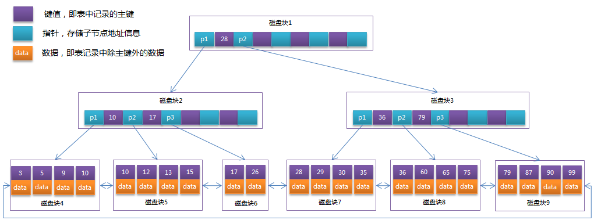

# Mysql

>索引本质是排好序的数据结构

## 1. hash数据结构

定义：散列表（Hash table，也叫哈希表），是根据关键码值(Key value)而直接进行访问的数据结构。也就是说，它通过把关键码值映射到表中一个位置来访问记录，以加快查找的速度。这个映射函数叫做散列函数，存放记录的数组叫做散列表。 对目标值进行hash运算得到hash值和数据磁盘指针地址保存到hash表，这样就达到快速定位数据位置。

缺点：精确查找十分快速，但范围查找就碰壁了。

### 1.1 BTree

定义：一个节点可以存储多个数据，这样可以避免黑红树的缺点，树的层数很变小。

缺点：  节点里面数组数据：每个数据的结构=索引数据+数据记录（即叶子节点存储键值和数据记录）

### 1.2 B+Tree

定义：B+Tree是在B-Tree基础上的一种优化。`节点里面数组数据：每个数据只存储键信息`，这样不存数据可以腾出空间放更多的键信息，让树层数越小
   - 非叶子节点只存储键信息。
   - `所有叶子节点之间都有一个链指针`
   - 数据记录都存放在叶子节点中

## 2. mysql为什么用整型自增作为索引比较好。而UUID作为索引效率比较低
   - 索引存储在磁盘，而且树的每个节点分配的空间有大小。整型占空间比较小，这样可以存放多个键值。反之然后UUID占空间比较大
   - 整型比较方便，UUID比较需要先转成ASCII在进行比较，`顺序往后插入提升速度`

最左前缀

myisam数据索引分离 innodb在一起
 
局部性原理 4kb 一页

行溢出65535，数据长度限制

**版本链:**

对于使用InnoDB存储引擎的表来说，它的聚簇索引记录中都包含两个必要的隐藏列（ row_id并不是必要的，我们创建的表中有主键或者非NULL唯一键时都不会包含row_id列）：

>trx_id：每次对某条记录进行改动时，都会把对应的事务id赋值给trx_id隐藏列。
>roll_pointer：每次对某条记录进行改动时，这个隐藏列会存一个指针，可以通过这个指针找到该记录修改前的信息 

**readView 结构:**
1. m_ids: 一个列表, 存储当前系统活跃的事务id (重点)
2. min_trx_id: 存m_ids的最小值
3. max_trx_id: 系统分配给下一个事务的id
4. creator_trx_id: 生成readView事务的事务id

注意max_trx_id并不是m_ids中的最大值，事务id是递增分配的。比方说现在有id为1， 2， 3这三个事务，之后id为3的事务提交了。那么一个新的读事务在生成ReadView时， m_ids就包括1和2， min_trx_id的值就是1，max_trx_id的值就是4。

有了这个ReadView，这样在访问某条记录时，只需要按照下边的步骤判断记录的某个版本是否可见：

1. 如果被访问版本的trx_id属性值与ReadView中的creator_trx_id值相同，意味着当前事务在访问它自己修改过的记录，所以该版本可以被当前事务访问。
2. 如果被访问版本的trx_id属性值小于ReadView中的min_trx_id值，表明生成该版本的事务在当前事务生成ReadView前已经提交，所以该版本可以被当前事务访问。
3. 如果被访问版本的trx_id属性值大于ReadView中的max_trx_id值，表明生成该版本的事务在当前事务生成ReadView后才开启，所以该版本不可以被当前事务访问。
4. 如果被访问版本的trx_id属性值在ReadView的min_trx_id和max_trx_id之间，那就需要判断一下trx_id属性值是不是在m_ids列表中，如果在，说明创建ReadView时生成该版本的事务还是活跃的，该版本不可以被访问；如果不在，说明创建ReadView时生成该版本的事务已经被提交，该版本可以被访问

MVCC（ Multi-Version Concurrency Control ，多版本并发控制）指的就是在使用READ COMMITTD、REPEATABLE READ这两种隔离级别的事务在执行普通的SEELCT操作时访问记录的版本链的过程。可以使不同事务的读-写、写-读操作并发执行，从而提升系统性能。 READ COMMITTD、 REPEATABLE READ这两个隔离级别的一个很大不同就是：生成ReadView的时机不同， READ COMMITTD在每一次进行普通SELECT操作前都会生成一个ReadView，而REPEATABLE READ只在第一次进行普通SELECT操作前生成一个ReadView，之后的查询操作都重复使用这个ReadView就好了

**锁**
1. 从性能上分为乐观锁(用版本对比来实现)和悲观锁
2. 从对数据库操作的类型分，分为读锁和写锁(都属于悲观锁)
   - 读锁（共享锁）：针对同一份数据，多个读操作可以同时进行而不会互相影响
   - 写锁（排它锁）：当前写操作没有完成前，它会阻断其他写锁和读锁
3. 从对数据操作的粒度分，分为表锁和行锁

## 3. Explain详解

概要描述：
- id:选择标识符
- select_type:表示查询的类型。
- table:输出结果集的表
- partitions:匹配的分区
- type:表示表的连接类型
- possible_keys:表示查询时，可能使用的索引
- key:表示实际使用的索引
- key_len:索引字段的长度
- ref:列与索引的比较
- rows:扫描出的行数(估算的行数)
- filtered:按表条件过滤的行百分比
- Extra:执行情况的描述和说明

### 3.1 id

SELECT识别符。这是SELECT的查询序列号，SQL从大到小的执行
1. id相同时，执行顺序由上至下
2. 如果是子查询，id的序号会递增，id值越大优先级越高，越先被执行
3. id如果相同，可以认为是一组，从上往下顺序执行；在所有组中，id值越大，优先级越高，越先执行   

### 3.2 select_type

表示查询中每个select子句的类型
1. SIMPLE(简单SELECT，不使用UNION或子查询等)
2. PRIMARY(子查询中最外层查询，查询中若包含任何复杂的子部分，最外层的select被标记为PRIMARY)
3. UNION(UNION中的第二个或后面的SELECT语句)
4. DEPENDENT UNION(UNION中的第二个或后面的SELECT语句，取决于外面的查询)
5. UNION RESULT(UNION的结果，union语句中第二个select开始后面所有select)
6. SUBQUERY(子查询中的第一个SELECT，结果不依赖于外部查询)
7. DEPENDENT SUBQUERY(子查询中的第一个SELECT，依赖于外部查询)
8. DERIVED(派生表的SELECT, FROM子句的子查询)
9. UNCACHEABLE SUBQUERY(一个子查询的结果不能被缓存，必须重新评估外链接的第一行)

## 4. table

显示这一步所访问数据库中表名称（显示这一行的数据是关于哪张表的），有时不是真实的表名字，可能是简称，例如上面的e，d，也可能是第几步执行的结果的简称

### 4.1 type

对表访问方式，表示MySQL在表中找到所需行的方式，又称“访问类型”。

常用的类型有： ALL、index、range、 ref、eq_ref、const、system、NULL（从左到右，性能从差到好）

- ALL：Full Table Scan， MySQL将遍历全表以找到匹配的行
- index: Full Index Scan，index与ALL区别为index类型只遍历索引树
- range:只检索给定范围的行，使用一个索引来选择行
- ref: 表示上述表的连接匹配条件，即哪些列或常量被用于查找索引列上的值
- eq_ref: 类似ref，区别就在使用的索引是唯一索引，对于每个索引键值，表中只有一条记录匹配，简单来说，就是多表连接中使用primary key或者 unique key作为关联条件
- const、system: 当MySQL对查询某部分进行优化，并转换为一个常量时，使用这些类型访问。如将主键置于where列表中，MySQL就能将该查询转换为一个常量，system是const类型的特例，当查询的表只有一行的情况下，使用system
- NULL: MySQL在优化过程中分解语句，执行时甚至不用访问表或索引，例如从一个索引列里选取最小值可以通过单独索引查找完成。

### 4.2 possible_keys

**指出MySQL能使用哪个索引在表中找到记录，查询涉及到的字段上若存在索引，则该索引将被列出，但不一定被查询使用（该查询可以利用的索引，如果没有任何索引显示 null）**

该列完全独立于EXPLAIN输出所示的表的次序。这意味着在possible_keys中的某些键实际上不能按生成的表次序使用。

如果该列是NULL，则没有相关的索引。在这种情况下，可以通过检查WHERE子句看是否它引用某些列或适合索引的列来提高你的查询性能。如果是这样，创造一个适当的索引并且再次用EXPLAIN检查查询

### 4.3 Key

**key列显示MySQL实际决定使用的键（索引），必然包含在possible_keys中**

如果没有选择索引，键是NULL。要想强制MySQL使用或忽视possible_keys列中的索引，在查询中使用FORCE INDEX、USE INDEX或者IGNORE INDEX。

### 4.4 key_len

**表示索引中使用的字节数，可通过该列计算查询中使用的索引的长度（key_len显示的值为索引字段的最大可能长度，并非实际使用长度，即key_len是根据表定义计算而得，不是通过表内检索出的）**

不损失精确性的情况下，长度越短越好 

### 4.5 ref

**列与索引的比较，表示上述表的连接匹配条件，即哪些列或常量被用于查找索引列上的值**

### 4.6 rows

**估算出结果集行数，表示MySQL根据表统计信息及索引选用情况，估算的找到所需的记录所需要读取的行数**

### 4.7 Extra

**该列包含MySQL解决查询的详细信息,有以下几种情况：**

- Using where:不用读取表中所有信息，仅通过索引就可以获取所需数据，这发生在对表的全部的请求列都是同一个索引的部分的时候，表示mysql服务器将在存储引擎检索行后再进行过滤
- Using temporary：表示MySQL需要使用临时表来存储结果集，常见于排序和分组查询，常见 group by ; order by
- Using filesort：当Query中包含 order by 操作，而且无法利用索引完成的排序操作称为“文件排序”
- Using join buffer：改值强调了在获取连接条件时没有使用索引，并且需要连接缓冲区来存储中间结果。如果出现了这个值，那应该注意，根据查询的具体情况可能需要添加索引来改进能。
- Impossible where：这个值强调了where语句会导致没有符合条件的行（通过收集统计信息不可能存在结果）。
- Select tables optimized away：这个值意味着仅通过使用索引，优化器可能仅从聚合函数结果中返回一行
- No tables used：Query语句中使用from dual 或不含任何from子句

### 4.8 总结：

• EXPLAIN不会告诉你关于触发器、存储过程的信息或用户自定义函数对查询的影响情况
• EXPLAIN不考虑各种Cache
• EXPLAIN不能显示MySQL在执行查询时所作的优化工作
• 部分统计信息是估算的，并非精确值
• EXPALIN只能解释SELECT操作，其他操作要重写为SELECT后查看执行计划。
