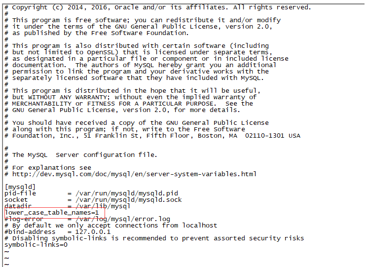

# 基本命令

## 1. 参数设置

```sql
show variables like '%lower_case_table_names%' --大小写敏感

lower_case_table_names=0   	表名存储为给定的大小和比较是区分大小写的 
lower_case_table_names=1    表名存储在磁盘是小写的，但是比较的时候是不区分大小写
lower_case_table_names=2	表名存储为给定的大小写但是比较的时候是小写的

```

```bash
docker ps -a
docker exec -it  [containerid]  /bin/bash
vi /etc/mysql/mysql.conf.d/mysqld.cnf 
#在配置文件中添加lower_case_table_names=1
apt-get update
apt-get install -y vim

find / -name my.cnf rpm安装时配置文件位置
/usr/my.cnf
lower_case_table_names=1

```



···

## 2. 函数
```sql
CREATE FUNCTION `F_ACTUSER`(v_FLOWCID varchar(40)) RETURNS longtext CHARSET utf8
BEGIN
	DECLARE v_STR LONGTEXT DEFAULT '';
	DECLARE V_INDEX BIGINT DEFAULT 1;
	DECLARE done INT DEFAULT 0;
	DECLARE V_USERNAME VARCHAR(400);
	DECLARE PATH_CUR CURSOR FOR (SELECT DISTINCT B.USERNAME FROM TS_FLOW_PATH_COM A
                INNER JOIN VJSP_USERS B
                   ON B.USERID = A.TS_MK_USERID
                WHERE A.FLOWCID = v_FLOWCID
                  AND C.FLOWZT NOT IN (-1, 2, 3));
									
	DECLARE CONTINUE HANDLER FOR NOT FOUND SET done = 1;
	
	OPEN PATH_CUR;
	pathLoop: LOOP
		FETCH PATH_CUR INTO V_USERNAME;
		IF done =1 THEN
			LEAVE pathLoop; 
		END IF; 
		IF V_INDEX =1 THEN
			SET v_STR = CONCAT(v_STR,V_USERNAME);
			SET V_INDEX =2;
		ELSE
			SET v_STR = CONCAT(v_STR,',',V_USERNAME);
		END IF;
	END LOOP pathLoop;
	CLOSE PATH_CUR;
	RETURN v_STR;
END
```

## 2. 存储过程

```sql
CREATE PROCEDURE `PROC_INIT_FLOW_SINGLE`(IN V_PARTNERID VARCHAR(40),
                                IN v_FLOWCID VARCHAR(40),
                                IN v_SPID VARCHAR(40),
                                IN v_SPYJ VARCHAR(2000),
                                IN v_ZXSX BIGINT,
                                IN v_USERID VARCHAR(40)
                                )
BEGIN
	DECLARE V_LYID VARCHAR(40);
	DECLARE done INT DEFAULT 0; 
	DECLARE LIST_CUR CURSOR FOR (SELECT TS_MK_PID FROM TS_FLOW_PATH_COM WHERE FLOWCID = V_FLOWCID AND PARTNERID = V_PARTNERID AND TS_MK_ZX_SX = v_ZXSX AND TS_MK_ZX_SX >= 0  AND TS_MK_PID = v_SPID);
	
	DECLARE CONTINUE HANDLER FOR NOT FOUND SET done = 1;

	OPEN LIST_CUR;
		listLoop: LOOP
			FETCH LIST_CUR INTO V_LYID;
			IF done=1 THEN
				LEAVE listLoop; 
			END IF; 
			UPDATE TS_FLOW_PATH_COM
        SET    TS_MK_SQ_DATE = NOW(), TS_SJTIME = -1, TS_MK_SQ_ZT = 2, TS_MK_SQ_YJ = v_SPYJ, TS_BTN_ID = -1, TS_BTN_NAME = V_SPYJ
        WHERE  FLOWCID = V_FLOWCID
        AND    PARTNERID = V_PARTNERID
        AND    TS_MK_PID = V_LYID;
			UPDATE TS_SYSTEM_DYWJ
        SET    CKZT = 1
        WHERE  FLOWCID = V_FLOWCID
        AND    PARTNERID = V_PARTNERID
        AND    PATHID = V_LYID;
		END LOOP listLoop;
	CLOSE LIST_CUR;
END
```

