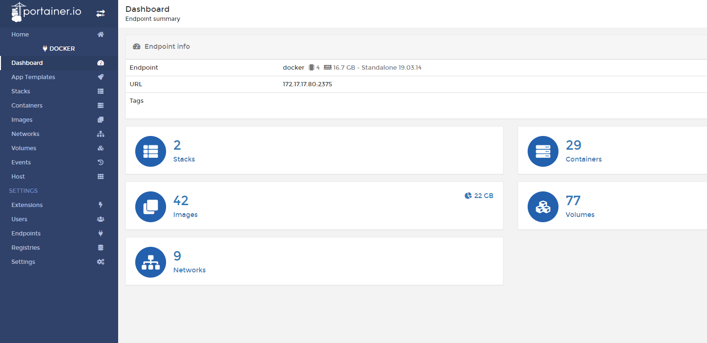
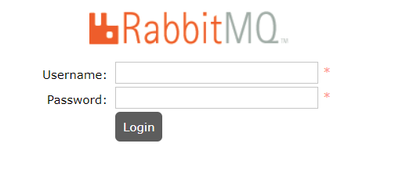
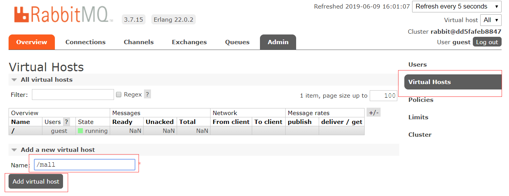
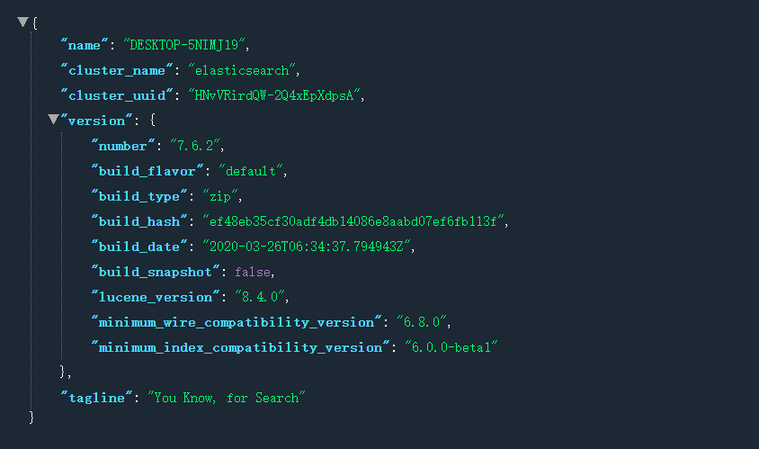
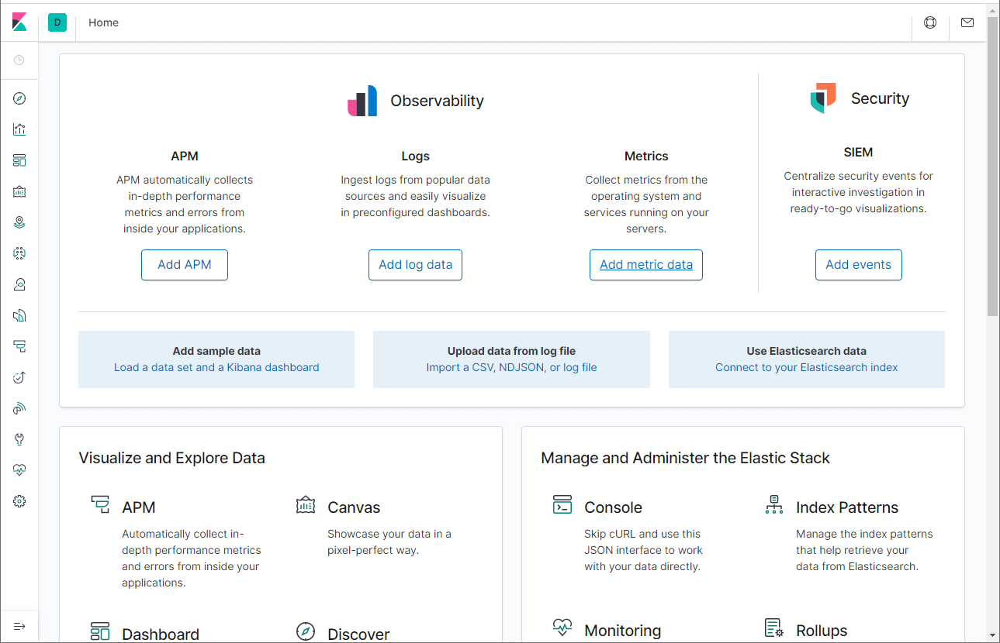
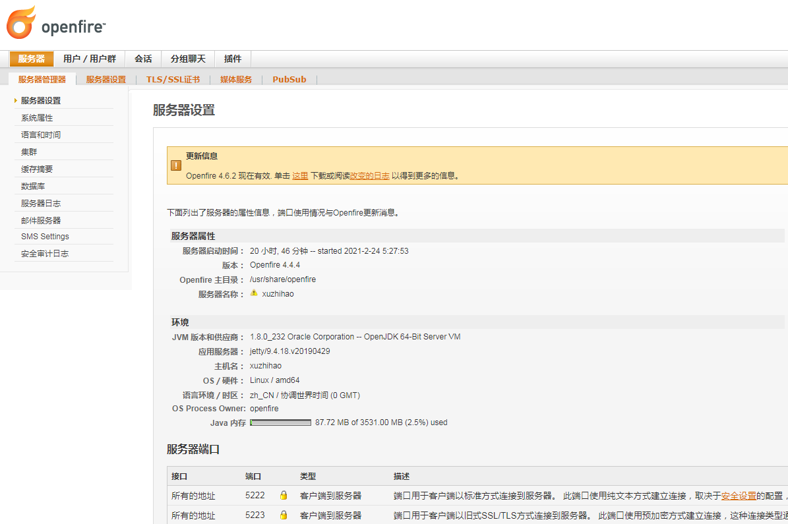
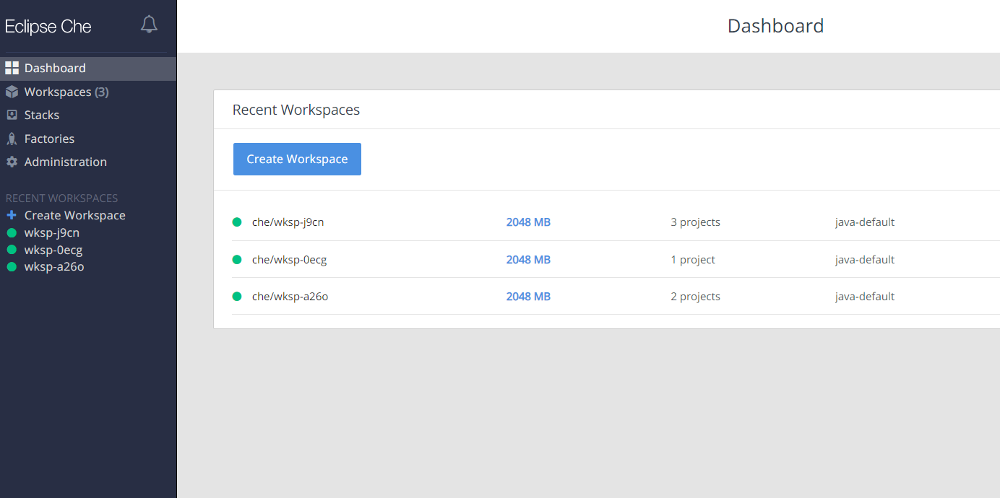
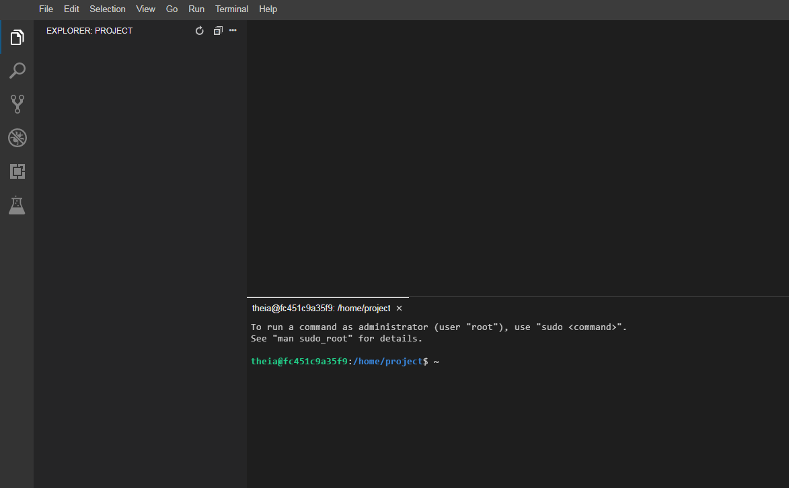

# Linux基于Docker部署

## 1. Docker

- 安装yum-utils：

```bash
yum install -y yum-utils device-mapper-persistent-data lvm2
```

- 为yum源添加docker仓库位置：

```bash
yum-config-manager --add-repo https://download.docker.com/linux/centos/docker-ce.repo
```

- 安装docker：

```bash
yum install docker-ce
```

- 启动docker：

```bash
systemctl start docker
```

## 2. Fastdfs

```bash
netstat -unltp | grep fdfs  #检测fdfs
docker run -dti --network=host --name tracker -v /var/fdfs/tracker:/var/fdfs delron/fastdfs tracker 
docker run -dti --network=host --name storage -e TRACKER_SERVER=192.168.3.200:22122 -v /var/fdfs/storage:/var/fdfs delron/fastdfs storage
```
## 3. Zookeeper

```bash
docker run -d -p 2181:2181 -v /mydata/zookeeper/data/:/data/ --name=zookeeper  --privileged zookeeper  #启动zk
```

## 4. Dubbo-admin

```bash
docker run -d -p 7001:7001 -e dubbo.registry.address=zookeeper://192.168.3.200:2181 -e dubbo.admin.root.password=root -e dubbo.admin.guest.password=guest chenchuxin/dubbo-admin 
```

## 5. Portainer

```bash
docker run -p 9000:9000 -p 8000:8000 --name portainer \
--restart=always \
-v /var/run/docker.sock:/var/run/docker.sock \
-v /mydata/portainer/data:/data \
-d portainer/portainer
```

```bash
vim /usr/lib/systemd/system/docker.service #编辑文件
ExecStart=/usr/bin/dockerd -H tcp://0.0.0.0:2375 -H unix://var/run/docker.sock #修改参数
systemctl daemon-reload #加载docker守护线程
systemctl restart docker #重启docker
```




## 6. MinIO
默认Access Key和Secret都是minioadmin

```bash
docker run -p 9090:9000 --name minio \
  -v /mydata/minio/data:/data \
  -v /mydata/minio/config:/root/.minio \
  -d minio/minio server /data
```

## 7. nginx-fancyindex

```bash
docker run -d \
  -p 8083:80 \
  -p 8084:443 \
  -e HTTP_AUTH="off" \
  -e HTTP_USERNAME="admin" \
  -e HTTP_PASSWD="admin" \
  -v /home/my-files:/app/public \
  --restart unless-stopped \
  --mount type=tmpfs,destination=/tmp \
  80x86/nginx-fancyindex
```

## 8. activemq

```bash
docker run -d --name activemq -p 61616:61616 -p 8161:8161 webcenter/activemq
```

## 9. zipkin

```bash
docker run -d --name zipkin -p  9411:9411 openzipkin/zipkin
```

## 10. Kafka

```bash
docker run -d --name kafka -p 9092:9092 -e KAFKA_BROKER_ID=0 -e KAFKA_ZOOKEEPER_CONNECT=zookeeper:2181 --link zookeeper -e 	KAFKA_ADVERTISED_LISTENERS=PLAINTEXT://172.17.17.80:9092 -e KAFKA_LISTENERS=PLAINTEXT://0.0.0.0:9092 -t wurstmeister/kafka
```

## 11. MySQL

- 下载MySQL`5.7`的docker镜像：

```bash
docker pull mysql:5.7
```

- 使用如下命令启动MySQL服务：

```bash
docker run -p 3306:3306 --name mysql \
-v /mydata/mysql/log:/var/log/mysql \
-v /mydata/mysql/data:/var/lib/mysql \
-v /mydata/mysql/conf:/etc/mysql \
-e MYSQL_ROOT_PASSWORD=root  \
-d mysql:5.7
```

- 参数说明
  - -p 3306:3306：将容器的3306端口映射到主机的3306端口
  - -v /mydata/mysql/conf:/etc/mysql：将配置文件夹挂在到主机
  - -v /mydata/mysql/log:/var/log/mysql：将日志文件夹挂载到主机
  - -v /mydata/mysql/data:/var/lib/mysql/：将数据文件夹挂载到主机
  - -e MYSQL_ROOT_PASSWORD=root：初始化root用户的密码
  
- 进入运行MySQL的docker容器：

```bash
docker exec -it mysql /bin/bash
```

- 使用MySQL命令打开客户端：

```bash
mysql -uroot -proot --default-character-set=utf8
```

- 创建shop数据库：

```sql
create database shop character set utf8
```

- 安装上传下载插件，并将`document/sql/shop.sql`上传到Linux服务器上：

```bash
yum -y install lrzsz
```

- 将`shop.sql`文件拷贝到mysql容器的`/`目录下：

```bash
docker cp /mydata/shop.sql mysql:/
```

- 将sql文件导入到数据库：

```bash
use shop;
source /shop.sql;
```

- 创建一个`reader:123456`帐号并修改权限，使得任何ip都能访问：

```sql
grant all privileges on *.* to 'reader' @'%' identified by '123456';
```

## 12. Redis

- 下载Redis`5.0`的docker镜像：

```bash
docker pull redis:5
```

- 使用如下命令启动Redis服务：

```bash
docker run -p 6379:6379 --name redis \
-v /mydata/redis/data:/data \
-d redis:5 redis-server --appendonly yes
```

- 进入Redis容器使用`redis-cli`命令进行连接：

```bash
docker exec -it redis redis-cli
```


## 13. Nginx

- 下载Nginx`1.10`的docker镜像：

```bash
docker pull nginx:1.10
```

- 先运行一次容器（为了拷贝配置文件）：

```bash
docker run -p 80:80 --name nginx \
-v /mydata/nginx/html:/usr/share/nginx/html \
-v /mydata/nginx/logs:/var/log/nginx  \
-d nginx:1.10
```

- 将容器内的配置文件拷贝到指定目录：

```bash
docker container cp nginx:/etc/nginx /mydata/nginx/
```

- 修改文件名称：

```bash
mv /mydata/nginx/nginx /mydata/nginx/conf
```

- 终止并删除容器：

```bash
docker stop nginx
docker rm nginx
```

- 使用如下命令启动Nginx服务：

```bash
docker run -p 80:80 -p 443:443 --name nginx \
-v /mydata/nginx/html:/usr/share/nginx/html \
-v /mydata/nginx/logs:/var/log/nginx  \
-v /mydata/nginx/conf:/etc/nginx \
-d nginx:1.10
```

## 14. RabbitMQ

- 下载rabbitmq`3.7.15`的docker镜像：

```bash
docker pull rabbitmq:3.7.15
```

- 使用如下命令启动RabbitMQ服务：

```bash
docker run -p 5672:5672 -p 15672:15672 --name rabbitmq \
-d rabbitmq:3.7.15
```

- 进入容器并开启管理功能：

```bash
docker exec -it rabbitmq /bin/bash
rabbitmq-plugins enable rabbitmq_management
```


- 开启防火墙：

```bash
firewall-cmd --zone=public --add-port=15672/tcp --permanent
firewall-cmd --reload
```
- 访问地址查看是否安装成功：http://192.168.3.200:15672



- 输入账号密码并登录：guest guest

- 创建帐号并设置其角色为管理员：mall mall


- 创建一个新的虚拟host为：/mall



- 点击mall用户进入用户配置页面


- 给mall用户配置该虚拟host的权限


## 15. Elasticsearch

- 下载Elasticsearch`7.6.2`的docker镜像：

```bash
docker pull elasticsearch:7.6.2
```

- 修改虚拟内存区域大小，否则会因为过小而无法启动:

```bash
sysctl -w vm.max_map_count=262144
```

- 使用如下命令启动Elasticsearch服务：

```bash
docker run -p 9200:9200 -p 9300:9300 --name elasticsearch \
-e "discovery.type=single-node" \
-e "cluster.name=elasticsearch" \
-v /mydata/elasticsearch/plugins:/usr/share/elasticsearch/plugins \
-v /mydata/elasticsearch/data:/usr/share/elasticsearch/data \
-d elasticsearch:7.6.2
```

- 启动时会发现`/usr/share/elasticsearch/data`目录没有访问权限，只需要修改`/mydata/elasticsearch/data`目录的权限，再重新启动即可；

```bash
chmod 777 /mydata/elasticsearch/data/
```

- 安装中文分词器IKAnalyzer，并重新启动：

```bash
docker exec -it elasticsearch /bin/bash
#此命令需要在容器中运行
elasticsearch-plugin install https://github.com/medcl/elasticsearch-analysis-ik/releases/download/v7.6.2/elasticsearch-analysis-ik-7.6.2.zip
docker restart elasticsearch
```

- 开启防火墙：

```bash
firewall-cmd --zone=public --add-port=9200/tcp --permanent
firewall-cmd --reload
```

- 访问会返回版本信息：http://192.168.3.200:9200



## 16. Logstash

- 下载Logstash`7.6.2`的docker镜像：

```bash
docker pull logstash:7.6.2
```

- 修改Logstash的配置文件`logstash.conf`中`output`节点下的Elasticsearch连接地址为`es:9200`

```
output {
  elasticsearch {
    hosts => "es:9200"
    index => "mall-%{type}-%{+YYYY.MM.dd}"
  }
}
```

- 创建`/mydata/logstash`目录，并将Logstash的配置文件`logstash.conf`拷贝到该目录；

```bash
mkdir /mydata/logstash
```

- 使用如下命令启动Logstash服务；

```bash
docker run --name logstash -p 4560:4560 -p 4561:4561 -p 4562:4562 -p 4563:4563 \
--link elasticsearch:es \
-v /mydata/logstash/logstash.conf:/usr/share/logstash/pipeline/logstash.conf \
-d logstash:7.6.2
```

- 进入容器内部，安装`json_lines`插件。

```bash
logstash-plugin install logstash-codec-json_lines
```

## 17. Kibana

- 下载Kibana`7.6.2`的docker镜像：

```bash
docker pull kibana:7.6.2
```

- 使用如下命令启动Kibana服务：

```bash
docker run --name kibana -p 5601:5601 \
--link elasticsearch:es \
-e "elasticsearch.hosts=http://es:9200" \
-d kibana:7.6.2
```

- 开启防火墙：

```bash
firewall-cmd --zone=public --add-port=5601/tcp --permanent
firewall-cmd --reload
```
- 访问地址进行测试：http://192.168.3.200:5601



## 18. MongoDB

- 下载MongoDB`4.2.5`的docker镜像：

```bash
docker pull mongo:4.2.5
```

- 使用docker命令启动：

```bash
docker run -p 27017:27017 --name mongo \
-v /mydata/mongo/db:/data/db \
-d mongo:4.2.5
```

## 19. Openfire
```bash
docker pull gizmotronic/openfire

docker run --name openfire -d --restart=always \
  --publish 9090:9090 --publish 5222:5222 --publish 7070:7070 \
  --volume /srv/docker/openfire:/var/lib/openfire \
  gizmotronic/openfire
```




## 20. eclipse/che

http://ip:8080

```bash
docker run -it -d --rm \
-v /var/run/docker.sock:/var/run/docker.sock \
-v /mydata/che:/data \
eclipse/che start
```



## 21. Theia

```bash
chown -R 1000:1000 /mydata/
docker run -it -p 3000:3000 -v "/mydata/theia:/home/project:cached" theiaide/theia
docker run -d -it --init -p 4000:3000 -v "/mydata/theia-full:/home/project:cached" theiaide/theia-full
```




## 22. Nexus3

```bash
docker pull sonatype/nexus3
mkdir -p /home/mvn/nexus-data  && chown -R 200 /home/mvn/nexus-data
docker run -d -p 8081:8081 --name nexus -v /home/mvn/nexus-data:/nexus-data sonatype/nexus3
```


## 23. zentao

```bash
mkdir -p /data/zbox

docker run -d -p 8080:80 -p 3316:3306 -e USER="admin" -e PASSWD="admin" -e BIND_ADDRESS="false" -e SMTP_HOST="163.177.90.125 smtp.exmail.qq.com" -v /data/zbox/:/opt/zbox/ --name zentao-server idoop/zentao:latest 
```

- 8080 访问禅道外部端口号
- 3316 把容器3306数据库端口映射到主机3316端口
- USER 设置登录账号 admin
- PASSWD 设置登录密码 123456
- BIND_ADDRESS 设置为false

## 24. Registry

修改Docker Daemon的配置文件，文件位置为/etc/docker/daemon.json，由于Docker默认使用HTTPS推送镜像，而我们的镜像仓库没有支持，所以需要添加如下配置，改为使用HTTP推送

```
{
  "insecure-registries": ["192.168.3.200:5000"]
}
```

REGISTRY_STORAGE_DELETE_ENABLED=true 开启删除镜像的功能

```bash
docker run -p 5000:5000 --name registry2 \
--restart=always \
-e REGISTRY_STORAGE_DELETE_ENABLED="true" \
-d registry:2
```

```bash
docker run -p 8280:80 --name registry-ui \
--link registry2:registry2 \
-e REGISTRY_URL="http://registry2:5000" \
-e DELETE_IMAGES="true" \
-e REGISTRY_TITLE="Registry2" \
-d joxit/docker-registry-ui:static
```
## 25. Harbor

> wget https://github.com/goharbor/harbor/releases/download/v2.0.1/harbor-offline-installer-v2.0.1.tgz

```shell
tar xf harbor-offline-installer-v2.0.1.tgz
mkdir /opt/harbor
mv harbor/* /opt/harbor
cd /opt/harbor
# 复制配置文件
cp harbor.yml.tmpl harbor.yml
# 编辑
vi harbor.yml
```

```yml
#修改配置文件(如果不用https就注释掉https的几项，我是用的http就注释掉了https的，其他几项修改为自己的信息)
···
hostname: 192.168.3.200
···
# http related config
http:
  # port for http, default is 80. If https enabled, this port will redirect to https port
  port: 88
···
# https related config
#https:
  # https port for harbor, default is 443
  #port: 443
  # The path of cert and key files for nginx
  #certificate: /your/certificate/path
  #private_key: /your/private/key/path
····
harbor_admin_password: Harbor12345
···
data_volume: /data
···
```

安装

```shell
./install.sh 
docker-compose up -d #启动
docker-compose stop #停止
docker-compose restart #重新启动
```

默认账户密码：admin/Harbor12345

## 26. postgres

```bash
docker run --name postgres2 -v /mydata/postgres/data:/var/lib/postgresql/data -e POSTGRES_PASSWORD=123456 -d -p 5432:5432 postgres:10.12
docker run --name postgres -e POSTGRES_PASSWORD=123456 -d -p 54321:5432 -v /etc/data/pgdata:/var/lib/postgresql/data-d postgres
默认用户：postgres 密码：POSTGRES_PASSWORD

/var/lib/postgresql/data  #镜像的data目录
/usr/lib/postgresql/??/bin #进入postgresql的工具目录
psql -Upostgres # 连接数据库

-it -d 这两个参数一般同时使用，保证 container 以交互的方式在后台运行。
--rm 这个参数是指在 container 停止时自动将 container 删除。
--name 你在使用 docker ps 命令时看到的 container 的名字。
-e POSTGRES_USER=dbuser 这个是设置 container 中的环境变量用的参数，指的是设计数据库用户为 dbuser 。之后登录数据库时就是使用这个用户名。
-e POSTGRES_PASSWORD=password 同上，也是设置 container 中的环境变量，这个是设置你登录数据库的密码，这里设置的密码为"password"。
-e POSTGRES_DB=testdb 同上，初始化一个新的数据库，其名字为 testdb。
-p 5432:5432 这个是将主机的端口与 container 暴露的端口进行映射。其格式为 -p 主机端口: container 端口。即 : 前为主机端口，后为 container 端口。
-v /docker/volumes/postgres:/var/lib/postgresql/data 挂载目录。
```

## 27. sonarqube

```bash
docker run -d --name sonarqube -e SONAR_ES_BOOTSTRAP_CHECKS_DISABLE=true -p 9000:9000 sonarqube:8.6-community #H2默认存储

#postgres外挂存储
docker run -d --name sonarqube \
    --link postgres2 \
    -p 9000:9000 \
    -e sonar.jdbc.url=jdbc:postgresql://172.17.17.80:5432/sonardb \
    -e sonar.jdbc.username=sonar \
    -e sonar.jdbc.password=123456 \
    -v /data/sonarqube/sonarqube_extensions:/opt/sonarqube/extensions \
    -v /data/sonarqube/sonarqube_logs:/opt/sonarqube/logs \
    -v /data/sonarqube/sonarqube_data:/opt/sonarqube/data \
    sonarqube:8.6-community
```

## 28. Jenkins

```bash
docker pull jenkins/jenkins:lts
docker pull jenkins/jenkins

mkdir -p /data/jenkins_home/
chown -R 1000:1000 /data/jenkins_home/

docker run -d --name jenkins -p 8888:8080 -p 50000:50000 -v /data/jenkins_home:/var/jenkins_home jenkins/jenkins

cd /data/jenkins_home
vi hudson.model.UpdateCenter.xml
# http://mirror.xmission.com/jenkins/updates/update-center.json

```

## 29. Sentinel

```bash
docker run --name sentinel -d -p 8858:8858 -d bladex/sentinel-dashboard
```


## 30. rocketmq

开通防火墙
```bash
firewall-cmd --zone=public --add-port=9876/tcp --permanent
firewall-cmd --zone=public --add-port=10911/tcp --permanent
firewall-cmd --zone=public --add-port=9800/tcp --permanent
firewall-cmd --reload
```

创建存储文件夹
```bash
mkdir -p /mydata/rocketmq/data/namesrv/logs /root/rocketmq/data/namesrv/store /mydata/rocketmq/conf /mydata/rocketmq/data/broker/logs /mydata/rocketmq/data/broker/stor
```


进入到 /mydata/rocketmq/conf 文件夹下 创建文件 broker.conf
```bash
cd /mydata/rocketmq/conf
touch broker.conf
vi broker.conf


brokerClusterName = DefaultCluster
brokerName = broker-a
brokerId = 0
deleteWhen = 04
fileReservedTime = 48
brokerRole = ASYNC_MASTER
flushDiskType = ASYNC_FLUSH
brokerIP1 = 172.17.17.80
```

拉取镜像
```bash
docker pull rocketmqinc/rocketmq:4.4.0
docker pull styletang/rocketmq-console-ng

docker run -d -p 9876:9876 -v /mydata/rocketmq/data/namesrv/logs:/root/logs -v /mydata/rocketmq/data/namesrv/store:/root/store --name rmqnamesrv -e "MAX_POSSIBLE_HEAP=100000000" rocketmqinc/rocketmq:4.4.0 sh mqnamesrv

docker run -d -p 10911:10911 -p 10909:10909 -v  /mydata/rocketmq/data/broker/logs:/root/logs -v  /mydata/rocketmq/data/broker/store:/root/store -v  /mydata/rocketmq/conf/broker.conf:/opt/rocketmq-4.4.0/conf/broker.conf --name rmqbroker --link rmqnamesrv:namesrv -e "NAMESRV_ADDR=namesrv:9876" -e "MAX_POSSIBLE_HEAP=200000000" rocketmqinc/rocketmq:4.4.0 sh mqbroker -c /opt/rocketmq-4.4.0/conf/broker.conf

docker run -d --name rmqconsole -p 9800:8080 --link rmqnamesrv:namesrv -e "JAVA_OPTS=-Drocketmq.namesrv.addr=namesrv:9876 -Dcom.rocketmq.sendMessageWithVIPChannel=false" -t styletang/rocketmq-console-ng

```