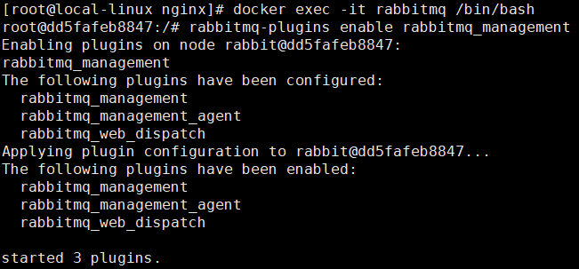

# Linux环境下的部署（基于Docker容器）

## Docker环境安装

- 安装`yum-utils`：

```bash
yum install -y yum-utils device-mapper-persistent-data lvm2
```

- 为yum源添加docker仓库位置：

```bash
yum-config-manager --add-repo https://download.docker.com/linux/centos/docker-ce.repo
```

- 安装docker：

```bash
yum install docker-ce
```

- 启动docker：

```bash
systemctl start docker
```

## Fastdfs安装

```bash
netstat -unltp | grep fdfs  #检测fdfs
docker run -dti --network=host --name tracker -v /var/fdfs/tracker:/var/fdfs delron/fastdfs tracker 
docker run -dti --network=host --name storage -e TRACKER_SERVER=192.168.3.200:22122 -v /var/fdfs/storage:/var/fdfs delron/fastdfs storage
```
## Zookeeper安装

```bash
docker run -d -p 2181:2181 -v /mysoft/zookeeper/data/:/data/ --name=zookeeper  --privileged zookeeper  #启动zk
```

## Portainer安装

```bash
docker run -p 9000:9000 -p 8000:8000 --name portainer \
--restart=always \
-v /var/run/docker.sock:/var/run/docker.sock \
-v /mydata/portainer/data:/data \
-d portainer/portainer
```

## MinIO安装
默认Access Key和Secret都是minioadmin

```bash
docker run -p 9090:9000 --name minio \
  -v /mydata/minio/data:/data \
  -v /mydata/minio/config:/root/.minio \
  -d minio/minio server /data
```

## nginx-fancyindex安装

```bash
docker run -d \
  -p 8083:80 \
  -p 8084:443 \
  -e HTTP_AUTH="off" \
  -e HTTP_USERNAME="admin" \
  -e HTTP_PASSWD="admin" \
  -v /home/my-files:/app/public \
  --restart unless-stopped \
  --mount type=tmpfs,destination=/tmp \
  80x86/nginx-fancyindex
```

## activemq安装

```bash
docker run -d --name activemq2 -p 61616:61616 -p 8161:8161 webcenter/activemq
```

## zipkin安装

```bash
docker run -d -p  9411:9411 openzipkin/zipkin:2.17.2
```

## Kafka安装

```bash
docker run -d --name kafka -p 9092:9092 -e KAFKA_BROKER_ID=0 -e KAFKA_ZOOKEEPER_CONNECT=zookeeper:2181 --link zookeeper -e 	KAFKA_ADVERTISED_LISTENERS=PLAINTEXT://172.17.17.80:9092 -e KAFKA_LISTENERS=PLAINTEXT://0.0.0.0:9092 -t wurstmeister/kafka
```

## MySQL安装

- 下载MySQL`5.7`的docker镜像：

```bash
docker pull mysql:5.7
```

- 使用如下命令启动MySQL服务：

```bash
docker run -p 3306:3306 --name mysql \
-v /mydata/mysql/log:/var/log/mysql \
-v /mydata/mysql/data:/var/lib/mysql \
-v /mydata/mysql/conf:/etc/mysql \
-e MYSQL_ROOT_PASSWORD=root  \
-d mysql:5.7
```

- 参数说明
  - -p 3306:3306：将容器的3306端口映射到主机的3306端口
  - -v /mydata/mysql/conf:/etc/mysql：将配置文件夹挂在到主机
  - -v /mydata/mysql/log:/var/log/mysql：将日志文件夹挂载到主机
  - -v /mydata/mysql/data:/var/lib/mysql/：将数据文件夹挂载到主机
  - -e MYSQL_ROOT_PASSWORD=root：初始化root用户的密码
  
- 进入运行MySQL的docker容器：

```bash
docker exec -it mysql /bin/bash
```

- 使用MySQL命令打开客户端：

```bash
mysql -uroot -proot --default-character-set=utf8
```

- 创建shop数据库：

```sql
create database shop character set utf8
```

- 安装上传下载插件，并将`document/sql/shop.sql`上传到Linux服务器上：

```bash
yum -y install lrzsz
```

- 将`shop.sql`文件拷贝到mysql容器的`/`目录下：

```bash
docker cp /mydata/shop.sql mysql:/
```

- 将sql文件导入到数据库：

```bash
use shop;
source /shop.sql;
```

- 创建一个`reader:123456`帐号并修改权限，使得任何ip都能访问：

```sql
grant all privileges on *.* to 'reader' @'%' identified by '123456';
```

## Redis安装

- 下载Redis`5.0`的docker镜像：

```bash
docker pull redis:5
```

- 使用如下命令启动Redis服务：

```bash
docker run -p 6379:6379 --name redis \
-v /mydata/redis/data:/data \
-d redis:5 redis-server --appendonly yes
```

- 进入Redis容器使用`redis-cli`命令进行连接：

```bash
docker exec -it redis redis-cli
```


## Nginx安装

- 下载Nginx`1.10`的docker镜像：

```bash
docker pull nginx:1.10
```

- 先运行一次容器（为了拷贝配置文件）：

```bash
docker run -p 80:80 --name nginx \
-v /mydata/nginx/html:/usr/share/nginx/html \
-v /mydata/nginx/logs:/var/log/nginx  \
-d nginx:1.10
```

- 将容器内的配置文件拷贝到指定目录：

```bash
docker container cp nginx:/etc/nginx /mydata/nginx/
```

- 修改文件名称：

```bash
mv nginx conf
```

- 终止并删除容器：

```bash
docker stop nginx
docker rm nginx
```

- 使用如下命令启动Nginx服务：

```bash
docker run -p 80:80 --name nginx \
-v /mydata/nginx/html:/usr/share/nginx/html \
-v /mydata/nginx/logs:/var/log/nginx  \
-v /mydata/nginx/conf:/etc/nginx \
-d nginx:1.10
```

## RabbitMQ安装

- 下载rabbitmq`3.7.15`的docker镜像：

```bash
docker pull rabbitmq:3.7.15
```

- 使用如下命令启动RabbitMQ服务：

```bash
docker run -p 5672:5672 -p 15672:15672 --name rabbitmq \
-d rabbitmq:3.7.15
```

- 进入容器并开启管理功能：

```bash
docker exec -it rabbitmq /bin/bash
rabbitmq-plugins enable rabbitmq_management
```



- 开启防火墙：

```bash
firewall-cmd --zone=public --add-port=15672/tcp --permanent
firewall-cmd --reload
```
- 访问地址查看是否安装成功：http://192.168.3.200:15672


- 输入账号密码并登录：guest guest

- 创建帐号并设置其角色为管理员：mall mall


- 创建一个新的虚拟host为：/mall


- 点击mall用户进入用户配置页面


- 给mall用户配置该虚拟host的权限


## Elasticsearch安装

- 下载Elasticsearch`7.6.2`的docker镜像：

```bash
docker pull elasticsearch:7.6.2
```

- 修改虚拟内存区域大小，否则会因为过小而无法启动:

```bash
sysctl -w vm.max_map_count=262144
```

- 使用如下命令启动Elasticsearch服务：

```bash
docker run -p 9200:9200 -p 9300:9300 --name elasticsearch \
-e "discovery.type=single-node" \
-e "cluster.name=elasticsearch" \
-v /mydata/elasticsearch/plugins:/usr/share/elasticsearch/plugins \
-v /mydata/elasticsearch/data:/usr/share/elasticsearch/data \
-d elasticsearch:7.6.2
```

- 启动时会发现`/usr/share/elasticsearch/data`目录没有访问权限，只需要修改`/mydata/elasticsearch/data`目录的权限，再重新启动即可；

```bash
chmod 777 /mydata/elasticsearch/data/
```

- 安装中文分词器IKAnalyzer，并重新启动：

```bash
docker exec -it elasticsearch /bin/bash
#此命令需要在容器中运行
elasticsearch-plugin install https://github.com/medcl/elasticsearch-analysis-ik/releases/download/v7.6.2/elasticsearch-analysis-ik-7.6.2.zip
docker restart elasticsearch
```

- 开启防火墙：

```bash
firewall-cmd --zone=public --add-port=9200/tcp --permanent
firewall-cmd --reload
```

- 访问会返回版本信息：http://192.168.3.200:9200


## Logstash安装

- 下载Logstash`7.6.2`的docker镜像：

```bash
docker pull logstash:7.6.2
```

- 修改Logstash的配置文件`logstash.conf`中`output`节点下的Elasticsearch连接地址为`es:9200`

```
output {
  elasticsearch {
    hosts => "es:9200"
    index => "mall-%{type}-%{+YYYY.MM.dd}"
  }
}
```

- 创建`/mydata/logstash`目录，并将Logstash的配置文件`logstash.conf`拷贝到该目录；

```bash
mkdir /mydata/logstash
```

- 使用如下命令启动Logstash服务；

```bash
docker run --name logstash -p 4560:4560 -p 4561:4561 -p 4562:4562 -p 4563:4563 \
--link elasticsearch:es \
-v /mydata/logstash/logstash.conf:/usr/share/logstash/pipeline/logstash.conf \
-d logstash:7.6.2
```

- 进入容器内部，安装`json_lines`插件。

```bash
logstash-plugin install logstash-codec-json_lines
```

## Kibana安装

- 下载Kibana`7.6.2`的docker镜像：

```bash
docker pull kibana:7.6.2
```

- 使用如下命令启动Kibana服务：

```bash
docker run --name kibana -p 5601:5601 \
--link elasticsearch:es \
-e "elasticsearch.hosts=http://es:9200" \
-d kibana:7.6.2
```

- 开启防火墙：

```bash
firewall-cmd --zone=public --add-port=5601/tcp --permanent
firewall-cmd --reload
```
- 访问地址进行测试：http://192.168.3.200:5601


## MongoDB安装

- 下载MongoDB`4.2.5`的docker镜像：

```bash
docker pull mongo:4.2.5
```

- 使用docker命令启动：

```bash
docker run -p 27017:27017 --name mongo \
-v /mydata/mongo/db:/data/db \
-d mongo:4.2.5
```

## Openfire安装
```bash
docker pull sameersbn/openfire
docker run --name openfire -d --publish 9090:9090 --publish 5222:5222 --publish 7777:7777 -v /home/workspace/docker/openfire/data:/var/lib/openfire -v /home/workspace/docker/openfire/logs:/var/log/openfire sameersbn/openfire
```