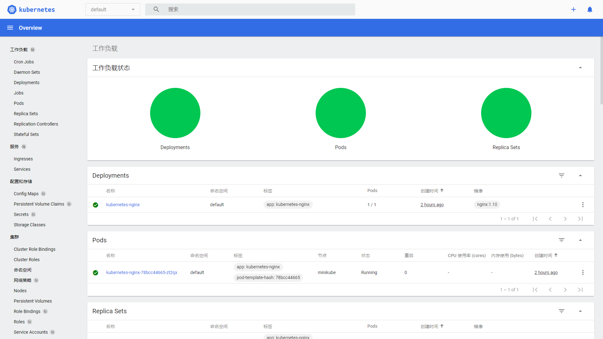

# Minikube

## 1. Docker安装
```bash
yum install -y yum-utils device-mapper-persistent-data lvm2
yum-config-manager --add-repo https://download.docker.com/linux/centos/docker-ce.repo
yum install docker-ce
systemctl start docker
```

## 2. Minikube安装

- 下载Minikube的二进制安装包并安装：

```bash
curl -LO https://storage.googleapis.com/minikube/releases/latest/minikube-linux-amd64
sudo install minikube-linux-amd64 /usr/local/bin/minikube
minikube version
minikube kubectl version
```
- 然后使用如下命令启动Minikube，如果你使用的是root用户的话会无法启动并提示如下信息，需要创建一个非root账号再启动 

```bash
# 创建用户
useradd -u 1024 -g docker xuzhihao
# 设置用户密码
passwd xuzhihao
# 切换用户
su xuzhihao
```

```bash
minikube start --vm-driver=docker --image-mirror-country=cn --image-repository=registry.cn-hangzhou.aliyuncs.com/google_containers --iso-url=https://kubernetes.oss-cn-hangzhou.aliyuncs.com/minikube/iso/minikube-v1.7.3.iso --registry-mirror=https://reg-mirror.qiniu.com
```

## 3. Kubernetes的使用

```bash
# 查找kubectl命令的位置
find / -name kubectl
# 找到之后复制到/bin目录下
cp /home/xuzhihao/.minikube/cache/linux/v1.20.2/kubectl /bin/
# 直接使用kubectl命令
kubectl version
```

```bash
kubectl get nodes
kubectl get pod --all-namespaces -o wide
```

## 4. 部署应用
>一旦运行了K8S集群，就可以在其上部署容器化应用程序。通过创建Deployment对象，可以指挥K8S如何创建和更新应用程序的实例。
- 指定好应用镜像并创建一个Deployment，这里创建一个Nginx应用

```bash
kubectl create deployment kubernetes-nginx --image=nginx:1.10
```
- 创建一个Deployment时K8S会产生如下操作
  - 选择一个合适的Node来部署这个应用
  - 将该应用部署到Node上
  - 当应用异常关闭或删除时重新部署应用

```bash
kubectl get deployments   # 查看所有Deployment
```

- 我们可以通过kubectl proxy命令临时创建一个代理，这样就可以通过暴露出来的接口直接访问K8S的API了，这里调用了查询K8S版本的接口

```bash
[xuzhihao@linux-local root]$ kubectl proxy
Starting to serve on 127.0.0.1:8001
[root@debug-registry ~]# curl http://localhost:8001/version
{
  "major": "1",
  "minor": "20",
  "gitVersion": "v1.20.2",
  "gitCommit": "faecb196815e248d3ecfb03c680a4507229c2a56",
  "gitTreeState": "clean",
  "buildDate": "2021-01-13T13:20:00Z",
  "goVersion": "go1.15.5",
  "compiler": "gc",
  "platform": "linux/amd64"
}
```

## 5. 查看应用
>通过对运行应用的Pod进行操作，可以查看容器日志，也可以执行容器内部命令

```bash
kubectl get pods        # 查看K8s中所有Pod的状态
kubectl describe pods   # 查看Pod的详细状态，包括IP地址、占用端口、使用镜像等信息
kubectl logs $POD_NAME  # 查看Pod打印的日志
kubectl exec -ti $POD_NAME -- bash # 进入容器
kubectl exec $POD_NAME -- env      # 查看环境变量
```

## 6. 公开暴露应用

>默认Pod无法被集群外部访问，需要创建Service并暴露端口才能被外部访问

- 创建一个Service来暴露kubernetes-nginx这个Deployment

```bash
kubectl expose deployment/kubernetes-nginx --type="NodePort" --port 80
kubectl get services    # 查看K8S中所有Service的状态
kubectl edit svc  deployment/kubernetes-nginx   # 修改端口
curl $(minikube ip):30158
```

## 7. 可视化管理
>Dashboard是基于网页的K8S用户界面。你可以使用Dashboard将容器应用部署到K8S集群中，也可以对容器应用排错，还能管理集群资源

- 查看Minikube内置插件，默认情况下Dashboard插件未启用
```bash
minikube addons list
minikube addons enable dashboard    # 启用Dashboard插件
minikube dashboard --url    # 通过--url参数不会打开管理页面，并可以在控制台获得访问路径
```

- 要想从外部访问Dashboard，需要从使用kubectl设置代理才行，--address设置为你的服务器地址

```bash
kubectl proxy --port=44469 --address='192.168.3.200' --accept-hosts='^.*' &
```
- 通过如下地址即可访问Dashboard

```bash
http://192.168.3.200:44469/api/v1/namespaces/kubernetes-dashboard/services/http:kubernetes-dashboard:/proxy/
```
- 查看K8S集群中的资源状态信息



## 8. 插件管理

```bash
minikube addons enable ingress
minikube addons disabled ingress
```