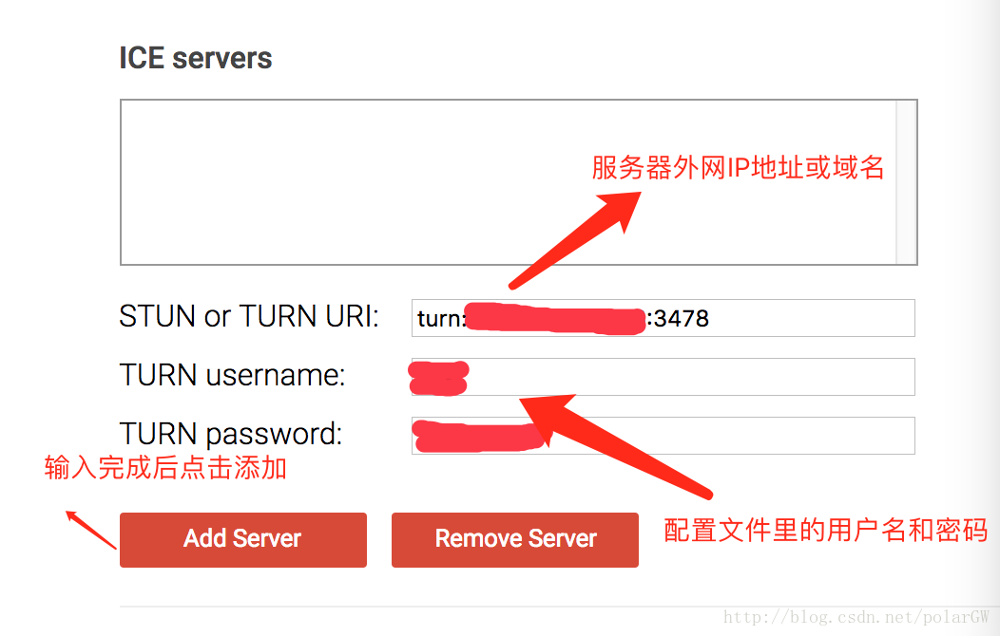
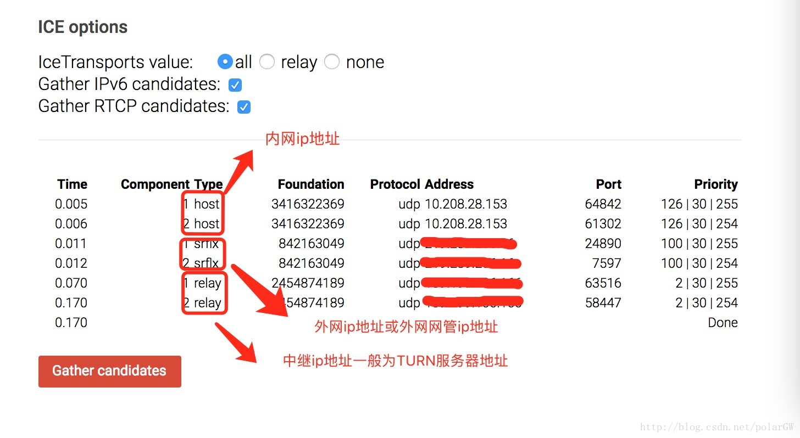

# 搭建Turnserver

## 1. 安装依赖

```bash
yum install -y make gcc cc gcc-c++ wget
yum install -y openssl-devel libevent libevent-devel mysql-devel mysql-server
```

## 2. 下载安装

```bash
wget wget http://turnserver.open-sys.org/downloads/v4.5.0.6/turnserver-4.5.0.6-CentOS7.2-x86_64.tar.gz
tar -zxvf turnserver-4.5.0.6-CentOS7.2-x86_64.tar.gz
cd turnserver-4.5.0.6
#如果里面有install.sh文件，直接执行./install.sh或者chmod a+x install 生成install文件 。
./install.sh
```

## 3. 配置文件修改

```bash
cd /etc/turnserver/
vim + turnserver.conf
```

文件末尾添加如下内容

```
listening-device=eth0
listening-port=3478
tls-listening-port=5349
listening-ip=内网ip
relay-ip=内网ip
external-ip=公网ip
min-port=49152
max-port=65535
lt-cred-mech
user=xuzhihao:123456
cert=/usr/local/etc/turn_server_cert.pem
pkey=/usr/local/etc/turn_server_pkey.pem
```

## 4. 启动

```
#启动命令: 
turnserver -v -r 外网ip -a -o -c /etc/turnserver/turnserver.conf 
#关闭命令: 
cat /var/run/turnserver/turnserver.pid 
#或者 cat /var/tmp/turnserver.pid 
```

## 5. 测试

https://webrtc.github.io/samples/src/content/peerconnection/trickle-ice/





stun服务器：

- stun:stun1.l.google.com:19302
- stun:stun2.l.google.com:19302
- stun:stun3.l.google.com:19302
- stun:stun4.l.google.com:19302