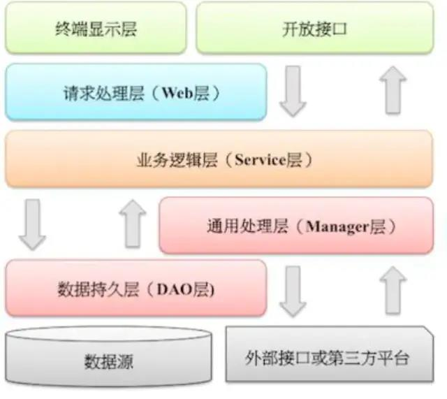
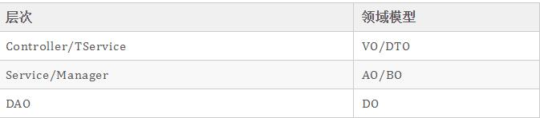

# 领域驱动模型DDD

一个好的应用分层需要具备以下几点:

- 方便后续代码进行维护扩展
- 分层的效果需要让整个团队都接受
- 各个层职责边界清晰

阿里的编码规范中约束的分层如下:

在编码规约中列举了下面几个领域模型规约:

DO（Data Object）：与数据库表结构一一对应，通过DAO层向上传输数据源对象。

DTO（Data Transfer Object）：数据传输对象，Service或Manager向外传输的对象。

BO（Business Object）：业务对象。由Service层输出的封装业务逻辑的对象。

AO（Application Object）：应用对象。在Web层与Service层之间抽象的复用对象模型，极为贴近展示层，复用度不高。

VO（View Object）：显示层对象，通常是Web向模板渲染引擎层传输的对象。

Query：数据查询对象，各层接收上层的查询请求。注意超过2个参数的查询封装，禁止使用Map类来传输。

