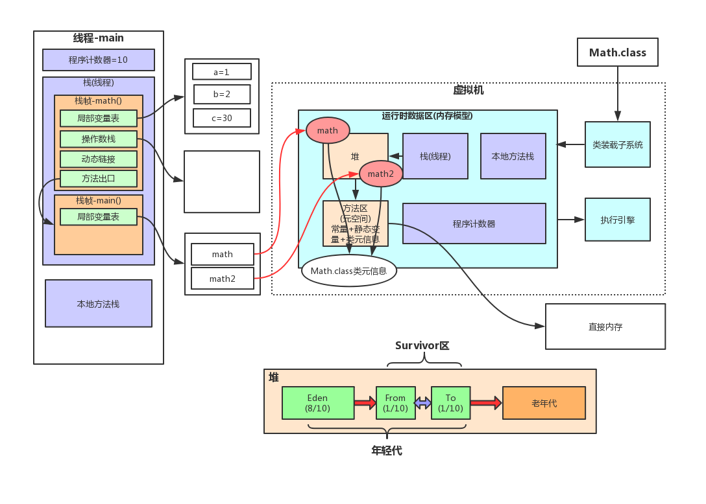

# JVM底层原理

## 1. JVM内存模型

### 1.1 方法区(元空间/永久代)-常量池
### 1.2 Java虚拟机栈及栈帧内部结构
### 1.3 堆内存分代机制详解
### 1.4 程序计数器详解
### 1.5 本地方法栈详解

## 2. 垃圾收集器分类和算法

1. 并行（Parallel）
    指多条垃圾收集线程并行工作，但此时用户线程仍然处于等待状态（挂起）；
    如ParNew、Parallel Scavenge、Parallel Old；
2. 并发（Concurrent）
    指用户线程与垃圾收集线程同时执行（但不一定是并行的，可能会交替执行），
    用户程序在继续运行，而垃圾收集程序线程运行于另一个CPU上，如CMS、G1（也有并行）

### 2.1 Serial（新生代串行）

采用复制算法，单线程收集，进行垃圾收集时，必须暂停所有工作线程，直到完成（ 即会"Stop The World）

对于限定单个CPU的环境来说，Serial收集器没有线程交互（切换）开销，可以获得最高的单线程收集效率，Client模式下默认的新生代收集器

### 2.2 ParNew（新生代并行复制）

Serial的多线程版本。一般运行在Server模式下首先的新生代收集器。 在Server模式下，ParNew收集器是一个非常重要的收集器，因为除Serial外，目前只有它能与CMS收集器配合工作；

参数：
- -XX:+UseConcMarkSweepGC：指定使用CMS后，会默认使用ParNew作为新生代收集器；
- -XX:+UseParNewGC：强制指定使用ParNew；    
- -XX:ParallelGCThreads：指定垃圾收集的线程数量，ParNew默认开启的收集线程与CPU的数量相同；

### 2.3 Parallel Scavenge（新生代并行复制）

与ParNew收集器相似，采用复制算法，多线程收集，目标则是达一个可控制的吞吐量（Throughput），说白了就是CPU的利用率，比较适合后端运算比较多的服务

参数:

- -XX:MaxGCPauseMillis：每次年轻代垃圾回收的最长时间(最大暂停时间)，收集器尽量保证内存回收时间不大于这个值，应该设置一个合理的值。
- -XX:GCTimeRatio：设置垃圾回收时间占程序运行时间的百分比，与上面的参数互斥
- -XX:+UseAdaptiveSizePolicy： 设置此选项后,并行收集器会自动选择年轻代区大小和相应的Survivor区比例,以达到目标系统规定的最低相应时间或者收集频率等,此值建议使用并行收集器时,一直打开.

### 2.4 Serial Old收集器（老年代串行）

单线程串行的老年代收集器。主要用于Client模式
1. 在JDK1.5及之前，与Parallel Scavenge收集器搭配使用（JDK1.6有Parallel Old收集器可搭配，就基本不用parallel+serial old）；
2. 作为CMS收集器的后备预案，在并发收集发生Concurrent Mode Failure时使用；

### 2.5 Parallel Old收集器（老年代并行标记整理）

适合和Parallel Scavenge收集器进行组合。-XX:+UseParallelOldGC

### 2.6 CMS垃圾收集器（老年代标记复制清除）

CMS(Concurrent Mark Sweep)收集器是一种以获取最短回收停顿时间为目标的收集器，目前大部分的B/S系统都使用CMS的收集器。一般CMS是老生代收集器，和PerNew进行组合

工作流程：初始标记->并发标记->重新标记->并发清除

CMS收集器的优点：并发收集、低停顿

缺点:
1. CMS收集器对CPU资源非常敏感。在并发阶段，虽然不会导致用户线程停顿，但是会占用CPU资源而导致引用程序变慢，总吞吐量下降。CMS默认启动的回收线程数是：(CPU数量+3) / 4。
2. CMS收集器无法处理浮动垃圾（ 在并发清除时，注意不是重新标记，用户线程新产生的垃圾，称为浮动垃圾），可能出现“Concurrent Mode Failure“，失败后而导致另一次Full GC的产生。这使得并发清除时需要预留一定的内存空间，不能像其他收集器在老年代几乎填满再进行收集

设置参数 "-XX:+UseConcMarkSweepGC"：指定使用CMS收集器；

### 2.7 G1垃圾收集器（整堆并发并行复制）

工作流程：初始标记->并发标记->最终标记->（并发）筛选回收

特点：
1. 并行与并发
2. 分代收集
3. 结合多种垃圾收集算法，空间整合，不产生碎片
4. 可预测的停顿：低停顿的同时实现高吞吐量  （优先回收价值高，成本高的Region对象，以提高吞吐量）相比CMS（标记-清除），G1总体上更像是基于标记-整理（不产生碎片），从局部（两个Region间）看，是基于复制算法；

## 3. 垃圾收集算法详解

### 3.1 标记清除算法详解
### 3.2 复制算法详解
### 3.3 标记整理算法详解
### 3.4 分代垃圾收集算法详解

## 4. JVM类加载机制

### 4.1 类加载的生命周期详解
### 4.2 启动、扩展、应用程序类加载器详解
### 4.3 手写自定义类加载器以及自定义类加载器的使用场景分析
### 4.4 双亲委派模型及如何打破，什么场景下需要打破双亲委派

## 5. JVM调优工具

### 5.1 JDK自带Jstat、Jinfo、Jmap、Jhat及Jstack调优命令详解
### 5.2 Jvisualvm、Jconsole调优工具详解
### 5.3 阿里巴巴JVM调优工具Arthas详解

## 6. GC日志分析

### 6.1 GCEasy日志分析工具使用
