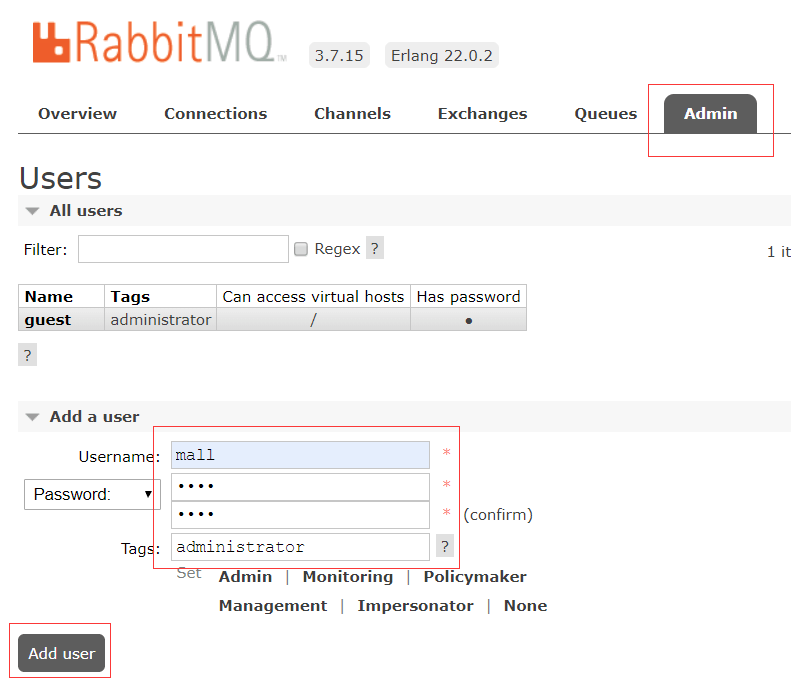

# Docker

## 1. 容器

### docker

```bash
yum-config-manager --add-repo https://mirrors.aliyun.com/docker-ce/linux/centos/docker-ce.repo
yum install docker-ce
yum install --setopt=obsoletes=0 docker-ce-18.06.3.ce-3.el7 -y
chkconfig docker on
systemctl start docker

vi /etc/docker/daemon.json
{
    "registry-mirrors":["https://docker.mirrors.ustc.edu.cn"],
    "insecure-registries": ["192.168.3.200:5000"],
    "exec-opts":["native.cgroupdriver=systemd"],
    "data-root": "/data/docker"
}

vi /usr/lib/systemd/system/docker.service
ExecStart=/usr/bin/dockerd  # 如果原文件此行后面有-H选项，请删除-H(含)后面所有内容。
mv /var/lib/docker /data    # images位置迁移
sudo systemctl daemon-reload
sudo systemctl restart docker
```

### portainer

```bash
docker run -p 9000:9000 -p 8000:8000 --name portainer \
--restart=always \
-v /var/run/docker.sock:/var/run/docker.sock \
-v /mydata/portainer/data:/data \
-d portainer/portainer
```

```bash
vim /usr/lib/systemd/system/docker.service #编辑文件
ExecStart=/usr/bin/dockerd -H tcp://0.0.0.0:2375 -H unix://var/run/docker.sock #修改参数
systemctl daemon-reload #加载docker守护线程
systemctl restart docker #重启docker
```


### nginx

```bash
docker pull nginx:1.10
```

- 先运行一次容器（为了拷贝配置文件）：

```bash
docker run -p 80:80 --name nginx \
-v /mydata/nginx/html:/usr/share/nginx/html \
-v /mydata/nginx/logs:/var/log/nginx  \
-d nginx:1.10
```

```bash
docker container cp nginx:/etc/nginx /mydata/nginx/ # 将容器内的配置文件拷贝到指定目录
mv /mydata/nginx/nginx /mydata/nginx/conf           # 修改文件
docker rm -f nginx
```

- 使用如下命令启动Nginx服务：

```bash
docker run -p 80:80 -p 443:443 --name nginx \
-v /mydata/nginx/html:/usr/share/nginx/html \
-v /mydata/nginx/logs:/var/log/nginx  \
-v /mydata/nginx/conf:/etc/nginx \
-d nginx:1.10
```

### nginx-fancyindex

```bash
docker run -d \
  -p 8083:80 \
  -p 8084:443 \
  -e HTTP_AUTH="off" \
  -e HTTP_USERNAME="admin" \
  -e HTTP_PASSWD="admin" \
  -v /home/my-files:/app/public \
  --restart unless-stopped \
  --mount type=tmpfs,destination=/tmp \
  80x86/nginx-fancyindex
```


### rancher

```bash
mkdir -p /mydata/rancher_home/rancher
mkdir -p /mydata/rancher_home/auditlog

docker run --privileged -d --restart=unless-stopped -p 80:80 -p 443:443 \
  -v /mydata/rancher_home/rancher:/var/lib/rancher \
  -v /mydata/rancher_home/auditlog:/var/log/auditlog \
  --name rancher rancher/rancher  

```

## 2. 数据库

### mysql


```bash
docker pull mysql:5.7

docker run -p 3306:3306 --name mysql \
-v /mydata/mysql/log:/var/log/mysql \
-v /mydata/mysql/data:/var/lib/mysql \
-v /mydata/mysql/conf:/etc/mysql \
-e MYSQL_ROOT_PASSWORD=root  \
-d mysql:5.7
```

- 参数说明
  - -p 3306:3306：将容器的3306端口映射到主机的3306端口
  - -v /mydata/mysql/conf:/etc/mysql：将配置文件夹挂在到主机
  - -v /mydata/mysql/log:/var/log/mysql：将日志文件夹挂载到主机
  - -v /mydata/mysql/data:/var/lib/mysql/：将数据文件夹挂载到主机
  - -e MYSQL_ROOT_PASSWORD=root：初始化root用户的密码
  
```bash
docker exec -it mysql /bin/bash
mysql -uroot -proot --default-character-set=utf8
grant all privileges on *.* to 'root' @'%' identified by '123456';
```

### redis


```bash
docker pull redis:5

docker run -p 6379:6379 --name redis \
-v /mydata/redis/data:/data \
-d redis:5 redis-server --appendonly yes
```

监控工具redis-stat

```bash
docker run --name redis-stat --link redis6380:redis -p 8080:63790 -d insready/redis-stat --server redis          # 容器内部自连接
docker run --name redis-stat -p 8080:63790 -d insready/redis-stat --server 192.168.3.200:6379 192.168.3.201:6379 # 远程集群或单机
```

### mongo

```bash
docker pull mongo:4.2.5

docker run -p 27017:27017 --name mongo \
-v /mydata/mongo/db:/data/db \
-d mongo:4.2.5
```

### postgres

```bash
docker run --name postgres2 -v /mydata/postgres/data:/var/lib/postgresql/data -e POSTGRES_PASSWORD=123456 -d -p 5432:5432 postgres:10.12
docker run --name postgres -e POSTGRES_PASSWORD=123456 -d -p 54321:5432 -v /etc/data/pgdata:/var/lib/postgresql/data-d postgres
默认用户：postgres 密码：POSTGRES_PASSWORD

/var/lib/postgresql/data   #镜像的data目录
/usr/lib/postgresql/??/bin #进入postgresql的工具目录
psql -Upostgres # 连接数据库

-it -d 这两个参数一般同时使用，保证 container 以交互的方式在后台运行。
--rm 这个参数是指在 container 停止时自动将 container 删除。
--name 你在使用 docker ps 命令时看到的 container 的名字。
-e POSTGRES_USER=dbuser 这个是设置 container 中的环境变量用的参数，指的是设计数据库用户为 dbuser 。之后登录数据库时就是使用这个用户名。
-e POSTGRES_PASSWORD=password 同上，也是设置 container 中的环境变量，这个是设置你登录数据库的密码，这里设置的密码为"password"。
-e POSTGRES_DB=testdb 同上，初始化一个新的数据库，其名字为 testdb。
-p 5432:5432 这个是将主机的端口与 container 暴露的端口进行映射。其格式为 -p 主机端口: container 端口。即 : 前为主机端口，后为 container 端口。
-v /docker/volumes/postgres:/var/lib/postgresql/data 挂载目录。
```

### tdengine

```bash
docker run -d -p 6041:6041 \
	-v /mydata/taos/conf:/etc/taos \
	-v /mydata/taos/data:/var/lib/taos \
	-v /mydata/taos/logs:/var/log/taos \
	--name tdengine 
	tdengine:2.0.19.1
```

### influxdb

1.x
```bash
docker run -d -p 8086:8086 \
      -v /mydata/influxdb1:/var/lib/influxdb \
      --name influxdb1 \
      influxdb:1.8
```

2.x
```bash
docker run -d -p 8086:8086 \
      -v /mydata/influxdb2/data:/var/lib/influxdb2 \
      -v /mydata/influxdb2/config:/etc/influxdb2 \
      -e DOCKER_INFLUXDB_INIT_MODE=setup \
	    -e DOCKER_INFLUXDB_INIT_USERNAME=my-user \
      -e DOCKER_INFLUXDB_INIT_PASSWORD=my-password \
      -e DOCKER_INFLUXDB_INIT_ORG=org \
      -e DOCKER_INFLUXDB_INIT_BUCKET=bucket \
	    --name influxdb2 \
      influxdb:2.0.6
```

## 3. 存储

### fastdfs

```bash
docker run -ti -d --name trakcer -v /mydata/tracker_data:/fastdfs/tracker/data --net=host season/fastdfs tracker
docker run -ti --name storage  \
  -v /mydata/storage_data:/fastdfs/storage/data  \
  -v /mydata/store_path:/fastdfs/store_path  \
  --net=host  \
  -e TRACKER_SERVER:192.168.3.200:22122  \
  season/fastdfs storage
```

```bash
docker run -dti --network=host --name tracker -v /mydata/fdfs/tracker:/var/fdfs delron/fastdfs tracker 
docker run -dti --network=host --name storage -e TRACKER_SERVER=192.168.3.200:22122 -v /mydata/fdfs/storage:/var/fdfs delron/fastdfs storage
```

一体安装
```bash
docker run \
	--net=host \
	--name=fastdfs \
	-e IP=192.168.3.200 \
	-e WEB_PORT=80 \
	-v /mydata/fdfs:/var/local/fdfs \
	-d registry.cn-beijing.aliyuncs.com/tianzuo/fastdfs
```

### minio
默认Access Key和Secret都是minioadmin

```bash
docker run -p 9090:9000 --name minio \
  -v /mydata/minio/data:/data \
  -v /mydata/minio/config:/root/.minio \
  -d minio/minio server /data
```


## 4. 分布式

### sentinel-dashboard

```bash
docker run --name sentinel -d -p 8858:8858 -d bladex/sentinel-dashboard:1.7.2
```

### nacos-server

```bash
docker run --name nacos -d -p 8848:8848 -e MODE=standalone nacos/nacos-server
```

### dubbo-admin

```bash
docker run -d -p 7001:7001 -e dubbo.registry.address=zookeeper://192.168.3.200:2181 -e dubbo.admin.root.password=root -e dubbo.admin.guest.password=guest chenchuxin/dubbo-admin 
```

### zookeeper

```bash
docker run -d -p 2181:2181 -v /mydata/zookeeper/data/:/data/ --name=zookeeper  --privileged zookeeper  #启动zk
```

### zipkin

```bash
docker run -d --name zipkin -p  9411:9411 openzipkin/zipkin
```

## 5. MQ

### activemq

```bash
docker run -d --name activemq -p 61616:61616 -p 8161:8161 webcenter/activemq
```

### rabbitmq

```bash
docker pull rabbitmq:3.7.15
docker run -p 5672:5672 -p 15672:15672 -p 1883:1883 --name rabbitmq -d rabbitmq:3.7.15
```

- 进入容器并开启管理功能：

```bash
docker exec -it rabbitmq /bin/bash
rabbitmq-plugins enable rabbitmq_mqtt
rabbitmq-plugins enable rabbitmq_management
```

- 开启防火墙：

```bash
firewall-cmd --zone=public --add-port=15672/tcp --permanent
firewall-cmd --reload
```
- 访问地址查看是否安装成功：http://192.168.3.200:15672


- 输入账号密码并登录：guest guest

- 创建帐号并设置其角色为管理员：mall mall



- 创建一个新的虚拟host为：/mall


- 点击mall用户进入用户配置页面


- 给mall用户配置该虚拟host的权限


### rocketmq

开通防火墙
```bash
firewall-cmd --zone=public --add-port=9876/tcp --permanent
firewall-cmd --zone=public --add-port=10911/tcp --permanent
firewall-cmd --zone=public --add-port=9800/tcp --permanent
firewall-cmd --reload
```

创建存储文件夹
```bash
mkdir -p /mydata/rocketmq/data/namesrv/logs /root/rocketmq/data/namesrv/store /mydata/rocketmq/conf /mydata/rocketmq/data/broker/logs /mydata/rocketmq/data/broker/stor
```


进入到 /mydata/rocketmq/conf 文件夹下 创建文件 broker.conf
```bash
cd /mydata/rocketmq/conf
touch broker.conf
vi broker.conf

brokerClusterName = DefaultCluster
brokerName = broker-a
brokerId = 0
deleteWhen = 04
fileReservedTime = 48
brokerRole = ASYNC_MASTER
flushDiskType = ASYNC_FLUSH
brokerIP1 = 172.17.17.80
messageDelayLevel=1s 5s 10s 30s 1m 2m 3m 4m 5m 6m 7m 8m 9m 10m 20m 30m 1h 2h
```

拉取镜像
```bash
docker pull rocketmqinc/rocketmq:4.4.0
docker pull styletang/rocketmq-console-ng

docker run -d -p 9876:9876 -v /mydata/rocketmq/data/namesrv/logs:/root/logs -v /mydata/rocketmq/data/namesrv/store:/root/store --name rmqnamesrv -e "MAX_POSSIBLE_HEAP=100000000" rocketmqinc/rocketmq:4.4.0 sh mqnamesrv

docker run -d -p 10911:10911 -p 10909:10909 -v  /mydata/rocketmq/data/broker/logs:/root/logs -v  /mydata/rocketmq/data/broker/store:/root/store -v  /mydata/rocketmq/conf/broker.conf:/opt/rocketmq-4.4.0/conf/broker.conf --name rmqbroker --link rmqnamesrv:namesrv -e "NAMESRV_ADDR=namesrv:9876" -e "MAX_POSSIBLE_HEAP=200000000" rocketmqinc/rocketmq:4.4.0 sh mqbroker -c /opt/rocketmq-4.4.0/conf/broker.conf

docker run -d --name rmqconsole -p 9800:8080 --link rmqnamesrv:namesrv -e "JAVA_OPTS=-Drocketmq.namesrv.addr=namesrv:9876 -Dcom.rocketmq.sendMessageWithVIPChannel=false" -t styletang/rocketmq-console-ng

```

### kafka

```bash
docker run -d --name kafka -p 9092:9092 -e KAFKA_BROKER_ID=0 -e KAFKA_ZOOKEEPER_CONNECT=zookeeper:2181 --link zookeeper -e     KAFKA_ADVERTISED_LISTENERS=PLAINTEXT://172.17.17.80:9092 -e KAFKA_LISTENERS=PLAINTEXT://0.0.0.0:9092 -t wurstmeister/kafka

docker run -d --name kafka-manager \--link zookeeper:zookeeper \--link kafka:kafka -p 9001:9000 \--restart=always \--env ZK_HOSTS=zookeeper:2181 \sheepkiller/kafka-manager

```

### emqx

```bash
# 开源版
docker run -d --name emqx -p 1883:1883 -p 8081:8081 -p 8083:8083 -p 8084:8084 -p 8883:8883 -p 18083:18083 emqx/emqx:v4.0.5
# 企业版
docker run -d --name emqx-ee -p 1883:1883 -p 8081:8081 -p 8083:8083 -p 8084:8084 -p 8883:8883 -p 18083:18083 emqx/emqx-ee:4.2.5
```

## 6. 大数据

### elasticsearch

```bash
docker pull elasticsearch:7.6.2
```

- 修改虚拟内存区域大小，否则会因为过小而无法启动:

```bash
sysctl -w vm.max_map_count=262144
```

- 使用如下命令启动Elasticsearch服务：

```bash
docker run -p 9200:9200 -p 9300:9300 --name elasticsearch \
-e "discovery.type=single-node" \
-e "cluster.name=elasticsearch" \
-v /mydata/elasticsearch/plugins:/usr/share/elasticsearch/plugins \
-v /mydata/elasticsearch/data:/usr/share/elasticsearch/data \
-d elasticsearch:7.6.2
```

- 启动时会发现`/usr/share/elasticsearch/data`目录没有访问权限，只需要修改`/mydata/elasticsearch/data`目录的权限，再重新启动即可；

```bash
chmod 777 /mydata/elasticsearch/data/
```

- 安装中文分词器IKAnalyzer，并重新启动：

```bash
docker exec -it elasticsearch /bin/bash
#此命令需要在容器中运行
elasticsearch-plugin install https://github.com/medcl/elasticsearch-analysis-ik/releases/download/v7.6.2/elasticsearch-analysis-ik-7.6.2.zip
docker restart elasticsearch
http://192.168.3.200:9200/_cat/plugins
```

- 开启防火墙：

```bash
firewall-cmd --zone=public --add-port=9200/tcp --permanent
firewall-cmd --reload
```

- 访问会返回版本信息：http://192.168.3.200:9200


- 安装elasticsearch-head插件

```bash
docker run -d -p 9100:9100 docker.io/mobz/elasticsearch-head:5
```

elasticsearch.yml，在文件末尾加入以下配置

```yml
http.cors.enabled: true
http.cors.allow-origin: "*"
```


### logstash

```bash
docker pull logstash:7.6.2
```

- 创建logstash.conf文件

```
input {
  tcp {
    mode => "server"
    host => "0.0.0.0"
    port => 4560
    codec => json_lines
    type => "debug"
  }
  tcp {
    mode => "server"
    host => "0.0.0.0"
    port => 4561
    codec => json_lines
    type => "error"
  }
  tcp {
    mode => "server"
    host => "0.0.0.0"
    port => 4562
    codec => json_lines
    type => "business"
  }
  tcp {
    mode => "server"
    host => "0.0.0.0"
    port => 4563
    codec => json_lines
    type => "record"
  }
}
filter{
  if [type] == "record" {
    mutate {
      remove_field => "port"
      remove_field => "host"
      remove_field => "@version"
    }
    json {
      source => "message"
      remove_field => ["message"]
    }
  }
}
output {
  elasticsearch {
    hosts => "es:9200"
    index => "mall-%{type}-%{+YYYY.MM.dd}"
  }
}
```

- 创建`/mydata/logstash`目录，并将Logstash的配置文件`logstash.conf`拷贝到该目录；

```bash
mkdir /mydata/logstash
```

- 使用如下命令启动Logstash服务；

```bash
docker run --name logstash -p 4560:4560 -p 4561:4561 -p 4562:4562 -p 4563:4563 \
--link elasticsearch:es \
-v /mydata/logstash/logstash.conf:/usr/share/logstash/pipeline/logstash.conf \
-d logstash:7.6.2
```

- 进入容器内部，安装`json_lines`插件。

```bash
docker exec -it logstash /bin/bash
cd /usr/share/logstash/bin
logstash-plugin install logstash-codec-json_lines
```

### kibana

```bash
docker pull kibana:7.6.2

docker run --name kibana -p 5601:5601 \
--link elasticsearch:es \
-e "elasticsearch.hosts=http://es:9200" \
-d kibana:7.6.2
```

- 开启防火墙：

```bash
firewall-cmd --zone=public --add-port=5601/tcp --permanent
firewall-cmd --reload
```
- 访问地址进行测试：http://192.168.3.200:5601

## 7. 持续集成

### nexus3

```bash
docker pull sonatype/nexus3
mkdir -p /home/mvn/nexus-data  && chown -R 200 /home/mvn/nexus-data
docker run -d -p 8081:8081 --name nexus -v /home/mvn/nexus-data:/nexus-data sonatype/nexus3
```


### registry

修改Docker Daemon的配置文件，文件位置为/etc/docker/daemon.json，由于Docker默认使用HTTPS推送镜像，而我们的镜像仓库没有支持，所以需要添加如下配置，改为使用HTTP推送

```
{
  "insecure-registries": ["192.168.3.200:5000"]
}
```

REGISTRY_STORAGE_DELETE_ENABLED=true 开启删除镜像的功能

```bash
docker run -p 5000:5000 --name registry2 \
--restart=always \
-e REGISTRY_STORAGE_DELETE_ENABLED="true" \
-d registry:2
```

```bash
docker run -p 8280:80 --name registry-ui \
--link registry2:registry2 \
-e REGISTRY_URL="http://registry2:5000" \
-e DELETE_IMAGES="true" \
-e REGISTRY_TITLE="Registry2" \
-d joxit/docker-registry-ui:static
```

### harbor

> wget https://github.com/goharbor/harbor/releases/download/v2.0.1/harbor-offline-installer-v2.0.1.tgz

```shell
tar xf harbor-offline-installer-v2.0.1.tgz
mkdir /opt/harbor
mv harbor/* /opt/harbor
cd /opt/harbor
# 复制配置文件
cp harbor.yml.tmpl harbor.yml
# 编辑
vi harbor.yml
```

```yml
#修改配置文件(如果不用https就注释掉https的几项，我是用的http就注释掉了https的，其他几项修改为自己的信息)
···
hostname: 192.168.3.200
···
# http related config
http:
  # port for http, default is 80. If https enabled, this port will redirect to https port
  port: 88
···
# https related config
#https:
  # https port for harbor, default is 443
  #port: 443
  # The path of cert and key files for nginx
  #certificate: /your/certificate/path
  #private_key: /your/private/key/path
····
harbor_admin_password: Harbor12345
···
data_volume: /data
···
```

安装

```shell
./install.sh 
docker-compose up -d #启动
docker-compose stop #停止
docker-compose restart #重新启动
```

默认账户密码：admin/Harbor12345


### sonarqube

```bash
docker run -d --name sonarqube -e SONAR_ES_BOOTSTRAP_CHECKS_DISABLE=true -p 9000:9000 sonarqube:8.6-community #H2默认存储

#postgres外挂存储
docker run -d --name sonarqube \
    --link postgres2 \
    -p 9000:9000 \
    -e sonar.jdbc.url=jdbc:postgresql://172.17.17.80:5432/sonardb \
    -e sonar.jdbc.username=sonar \
    -e sonar.jdbc.password=123456 \
    -v /data/sonarqube/sonarqube_extensions:/opt/sonarqube/extensions \
    -v /data/sonarqube/sonarqube_logs:/opt/sonarqube/logs \
    -v /data/sonarqube/sonarqube_data:/opt/sonarqube/data \
    sonarqube:8.6-community
```

### jenkins

```bash
docker pull jenkins/jenkins:lts
docker pull jenkins/jenkins

mkdir -p /data/jenkins_home/
chown -R 1000:1000 /data/jenkins_home/

docker run -d --name jenkins -p 8888:8080 -p 50000:50000 -v /data/jenkins_home:/var/jenkins_home jenkins/jenkins

cd /data/jenkins_home
vi hudson.model.UpdateCenter.xml
# http://mirror.xmission.com/jenkins/updates/update-center.json

```

### prometheus

```bash
docker pull prom/prometheus
docker pull prom/node-exporter
docker pull grafana/grafana
```

docker-compose-prometheus.yml
```yml
version: '2'
services:
####################prometheus###############
  prometheus:
    image: "prom/prometheus"
    hostname: prometheus
    container_name: prometheus
    ports:
      - '9090:9090'
    volumes:
      - /mydata/prometheus/prometheus.yml:/etc/prometheus/prometheus.yml
    restart: always

###############node-exporter###############
  node-exporter:
    image: "prom/node-exporter"
    hostname: node-exporter
    container_name: node-exporter
    ports:
      - '9100:9100'
    volumes:
      - /usr/share/zoneinfo/Asia/Shanghai:/etc/localtime:ro
      - /proc:/host/proc:ro
      - /sys:/host/sys:ro
      - /:/rootfs:ro
    restart: always
    network_mode: host
    command:
      - '--path.procfs=/host/proc'
      - '--path.sysfs=/host/sys'
      - '--path.rootfs=/rootfs'
```

prometheus.yml
```yml
global:
  scrape_interval:     60s
  evaluation_interval: 60s
 
scrape_configs:
  - job_name: prometheus
    static_configs:
      - targets: ['localhost:9090']
        labels:
          instance: prometheus
 
  - job_name: linux
    static_configs:
      - targets: ['172.17.17.201:9100']
```

```bash
docker-compose -f docker-compose-prometheus.yml up -d  
```

### grafana

```bash
docker run -d -p 3000:3000 --name grafana grafana/grafana
```

admin:admin


## 8. 其他

### zentao

```bash
mkdir -p /data/zbox

docker run -d -p 8080:80 -p 3316:3306 -e USER="admin" -e PASSWD="admin" -e BIND_ADDRESS="false" -e SMTP_HOST="163.177.90.125 smtp.exmail.qq.com" -v /data/zbox/:/opt/zbox/ --name zentao-server idoop/zentao:latest 
```

- 8080 访问禅道外部端口号
- 3316 把容器3306数据库端口映射到主机3316端口
- USER 设置登录账号 admin
- PASSWD 设置登录密码 123456
- BIND_ADDRESS 设置为false


### node-red

```bash
sudo docker run -it -p 1880:1880 --name=nodered --restart=always --user=root --net=host -v /data/nodered:/data -e TZ=Asia/Shanghai nodered/node-red
```

### openfire
```bash
docker pull gizmotronic/openfire

docker run --name openfire -d --restart=always \
  --publish 9090:9090 --publish 5222:5222 --publish 7070:7070 \
  --volume /srv/docker/openfire:/var/lib/openfire \
  gizmotronic/openfire
```


### eclipse/che

http://ip:8080

```bash
docker run -it -d --rm \
-v /var/run/docker.sock:/var/run/docker.sock \
-v /mydata/che:/data \
eclipse/che start
```


### theia

```bash
chown -R 1000:1000 /mydata/
docker run -it -d -p 3000:3000 -v "/mydata/theia:/home/project:cached" theiaide/theia
docker run -it -d -p 3000:3000 -v "/mydata/theia-java:/home/project:cached" theiaide/theia-java
docker run -it -d --init -p 3000:3000 -v "/mydata/theia-full:/home/project:cached" theiaide/theia-full
```

