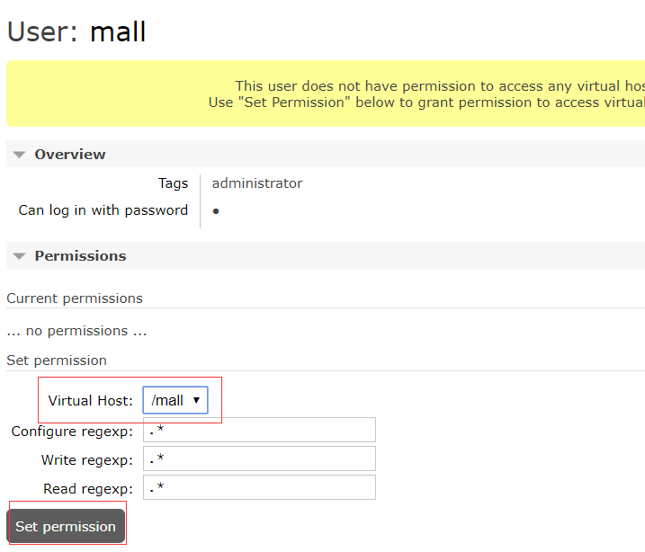

# Docker

## 1. 容器

### portainer

```bash
docker run -p 9000:9000 --name portainer \
--restart=always \
-v /var/run/docker.sock:/var/run/docker.sock \
-v /mydata/portainer/data:/data \
-d portainer/portainer
```

```bash
vim /usr/lib/systemd/system/docker.service #编辑文件
ExecStart=/usr/bin/dockerd -H tcp://0.0.0.0:2375 -H unix://var/run/docker.sock #修改参数
systemctl daemon-reload #加载docker守护线程
systemctl restart docker #重启docker
```


### nginx

```bash
docker pull nginx:1.10
```

- 先运行一次容器（为了拷贝配置文件）：

```bash
docker run -p 80:80 --name nginx \
-v /mydata/nginx/html:/usr/share/nginx/html \
-v /mydata/nginx/logs:/var/log/nginx  \
-d nginx:1.10
```

```bash
docker container cp nginx:/etc/nginx /mydata/nginx/ # 将容器内的配置文件拷贝到指定目录
mv /mydata/nginx/nginx /mydata/nginx/conf           # 修改文件
docker rm -f nginx
```

- 使用如下命令启动Nginx服务：

```bash
docker run -p 80:80 -p 443:443 --name nginx \
-v /mydata/nginx/html:/usr/share/nginx/html \
-v /mydata/nginx/logs:/var/log/nginx  \
-v /mydata/nginx/conf:/etc/nginx \
-d nginx:1.10
```

### nginx-fancyindex

```bash
docker run -d \
  -p 8083:80 \
  -p 8084:443 \
  -e HTTP_AUTH="off" \
  -e HTTP_USERNAME="admin" \
  -e HTTP_PASSWD="admin" \
  -v /home/my-files:/app/public \
  --restart unless-stopped \
  --mount type=tmpfs,destination=/tmp \
  80x86/nginx-fancyindex
```


### rancher

```bash
mkdir -p /mydata/rancher_home/rancher
mkdir -p /mydata/rancher_home/auditlog

docker run --privileged -d --restart=unless-stopped -p 80:80 -p 443:443 \
  -v /mydata/rancher_home/rancher:/var/lib/rancher \
  -v /mydata/rancher_home/auditlog:/var/log/auditlog \
  --name rancher rancher/rancher  

```

## 2. 数据库

### mysql


```bash
docker pull mysql:5.7

docker run -p 3306:3306 --name mysql \
-v /mydata/mysql/log:/var/log/mysql \
-v /mydata/mysql/data:/var/lib/mysql \
-v /mydata/mysql/conf:/etc/mysql \
-e MYSQL_ROOT_PASSWORD=root  \
-d mysql:5.7
```

- 参数说明
  - -p 3306:3306：将容器的3306端口映射到主机的3306端口
  - -v /mydata/mysql/conf:/etc/mysql：将配置文件夹挂在到主机
  - -v /mydata/mysql/log:/var/log/mysql：将日志文件夹挂载到主机
  - -v /mydata/mysql/data:/var/lib/mysql/：将数据文件夹挂载到主机
  - -e MYSQL_ROOT_PASSWORD=root：初始化root用户的密码
  
```bash
docker exec -it mysql /bin/bash
mysql -uroot -proot --default-character-set=utf8
grant all privileges on *.* to 'root' @'%' identified by '123456';
```


### mycat

创建 dockerfile
```bash
FROM centos:7 
RUN echo "root:root" | chpasswd
RUN yum -y install net-tools

# install java
ADD http://mirrors.linuxeye.com/jdk/jdk-8u221-linux-x64.tar.gz /usr/local/
RUN cd /usr/local && tar -zxvf jdk-8u221-linux-x64.tar.gz && ls -lna

ENV JAVA_HOME /usr/local/jdk1.8.0_221
ENV CLASSPATH ${JAVA_HOME}/lib/dt.jar:$JAVA_HOME/lib/tools.jar
ENV PATH $PATH:${JAVA_HOME}/bin

#install mycat

ADD http://dl.mycat.io/1.6.7.3/20190828135747/Mycat-server-1.6.7.3-release-20190828135747-linux.tar.gz /usr/local
RUN cd /usr/local && tar -zxvf Mycat-server-1.6.7.3-release-20190828135747-linux.tar.gz && ls -lna

#download mycat-ef-proxy
#RUN mkdir -p /usr/local/proxy
#ADD https://github.com/LonghronShen/mycat-docker/releases/download/1.6/MyCat-Entity-Framework-Core-Proxy.1.0.0-alpha2-netcore100.tar.gz /usr/local/proxy
#RUN cd /usr/local/proxy && tar -zxvf MyCat-Entity-Framework-Core-Proxy.1.0.0-alpha2-netcore100.tar.gz && ls -lna && sed -i -e 's#C:\\\\mycat#/usr/local/mycat#g' config.json

VOLUME /usr/local/mycat/conf

EXPOSE 8066 9066
#EXPOSE 7066

CMD /usr/local/mycat/bin/mycat console
```

```bash
Docker  build –f  dockerfile –t mycat  .                                      # 生成镜像
docker  run -dti --network mysql -p 8066:8066 -p 9066:9066 --name mycat mycat # network根据环境调整
docker  cp  mycat:/mydata/mycat/conf/  /usr/local/mycat/conf/                 # 挂载配置文件
docker  rm -f  mycat
```

server.xml 配置
```xml
<?xml version="1.0" encoding="UTF-8"?>
<!-- - - Licensed under the Apache License, Version 2.0 (the "License"); 
   - you may not use this file except in compliance with the License. - You 
   may obtain a copy of the License at - - http://www.apache.org/licenses/LICENSE-2.0 
   - - Unless required by applicable law or agreed to in writing, software - 
   distributed under the License is distributed on an "AS IS" BASIS, - WITHOUT 
   WARRANTIES OR CONDITIONS OF ANY KIND, either express or implied. - See the 
   License for the specific language governing permissions and - limitations 
   under the License. -->
<!DOCTYPE mycat:server SYSTEM "server.dtd">
<mycat:server xmlns:mycat="http://io.mycat/">
   <system>
   <property name="nonePasswordLogin">0</property> <!-- 0为需要密码登陆、1为不需要密码登陆 ,默认为0，设置为1则需要指定默认账户-->
   <property name="useHandshakeV10">1</property>
   <property name="useSqlStat">0</property>  <!-- 1为开启实时统计、0为关闭 -->
   <property name="useGlobleTableCheck">0</property>  <!-- 1为开启全加班一致性检测、0为关闭 -->
      <property name="sqlExecuteTimeout">300</property>  <!-- SQL 执行超时 单位:秒-->
      <property name="sequnceHandlerType">2</property>
      <!--<property name="sequnceHandlerPattern">(?:(\s*next\s+value\s+for\s*MYCATSEQ_(\w+))(,|\)|\s)*)+</property>-->
      <!--必须带有MYCATSEQ_或者 mycatseq_进入序列匹配流程 注意MYCATSEQ_有空格的情况-->
      <property name="sequnceHandlerPattern">(?:(\s*next\s+value\s+for\s*MYCATSEQ_(\w+))(,|\)|\s)*)+</property>
   <property name="subqueryRelationshipCheck">false</property> <!-- 子查询中存在关联查询的情况下,检查关联字段中是否有分片字段 .默认 false -->
      <!--  <property name="useCompression">1</property>--> <!--1为开启mysql压缩协议-->
        <!--  <property name="fakeMySQLVersion">5.6.20</property>--> <!--设置模拟的MySQL版本号-->
   <!-- <property name="processorBufferChunk">40960</property> -->
   <!-- 
   <property name="processors">1</property> 
   <property name="processorExecutor">32</property> 
    -->
        <!--默认为type 0: DirectByteBufferPool | type 1 ByteBufferArena | type 2 NettyBufferPool -->
      <property name="processorBufferPoolType">0</property>
      <!--默认是65535 64K 用于sql解析时最大文本长度 -->
      <!--<property name="maxStringLiteralLength">65535</property>-->
      <!--<property name="sequnceHandlerType">0</property>-->
      <!--<property name="backSocketNoDelay">1</property>-->
      <!--<property name="frontSocketNoDelay">1</property>-->
      <!--<property name="processorExecutor">16</property>-->
      <!--
         <property name="serverPort">8066</property> <property name="managerPort">9066</property> 
         <property name="idleTimeout">300000</property> <property name="bindIp">0.0.0.0</property>
         <property name="dataNodeIdleCheckPeriod">300000</property> 5 * 60 * 1000L; //连接空闲检查
         <property name="frontWriteQueueSize">4096</property> <property name="processors">32</property> -->
      <!--分布式事务开关，0为不过滤分布式事务，1为过滤分布式事务（如果分布式事务内只涉及全局表，则不过滤），2为不过滤分布式事务,但是记录分布式事务日志-->
      <property name="handleDistributedTransactions">0</property>
      
         <!--
         off heap for merge/order/group/limit      1开启   0关闭
      -->
      <property name="useOffHeapForMerge">0</property>

      <!--单位为m-->
        <property name="memoryPageSize">64k</property>

      <!--单位为k-->
      <property name="spillsFileBufferSize">1k</property>

      <property name="useStreamOutput">0</property>

      <!--单位为m-->
      <property name="systemReserveMemorySize">384m</property>


      <!--是否采用zookeeper协调切换  -->
      <property name="useZKSwitch">false</property>

      <!-- XA Recovery Log日志路径 -->
      <!--<property name="XARecoveryLogBaseDir">./</property>-->

      <!-- XA Recovery Log日志名称 -->
      <!--<property name="XARecoveryLogBaseName">tmlog</property>-->
      <!--如果为 true的话 严格遵守隔离级别,不会在仅仅只有select语句的时候在事务中切换连接-->
      <property name="strictTxIsolation">false</property>
      
      <property name="useZKSwitch">true</property>
      
   </system>
   
   <!-- 全局SQL防火墙设置 -->
   <!--白名单可以使用通配符%或着*-->
   <!--例如<host host="127.0.0.*" user="root"/>-->
   <!--例如<host host="127.0.*" user="root"/>-->
   <!--例如<host host="127.*" user="root"/>-->
   <!--例如<host host="1*7.*" user="root"/>-->
   <!--这些配置情况下对于127.0.0.1都能以root账户登录-->
   <!--
   <firewall>
      <whitehost>
         <host host="1*7.0.0.*" user="root"/>
      </whitehost>
       <blacklist check="false">
       </blacklist>
   </firewall>
   -->
	<!-- 添加用户，及用户能访问的逻辑库  -->
    <user name="tx0001">
        <property name="password">wycqq12345</property>
        <property name="schemas">block_master_eth</property>
        <property name="readOnly">true</property>
    </user>
</mycat:server>
```

schema.xml 配置实现读写分离，定义逻辑库 ，分片，分表，
```xml
<?xml version="1.0"?>
<!DOCTYPE mycat:schema SYSTEM "schema.dtd">
<mycat:schema xmlns:mycat="http://io.mycat/">
    <schema name="block_master_eth" checkSQLschema="true" sqlMaxLimit="100">
        <table name="blocks" ruleRequired="false" primaryKey="block_number"  autoIncrement="false"  dataNode="eth"  />
        <table name="transactions" ruleRequired="true"  subTables="transactions$1-100"   autoIncrement="false"  dataNode="eth" rule="transactions_rule" />
    </schema>

    <dataNode name="eth"  dataHost="host"  database="block_master_eth" />

    <dataHost name="host" maxCon="2000" minCon="200" balance="3"
        dbType="mysql" dbDriver="jdbc" switchType="1">
        <heartbeat>select user()</heartbeat>
        <writeHost host="btcM1" url="jdbc:mysql://masterIP:3306/" user="root" password="wycqq123456">
            <readHost host="btcS1" url="jdbc:mysql://slaveIP:3308/" user="root" password="wycqq123456" />
        </writeHost>
    </dataHost>
</mycat:schema>
```

rule.xml 配置定义分表，分片规则
```xml
<?xml version="1.0" encoding="UTF-8"?>
<!DOCTYPE mycat:rule SYSTEM "rule.dtd">
<mycat:rule xmlns:mycat="http://io.mycat/">
    <tableRule name="transactions_rule">
        <rule>
            <columns>block_number</columns>
            <algorithm>t_fun_block</algorithm>
        </rule>
    </tableRule>


    <function name="t_fun_block" class="io.mycat.route.function.PartitionByPattern">
        <property name="patternValue">2000</property>
        <property name="defaultNode">0</property>
        <property name="mapFile">partition-pattern.txt</property>
    </function>
    </mycat:rule>
```


### sharding-proxy

/mydata/sharding_proxy/conf下创建server.yaml
```yaml
authentication:
  users:
    root:
      password: root
    sharding:
      password: sharding
      authorizedSchemas: dbgirl
props:
  acceptor.size: 16
```

创建config-dbgirl.yaml
```yaml
schemaName: dbgirl
dataSources:
  ds0:
    username: root
    password: 123456
    url: jdbc:mysql://132.126.3.141:3306/dbgirl?useUnicode=true&characterEncoding=utf-8&serverTimezone=Asia/Shanghai
  ds1:
    username: root
    password: 123456
    url: jdbc:mysql://132.126.3.141:3306/dbgirl2?useUnicode=true&characterEncoding=utf-8&serverTimezone=Asia/Shanghai
shardingRule:
  tables:
    girl:
      actualDataNodes: ds$->{0..1}.girl
      databaseStrategy:
        inline:
          shardingColumn: id
          algorithmExpression: ds$->{id % 2}
      keyGenerator:
        type: SNOWFLAKE
        column: id
  bindingTables:
    - girl
  defaultTableStrategy:
    none:
```

```bash
docker run -p 13308:3308 -d \
  -v /mydata/sharding_proxy/conf:/opt/sharding-proxy/conf  \
  -v /mydata/sharding_proxy/ext-lib:/opt/sharding-proxy/ext-lib  \
  -e JVM_OPTS="-Djava.awt.headless=true"  \
  --name sharding-proxy  \
  apache/sharding-proxy:latest
```

### redis


```bash
docker pull redis:5

docker run -p 6379:6379 --name redis \
-v /mydata/redis/data:/data \
-d redis:5 redis-server --appendonly yes
```

监控工具redis-stat

```bash
docker run --name redis-stat --link redis6380:redis -p 8080:63790 -d insready/redis-stat --server redis          # 容器内部自连接
docker run --name redis-stat -p 8080:63790 -d insready/redis-stat --server 192.168.3.200:6379 192.168.3.201:6379 # 远程集群或单机
```

### mongo

```bash
docker pull mongo:4.2.5

docker run -p 27017:27017 --name mongo \
-v /mydata/mongo/db:/data/db \
-d mongo:4.2.5
```

### postgres

```bash
docker run --name postgres2 -v /mydata/postgres/data:/var/lib/postgresql/data -e POSTGRES_PASSWORD=123456 -d -p 5432:5432 postgres:10.12
docker run --name postgres -e POSTGRES_PASSWORD=123456 -d -p 54321:5432 -v /etc/data/pgdata:/var/lib/postgresql/data-d postgres
默认用户：postgres 密码：POSTGRES_PASSWORD

/var/lib/postgresql/data   #镜像的data目录
/usr/lib/postgresql/??/bin #进入postgresql的工具目录
psql -Upostgres # 连接数据库

-it -d 这两个参数一般同时使用，保证 container 以交互的方式在后台运行。
--rm 这个参数是指在 container 停止时自动将 container 删除。
--name 你在使用 docker ps 命令时看到的 container 的名字。
-e POSTGRES_USER=dbuser 这个是设置 container 中的环境变量用的参数，指的是设计数据库用户为 dbuser 。之后登录数据库时就是使用这个用户名。
-e POSTGRES_PASSWORD=password 同上，也是设置 container 中的环境变量，这个是设置你登录数据库的密码，这里设置的密码为"password"。
-e POSTGRES_DB=testdb 同上，初始化一个新的数据库，其名字为 testdb。
-p 5432:5432 这个是将主机的端口与 container 暴露的端口进行映射。其格式为 -p 主机端口: container 端口。即 : 前为主机端口，后为 container 端口。
-v /docker/volumes/postgres:/var/lib/postgresql/data 挂载目录。
```

### tdengine

```bash
docker run -d -p 6041:6041 \
	-v /mydata/taos/conf:/etc/taos \
	-v /mydata/taos/data:/var/lib/taos \
	-v /mydata/taos/logs:/var/log/taos \
	--name tdengine 
	tdengine:2.0.19.1
```

### influxdb

1.x
```bash
docker run -d -p 8086:8086 \
      -v /mydata/influxdb1:/var/lib/influxdb \
      --name influxdb1 \
      influxdb:1.8
```

2.x
```bash
docker run -d -p 8086:8086 \
      -v /mydata/influxdb2/data:/var/lib/influxdb2 \
      -v /mydata/influxdb2/config:/etc/influxdb2 \
      -e DOCKER_INFLUXDB_INIT_MODE=setup \
	    -e DOCKER_INFLUXDB_INIT_USERNAME=my-user \
      -e DOCKER_INFLUXDB_INIT_PASSWORD=my-password \
      -e DOCKER_INFLUXDB_INIT_ORG=org \
      -e DOCKER_INFLUXDB_INIT_BUCKET=bucket \
	    --name influxdb2 \
      influxdb:2.0.6
```

### couchdb

```bash
docker run -p 5984:5984 --name my-couchdb -e COUCHDB_USER=admin -e COUCHDB_PASSWORD=admin -v /home/mydata/couchdb/data:/opt/couchdb/data -d couchdb
docker run -d -p 8800:8000 --link=my-couchdb --name fauxton 3apaxicom/fauxton sh -c 'fauxton -c http://172.17.17.137:5984'

```


## 3. 存储

### fastdfs

```bash
docker run -ti -d --name trakcer -v /mydata/tracker_data:/fastdfs/tracker/data --net=host season/fastdfs tracker
docker run -ti --name storage  \
  -v /mydata/storage_data:/fastdfs/storage/data  \
  -v /mydata/store_path:/fastdfs/store_path  \
  --net=host  \
  -e TRACKER_SERVER:192.168.3.200:22122  \
  season/fastdfs storage
```

```bash
docker run -dti --network=host --name tracker -v /mydata/fdfs/tracker:/var/fdfs delron/fastdfs tracker 
docker run -dti --network=host --name storage -e TRACKER_SERVER=192.168.3.200:22122 -v /mydata/fdfs/storage:/var/fdfs delron/fastdfs storage
```

一体安装
```bash
docker run \
	--net=host \
	--name=fastdfs \
	-e IP=192.168.3.200 \
	-e WEB_PORT=80 \
	-v /mydata/fdfs:/var/local/fdfs \
	-d registry.cn-beijing.aliyuncs.com/tianzuo/fastdfs
```

### minio
默认Access Key和Secret都是minioadmin

```bash
docker run -p 9090:9000 --name minio \
  -v /mydata/minio/data:/data \
  -v /mydata/minio/config:/root/.minio \
  -d minio/minio server /data
```


## 4. 分布式

### sentinel-dashboard

```bash
docker run --name sentinel -d -p 8858:8858 -d bladex/sentinel-dashboard:1.7.2
```

### nacos-server

```bash
docker run --name nacos -d -p 8848:8848 -e MODE=standalone nacos/nacos-server
```

### dubbo-admin

```bash
docker run -d -p 7001:7001 -e dubbo.registry.address=zookeeper://192.168.3.200:2181 -e dubbo.admin.root.password=root -e dubbo.admin.guest.password=guest chenchuxin/dubbo-admin 
```

### zookeeper

```bash
docker run -d -p 2181:2181 -v /mydata/zookeeper/data/:/data/ --name=zookeeper  --privileged zookeeper  #启动zk
docker run -d --net="host" --name zkui -p 9090:9090 -e ZKUI_ZK_SERVER=192.168.3.200:2181 qnib/zkui  #可视化ui
```


### zipkin

```bash
docker run -d --name zipkin -p  9411:9411 openzipkin/zipkin
```

### skywalking

```bash
docker pull elasticsearch:7.6.2
docker pull apache/skywalking-oap-server:6.6.0-es7
docker pull apache/skywalking-ui:6.6.0

# 安装server 因为之前elk是compose安装,默认在mydata_default的网桥中
docker run --name oap --restart always -d \
--network mydata_default \
--restart=always \
-e TZ=Asia/Shanghai \
-p 12800:12800 \
-p 11800:11800 \
--link elasticsearch:es \
-e SW_STORAGE=elasticsearch \
-e SW_STORAGE_ES_CLUSTER_NODES=es:9200 \
apache/skywalking-oap-server:6.6.0-es7

# 安装ui
docker run -d --name skywalking-ui \
--network mydata_default \
--restart=always \
-e TZ=Asia/Shanghai \
-p 8088:8080 \
--link oap:oap \
-e SW_OAP_ADDRESS=oap:12800 \
apache/skywalking-ui:6.6.0
```

下载源码包，下面会用到agent 
> https://archive.apache.org/dist/skywalking/6.6.0/apache-skywalking-apm-6.6.0.tar.gz

```bash
java -jar skywalking_springboot.jar # 原启动方式
java -javaagent:/home/mydata/app_skywalking/apache-skywalking-apm-bin/agent/skywalking-agent.jar -Dskywalking.agent.service_name=springboot -Dskywalking.collector.backend_service=127.0.0.1:11800 -jar /home/mydata/app_skywalking/skywalking_springboot.jar
```
## 5. MQ

### activemq

```bash
docker run -d --name activemq -p 61616:61616 -p 8161:8161 webcenter/activemq
```

### rabbitmq

```bash
docker pull rabbitmq:3.7.15
docker run -p 5672:5672 -p 15672:15672 -p 1883:1883 --name rabbitmq -d rabbitmq:3.7.15
```

- 进入容器并开启管理功能：

```bash
docker exec -it rabbitmq /bin/bash
rabbitmq-plugins enable rabbitmq_mqtt
rabbitmq-plugins enable rabbitmq_management
```

- 开启防火墙：

```bash
firewall-cmd --zone=public --add-port=15672/tcp --permanent
firewall-cmd --reload
```
- 访问地址查看是否安装成功：http://192.168.3.200:15672


- 输入账号密码并登录：guest guest

- 创建帐号并设置其角色为管理员：mall mall


- 创建一个新的虚拟host为：/mall


- 点击mall用户进入用户配置页面


- 给mall用户配置该虚拟host的权限




### rocketmq

开通防火墙
```bash
firewall-cmd --zone=public --add-port=9876/tcp --permanent
firewall-cmd --zone=public --add-port=10911/tcp --permanent
firewall-cmd --zone=public --add-port=9800/tcp --permanent
firewall-cmd --reload
```

创建存储文件夹
```bash
mkdir -p /mydata/rocketmq/data/namesrv/logs /root/rocketmq/data/namesrv/store /mydata/rocketmq/conf /mydata/rocketmq/data/broker/logs /mydata/rocketmq/data/broker/stor
```


进入到 /mydata/rocketmq/conf 文件夹下 创建文件 broker.conf
```bash
cd /mydata/rocketmq/conf
touch broker.conf
vi broker.conf

brokerClusterName = DefaultCluster
brokerName = broker-a
brokerId = 0
deleteWhen = 04
fileReservedTime = 48
brokerRole = ASYNC_MASTER
flushDiskType = ASYNC_FLUSH
brokerIP1 = 172.17.17.80
messageDelayLevel=1s 5s 10s 30s 1m 2m 3m 4m 5m 6m 7m 8m 9m 10m 20m 30m 1h 2h
```

拉取镜像
```bash
docker pull rocketmqinc/rocketmq:4.4.0
docker pull styletang/rocketmq-console-ng

docker run -d -p 9876:9876 -v /mydata/rocketmq/data/namesrv/logs:/root/logs -v /mydata/rocketmq/data/namesrv/store:/root/store --name rmqnamesrv -e "MAX_POSSIBLE_HEAP=100000000" rocketmqinc/rocketmq:4.4.0 sh mqnamesrv

docker run -d -p 10911:10911 -p 10909:10909 -v  /mydata/rocketmq/data/broker/logs:/root/logs -v  /mydata/rocketmq/data/broker/store:/root/store -v  /mydata/rocketmq/conf/broker.conf:/opt/rocketmq-4.4.0/conf/broker.conf --name rmqbroker --link rmqnamesrv:namesrv -e "NAMESRV_ADDR=namesrv:9876" -e "MAX_POSSIBLE_HEAP=200000000" rocketmqinc/rocketmq:4.4.0 sh mqbroker -c /opt/rocketmq-4.4.0/conf/broker.conf

docker run -d --name rmqconsole -p 9800:8080 --link rmqnamesrv:namesrv -e "JAVA_OPTS=-Drocketmq.namesrv.addr=namesrv:9876 -Dcom.rocketmq.sendMessageWithVIPChannel=false" -t styletang/rocketmq-console-ng

```

### kafka

```bash
docker run -itd --name kafka -p 9092:9092 \
-e KAFKA_BROKER_ID=0 \
-e KAFKA_ZOOKEEPER_CONNECT=zookeeper:2181 \
-e KAFKA_ADVERTISED_LISTENERS=PLAINTEXT://172.17.17.80:9092 \
-e KAFKA_LISTENERS=PLAINTEXT://0.0.0.0:9092 \
--link zookeeper \
-t wurstmeister/kafka
```

kafka-manager
```bash
docker run -itd --name kafka-manager \
--link zookeeper:zookeeper \
--link kafka:kafka -p 9001:9000 \
--restart=always \
--env ZK_HOSTS=zookeeper:2181 \
sheepkiller/kafka-manager
```


kafka-eagle

下载：https://codeload.github.com/smartloli/kafka-eagle-bin/tar.gz/v2.0.5
```bash
cat >> /etc/profile  <<EOF
export KE_HOME=/root/soft/kafka-eagle-web-2.0.5
export PATH=$PATH:$KE_HOME/bin
EOF
source /etc/profile
chmod +x /root/soft/kafka-eagle-web-2.0.5/bin/ke.sh
cd /root/soft/kafka-eagle-web-2.0.5/bin
./ke start
```


### emqx

```bash
# 开源版
docker run -d --name emqx -p 1883:1883 -p 8081:8081 -p 8083:8083 -p 8084:8084 -p 8883:8883 -p 18083:18083 emqx/emqx:v4.0.5
# 企业版
docker run -d --name emqx-ee -p 1883:1883 -p 8081:8081 -p 8083:8083 -p 8084:8084 -p 8883:8883 -p 18083:18083 emqx/emqx-ee:4.2.5
```

## 6. 大数据

### elasticsearch

```bash
docker pull elasticsearch:7.6.2
```

- 修改虚拟内存区域大小，否则会因为过小而无法启动:

```bash
sysctl -w vm.max_map_count=262144
```

- 使用如下命令启动Elasticsearch服务：

```bash
docker run -p 9200:9200 -p 9300:9300 --name elasticsearch \
-e "discovery.type=single-node" \
-e "cluster.name=elasticsearch" \
-v /mydata/elasticsearch/plugins:/usr/share/elasticsearch/plugins \
-v /mydata/elasticsearch/data:/usr/share/elasticsearch/data \
-d elasticsearch:7.6.2
```

- 启动时会发现`/usr/share/elasticsearch/data`目录没有访问权限，只需要修改`/mydata/elasticsearch/data`目录的权限，再重新启动即可；

```bash
chmod 777 /mydata/elasticsearch/data/
```

- 安装中文分词器IKAnalyzer，并重新启动：

```bash
docker exec -it elasticsearch /bin/bash
#此命令需要在容器中运行
elasticsearch-plugin install https://github.com/medcl/elasticsearch-analysis-ik/releases/download/v7.6.2/elasticsearch-analysis-ik-7.6.2.zip
docker restart elasticsearch
http://192.168.3.200:9200/_cat/plugins
```

- 开启防火墙：

```bash
firewall-cmd --zone=public --add-port=9200/tcp --permanent
firewall-cmd --reload
```

- 访问会返回版本信息：http://192.168.3.200:9200


- 安装elasticsearch-head插件

```bash
docker run -d -p 9100:9100 docker.io/mobz/elasticsearch-head:5
```

elasticsearch.yml，在文件末尾加入以下配置

```yml
http.cors.enabled: true
http.cors.allow-origin: "*"
```


### logstash

```bash
docker pull logstash:7.6.2
```

- 创建logstash.conf文件

```
input {
  tcp {
    mode => "server"
    host => "0.0.0.0"
    port => 4560
    codec => json_lines
    type => "debug"
  }
  tcp {
    mode => "server"
    host => "0.0.0.0"
    port => 4561
    codec => json_lines
    type => "error"
  }
  tcp {
    mode => "server"
    host => "0.0.0.0"
    port => 4562
    codec => json_lines
    type => "business"
  }
  tcp {
    mode => "server"
    host => "0.0.0.0"
    port => 4563
    codec => json_lines
    type => "record"
  }
}
filter{
  if [type] == "record" {
    mutate {
      remove_field => "port"
      remove_field => "host"
      remove_field => "@version"
    }
    json {
      source => "message"
      remove_field => ["message"]
    }
  }
}
output {
  elasticsearch {
    hosts => "es:9200"
    index => "mall-%{type}-%{+YYYY.MM.dd}"
  }
}
```

- 创建`/mydata/logstash`目录，并将Logstash的配置文件`logstash.conf`拷贝到该目录；

```bash
mkdir /mydata/logstash
```

- 使用如下命令启动Logstash服务；

```bash
docker run --name logstash -p 4560:4560 -p 4561:4561 -p 4562:4562 -p 4563:4563 \
--link elasticsearch:es \
-v /mydata/logstash/logstash.conf:/usr/share/logstash/pipeline/logstash.conf \
-d logstash:7.6.2
```

- 进入容器内部，安装`json_lines`插件。

```bash
docker exec -it logstash /bin/bash
cd /usr/share/logstash/bin
logstash-plugin install logstash-codec-json_lines
```

### kibana

```bash
docker pull kibana:7.6.2

docker run --name kibana -p 5601:5601 \
--link elasticsearch:es \
-e "elasticsearch.hosts=http://es:9200" \
-d kibana:7.6.2
```

- 开启防火墙：

```bash
firewall-cmd --zone=public --add-port=5601/tcp --permanent
firewall-cmd --reload
```
- 访问地址进行测试：http://192.168.3.200:5601


### hadoop

```bash
docker run -dit --name hadoop-docker \
 -p 9000:9000 -p 8088:8088 -p 8040:8040 -p 8042:8042 \
 -p 50070:50070 -p 49707:49707 -p 50010:50010 -p 50075:50075 \
 -p 50090:50090 sequenceiq/hadoop-docker:2.6.0 /etc/bootstrap.sh -bash
```

```lua
组件	节点	默认端口	配置	用途说明
HDFS	DataNode	50010	dfs.datanode.address	datanode服务端口，用于数据传输
HDFS	DataNode	50075	dfs.datanode.http.address	http服务的端口
HDFS	DataNode	50475	dfs.datanode.https.address	https服务的端口
HDFS	DataNode	50020	dfs.datanode.ipc.address	ipc服务的端口
HDFS	NameNode	50070	dfs.namenode.http-address	http服务的端口
HDFS	NameNode	50470	dfs.namenode.https-address	https服务的端口
HDFS	NameNode	8020	fs.defaultFS	接收Client连接的RPC端口，用于获取文件系统metadata信息。
HDFS	journalnode	8485	dfs.journalnode.rpc-address	RPC服务
HDFS	journalnode	8480	dfs.journalnode.http-address	HTTP服务
HDFS	ZKFC	8019	dfs.ha.zkfc.port	ZooKeeper FailoverController，用于NN HA
YARN	ResourceManager	8032	yarn.resourcemanager.address	RM的applications manager(ASM)端口
YARN	ResourceManager	8030	yarn.resourcemanager.scheduler.address	scheduler组件的IPC端口
YARN	ResourceManager	8031	yarn.resourcemanager.resource-tracker.address	IPC
YARN	ResourceManager	8033	yarn.resourcemanager.admin.address	IPC
YARN	ResourceManager	8088	yarn.resourcemanager.webapp.address	http服务端口
YARN	NodeManager	8040	yarn.nodemanager.localizer.address	localizer IPC
YARN	NodeManager	8042	yarn.nodemanager.webapp.address	http服务端口
YARN	NodeManager	8041	yarn.nodemanager.address	NM中container manager的端口
YARN	JobHistory Server	10020	mapreduce.jobhistory.address	IPC
YARN	JobHistory Server	19888	mapreduce.jobhistory.webapp.address	http服务端口
HBase	Master	60000	hbase.master.port	IPC
HBase	Master	60010	hbase.master.info.port	http服务端口
HBase	RegionServer	60020	hbase.regionserver.port	IPC
HBase	RegionServer	60030	hbase.regionserver.info.port	http服务端口
HBase	HQuorumPeer	2181	hbase.zookeeper.property.clientPort	HBase-managed ZK mode，使用独立的ZooKeeper集群则不会启用该端口。
HBase	HQuorumPeer	2888	hbase.zookeeper.peerport	HBase-managed ZK mode，使用独立的ZooKeeper集群则不会启用该端口。
HBase	HQuorumPeer	3888	hbase.zookeeper.leaderport	HBase-managed ZK mode，使用独立的ZooKeeper集群则不会启用该端口。
Hive	Metastore	9083	/etc/default/hive-metastore中export PORT=<port>来更新默认端口	
Hive	HiveServer	10000	/etc/hive/conf/hive-env.sh中export HIVE_SERVER2_THRIFT_PORT=<port>来更新默认端口	
ZooKeeper	Server	2181	/etc/zookeeper/conf/zoo.cfg中clientPort=<port>	对客户端提供服务的端口
ZooKeeper	Server	2888	/etc/zookeeper/conf/zoo.cfg中server.x=[hostname]:nnnnn[:nnnnn]，标蓝部分	follower用来连接到leader，只在leader上监听该端口。
ZooKeeper	Server	3888	/etc/zookeeper/conf/zoo.cfg中server.x=[hostname]:nnnnn[:nnnnn]，标蓝部分	用于leader选举的。只在electionAlg是1,2或3(默认)时需要。
```

## 7. 持续集成

### nexus3

```bash
docker pull sonatype/nexus3
mkdir -p /home/mvn/nexus-data  && chown -R 200 /home/mvn/nexus-data
docker run -d -p 8081:8081 --name nexus -v /home/mvn/nexus-data:/nexus-data sonatype/nexus3
```


### registry

修改Docker Daemon的配置文件，文件位置为/etc/docker/daemon.json，由于Docker默认使用HTTPS推送镜像，而我们的镜像仓库没有支持，所以需要添加如下配置，改为使用HTTP推送

```
{
  "insecure-registries": ["192.168.3.200:5000"]
}
```

REGISTRY_STORAGE_DELETE_ENABLED=true 开启删除镜像的功能

```bash
docker run -p 5000:5000 --name registry2 \
--restart=always \
-e REGISTRY_STORAGE_DELETE_ENABLED="true" \
-d registry:2
```

```bash
docker run -p 8280:80 --name registry-ui \
--link registry2:registry2 \
-e REGISTRY_URL="http://registry2:5000" \
-e DELETE_IMAGES="true" \
-e REGISTRY_TITLE="Registry2" \
-d joxit/docker-registry-ui:static
```

### harbor

> wget https://github.com/goharbor/harbor/releases/download/v2.0.1/harbor-offline-installer-v2.0.1.tgz

```shell
tar xf harbor-offline-installer-v2.0.1.tgz
mkdir /opt/harbor
mv harbor/* /opt/harbor
cd /opt/harbor
# 复制配置文件
cp harbor.yml.tmpl harbor.yml
# 编辑
vi harbor.yml
```

```yml
#修改配置文件(如果不用https就注释掉https的几项，我是用的http就注释掉了https的，其他几项修改为自己的信息)
···
hostname: 192.168.3.200
···
# http related config
http:
  # port for http, default is 80. If https enabled, this port will redirect to https port
  port: 88
···
# https related config
#https:
  # https port for harbor, default is 443
  #port: 443
  # The path of cert and key files for nginx
  #certificate: /your/certificate/path
  #private_key: /your/private/key/path
····
harbor_admin_password: Harbor12345
···
data_volume: /data
···
```

安装

```shell
./install.sh 
docker-compose up -d #启动
docker-compose stop #停止
docker-compose restart #重新启动
```

默认账户密码：admin/Harbor12345


### sonarqube

```bash
docker run -d --name sonarqube -e SONAR_ES_BOOTSTRAP_CHECKS_DISABLE=true -p 9000:9000 sonarqube:8.6-community #H2默认存储

#postgres外挂存储
docker run -d --name sonarqube \
    --link postgres2 \
    -p 9000:9000 \
    -e sonar.jdbc.url=jdbc:postgresql://172.17.17.80:5432/sonardb \
    -e sonar.jdbc.username=sonar \
    -e sonar.jdbc.password=123456 \
    -v /data/sonarqube/sonarqube_extensions:/opt/sonarqube/extensions \
    -v /data/sonarqube/sonarqube_logs:/opt/sonarqube/logs \
    -v /data/sonarqube/sonarqube_data:/opt/sonarqube/data \
    sonarqube:8.6-community
```

### jenkins

```bash
docker pull jenkins/jenkins:lts
docker pull jenkins/jenkins

mkdir -p /data/jenkins_home/
chown -R 1000:1000 /data/jenkins_home/

docker run -d --name jenkins -p 8888:8080 -p 50000:50000 -v /data/jenkins_home:/var/jenkins_home jenkins/jenkins

cd /data/jenkins_home
vi hudson.model.UpdateCenter.xml
# http://mirror.xmission.com/jenkins/updates/update-center.json

```

### prometheus

```bash
docker pull prom/prometheus
docker pull prom/node-exporter
docker pull grafana/grafana
```

docker-compose-prometheus.yml
```yml
version: '2'
services:
####################prometheus###############
  prometheus:
    image: "prom/prometheus"
    hostname: prometheus
    container_name: prometheus
    ports:
      - '9090:9090'
    volumes:
      - /mydata/prometheus/prometheus.yml:/etc/prometheus/prometheus.yml
    restart: always

###############node-exporter###############
  node-exporter:
    image: "prom/node-exporter"
    hostname: node-exporter
    container_name: node-exporter
    ports:
      - '9100:9100'
    volumes:
      - /usr/share/zoneinfo/Asia/Shanghai:/etc/localtime:ro
      - /proc:/host/proc:ro
      - /sys:/host/sys:ro
      - /:/rootfs:ro
    restart: always
    network_mode: host
    command:
      - '--path.procfs=/host/proc'
      - '--path.sysfs=/host/sys'
      - '--path.rootfs=/rootfs'
```

prometheus.yml
```yml
global:
  scrape_interval:     60s
  evaluation_interval: 60s
 
scrape_configs:
  - job_name: prometheus
    static_configs:
      - targets: ['localhost:9090']
        labels:
          instance: prometheus
 
  - job_name: linux
    static_configs:
      - targets: ['172.17.17.201:9100']
```

```bash
docker-compose -f docker-compose-prometheus.yml up -d  
```

### grafana

```bash
docker run -d -p 3000:3000 --name grafana grafana/grafana
```

admin:admin


## 8. 其他

### zentao

```bash
mkdir -p /data/zbox

docker run -d -p 8080:80 -p 3316:3306 -e USER="admin" -e PASSWD="admin" -e BIND_ADDRESS="false" -e SMTP_HOST="163.177.90.125 smtp.exmail.qq.com" -v /data/zbox/:/opt/zbox/ --name zentao-server idoop/zentao:latest 
```

- 8080 访问禅道外部端口号
- 3316 把容器3306数据库端口映射到主机3316端口
- USER 设置登录账号 admin
- PASSWD 设置登录密码 123456
- BIND_ADDRESS 设置为false


### node-red

```bash
sudo docker run -it -p 1880:1880 --name=nodered --restart=always --user=root --net=host -v /data/nodered:/data -e TZ=Asia/Shanghai nodered/node-red
```

### openfire
```bash
docker pull gizmotronic/openfire

docker run --name openfire -d --restart=always \
  --publish 9090:9090 --publish 5222:5222 --publish 7070:7070 \
  --volume /srv/docker/openfire:/var/lib/openfire \
  gizmotronic/openfire
```


### eclipse/che

http://ip:8080

```bash
docker run -it -d --rm \
-v /var/run/docker.sock:/var/run/docker.sock \
-v /mydata/che:/data \
eclipse/che start
```


### theia

```bash
chown -R 1000:1000 /mydata/
docker run -it -d -p 3000:3000 -v "/mydata/theia:/home/project:cached" theiaide/theia
docker run -it -d -p 3000:3000 -v "/mydata/theia-java:/home/project:cached" theiaide/theia-java
docker run -it -d --init -p 3000:3000 -v "/mydata/theia-full:/home/project:cached" theiaide/theia-full
```

