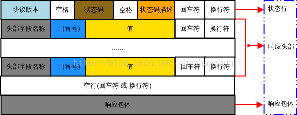
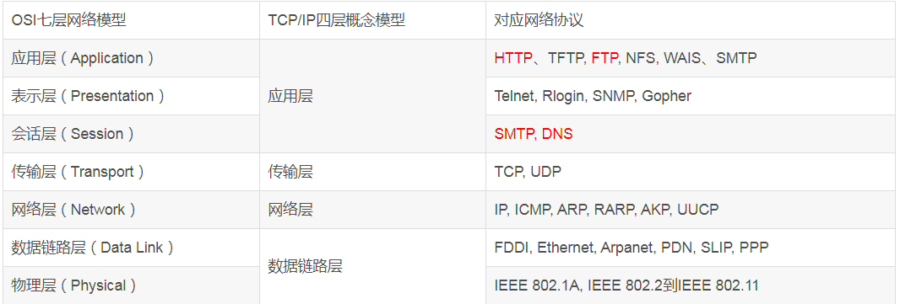

# 网络通信

## 1. 网络协议详解

### http请求和响应格式

HTTP 超文本传输协议 请求报文由请求行、请求头部、空行 和 请求包体 4 个部分组成


```html
POST /examples/default.jsp HTTP/1.1 
Accept: text/plain; text/html 
Accept-Language: en-gb 
Connection: Keep-Alive 
Host: localhost 
User-Agent: Mozilla/4.0 (compatible; MSIE 4.01; Windows 98)
Content-Length: 33 Content-Type: application/x-www-form-urlencoded Accept-Encoding: gzip, deflate 

lastName=Franks&firstName=Michael  
```

请求行：请求行由方法字段、URL 字段 和HTTP 协议版本字段 3 个部分组成，他们之间使用空格隔开。常用的 HTTP 请求方法有 GET、POST、HEAD、PUT、DELETE、OPTIONS、TRACE、CONNECT
 - GET：当客户端要从服务器中读取某个资源时，使用GET 方法。GET 方法要求服务器将URL 定位的资源放在响应报文的部分，回送给客户端，即向服务器请求某个资源。使用GET 方法时，请求参数和对应的值附加在 URL 后面，利用一个问号(“?”)代表URL 的结尾与请求参数的开始，传递参数长度受限制。例如，/index.jsp?id=100&op=bind。
 - POST：当客户端给服务器提供信息较多时可以使用POST 方法，POST 方法向服务器提交数据，比如完成表单数据的提交，将数据提交给服务器处理。GET 一般用于获取/查询资源信息，POST 会附带用户数据，一般用于更新资源信息。POST 方法将请求参数封装在HTTP 请求数据中，以名称/值的形式出现，可以传输大量数据;

请求头部：请求头部由关键字/值对组成，每行一对，关键字和值用英文冒号“:”分隔。请求头部通知服务器有关于客户端请求的信息，典型的请求头有：
 - User-Agent：产生请求的浏览器类型;
 - Accept：客户端可识别的响应内容类型列表;星号 “ * ” 用于按范围将类型分组，用 “ */* ” 指示可接受全部类型，用“ type/* ”指示可接受 type 类型的所有子类型;
 - Accept-Language：客户端可接受的自然语言;
 - Accept-Encoding：客户端可接受的编码压缩格式;
 - Accept-Charset：可接受的应答的字符集;
 - Host：请求的主机名，允许多个域名同处一个IP 地址，即虚拟主机;
 - connection：连接方式(close 或 keepalive);
 -  Cookie：存储于客户端扩展字段，向同一域名的服务端发送属于该域的cookie;

空行：最后一个请求头之后是一个空行，发送回车符和换行符，通知服务器以下不再有请求头;

请求包体：请求包体不在 GET 方法中使用，而是在POST 方法中使用。POST 方法适用于需要客户填写表单的场合。与请求包体相关的最常使用的是包体类型 Content-Type 和包体长度 Content-Length;

HTTP 响应报文由状态行、响应头部、空行 和 响应包体 4 个部分组成，如下图所示：


```html
HTTP/1.1 200 OK 
Server: Microsoft-IIS/4.0 
Date: Mon, 5 Jan 2004 13:13:33 GMT 
Content-Type: text/html 
Last-Modified: Mon, 5 Jan 2004 13:13:12 GMT 
Content-Length: 112 

<html> 
    <head> 
        <title>HTTP Response Example</title> 
    </head> 
    <body> 
        Welcome to Brainy Software 
    </body> 
</html> 
```

状态行：状态行由 HTTP 协议版本字段、状态码和状态码的描述文本 3 个部分组成，他们之间使用空格隔开;

状态码由三位数字组成，第一位数字表示响应的类型，常用的状态码有五大类如下所示：
 - 1xx：表示服务器已接收了客户端请求，客户端可继续发送请求;
 - 2xx：表示服务器已成功接收到请求并进行处理;
 - 3xx：表示服务器要求客户端重定向;
 - 4xx：表示客户端的请求有非法内容;
 - 5xx：表示服务器未能正常处理客户端的请求而出现意外错误;

状态码描述文本有如下取值：
 - 200 OK：表示客户端请求成功;
 - 400 Bad Request：表示客户端请求有语法错误，不能被服务器所理解;
 - 401 Unauthonzed：表示请求未经授权，该状态代码必须与 WWW-Authenticate 报头域一起使用;
 - 403 Forbidden：表示服务器收到请求，但是拒绝提供服务，通常会在响应正文中给出不提供服务的原因;
 - 404 Not Found：请求的资源不存在，例如，输入了错误的URL;
 - 500 Internal Server Error：表示服务器发生不可预期的错误，导致无法完成客户端的请求;
 - 503 Service Unavailable：表示服务器当前不能够处理客户端的请求，在一段时间之后，服务器可能会恢复正常;

响应头部：响应头可能包括：
 - Location：Location响应报头域用于重定向接受者到一个新的位置。例如：客户端所请求的页面已不存在原先的位置，为了让客户端重定向到这个页面新的位置，服务器端可以发回Location响应报头后使用重定向语句，让客户端去访问新的域名所对应的服务器上的资源;
 - Server：Server 响应报头域包含了服务器用来处理请求的软件信息及其版本。它和 User-Agent 请求报头域是相对应的，前者发送服务器端软件的信息，后者发送客户端软件(浏览器)和操作系统的信息。
 - Vary：指示不可缓存的请求头列表;
 - Connection：连接方式;
 - 对于请求来说：close(告诉 WEB 服务器或者代理服务器，在完成本次请求的响应后，断开连接，不等待本次连接的后续请求了)。keepalive(告诉WEB服务器或者代理服务器，在完成本次请求的响应后，保持连接，等待本次连接的后续请求);
 - 对于响应来说：close(连接已经关闭); keepalive(连接保持着，在等待本次连接的后续请求); Keep-Alive：如果浏览器请求保持连接，则该头部表明希望WEB 服务器保持连接多长时间(秒);例如：Keep-Alive：300;
 - WWW-Authenticate：WWW-Authenticate响应报头域必须被包含在401 (未授权的)响应消息中，这个报头域和前面讲到的Authorization 请求报头域是相关的，当客户端收到 401 响应消息，就要决定是否请求服务器对其进行验证。如果要求服务器对其进行验证，就可以发送一个包含了Authorization 报头域的请求;

空行：最后一个响应头部之后是一个空行，发送回车符和换行符，通知服务器以下不再有响应头部。

响应包体：服务器返回给客户端的文本信息;

HTTP 工作原理

HTTP 协议采用请求/响应模型。客户端向服务器发送一个请求报文，服务器以一个状态作为响应。
 - 客户端连接到web服务器：HTTP 客户端与web服务器建立一个 TCP 连接;
 - 客户端向服务器发起 HTTP 请求：通过已建立的TCP 连接，客户端向服务器发送一个请求报文;
 - 服务器接收 HTTP 请求并返回 HTTP 响应：服务器解析请求，定位请求资源，服务器将资源副本写到 TCP 连接，由客户端读取;
 - 释放 TCP 连接：若connection 模式为close，则服务器主动关闭TCP 连接，客户端被动关闭连接，释放TCP 连接;若connection 模式为keepalive，则该连接会保持一段时间，在该时间内可以继续接收请求;
 - 客户端浏览器解析HTML内容：客户端将服务器响应的 html 文本解析并显示;

HTTP 无状态性

HTTP 协议是无状态的(stateless)。也就是说，同一个客户端第二次访问同一个服务器上的页面时，服务器无法知道这个客户端曾经访问过，服务器也无法分辨不同的客户端。HTTP 的无状态特性简化了服务器的设计，使服务器更容易支持大量并发的HTTP 请求。

HTTP 持久连接

HTTP1.0 使用的是非持久连接，主要缺点是客户端必须为每一个待请求的对象建立并维护一个新的连接，即每请求一个文档就要有两倍RTT 的开销。因为同一个页面可能存在多个对象，所以非持久连接可能使一个页面的下载变得十分缓慢，而且这种短连接增加了传输的负担。HTTP1.1 使用持久连接keepalive，所谓持久连接，就是服务器在发送响应后仍然在一段时间内保持这条连接，允许在同一个连接中存在多次数据请求和响应，即在持久连接情况下，服务器在发送完响应后并不关闭TCP 连接，而客户端可以通过这个连接继续请求其他对象。

### http转发与重定向

1、首先转发是服务器的操作，而重定向是客户端的操作。

2、重定向时，客户端浏览器的地址栏有变化，而转发没有

3、转发可以携带数据，重定向不行

4、重定向发生在客户端!转发发生在服务端,客户端是不知道

5、重定向时，客户端发送了两个请求，而转发只发送了一个请求（本质区别）

### http的Cookie机制

### http缓存控制和代理服务

浏览器缓存分为强缓存和协商缓存，浏览器加载一个页面的简单流程如下：

- 浏览器先根据这个资源的http头信息来判断是否命中强缓存。如果命中则直接加在缓存中的资源，并不会将请求发送到服务器。
- 如果未命中强缓存，则浏览器会将资源加载请求发送到服务器。服务器来判断浏览器本地缓存是否失效。若可以使用，则服务器并不会返回资源信息，浏览器继续从缓存加载资源。
- 如果未命中协商缓存，则服务器会将完整的资源返回给浏览器，浏览器加载新资源，并更新缓存。

web缓存器，也叫作代理服务器

web缓存代理服务器的工作方式：

- 用户A浏览器建立一条到该web缓存服务器中的TCP连接，并向web缓存服务器中的该对象发送一个HTTP请求。
- 该web缓存服务器先检查该对象在本地有没有副本。如果有，那么该web缓存服务器就用HTTP响应报文想客户机浏览器返回该对象。
- 如果该web缓存服务器没有该对象的副本，他就与该对象的初始服务器建立一条TCP连接，并发送一个该对象的HTTP请求。在收到该请求后初始web服务器向该web缓存服务器发送具有该对象的HTTP响应报文。
- 当该web缓存服务器收到该对象时，他在本地存储空间存储了一个副本，并用HTTP响应报文向用户A浏览器发送该副本。
- 如果其他用户的浏览器也恰好要访问该对象，那么久能迅速从web缓存服务器中得到它，并且不会增加网络流量。

HTTP代理分为正向代理、反向代理和透明代理；
 - 正向代理：服务器代理客户端去访问其他的服务器，这个服务器时存在于客户端和源始服务器之间，客户端隐藏与代理服务器的后面充当幕后主使。源始服务器所看到的是它在代理服务器服务器进行交互，而不知道客户端的存在。一般用在web缓存技术中。场景如下：
   - 访问原来无法访问的资源，如google
   - 可以做缓存，加速访问资源
   - 对客户端访问授权，上网进行认证
   - 代理可以记录用户访问记录（上网行为管理），对外隐藏用户信息
 - 反向代理：与正向代理相反，此时是源始服务器藏在代理服务器后面，客户端看到的是自己在与代理服务器交互，而不知道源始服务器的存在。可以隐藏保护源始服务器资源。在负载均衡中使用反向代理技术来减小服务器压力。在CDN（分布式集群管理）的核心技术中也用到了反向代理。
   - 保证内网的安全，阻止web攻击，大型网站，通常将反向代理作为公网访问地址，Web服务器是内网
   - 负载均衡，通过反向代理服务器来优化网站的负载
 - 透明代理：客户端根本不需要知道有代理服务器的存在它改变你的request fields（报文），并会传送真实IP，多用于路由器的NAT转发中。注意，加密的透明代理则是属于匿名代理，意思是不用设置使用代理了。当用户服务器提交请求的时候，透明代理设备根据自身策略拦截并修改用户的报文，并作为实际的请求方，向服务器送请求，当接收信息回传，透明代理再根据自身的设置把允许的报文发回至用户

>总结：正向代理即是客户端代理, 代理客户端, 服务端不知道实际发起请求的客户端.
>反向代理即是服务端代理, 代理服务端, 客户端不知道实际提供服务的服务端

### HTTPS是什么？SSL/TLS又是什么？ 

### 对称加密与非对称加密 、数字签名与证书 

### OSI七层网络协议

OSI（Open System Interconnect），即开放式系统互联。 一般都叫OSI参考模型，是ISO（国际标准化组织）组织在1985年研究的网络互连模型。ISO为了更好的使网络应用更为普及，推出了OSI参考模型。其含义就是推荐所有公司使用这个规范来控制网络。这样所有公司都有相同的规范，就能互联了。
OSI定义了网络互连的七层框架（物理层、数据链路层、网络层、传输层、会话层、表示层、应用层），即ISO开放互连系统参考模型


OSI七层和TCP/IP四层的关系

OSI引入了服务、接口、协议、分层的概念，TCP/IP借鉴了OSI的这些概念建立TCP/IP模型。

OSI先有模型，后有协议，先有标准，后进行实践；而TCP/IP则相反，先有协议和应用再提出了模型，且是参照的OSI模型。

OSI是一种理论下的模型，而TCP/IP已被广泛使用，成为网络互联事实上的标准。
 - TCP：transmission control protocol 传输控制协议
 - UDP：user data protocol 用户数据报协议



OSI七层和TCP/IP的区别

 - TCP/IP他是一个协议簇；而OSI（开放系统互联）则是一个模型，且TCP/IP的开发时间在OSI之前。
 - TCP/IP是由一些交互性的模块做成的分层次的协议，其中每个模块提供特定的功能；OSi则指定了哪个功能是属于哪一层的。
 - TCP/IP是五层结构，而OSI是七层结构。OSI的最高三层在TCP中用应用层表示。


### TCP协议详解

传输控制协议（TCP，Transmission Control Protocol）是一种面向连接的、可靠的、基于字节流的传输层通信协议


### TCP协议的流量控制详解

零窗口探测报文

### TCP协议的可靠性是如何保障的

数据链路层流量控制技术，目标：提高信道利用率

停止-等待协议SW
 - 每发完一个数据帧就停止发送，等待对方确认
 - 收到确认后再发送下一个数据帧
 - 每发送完一个数据帧就启动一个相应的重传计时器，当计时器超时却未收到确认时就重传该数据帧

这种可靠性传输协议被称为`自动重传请求ARQ（Aytomatic Repeat reQuest）`

ARQ表明重传的请求式发送方自动进行的，接收方不需要请求方重传某个出错的数据帧

后退N帧协议GBN
 - 基于互动窗口的流量控制技术
 - 发送方可在未收到接收方确认帧的情况下，将序号落在发送窗口内的多个数据帧全部发送出去，接收方必须具备累计确认和捎带确认
 - 发生方只有收到确认帧时，发送窗口才能向前滑动
 - 当发送窗口内某个已经发送的数据帧出现超时重发时，其后续在发送窗口内已经发送的数据帧必须全部重传，这是后退N帧协议名称的由来

选择重传协议SR
 - 接收方有差错处理策略，一旦收到误码数据帧或者怀疑数据帧立即发送相应的否定确认帧`NAK`,不必等到计时器超
 - 发送发只重传出错的数据帧或者超时的数据帧

### TCP协议可靠传输的实现

以字节为单位的时间窗口
 - 虽然发送方的发送窗口式根据接收方的接收窗口设置的，但在同一时刻发送方的窗口并不总是和接收方的接收窗口一样大
 - 对于不按序到达的数据如何处理，TCP并无明确要求，先到先入缓存到齐后一并提交应用进程
 - TCP接收方必须有积累确认和捎带确认机制，但不硬过分推迟发送确认，会导致不必要的重传
 - 全双工同通信，通信中的每一方都再发送和接受报文段，每一方都有自己的发送窗口和接收窗口

### TCP协议与Socket的联系
- HTTP是应用层协议，定义的是传输数据的内容以及格式的规范
- TCP是底层通讯协议，定义的是数据传输和连接方式的规范
- Socket可以支持不同的传输层协议（TCP或UDP），当使用TCP协议进行连接时，该Socket连接就是一个TCP连接，Socket是发动机，提供了网络通信的能力

我们在传输数据时，可以只使用（传输层）TCP/IP协议，但是那样的话，如果没有应用层，便无法识别数据内容，如果想要使传输的数据有意义，则必须使用到应用层协议，应用层协议有很多，比如HTTP、FTP、TELNET等，也可以自己定义应用层协议。WEB使用HTTP协议作应用层协议，以封装HTTP文本信息，然后使用TCP/IP做传输层协议将它发到网络上

TCP/IP只是一个协议栈，就像操作系统的运行机制一样，必须要具体实现，同时还要提供对外的操作接口。这个就像操作系统会提供标准的编程接口，比如win32编程接口一样，TCP/IP也要提供可供程序员做网络开发所用的接口，这就是Socket编程接口

