# 企业级解决方案

## 1. 系统设计

### 1.1 企业级微服务总体分层架构图

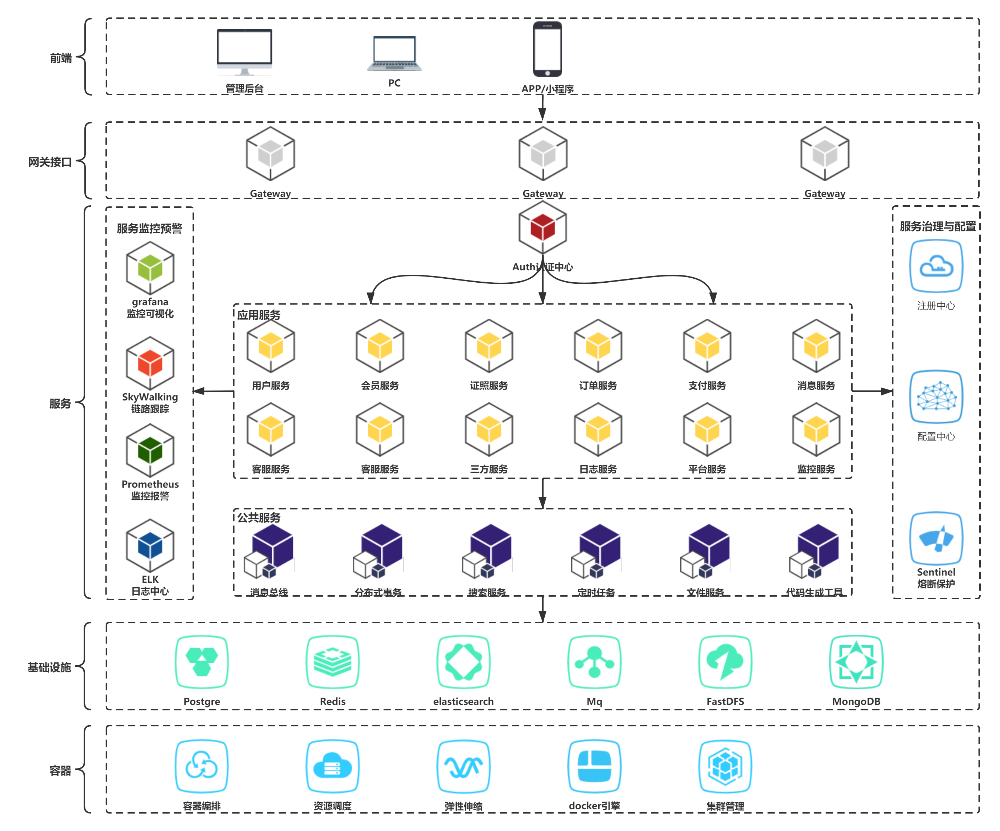

### 1.2 企业级微服务技术架构图

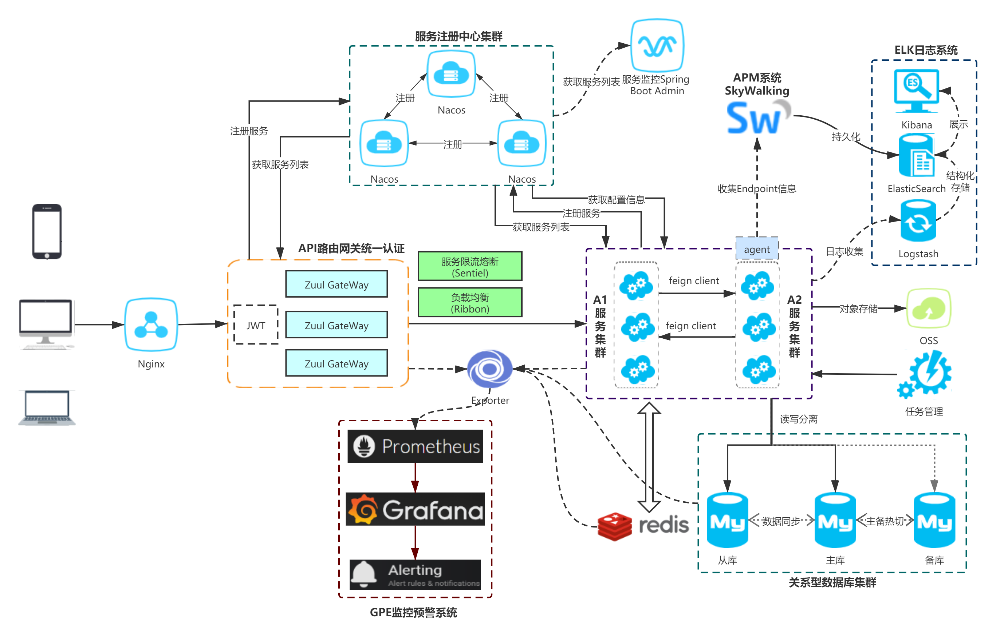

### 1.3 企业级服务认证架构设计

#### 1.3.1 有网络隔离

一、环境说明

无网络隔离是指用户访问的网络环境与整个系统的部署网络环境是相通的，例如用户可以绕过API网关直接访问后台的服务

二、架构图

1. JWT

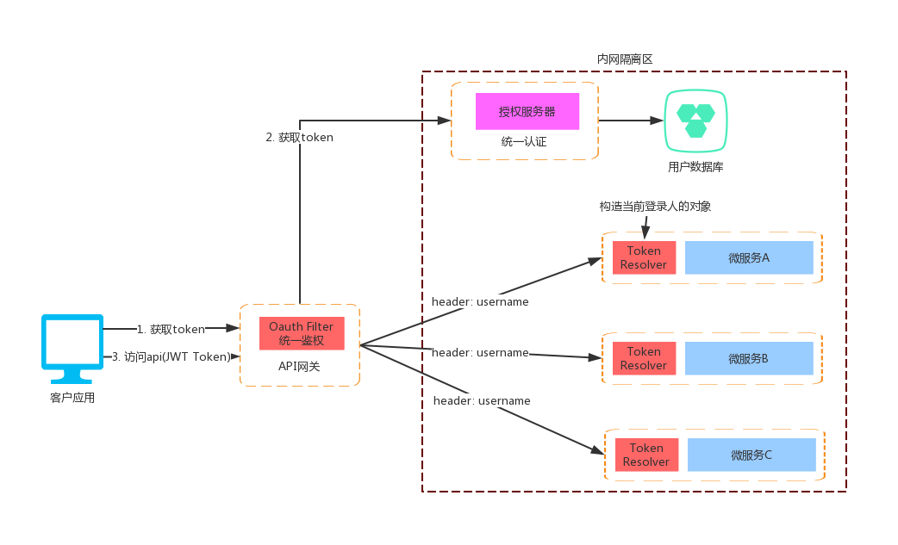

2. Redis

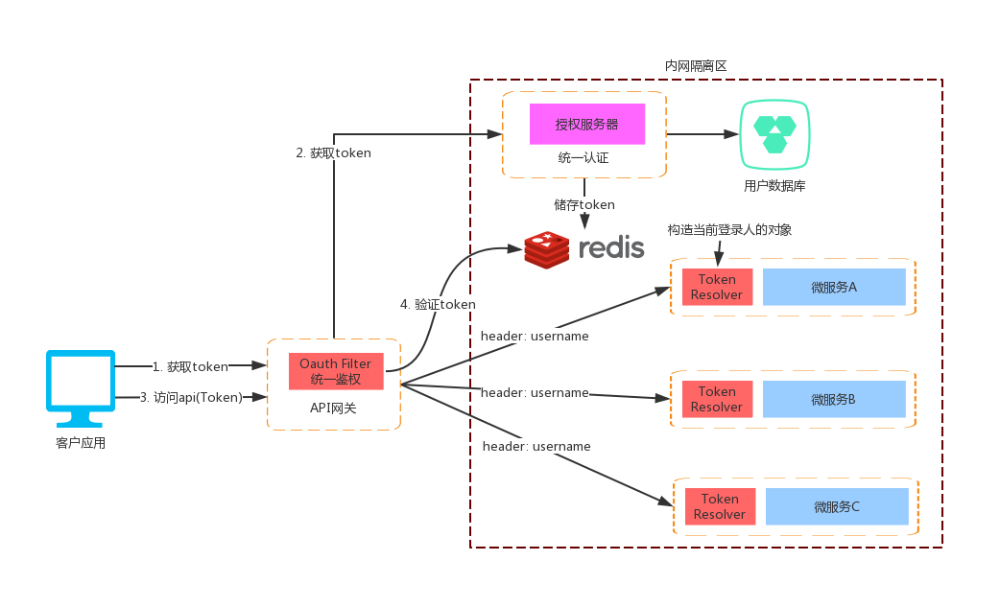

三、设计思路

- 授权服务器：负责登录认证、token派发、token刷新、应用接入管理等功能
- API网关：添加认证中心的sdk负责所有请求的鉴权，包括登录验证和url级别的权限判断，主要的JWT原理如下：
    1. 拦截请求获取判断是否带有token参数(parameter和header)
    2. 通过公钥pubkey.txt解密token
    3. 判断token中的权限信息是否能访问当前url
    4. 把用户名和角色信息放到请求的header中，传给后面的微服务
- TokenResolver(TokenArgumentResolver类)：嵌入在微服务程序中负责获取当前登录人，主要原理如下：
    1. 判断当前url请求的方法有没有带有@LoginUser注解
    2. 判断@LoginUser注解的isFull属性是否为true则通过username查询用户对象
    3. 构建SysUser对象传给目标方法

#### 1.3.2 无网络隔离V1

一、环境说明

无网络隔离是指用户访问的网络环境与整个系统的部署网络环境是相通的，例如用户可以绕过API网关直接访问后台的服务

二、架构图

1. JWT

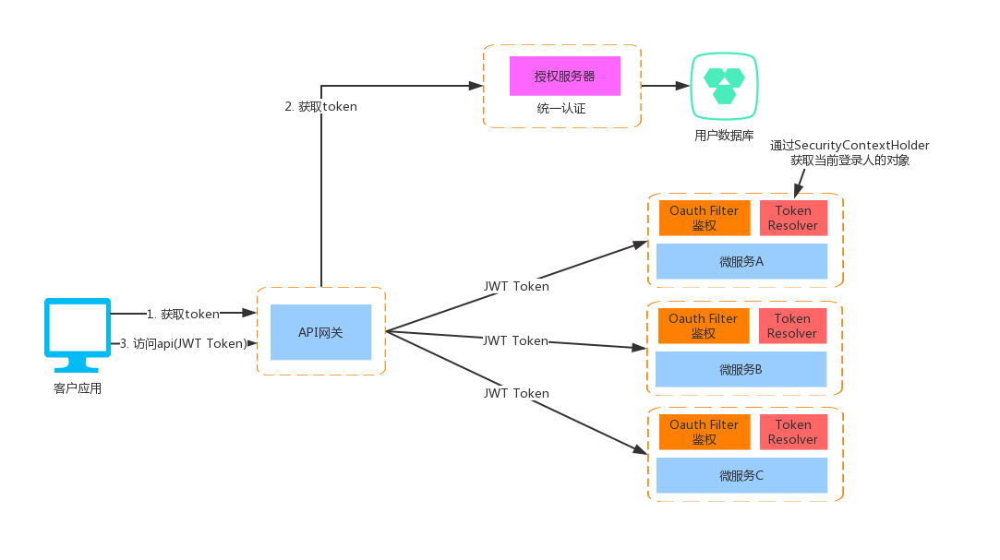

2. Redis

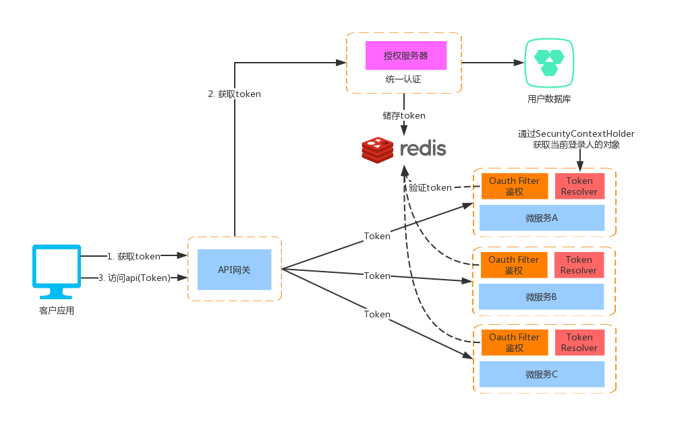

三、设计思路

- 统一认证：负责登录认证、token派发、token刷新、应用接入管理等功能
- API网关：只负责路由转发
- 微服务：每个服务都需加入认证中心的sdk负责所有请求的鉴权
- TokenResolver：嵌入在微服务程序中通过SecurityContextHolder获取当前登录人，主要原理如下：
    1. 判断当前url请求的方法有没有带有@LoginUser注解
    2. 判断@LoginUser注解的isFull属性是否为true则通过username查询用户对象
    3. 构建SysUser对象传给目标方法

#### 1.3.3 无网络隔离V2

一、环境说明

无网络隔离的情况下需要保证每个服务的API访问都要进行认证

二、架构图

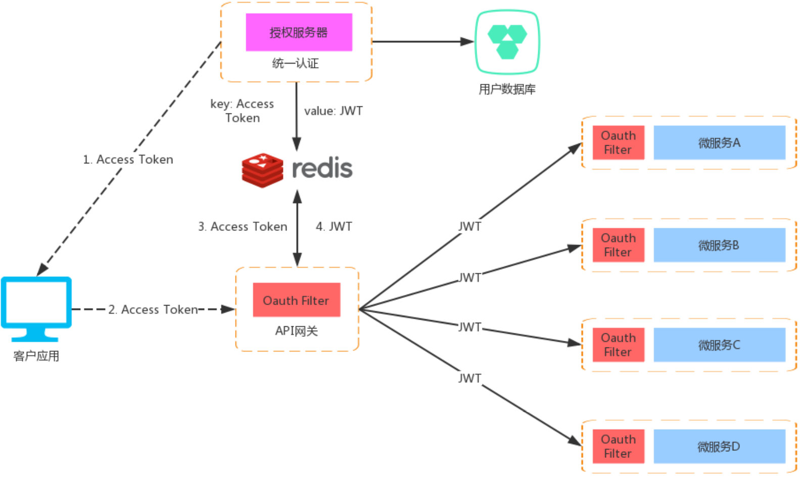

三、设计思路

在V1的架构基础上进行改进保证每个服务的API都有认证，并且客户端与服务内部分别使用不同的token同时融合了redisToken和jwt两者的优点

- 客户端使用redisToken
    1. 减少网络带宽消耗：普通的uuid token对于jwt的长度小很多
    2. 能实现更多的功能：使用redisToken功能更多，能方便实现如token自动续约、在线用户列表、踢人等功能
- 内部服务使用jwt
    3. 场景符合：由于是内部服务使用，客户端只能获取access token没有jwt，所以无需让jwt token失效符合jwt特性
    4. 提升性能：服务与服务之间的通信只需通过jwt自解析认证，无需网络连接，大大减少redis的压力和提升性能
    5. 增加安全性：内部服务与客户端所使用的token不一样，能有效防止客户端绕开网关直接请求后面服务

#### 1.3.4 token自动续签设计(Redis Token)

一、说明

本设计只针对redis token模式，该模式下的续签建议只修改过期时间而不重新生成token，因为重新生成token会导致同一个账号下的其他客户端访问失效

> 续签会有性能开销，所以设计了开关和黑白名单方便灵活控制，只有真正需要的业务才开放

二、逻辑时序图

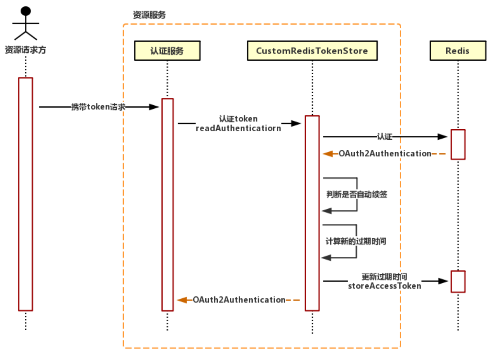

- 整个续签逻辑在CustomRedisTokenStore中实现
- 在方法readAuthentication中认证token成功后，根据配置文件(开关、黑白名单)、过期时间等判断是否满足续签条件
- 因为storeAccessToken方法有很多redis访问，所以使用pipeline能有效提升性能减少开销

#### 1.3.5 url级权限控制

一、概述

- 该功能会有性能开销，并且会增加很多系统使用成本(大量的配置)，所以要按需开启
- 一般有这种需求的系统都是后台管理类的2B系统，用户量和并发量并不大所以性能上的开销是可以接受的

二、功能说明

1. 资源/按钮权限配置
2. 角色关联权限
3. 前端页面按钮资源控制显示/隐藏
4. 后台接口url权限认证(如果对安全性要求不高可以去掉)
> admin账号不受权限影响，能访问所有接口

三、开启功能

1. 在网关添加url权限相关配置

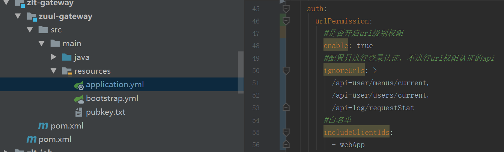

```java
//打开网关认证配置
zlt.security.auth.urlPermission.enable设置为true

//配置只认证登录，登录后所有角色都能访问的url(可选项)
zlt.security.auth.urlPermission.ignoreUrls

//配置白名单/黑名单(可选项)
zlt.security.auth.urlPermission.includeClientIds
zlt.security.auth.urlPermission.exclusiveClientIds
```

2. 页面菜单管理配置权限

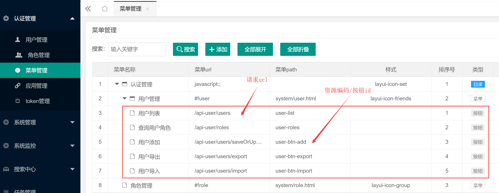

> 菜单url：请求后台的url
> 菜单path：资源编码或者按钮id，用于前端页面控制元素显示/隐藏

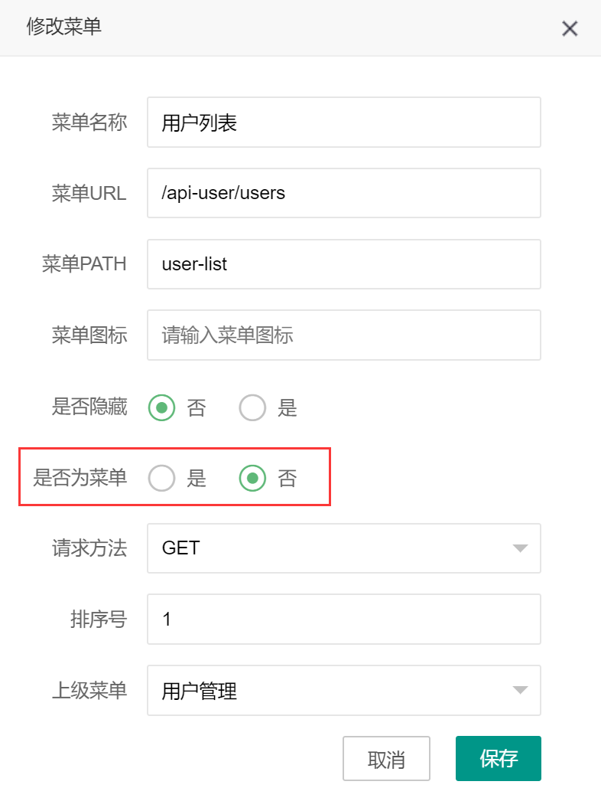

> 是否为菜单：选择否则为按钮类型
> 请求方法：请求后台接口的方法类型，如果不配置则该权限会对该url的所有方法都生效

3. 页面角色管理关联权限

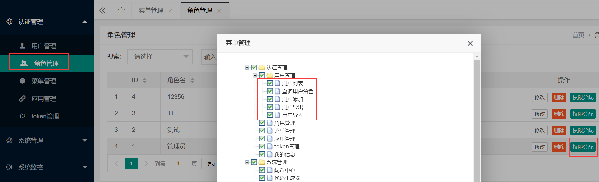

4. 页面自己添加js动态根据权限控制隐藏的元素

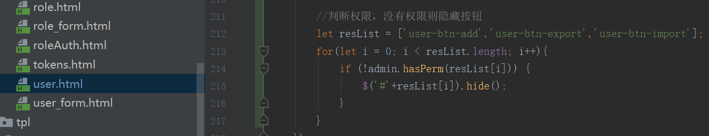

> admin.hasPerm方法为判断当前登录人所属角色是否具有该权限

四、缓存问题

目前的代码在根据多个角色编号查询资源/按钮权限的代码上增加了缓存配置(有效期5分钟)，所以修改角色按钮权限后并不会马上生效

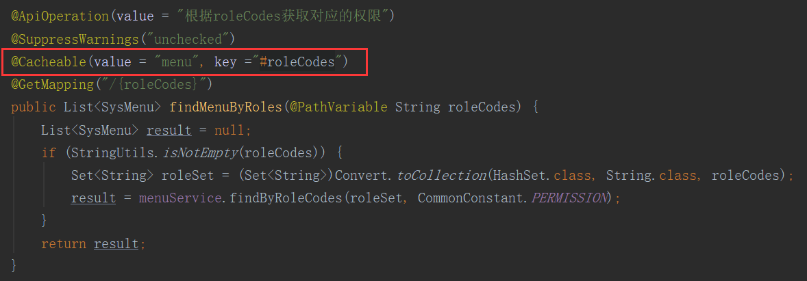

如果需要马上生效则有3个方案
1. 去掉缓存，每次都直接查询数据库(并发量不大的情况下)
2. 手动删除redis的缓存(应急情况下)
3. 页面增加刷新按钮，刷新/删除缓存数据(推荐)


### 1.4 企业级日志解决方案设计

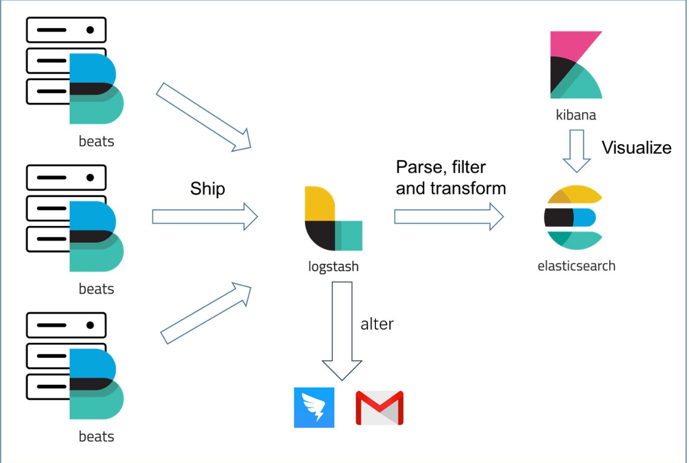

#### 1.4.1 组件说明

1. filebeat：部署在每台应用服务器、数据库、中间件中，负责日志抓取与聚合日志日志聚合：把多行日志合并成一条，例如exception的堆栈信息等
2. logstash：通过各种filter结构化日志信息，并把字段transform成对应的类型
3. elasticsearch：负责存储和查询日志信息
4. kibana：通过ui展示日志信息、还能生成饼图、柱状图等

#### 1.4.2 ELK常见部署架构

1. Logstash作为日志收集器

这种架构是比较原始的部署架构，在各应用服务器端分别部署一个Logstash组件，作为日志收集器，然后将Logstash收集到的数据过滤、分析、格式化处理后发送至Elasticsearch存储，最后使用Kibana进行可视化展示，这种架构不足的是：Logstash比较耗服务器资源，所以会增加应用服务器端的负载压力

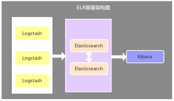

2. Filebeat作为日志收集器

该架构与第一种架构唯一不同的是：应用端日志收集器换成了Filebeat，Filebeat轻量，占用服务器资源少，所以使用Filebeat作为应用服务器端的日志收集器，一般Filebeat会配合Logstash一起使用，这种部署方式也是目前最常用的架构

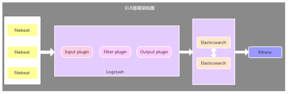

3. 引入缓存队列的部署架构

该架构在第二种架构的基础上引入了Kafka消息队列（还可以是其他消息队列），将Filebeat收集到的数据发送至Kafka，然后在通过Logstasth读取Kafka中的数据，这种架构主要是解决大数据量下的日志收集方案，使用缓存队列主要是解决数据安全与均衡Logstash与Elasticsearch负载压力


4. 以上三种架构的总结

第一种部署架构由于资源占用问题，现已很少使用，目前使用最多的是第二种部署架构，至于第三种部署架构个人觉得没有必要引入消息队列，除非有其他需求，因为在数据量较大的情况下，Filebeat 使用压力敏感协议向 Logstash 或 Elasticsearch 发送数据。如果 Logstash 正在繁忙地处理数据，它会告知 Filebeat 减慢读取速度。拥塞解决后，Filebeat 将恢复初始速度并继续发送数据


### 1.5 企业级监控架构设计(Metrics)

一、介绍

ELK主要收集分析预警的是我们平台系统中各个服务的业务日志，一般通过日志组件(log4j 、log4j2 、logback)来收集并写入文本。但是对于系统本身以及一些应用软件的监控预警，这套方案显然是不合适的，这里推荐一下GPE三剑客；基本上主流的中间件和应用都能监控，并且大多数都是代码无入侵的。

二、架构图

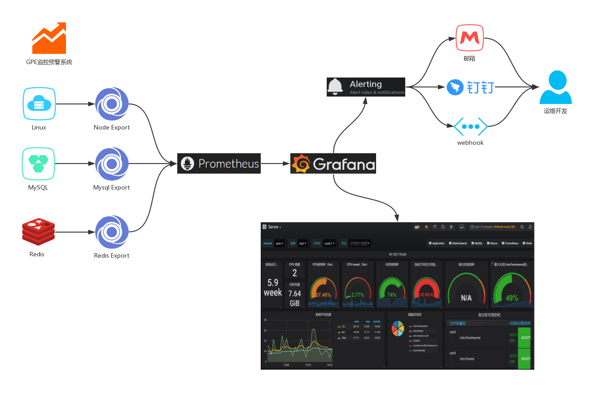

三、核心组件

Grafana、Prometheus、Exporter的三剑客，使用邮件、钉钉以及webhook实现异常告警。

1. Prometheus：是一个开源的服务监控系统，它通过HTTP协议从远程的机器收集数据并存储在本地的时序数据库上。
2. Grafana：是一个开箱即用的可视化工具，具有功能齐全的度量仪表盘和图形编辑器，有灵活丰富的图形化选项，可以混合多种风格，支持多个数据源特点。
3. Exporter：是一系列的插件和外部进程，支持黑盒获取metrics(代码无入侵)

四、工作流程

1. Exporter组件获取服务器或者系统软件的metrics
2. Prometheus拉取Exporter的metrics到本地存储
3. Grafana配置Prometheus数据源获取其采集数据结合自定义面板实现监控大屏
4. Grafana通过设置Alerting实现监控预警

### 1.6 框架技术选型

一、组件选择

- 分布式系统套件版本：Spring Boot 2.x + Spring Cloud + Spring Cloud Alibaba
- 服务治理注册与发现：Spring Cloud Alibaba Nacos
- 统一配置中心：Spring Cloud Alibaba Nacos
- 服务降级、熔断和限流：alibaba/Sentinel
- 网关路由代理调用：Spring Cloud Gateway / Netflix Zuul
- 声明式服务调用：Spring Cloud OpenFeign
- 服务负载均衡：Spring Cloud Netflix Ribbon
- 服务安全认证：Spring Security
- 数据访问层：Mybatis-plus
- 分布式事务：alibaba/Seata / RocketMQ
- 统一日志收集存储：ELK + Filebeat
- 服务应用监控：Spring Cloud Admin / Prometheus
- 服务调用链监控：Skywalking
- 分布式任务调度：XXL-JOB
- 全文搜索引擎：Elasticsearch
- 分库分表：Sharding-JDBC
- 容器管理平台：Rancher

### 1.7 架构设计方法论思维导图

### 1.8 系统幂等性设计与实践

一、幂等性的定义

就是用户对于同一操作发起的一次请求或者多次请求的结果是一致的，不会因为多次点击而产生了副作用。举个最简单的例子，那就是支付，用户购买商品使用支付，支付扣款成功，但是返回结果的时候网络异常，此时钱已经扣了，用户再次点击按钮，此时会进行第二次扣款，返回结果成功，用户查询余额返发现多扣钱了，流水记录也变成了两条。

二、确定需要幂等性的范围

- 请求层面：读请求、写请求
    - 其中读请求没有影响数据变化不需要做幂等性
- 微服务层面：负载均衡、api网关、业务逻辑层、数据访问层
    - 其中负载均衡、api网关、业务逻辑层没有影响数据变化不需要做幂等性

> 总结：上面的范围里只有数据访问层和写请求
1. Insert需要做幂等性
2. Update直接更新某个值的：不需要做幂等性
3. 累加操作等计算式的更新：需要做幂等性
4. Delete重复删除结果是一样：不需要做幂等性

三、幂等性解决方案

1. Insert幂等方案

细粒度分布式锁+select + insert

先加一个细粒度的分布式锁，然后select查一下是否存在，不存在再insert
例子可参考文档：开发说明中的方法级幂等性
优点：性能影响较少，使用的是细粒度锁，所以只有重复提交记录时才会阻塞
缺点：写操作会增加一次select开销，实现难度相对较大因为需要分布式细粒度锁

2. Update计算操作幂等方案

常用的场景可通过版本号的方式来控制
```sql
alter table sys_user add version int default 0;
update sys_user set age=age+1, version=version+1 where version=xx
```


### 1.9 分布式ID生成器解决方案

一、介绍

1. 什么情况下我们需要ID生成器
- 数据库水平拆分的情况下，主键由于需要作为业务标识使用，需要唯一。
- 业务编号需要暴露给用户，但是又不想被用户猜到需要被隐藏的业务编号
- 业务编号需要体现业务信息，比如订单分类订单渠道等等

2. ID生成器设计目标
- 全局唯一
- 每秒可生成100W+
- 趋于递增（对索引友好）
- 高可用
- 可伸缩

二、常见ID生成方案

1. UUID

UUID 是 通用唯一识别码（Universally Unique Identifier）的缩写，是一种软件建构的标准，亦为开放软件基金会组织在分布式计算环境领域的一部分

UUID是由一组32位数的16进制数字所构成，是故UUID理论上的总数为1632=2128，约等于3.4 x 1038。也就是说若每纳秒产生1兆个UUID，要花100亿年才会将所有UUID用完。

UUID的标准型式包含32个16进制数字，以连字号分为五段，形式为8-4-4-4-12的32个字符。示例： 550e8400-e29b-41d4-a716-446655440000

每秒产生10亿笔UUID，100年后只产生一次重复的机率是50%

优点：
- 本地生成，没有网络消耗
- 可以任意水平扩展
- 生成效率高
- 生成节点不限

缺点
- 没有排序，无法保证趋势递增。
- UUID往往是使用字符串存储，查询的效率比较低。
- 存储空间比较大，如果是海量数据库，就需要考虑存储量的问题。
- 传输数据量大
- 不可读

2. 数据库自增列

可以通过设置bigint类型的数据库自增列，在事务中通过Insert操作获取主键Id

优点
- 可以实现ID完全递增
- 部署简单，有DB就可以

缺点
- 生成效率差，取决于数据库性能指标，每秒生成一万ID都很难
- 依赖于数据库，如果DB发生故障，在做主从切换的时候可能会引发BUG


3. Redis生成ID

优点
- 不依赖于数据库，灵活方便，且性能优于数据库。
- 数字ID天然排序，对分页或者需要排序的结果很有帮助。

缺点
- 如果系统中没有Redis，还需要引入新的组件，增加系统复杂度。
- 需要编码和配置的工作量比较大。

4. MongoDB的ObjectId

MongoDB的ObjectId和snowflake算法类似。它设计成轻量型的，不同的机器都能用全局唯一的同种方法方便地生成它。MongoDB 从一开始就设计用来作为分布式数据库，处理多个节点是一个核心要求。使其在分片环境中要容易生成得多。

其格式如下：

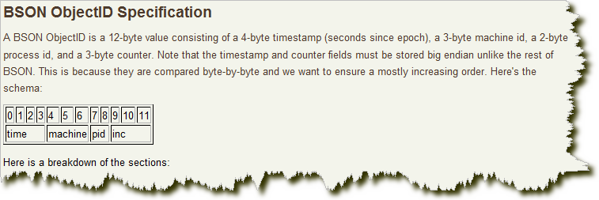

前4个字节是从标准纪元开始的时间戳，单位为秒。时间戳，与随后的5 个字节组合起来，提供了秒级别的唯一性。由于时间戳在前，这意味着ObjectId 大致会按照插入的顺序排列。这对于某些方面很有用，如将其作为索引提高效率。这4 个字节也隐含了文档创建的时间。绝大多数客户端类库都会公开一个方法从ObjectId 获取这个信息。

接下来的3 字节是所在主机的唯一标识符。通常是机器主机名的散列值。这样就可以确保不同主机生成不同的ObjectId，不产生冲突。为了确保在同一台机器上并发的多个进程产生的ObjectId 是唯一的，接下来的两字节来自产生ObjectId 的进程标识符（PID）。
        
前9字节保证了同一秒钟不同机器不同进程产生的ObjectId 是唯一的。后3 字节就是一个自动增加的计数器，确保相同进程同一秒产生的ObjectId 也是不一样的。同一秒钟最多允许每个进程拥有2563（16 777 216）个不同的ObjectId。

5. Twitter的snowflake算法

snowflake是Twitter开源的分布式ID生成算法，结果是一个long型的ID。其核心思想是：使用41bit作为毫秒数，10bit作为机器的ID（5个bit是数据中心，5个bit的机器ID），12bit作为毫秒内的流水号（意味着每个节点在每毫秒可以产生 4096 个 ID），最后还有一个符号位，永远是0。

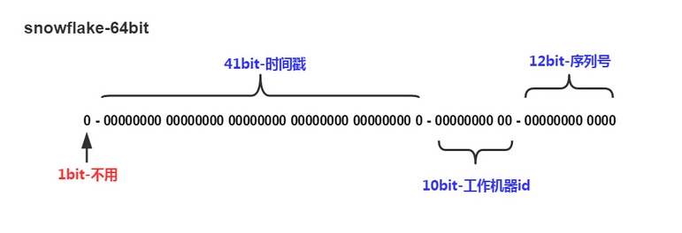


| 分段 | 作用 | 说明 |
| -- | -- | -- |
| 1bit | 保留 | - |
| 41bit | 时间戳精确到毫秒 | 可以支持69年的跨度 |
| 5bit | DatacenterId | 可以最多支持32个节点 |
| 5bit | WorkerId | 可以最多支持32个节点 |
| 12bit | 毫秒内的计数 | 支持每个节点每毫秒产生4096个ID |

理论上单机每秒400W+，最多每秒可以生成41亿+的ID

优点
- ID趋势递增
- 生成效率高，单机每秒400W+
- 支持线性扩充
- 稳定性高，不依赖DB等服务

缺点
- 依赖服务器时间，如果服务器时间发生回拨，可能导致生成重复ID
- 在单机上是递增的，但是由于涉及到分布式环境，每台机器上的时钟不可能完全同步，也许有时候也会出现不是全局递增的情况

### 1.10 实时搜索系统设计

一、背景

传统的关系型数据库在存储大数据量时需要进行分库分表，但是分库分表后又很难实现复杂查询的需求，所以这个时候就需要引入异构数据源来做OLAP的场景

二、搜索系统的目标

- 海量请求：支持亿级请求
- 秒级响应：复杂查询秒级内出结果
- 实时搜索：数据被修改后，能实时搜索到最新数据

三、总体架构如下

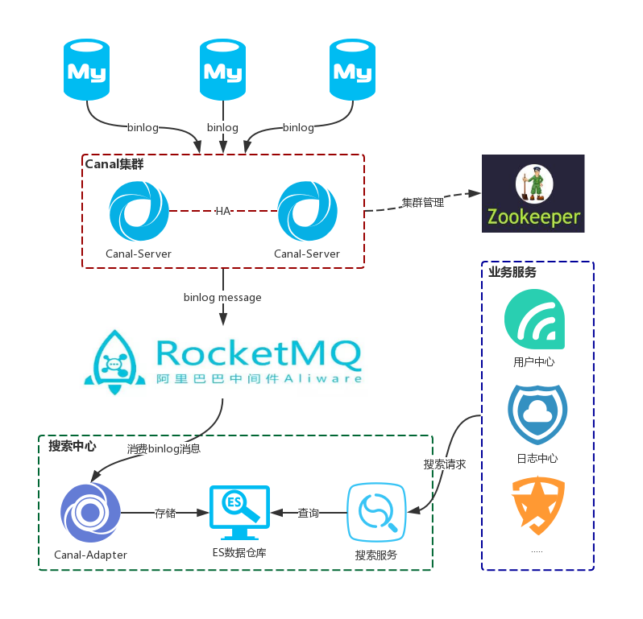

1. 海量请求和秒级响应

使用ElasticSearch来实现这个目标，是一个基于Lucene的搜索服务器。它提供了一个分布式多用户能力的全文搜索引擎，基于RESTful web接口。Elasticsearch是用Java开发的，并作为Apache许可条款下的开放源码发布，是当前流行的企业级搜索引擎。能够达到实时搜索，稳定，可靠，快速，安装使用方便。

2. 实时增量同步

阿里的开源项目Canal，就是用来解决这个问题的，Canal项目利用了MySQL数据库主从同步的原理，将Canal Server模拟成一台需要同步的从库，从而让主库将binlog日志流发送到Canal Server接口。Canal项目对binlog日志的解析进行了封装，我们可以直接得到解析后的数据，而不需要理会binlog的日志格式。而且Canal项目整合了zookeeper，整体实现了高可用，可伸缩性强

3. MQ

Canal收集的binlog数据支持直接发送到MQ中目前支持RocketMQ和Kafka，用于削峰填谷；关于RocketMQ的安装部署可查看

4. Adapter

Canal提供各种Adapter组件用于binlog转换，这里利用Adapter实现消费MQ的binlog信息自动转换为索引数据存到ES中，关于Adapter的安装和用法可查看 实时同步数据到ElasticSearch
> 在同步之前需要先创建ES的索引

5. 搜索服务

es客户端的api比较复杂难懂，通过通用的搜索服务对外提供restful的API接口供业务系统使用，屏蔽底层的复杂性

## 2. 企业级功能

## 3. 持续集成部署