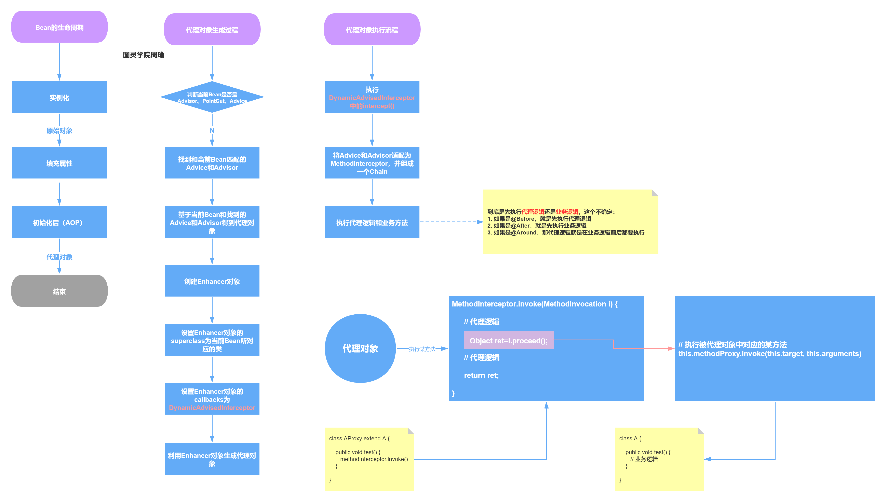
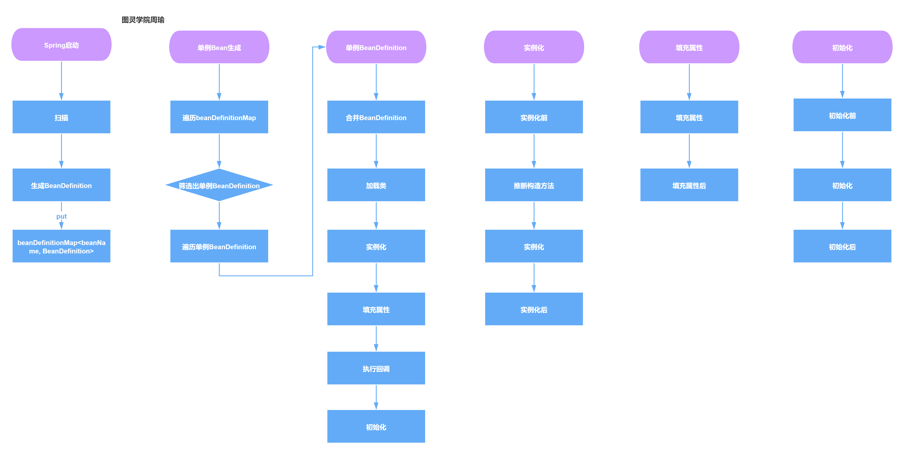
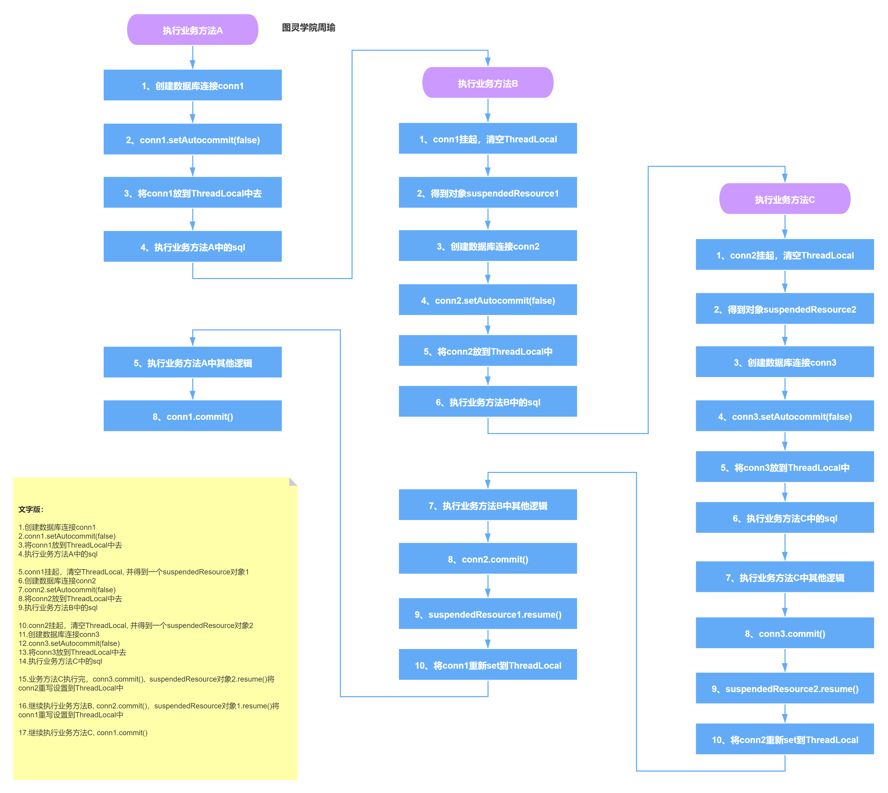
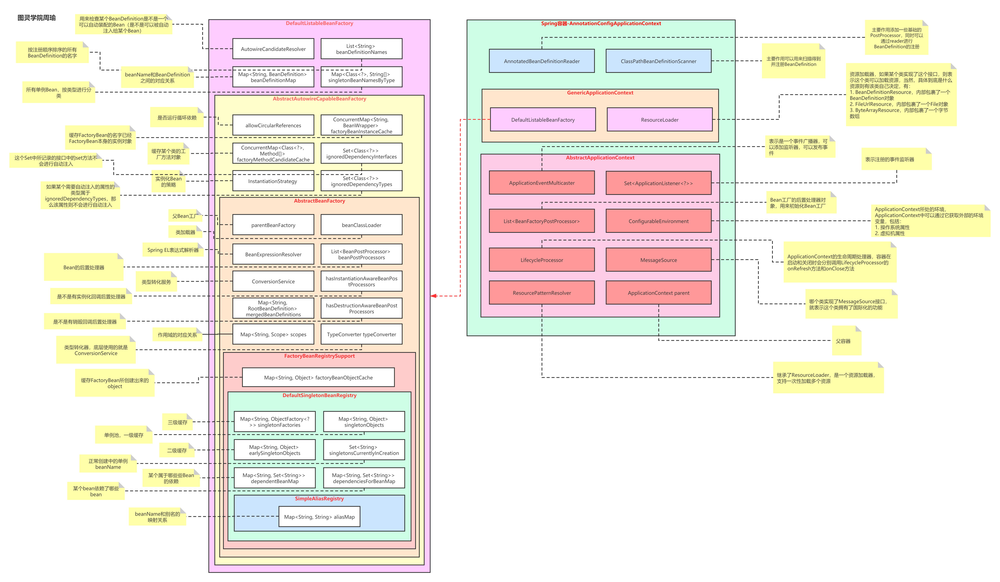
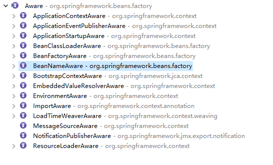

# Spring的底层原理与源码实现

## 1. Spring核心体系结构

### 1.1 Spring核心知识点


### 1.2 依赖注入的工作流程


### 1.3 AOP的工作流程



### 1.4 Bean的生命周期原理详解与源码分析



### 1.5 事务隔离级别流程



### 1.6 ApplicationContext和BeanFactory架构图



### 1.7 BeanFactory架构


## 2. Spring结构实现

### 2.1 BeanDefinition的底层原理与源码详解

BeanDefinition在Spring中是用来描述Bean对象的，其不是一个bean实例，仅仅是包含bean实例的所有信息，比如属性值、构造器参数以及其他信息。Bean对象创建是根据BeanDefinitionc中描述的信息来创建的，BeanDefinition存在的作用是为了可以方便的进行修改属性值和其他元信息，比如通过BeanFactoryPostProcessor进行修改一些信息，然后在创建Bean对象的时候就可以结合原始信息和修改后的信息创建对象了

#### 2.1.1 属性信息

```java
@SuppressWarnings("serial")
public abstract class AbstractBeanDefinition extends BeanMetadataAttributeAccessor
		implements BeanDefinition, Cloneable {
	//作用范围
	public static final String SCOPE_DEFAULT = "";
	public static final int AUTOWIRE_NO = AutowireCapableBeanFactory.AUTOWIRE_NO;
	public static final int AUTOWIRE_BY_NAME = AutowireCapableBeanFactory.AUTOWIRE_BY_NAME;
	public static final int AUTOWIRE_BY_TYPE = AutowireCapableBeanFactory.AUTOWIRE_BY_TYPE;
	public static final int AUTOWIRE_CONSTRUCTOR = AutowireCapableBeanFactory.AUTOWIRE_CONSTRUCTOR;
	public static final int AUTOWIRE_AUTODETECT = AutowireCapableBeanFactory.AUTOWIRE_AUTODETECT;
	//表示是否存在依赖的
	public static final int DEPENDENCY_CHECK_NONE = 0;
	public static final int DEPENDENCY_CHECK_OBJECTS = 1;
	public static final int DEPENDENCY_CHECK_SIMPLE = 2;
	public static final int DEPENDENCY_CHECK_ALL = 3;
	public static final String INFER_METHOD = "(inferred)";
	//
	@Nullable
	private volatile Object beanClass;
	//作用范围
	@Nullable
	private String scope = SCOPE_DEFAULT;
	//是不是抽象类
	private boolean abstractFlag = false;
	@Nullable
	private Boolean lazyInit;
	//表示自动注入模式
	private int autowireMode = AUTOWIRE_NO;
	//表示是否存在依赖
	private int dependencyCheck = DEPENDENCY_CHECK_NONE;
    //用来表示一个bean的实例化依靠另一个bean先实例化，对应bean属性depend-on
	@Nullable
	private String[] dependsOn;
	//false时容器在查找自动装配对象时，将不考虑该bean,但该bean本身还是可以自动注入其他bean
	private boolean autowireCandidate = true;
	//自动装配出现多个bean候选者是，将作为首选者，对应bean属性primary
	private boolean primary = false;
	//用于记录Qualifier，对应子元素qualifier
	private final Map<String, AutowireCandidateQualifier> qualifiers = new LinkedHashMap<>();

	@Nullable
	private Supplier<?> instanceSupplier;
	//允许访问非公开的构造器和方法，程序设置
	private boolean nonPublicAccessAllowed = true;
	private boolean lenientConstructorResolution = true;
	//对应bean属性factory-bean
	@Nullable
	private String factoryBeanName;
	//对应bean属性factory-method
	@Nullable
	private String factoryMethodName;
    //记录构造函数注入属性，对应bean属性constructor-arg
	@Nullable
	private ConstructorArgumentValues constructorArgumentValues;
	@Nullable
	private MutablePropertyValues propertyValues;

	private MethodOverrides methodOverrides = new MethodOverrides();
	//对应bean属性init-method	
	@Nullable
	private String initMethodName;
    //对应bean属性destroy-method
	@Nullable
	private String destroyMethodName;

	private boolean enforceInitMethod = true;

	private boolean enforceDestroyMethod = true;
	//是用户定义的而不是应用程序本身定义时为false，创建AOP时为true，程序设置
	private boolean synthetic = false;
	 /**
     *  ROLE_APPLICATION = 0 :用户
     *  ROLE_SUPPORT = 1：某些复杂配置一部分
     *  ROLE_INFRASTRUCTURE = 2：完全内部使用，与用户无关
     *  定义这个bean的应用
     */ 
	private int role = BeanDefinition.ROLE_APPLICATION;
	//bean的描述信息
	@Nullable
	private String description;
	//bean定义的资源
	@Nullable
	private Resource resource;


	/**
	 * Create a new AbstractBeanDefinition with default settings.
	 */
	protected AbstractBeanDefinition() {
		this(null, null);
	}

	/**
	 * Create a new AbstractBeanDefinition with the given
	 * constructor argument values and property values.
	 */
	protected AbstractBeanDefinition(@Nullable ConstructorArgumentValues cargs, @Nullable MutablePropertyValues pvs) {
		this.constructorArgumentValues = cargs;
		this.propertyValues = pvs;
	}

	/**
	 * Create a new AbstractBeanDefinition as a deep copy of the given
	 * bean definition.
	 * @param original the original bean definition to copy from
	 */
	protected AbstractBeanDefinition(BeanDefinition original) {
		setParentName(original.getParentName());
		setBeanClassName(original.getBeanClassName());
		setScope(original.getScope());
		setAbstract(original.isAbstract());
		setFactoryBeanName(original.getFactoryBeanName());
		setFactoryMethodName(original.getFactoryMethodName());
		setRole(original.getRole());
		setSource(original.getSource());
		copyAttributesFrom(original);

		if (original instanceof AbstractBeanDefinition) {
			AbstractBeanDefinition originalAbd = (AbstractBeanDefinition) original;
			if (originalAbd.hasBeanClass()) {
				setBeanClass(originalAbd.getBeanClass());
			}
			if (originalAbd.hasConstructorArgumentValues()) {
				setConstructorArgumentValues(new ConstructorArgumentValues(original.getConstructorArgumentValues()));
			}
			if (originalAbd.hasPropertyValues()) {
				setPropertyValues(new MutablePropertyValues(original.getPropertyValues()));
			}
			if (originalAbd.hasMethodOverrides()) {
				setMethodOverrides(new MethodOverrides(originalAbd.getMethodOverrides()));
			}
			Boolean lazyInit = originalAbd.getLazyInit();
			if (lazyInit != null) {
				setLazyInit(lazyInit);
			}
			setAutowireMode(originalAbd.getAutowireMode());
			setDependencyCheck(originalAbd.getDependencyCheck());
			setDependsOn(originalAbd.getDependsOn());
			setAutowireCandidate(originalAbd.isAutowireCandidate());
			setPrimary(originalAbd.isPrimary());
			copyQualifiersFrom(originalAbd);
			setInstanceSupplier(originalAbd.getInstanceSupplier());
			setNonPublicAccessAllowed(originalAbd.isNonPublicAccessAllowed());
			setLenientConstructorResolution(originalAbd.isLenientConstructorResolution());
			setInitMethodName(originalAbd.getInitMethodName());
			setEnforceInitMethod(originalAbd.isEnforceInitMethod());
			setDestroyMethodName(originalAbd.getDestroyMethodName());
			setEnforceDestroyMethod(originalAbd.isEnforceDestroyMethod());
			setSynthetic(originalAbd.isSynthetic());
			setResource(originalAbd.getResource());
		}
		else {
			setConstructorArgumentValues(new ConstructorArgumentValues(original.getConstructorArgumentValues()));
			setPropertyValues(new MutablePropertyValues(original.getPropertyValues()));
			setLazyInit(original.isLazyInit());
			setResourceDescription(original.getResourceDescription());
		}
	}
}
```

### 2.2 BeanFactoryPostProcessor的底层原理与源码详解

使用bean工厂的后置处理器可以达到两个目的1.注册bean 2.已有bean元数据的修改

注意：此时的单例池还没有成品对象，还未进行实例化

beanFactory.registerSingleton 直接将对象放入单例池

beanFactory.createBean 创建一个受管理的bean

```java
@Component
public class MyBeanFactoryPostProcessor implements BeanFactoryPostProcessor {

	@Override
	public void postProcessBeanFactory(ConfigurableListableBeanFactory beanFactory) throws BeansException {
		// 注入方式1
		GenericBeanDefinition beanDefinition = new GenericBeanDefinition();
		beanDefinition.setBeanClass(User.class);
		beanDefinition.getPropertyValues().addPropertyValue("id", 100);
		((DefaultListableBeanFactory) beanFactory).registerBeanDefinition("user100", beanDefinition);

//		beanFactory.registerSingleton  ???

		// 修改之前bean中的属性
		GenericBeanDefinition beanDefinition2 = (GenericBeanDefinition)beanFactory.getBeanDefinition("user100");
		
		System.err.println(beanDefinition2);
		
		String[] beanStr = beanFactory.getBeanDefinitionNames();
		for (String beanName : beanStr) {
			if ("user100".equals(beanName)) {
				BeanDefinition bd = beanFactory.getBeanDefinition(beanName);
				MutablePropertyValues m = bd.getPropertyValues();
				if (m.contains("id")) {
					m.addPropertyValue("id", "111111111");
				}
			}
		}

	}

}
```

### 2.3 BeanDefinitionRegistry的底层原理与源码详解

### 2.4 BeanDefinitionRegistryPostProcessor的底层原理与源码详解

### 2.5 BeanPostProcessor的底层原理与源码详解

BeanFactoryPostProcessor和BeanPostProcessor这两个接口都是初始化bean时对外暴露的入口之一

AutowiredAnnotationBeanPostProcessor


```java
public class CustomBeanPostProcessor implements BeanPostProcessor {

    public Object postProcessBeforeInitialization(Object bean, String beanName) throws BeansException {
        if(bean instanceof Student){
            // 如果当前的bean是Student,则打印日志
            System.out.println("postProcessBeforeInitialization bean : " + beanName);
        }
        return bean;
    }

    public Object postProcessAfterInitialization(Object bean, String beanName) throws BeansException {
        if(bean instanceof Student){
            System.out.println("postProcessAfterInitialization bean : " + beanName);
        }
        return bean;
    }
}
```

### 2.6 BeanNameGenerator的底层原理与源码详解

### 2.7 aware接口



#### 2.7.1 beanNameAware

`dubbo`

#### 2.7.2 

#### 2.7.3 

## 3. 总结

### 3.1 依赖注入方式到底有几种？

1. 手动注入
   - setter注入
   - 构造器注入

```java
public class UserService{

	private OrderService orderService;//必须提供set方法

	public void setOrderService(OrderService orderService){
		this.orderService = orderService;
	}
	public void test(){
		System.out.println(orderService);
	}
}
```

```xml
<bean id="userService" class="com.xuzhihao.service.UserService"></bean>

<bean id="orderService" class="com.xuzhihao.service.OrderService">
	<property name="userService" ref="userService"></property> //第一种setter注入
	<constructor-arg index="0" ref="userService"></constructor-arg>    //第二种方式注入属性值
</bean>

```
1. 自动注入
   - XML自动注入
     - setter注入
     - 构造器注入
   - @Autowired注解的自动注入
     - 属性
     - 构造方法
     - 普通方法

```java
public class UserService{

	// @Autowired
	private OrderService orderService;//必须提供set方法

	public void setOrderService(OrderService orderService){
		this.orderService = orderService;
	}
	public void test(){
		System.out.println(orderService);
	}
}
```

```xml
<bean id="userService" class="com.xuzhihao.service.UserService"></bean>

<bean id="orderService" class="com.xuzhihao.service.OrderService" autowird="byName">
</bean>

```

### 3.2 如何解决循环依赖，三级缓存解决循环依赖问题的关键是什么？为什么通过提前暴漏对象能解决

实例化和初始化分开操作，在中间过程中给其他对象赋值的时候，并不是一个完整的对象，而是把半成品对象赋值给了其他对象，使用三级缓存的本质在于aop代理问题

1. 一级缓存，用于保存beanName和创建bean实例之间的关系  singletonObjects
2. 二级缓存，提前曝光的单例对象的cache，存放原始的 bean 对象（尚未填充属性），用于解决循环依赖 earlySingletonObjects
3. 三级缓存，单例对象工厂的cache，存放 bean 工厂对象，用于解决循环依赖，函数式接口 仅有一个方法 可以传入lamda表达式 可以是匿名内部类 调用getObject来执行具体的逻辑 实际调用的是createBean singletonFactories
    
如果使用一级缓存能否不解决问题？

不能，在整个过程中，缓存中放的是半成品(二级early)和成品对象(一级)，如果只有一级缓存，半成品和成品都放在一级中，由于半成品无法使用 需要做额外的判断，因此把成品和半成品存放空间分割开来

为什么使用三级缓存能解决aop代理问题？

当一个对象需要被代理的时候，整个创建过程包含两个对象，原对象和代理生成对象bean默认的都是单例，在整个生命周期的处理环节中一个beanName不能对应多个对象 ,所有对代理对象的时候覆盖原对象

如何知道什么时候使用代理对象？

因为不知道什么时候调用，所以通过一个匿名内部类的方式在使用的方式覆盖原对象，保证全局唯一，这就是三级缓存的本质

cglib核心代理处理ObjenesisCglibAopProxy.java


### 3.3 

### 3.3 

### 3.3 

### 3.3 

### 3.3 

### 3.3 

### 3.3 

## 4. 常用注解

### 4.1 @Import

实现ImportSelector接口是springboot自动装配的核心原来

导入ImportBeanDefinitionRegistrar的实现类方式是`Feign`整合的关键

导入bean的三种方式

1. 导入@Configuration注解的配置类或者是直接将bean导入，导入的bean以全限定类名注册到容器中
   
```java
@Data
public class User {
	private int id;
	private String name;
}

@ComponentScan(value = "com.xuzhihao")
@Import({ User.class })
public class SpringConfiguration {

}
//输出结果
AnnotationConfigApplicationContext ac = new AnnotationConfigApplicationContext(SpringConfiguration.class);
String[] names = ac.getBeanDefinitionNames();
for (String name : names) {
    System.out.println(name);
}

```

2. 导入实现ImportSelector接口或子接口DeferredImportSelector的类

重写ImportSelector的selectImports方法 两种使用方式 1. 返回值注册 2. 通过beanFactory注册

```java
@Import({ MyImportSelector.class })
public class SpringConfiguration {

}

//单独的class
@Data
public class Order {
	private int id;
	private String name;
}
//单独的class
@Data
public class Stock {
	private int id;
	private String name;
}


public class MyImportSelector implements ImportSelector, BeanFactoryAware {

	private BeanFactory beanFactory;

	@Override
	public String[] selectImports(AnnotationMetadata annotationMetadata) {
		GenericBeanDefinition beanDefinition = new GenericBeanDefinition();
		beanDefinition.setBeanClass(Stock.class);
		beanDefinition.getPropertyValues().addPropertyValue("id", 123456);
		((DefaultListableBeanFactory) beanFactory).registerBeanDefinition("Stock", beanDefinition);//beanName注册
		return new String[] { "com.xuzhihao.domain.Order" };//全限定类型注册
	}

	@Override
	public void setBeanFactory(BeanFactory beanFactory) {
		this.beanFactory = beanFactory;
	}
}

//输出结果
AnnotationConfigApplicationContext ac = new AnnotationConfigApplicationContext(SpringConfiguration.class);
String[] names = ac.getBeanDefinitionNames();
for (String name : names) {
    System.out.println(name);
}
System.out.println(ac.getBean("Stock"));
```


3. 导入ImportBeanDefinitionRegistrar的实现类

```java
@ComponentScan(value = "com.xuzhihao")
@Import({ MyImportBeanDefinitionRegistrar.class })
public class SpringConfiguration {

}

public class MyImportBeanDefinitionRegistrar implements ImportBeanDefinitionRegistrar {

	@Override
	public void registerBeanDefinitions(AnnotationMetadata annotationMetadata, BeanDefinitionRegistry registry) {
		RootBeanDefinition rootBeanDefinition = new RootBeanDefinition(Stock.class);
		registry.registerBeanDefinition("Stock2", rootBeanDefinition);
	}

}

//输出结果
AnnotationConfigApplicationContext ac = new AnnotationConfigApplicationContext(SpringConfiguration.class);
String[] names = ac.getBeanDefinitionNames();
for (String name : names) {
    System.out.println(name);
}
System.out.println(ac.getBean("Stock2"));

```

