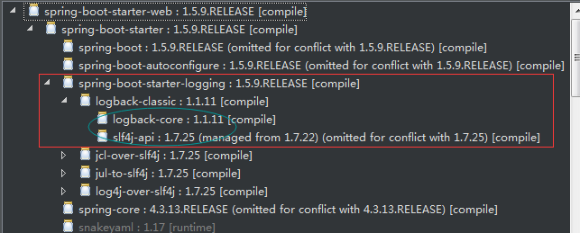

# SpringBoot

## 1. 配置文件加载顺序

```xml
<parent>
    <groupId>org.springframework.boot</groupId>
    <artifactId>spring-boot-starter-parent</artifactId>
    <version>2.3.0.RELEASE</version>
    <relativePath />
</parent>
```

```xml
<resources>
    <resource>
        <directory>${basedir}/src/main/resources</directory>
        <filtering>true</filtering>
        <includes>
            <include>**/application*.yml</include>
            <include>**/application*.yaml</include>
            <include>**/application*.properties</include>
        </includes>
    </resource>
</resources>
```

按照优先级从高到低的顺序，所有位置的文件都会被加载，高优先级的配置内容会覆盖低优先级配置的内容，其中配置文件中的内容是互补配置
- file:/config/ （工程根目录下的config）
- file:/    （工程根目录）
- classpath:/config/
- classpath:/

java -jar xxxx.jar --spring.config.location=D:/kawa/application.yml


## 2. 属性注入

```yml
#自定义的属性和值
yml:
  simpleProp: simplePropValue
  arrayProps: 1,2,3,4,5
  listProp1:
    - name: abc
      value: abcValue
    - name: efg
      value: efgValue
  noAuthUrls:
    - /
    - /login
    - /logout
    - /register
    - /forgot
  excludeUrls:
    - config2Value1
    - config2Vavlue2
  mapProps:
    key1: value1
    key2: value2
  menus :
```

```java
package com.xuzhihao.config;

import org.springframework.boot.context.properties.ConfigurationProperties;
import org.springframework.stereotype.Component;

import java.util.ArrayList;
import java.util.HashMap;
import java.util.List;
import java.util.Map;

@Component
@ConfigurationProperties(prefix = "yml")
public class YmlConfig {

	String simpleProp;
	private String[] arrayProps;
	private List<Map<String, String>> listProp1 = new ArrayList<>(); // 接收prop1里面的属性值
	private List<String> noAuthUrls = new ArrayList<>(); // noAuthUrls
	private Map<String, String> mapProps = new HashMap<>(); // 接收prop1里面的属性值

	public String getSimpleProp() {
		return simpleProp;
	}

	// String类型的一定需要setter来接收属性值；maps, collections, 和 arrays 不需要
	public void setSimpleProp(String simpleProp) {
		this.simpleProp = simpleProp;
	}

	public String[] getArrayProps() {
		return arrayProps;
	}

	public void setArrayProps(String[] arrayProps) {
		this.arrayProps = arrayProps;
	}

	public List<Map<String, String>> getListProp1() {
		return listProp1;
	}

	public void setListProp1(List<Map<String, String>> listProp1) {
		this.listProp1 = listProp1;
	}

	public Map<String, String> getMapProps() {
		return mapProps;
	}

	public void setMapProps(Map<String, String> mapProps) {
		this.mapProps = mapProps;
	}

	public List<String> getNoAuthUrls() {
		return noAuthUrls;
	}

	public void setNoAuthUrls(List<String> noAuthUrls) {
		this.noAuthUrls = noAuthUrls;
	}
	
}
```


## 3. 自动配置原理

@SpringBootApplication

```java
@Target(ElementType.TYPE)
@Retention(RetentionPolicy.RUNTIME)
@Documented
@Inherited
@SpringBootConfiguration
@EnableAutoConfiguration//自动装配
@ComponentScan(excludeFilters = { @Filter(type = FilterType.CUSTOM, classes = TypeExcludeFilter.class),
		@Filter(type = FilterType.CUSTOM, classes = AutoConfigurationExcludeFilter.class) })
public @interface SpringBootApplication {
    ...
```    

```java
@Target(ElementType.TYPE)
@Retention(RetentionPolicy.RUNTIME)
@Documented
@Inherited
@AutoConfigurationPackage
@Import(AutoConfigurationImportSelector.class)
public @interface EnableAutoConfiguration {
    ...
```

```java
public class AutoConfigurationImportSelector implements DeferredImportSelector, BeanClassLoaderAware,
...
//此处用的import的第2种使用方式的第2种形式 导入实现DeferredImportSelector类的子接口
//同样重写selectImports方法
@Override
public String[] selectImports(AnnotationMetadata annotationMetadata) {
    if (!isEnabled(annotationMetadata)) {
        return NO_IMPORTS;
    }
    AutoConfigurationEntry autoConfigurationEntry = getAutoConfigurationEntry(annotationMetadata);
    return StringUtils.toStringArray(autoConfigurationEntry.getConfigurations());
}
...

//首先判断是否实现Group
@Override
public Class<? extends Group> getImportGroup() {
    return AutoConfigurationGroup.class;
}
@Override
public void process(AnnotationMetadata annotationMetadata, DeferredImportSelector deferredImportSelector) {
    Assert.state(deferredImportSelector instanceof AutoConfigurationImportSelector,
            () -> String.format("Only %s implementations are supported, got %s",
                    AutoConfigurationImportSelector.class.getSimpleName(),
                    deferredImportSelector.getClass().getName()));
    AutoConfigurationEntry autoConfigurationEntry = ((AutoConfigurationImportSelector) deferredImportSelector)
            .getAutoConfigurationEntry(annotationMetadata);
    this.autoConfigurationEntries.add(autoConfigurationEntry);
    for (String importClassName : autoConfigurationEntry.getConfigurations()) {
        this.entries.putIfAbsent(importClassName, annotationMetadata);
    }
}

protected AutoConfigurationEntry getAutoConfigurationEntry(AnnotationMetadata annotationMetadata) {
    if (!isEnabled(annotationMetadata)) {
        return EMPTY_ENTRY;
    }
    AnnotationAttributes attributes = getAttributes(annotationMetadata);
    // 把需要完成自动状态的类全部扫描进来
    List<String> configurations = getCandidateConfigurations(annotationMetadata, attributes);
    // 完成去重
    configurations = removeDuplicates(configurations);
    // 检测需要排除掉自动装配的集合
    Set<String> exclusions = getExclusions(annotationMetadata, attributes);
    // 对于排除项目进行一个检查
    checkExcludedClasses(configurations, exclusions);
    // 从总的集合中删除掉不需要装配的内容
    configurations.removeAll(exclusions);
    configurations = getConfigurationClassFilter().filter(configurations);
    // 开火 进行封装
    fireAutoConfigurationImportEvents(configurations, exclusions);
    return new AutoConfigurationEntry(configurations, exclusions);
}

protected List<String> getCandidateConfigurations(AnnotationMetadata metadata, AnnotationAttributes attributes) {
    // 获取所有auto配置类的信息
    // 如spring.factories中138行
    // ：org.springframework.boot.autoconfigure.web.servlet.DispatcherServletAutoConfiguration
    List<String> configurations = SpringFactoriesLoader.loadFactoryNames(getSpringFactoriesLoaderFactoryClass(),
            getBeanClassLoader());
    Assert.notEmpty(configurations, "No auto configuration classes found in META-INF/spring.factories. If you "
            + "are using a custom packaging, make sure that file is correct.");
    return configurations;
}

public static List<String> loadFactoryNames(Class<?> factoryType, @Nullable ClassLoader classLoader) {
    String factoryTypeName = factoryType.getName();
    return loadSpringFactories(classLoader).getOrDefault(factoryTypeName, Collections.emptyList());
}

private static Map<String, List<String>> loadSpringFactories(@Nullable ClassLoader classLoader) {
    MultiValueMap<String, String> result = cache.get(classLoader);
    if (result != null) {
        return result;
    }

    try {
        //所有jar包下寻找META-INF/spring.factories
        Enumeration<URL> urls = (classLoader != null ?
                classLoader.getResources(FACTORIES_RESOURCE_LOCATION) :
                ClassLoader.getSystemResources(FACTORIES_RESOURCE_LOCATION));
        result = new LinkedMultiValueMap<>();
        while (urls.hasMoreElements()) {
            URL url = urls.nextElement();
            UrlResource resource = new UrlResource(url);
            Properties properties = PropertiesLoaderUtils.loadProperties(resource);
            for (Map.Entry<?, ?> entry : properties.entrySet()) {
                String factoryTypeName = ((String) entry.getKey()).trim();
                for (String factoryImplementationName : StringUtils.commaDelimitedListToStringArray((String) entry.getValue())) {
                    result.add(factoryTypeName, factoryImplementationName.trim());
                }
            }
        }
        cache.put(classLoader, result);
        return result;
    }
    catch (IOException ex) {
        throw new IllegalArgumentException("Unable to load factories from location [" +
                FACTORIES_RESOURCE_LOCATION + "]", ex);
    }
}
```

```java
/*
 * Copyright 2012-2020 the original author or authors.
 *
 * Licensed under the Apache License, Version 2.0 (the "License");
 * you may not use this file except in compliance with the License.
 * You may obtain a copy of the License at
 *
 *      https://www.apache.org/licenses/LICENSE-2.0
 *
 * Unless required by applicable law or agreed to in writing, software
 * distributed under the License is distributed on an "AS IS" BASIS,
 * WITHOUT WARRANTIES OR CONDITIONS OF ANY KIND, either express or implied.
 * See the License for the specific language governing permissions and
 * limitations under the License.
 */

package org.springframework.boot.autoconfigure.web.servlet;

import org.springframework.boot.autoconfigure.EnableAutoConfiguration;
import org.springframework.boot.autoconfigure.condition.ConditionalOnClass;
import org.springframework.boot.autoconfigure.condition.ConditionalOnMissingBean;
import org.springframework.boot.autoconfigure.condition.ConditionalOnProperty;
import org.springframework.boot.autoconfigure.condition.ConditionalOnWebApplication;
import org.springframework.boot.autoconfigure.web.ServerProperties;
import org.springframework.boot.context.properties.EnableConfigurationProperties;
import org.springframework.boot.web.server.WebServerFactoryCustomizer;
import org.springframework.boot.web.servlet.filter.OrderedCharacterEncodingFilter;
import org.springframework.boot.web.servlet.server.ConfigurableServletWebServerFactory;
import org.springframework.boot.web.servlet.server.Encoding;
import org.springframework.context.annotation.Bean;
import org.springframework.context.annotation.Configuration;
import org.springframework.core.Ordered;
import org.springframework.web.filter.CharacterEncodingFilter;

/**
 * {@link EnableAutoConfiguration Auto-configuration} for configuring the encoding to use
 * in web applications.
 *
 * @author Stephane Nicoll
 * @author Brian Clozel
 * @since 2.0.0
 */
@Configuration(proxyBeanMethods = false)
@EnableConfigurationProperties(ServerProperties.class)
@ConditionalOnWebApplication(type = ConditionalOnWebApplication.Type.SERVLET)
@ConditionalOnClass(CharacterEncodingFilter.class)
@ConditionalOnProperty(prefix = "server.servlet.encoding", value = "enabled", matchIfMissing = true)
public class HttpEncodingAutoConfiguration {

	private final Encoding properties;

	public HttpEncodingAutoConfiguration(ServerProperties properties) {
		this.properties = properties.getServlet().getEncoding();
	}

	@Bean
	@ConditionalOnMissingBean
	public CharacterEncodingFilter characterEncodingFilter() {
		CharacterEncodingFilter filter = new OrderedCharacterEncodingFilter();
		filter.setEncoding(this.properties.getCharset().name());
		filter.setForceRequestEncoding(this.properties.shouldForce(Encoding.Type.REQUEST));
		filter.setForceResponseEncoding(this.properties.shouldForce(Encoding.Type.RESPONSE));
		return filter;
	}

	@Bean
	public LocaleCharsetMappingsCustomizer localeCharsetMappingsCustomizer() {
		return new LocaleCharsetMappingsCustomizer(this.properties);
	}

	static class LocaleCharsetMappingsCustomizer
			implements WebServerFactoryCustomizer<ConfigurableServletWebServerFactory>, Ordered {

		private final Encoding properties;

		LocaleCharsetMappingsCustomizer(Encoding properties) {
			this.properties = properties;
		}

		@Override
		public void customize(ConfigurableServletWebServerFactory factory) {
			if (this.properties.getMapping() != null) {
				factory.setLocaleCharsetMappings(this.properties.getMapping());
			}
		}

		@Override
		public int getOrder() {
			return 0;
		}

	}

}
```

EurekaServer装配过程


## 4. 热部署DevTools原理

Spring Boot提供的重启技术是通过使用两个类加载器实现的。没有发生变化的类（比如那些第三方jars）会被加载进一个基础（basic）classloader里面，正在开发的类会加载进一个重启（restart）classloader里面。当应用重启时，restart类加载器会被丢弃，并创建一个新的。这种方式意味着应用重启通常比冷启动（cold starts）快很多，因为基础类加载器已经可用，并且populated（意思是基础类加载器加载的类比较多）

application.properties
```pro
spring.devtools.restart.enabled=true
spring.devtools.restart.trigger-file=trigger.txt
```

pom.xml
```xml
<dependency>
    <groupId>org.springframework.boot</groupId>
    <artifactId>spring-boot-devtools</artifactId>
    <optional>true</optional>
    <scope>true</scope>
</dependency>
<!-- 构建节点 -->
<build>
    <plugins>
        <!-- 这是spring boot devtool plugin -->
        <plugin>
            <groupId>org.springframework.boot</groupId>
            <artifactId>spring-boot-maven-plugin</artifactId>
            <configuration>
                <!--fork : 如果没有该项配置，肯呢个devtools不会起作用，即应用不会restart -->
                <fork>true</fork>
            </configuration>
        </plugin>
    </plugins>
</build>
```

## 5. 整合slf4j日志

```xml
<?xml version="1.0" encoding="UTF-8"?>
<configuration>
	<!-- 文件输出格式 -->
	<property name="PATTERN"
		value="%-12(%d{yyyy-MM-dd HH:mm:ss.SSS}) |-%-5level [%thread] %c [%L] -| %msg%n" />

	<!-- %m输出的信息,%p日志级别,%t线程名,%d日期,%c类的全名,%i索引【从数字0开始递增】,,, -->
	<!-- appender是configuration的子节点，是负责写日志的组件。 -->
	<!-- ConsoleAppender：把日志输出到控制台 -->
	<appender name="STDOUT"
		class="ch.qos.logback.core.ConsoleAppender">
		<encoder>
			<pattern>${PATTERN}</pattern>
			<!-- 控制台也要使用UTF-8，不要使用GBK，否则会中文乱码 -->
			<charset>UTF-8</charset>
		</encoder>
	</appender>
	<!-- RollingFileAppender：滚动记录文件，先将日志记录到指定文件，当符合某个条件时，将日志记录到其他文件 -->
	<!-- 1.先按日期存日志，日期变了，将前一天的日志文件名重命名为XXX%日期%索引，新的日志仍然是sys.log -->
	<!-- 2.如果日期没有发生变化，但是当前日志的文件大小超过1KB时，对当前日志进行分割 重命名 -->
	<appender name="syslog"
		class="ch.qos.logback.core.rolling.RollingFileAppender">
		<File>log/info.log</File>
		<!-- rollingPolicy:当发生滚动时，决定 RollingFileAppender 的行为，涉及文件移动和重命名。 -->
		<!-- TimeBasedRollingPolicy： 最常用的滚动策略，它根据时间来制定滚动策略，既负责滚动也负责出发滚动 -->
		<rollingPolicy
			class="ch.qos.logback.core.rolling.TimeBasedRollingPolicy">
			<!-- 活动文件的名字会根据fileNamePattern的值，每隔一段时间改变一次 -->
			<!-- 文件名：log/sys.2017-12-05.0.log -->
			<fileNamePattern>log/info.%d.%i.log</fileNamePattern>
			<!-- 每产生一个日志文件，该日志文件的保存期限为30天 -->
			<maxHistory>30</maxHistory>
			<timeBasedFileNamingAndTriggeringPolicy
				class="ch.qos.logback.core.rolling.SizeAndTimeBasedFNATP">
				<!-- maxFileSize:这是活动文件的大小，默认值是10MB,本篇设置为1KB，只是为了演示 -->
				<maxFileSize>2KB</maxFileSize>
			</timeBasedFileNamingAndTriggeringPolicy>
		</rollingPolicy>
		<encoder>
			<!-- pattern节点，用来设置日志的输入格式 -->
			<pattern>
				<pattern>${PATTERN}</pattern>
			</pattern>
			<!-- 记录日志的编码 -->
			<charset>UTF-8</charset> <!-- 此处设置字符集 -->
		</encoder>
	</appender>
	<!-- 控制台输出日志级别 -->
	<root level="info">
		<appender-ref ref="STDOUT" />
	</root>
	<!-- 指定项目中某个包，当有日志操作行为时的日志记录级别 -->
	<!-- com.appley为根包，也就是只要是发生在这个根包下面的所有日志操作行为的权限都是DEBUG -->
	<!-- 级别依次为【从高到低】：FATAL > ERROR > WARN > INFO > DEBUG > TRACE -->
	<logger name="com.xuzhihao" level="DEBUG">
		<appender-ref ref="syslog" />
	</logger>
</configuration>
```

spring-boot-starter-web的依赖树



更换日志
```xml
<dependency>
        <groupId>org.springframework.boot</groupId>
        <artifactId>spring-boot-starter-web</artifactId>
        <exclusions>
            <exclusion>
                <groupId>org.springframework.boot</groupId>
                <artifactId>spring-boot-starter-logging</artifactId>
            </exclusion>
        </exclusions>
    </dependency>
    <dependency>
        <groupId>org.springframework.boot</groupId>
        <artifactId>spring-boot-starter-log4j2</artifactId>
    </dependency>
```

## 6. 拦截、过滤、监听

拦截器
```java
package com.xuzhihao.config.handle;

import javax.servlet.http.HttpServletRequest;
import javax.servlet.http.HttpServletResponse;

import org.slf4j.Logger;
import org.slf4j.LoggerFactory;
import org.springframework.beans.factory.annotation.Autowired;
import org.springframework.stereotype.Component;
import org.springframework.web.servlet.HandlerInterceptor;

import com.xuzhihao.config.YmlConfig;
import com.xuzhihao.domain.SessionInfo;

@Component
public class LoginHandlerInterceptor implements HandlerInterceptor {

	private static Logger logger = LoggerFactory.getLogger(LoginHandlerInterceptor.class);

	@Autowired
	private YmlConfig config;

	/**
	 * 在调用controller具体方法前拦截
	 */
	@Override
	public boolean preHandle(HttpServletRequest request, HttpServletResponse response, Object handler)
			throws Exception {
		logger.debug("=======进入Login拦截器=======");
		String requestUri = request.getRequestURI();
		String contextPath = request.getContextPath();
		String url = requestUri.substring(contextPath.length());
		SessionInfo sessionInfo = (SessionInfo) request.getSession().getAttribute("sessionInfo");
		if (!config.getNoAuthUrls().contains(url)) {// 需要拦截认证的页面
			if ((sessionInfo == null) || (sessionInfo.getId() == null)) {
				response.sendRedirect(request.getContextPath() + "/"); // 未登录自动跳转界面
				return false;
			}
		}
		return true;
	}
}
```

监听器
```java
package com.xuzhihao.config.handle;

import javax.servlet.http.HttpSessionEvent;
import javax.servlet.http.HttpSessionListener;

import org.springframework.stereotype.Component;

@Component
public class LoginSessionListener implements HttpSessionListener {

	public static int online = 0;

	@Override
	public void sessionCreated(HttpSessionEvent se) {
		System.out.println("创建session");
		online++;
	}

	@Override
	public void sessionDestroyed(HttpSessionEvent se) {
		System.out.println("销毁session");

	}

}
```

过滤器
```java
package com.xuzhihao.config.handle;

import java.io.IOException;

import javax.servlet.Filter;
import javax.servlet.FilterChain;
import javax.servlet.ServletException;
import javax.servlet.ServletRequest;
import javax.servlet.ServletResponse;

import org.slf4j.Logger;
import org.slf4j.LoggerFactory;
import org.springframework.stereotype.Component;

@Component
public class LoginFilter implements Filter {

	private static Logger logger = LoggerFactory.getLogger(LoginFilter.class);

	@Override
	public void doFilter(ServletRequest servletRequest, ServletResponse servletResponse, FilterChain filterChain)
			throws IOException, ServletException {
		logger.info("=======进入Filter过滤器=======");
		filterChain.doFilter(servletRequest, servletResponse);
	}
}
```

注册事件
```java
/**
 * 快速初始化监听器 拦截器 过滤器
 */
@Configuration
public class WebConfig implements WebMvcConfigurer {
	@Autowired
	private LoginHandlerInterceptor loginHandlerInterceptor;
	@Autowired
	private LoginFilter loginFilter;
	@Autowired
	private LoginSessionListener loginSessionListener;

    /**
	 * 注册拦截器
	 * 
	 * @return
	 */
	@Override
	public void addInterceptors(InterceptorRegistry registry) {
		registry.addInterceptor(loginHandlerInterceptor).addPathPatterns("/**").// 对来自/*这个链接来的请求进行拦截
				excludePathPatterns("/error", "/css/**", "/js/**", "/images/**", "/plugins/**"); // 添加不拦截路径
	}

	/**
	 * 注册过滤器
	 * 
	 * @return
	 */
	@SuppressWarnings({ "rawtypes", "unchecked" })
	@Bean // 将方法中返回的对象注入到IOC容器中
	public FilterRegistrationBean filterRegistrationBean() {
		FilterRegistrationBean filterRegistration = new FilterRegistrationBean();
		filterRegistration.setFilter(loginFilter); // 创建并注册LoginFilter
		filterRegistration.addUrlPatterns("/*"); // 拦截的路径（对所有请求拦截）
		filterRegistration.setName("LoginFilter"); // 拦截器的名称
		filterRegistration.setOrder(1); // 拦截器的执行顺序。数字越小越先执行
		return filterRegistration;
	}

	/**
	 * 注册监听器
	 * 
	 * @return
	 */
	@SuppressWarnings({ "rawtypes", "unchecked" })
	@Bean
	public ServletListenerRegistrationBean registrationBean() {
		ServletListenerRegistrationBean registrationBean = new ServletListenerRegistrationBean();
		registrationBean.setListener(loginSessionListener);
		return registrationBean;
	}
```

## 7. 异常处理

全局异常处理
```java
package com.xuzhihao.shop.common.exception;

import org.springframework.web.bind.annotation.ControllerAdvice;
import org.springframework.web.bind.annotation.ExceptionHandler;
import org.springframework.web.bind.annotation.ResponseBody;

import com.xuzhihao.shop.common.api.CommonResult;

/**
 * 全局异常处理-可捕获指定异常
 * 
 * @author Administrator
 *
 */
@ControllerAdvice
public class GlobalExceptionHandler {

	@SuppressWarnings("rawtypes")
	@ResponseBody
	@ExceptionHandler(value = ApiException.class)
	public CommonResult handle(ApiException e) {
		if (e.getErrorCode() != null) {
			return CommonResult.failed(e.getErrorCode());
		}
		return CommonResult.failed(e.getMessage());
	}
}

@RequestMapping(value = "/test", method = RequestMethod.GET)
	public HashMap<String, Object> list(String realName, String mobilePhone, String abc) {
		Asserts.fail("用户名或密码不能为空！");
		HashMap<String, Object> parameter = new HashMap<String, Object>();
		parameter.put("realName", "今晚打老虎");
		parameter.put("idCard", "111111111111115762");
		
		return parameter;
	}
```

自定义错误页面
```java
@Component
public class ErrorPageConfig implements ErrorPageRegistrar {
	@Override
	public void registerErrorPages(ErrorPageRegistry errorPageRegistry) {
		// 1、按错误的类型显示错误的网页
		// 错误类型为404，找不到网页的，默认显示404.html网页
		ErrorPage e404 = new ErrorPage(HttpStatus.NOT_FOUND, "/error/404.html");
		// 错误类型为500，表示服务器响应错误，默认显示500.html网页
		ErrorPage e500 = new ErrorPage(HttpStatus.INTERNAL_SERVER_ERROR, "/error/500.html");
		errorPageRegistry.addErrorPages(e404, e500);
	}
}
```

## 8. WebMvcConfigurer

```java
public interface WebMvcConfigurer {

	// 路径匹配规则
	default void configurePathMatch(PathMatchConfigurer configurer) {}

	// 配置内容裁决的一些选项
	default void configureContentNegotiation(ContentNegotiationConfigurer configurer) {}

	// 异步调用线程池设置
	default void configureAsyncSupport(AsyncSupportConfigurer configurer) {}

	// 默认静态资源处理器
	default void configureDefaultServletHandling(DefaultServletHandlerConfigurer configurer) {}

	// 全局参数转换
	default void addFormatters(FormatterRegistry registry) {}

	// 注册拦截器
	default void addInterceptors(InterceptorRegistry registry) {}

	// 配置静态资源的映射
	default void addResourceHandlers(ResourceHandlerRegistry registry) {}

	// 解决跨域
	default void addCorsMappings(CorsRegistry registry) {}

	// 视图跳转控制器
	default void addViewControllers(ViewControllerRegistry registry) {}

	// 配置视图解析器
	default void configureViewResolvers(ViewResolverRegistry registry) {}

	// 自定义参数解析
	default void addArgumentResolvers(List<HandlerMethodArgumentResolver> resolvers) {}

	// 自定义Handlers
	default void addReturnValueHandlers(List<HandlerMethodReturnValueHandler> handlers) {}

	// 消息转换
	default void configureMessageConverters(List<HttpMessageConverter<?>> converters) {}

	default void extendMessageConverters(List<HttpMessageConverter<?>> converters) {}

	default void configureHandlerExceptionResolvers(List<HandlerExceptionResolver> resolvers) {}

	default void extendHandlerExceptionResolvers(List<HandlerExceptionResolver> resolvers) {}

	@Nullable
	default Validator getValidator() {
		return null;
	}

	@Nullable
	default MessageCodesResolver getMessageCodesResolver() {
		return null;
	}

}
```

## 9. 国际化

```java
package com.xuzhihao.i18n;

import org.springframework.context.annotation.PropertySource;
import org.springframework.context.i18n.LocaleContextHolder;

import java.util.HashMap;
import java.util.Locale;
import java.util.Map;
import java.util.ResourceBundle;

/**
 * @author qinming
 * @date 2020-12-28 17:01:38
 * <p> 无 </p>
 */
@PropertySource(value = {"classpath:i18n/messages*.properties"})
public class MessageConfig {


    /**
     * 国际化信息map
     */
    private static final Map<String, ResourceBundle> MESSAGES = new HashMap<>();

    /**
     * 获取国际化信息
     * 只配置了 zh en 语言
     */
    public static String getMessage(String key) {
        //获取当前语言环境
        Locale locale = LocaleContextHolder.getLocale();
        if (!Locale.CHINA.getLanguage().equals(locale.getLanguage())
                && !Locale.ENGLISH.getLanguage().equals(locale.getLanguage())) {
            //其他语言一律为中文
            locale = Locale.CHINA;
        }
        ResourceBundle message = MESSAGES.get(locale.getLanguage());
        if (message == null) {
            //根据语言读取配置
            message = MESSAGES.get(locale.getLanguage());
            if (message == null) {
                message = ResourceBundle.getBundle("i18n/messages", locale);
                MESSAGES.put(locale.getLanguage(), message);
            }
        }
        return message.getString(key);
    }

    /**
     * 清除国际化信息
     */
    public static void flushMessage() {
        MESSAGES.clear();
    }
}
```

```java
package com.xuzhihao.i18n;

import java.util.Locale;

import javax.servlet.http.HttpServletRequest;
import javax.servlet.http.HttpServletResponse;
import javax.servlet.http.HttpSession;

import org.springframework.web.servlet.LocaleResolver;

import cn.hutool.core.util.StrUtil;

/**
 * 国际化解析
 */
public class MyLocaleResolver implements LocaleResolver {

	private static final String LANG = "lang";

	private static final String LANG_SESSION = "lang_session";

	public static final String DELIMITER = "_";

	@Override
	public Locale resolveLocale(HttpServletRequest request) {
		String lang = request.getHeader(LANG);
		// 默认语言 简体中文
		Locale locale = Locale.CHINA;
		if (StrUtil.isNotBlank(lang) && lang.contains(DELIMITER)) {
			String[] langueagea = lang.split(DELIMITER);
			locale = new Locale(langueagea[0], langueagea[1]);
			HttpSession session = request.getSession();
			session.setAttribute(LANG_SESSION, locale);
		} else {
			HttpSession session = request.getSession();
			Locale localeInSession = (Locale) session.getAttribute(LANG_SESSION);
			if (localeInSession != null) {
				locale = localeInSession;
			}
		}
		return locale;
	}

	@Override
	public void setLocale(HttpServletRequest httpServletRequest, HttpServletResponse httpServletResponse,
			Locale locale) {

	}
}
```

```java
@Configuration
public class WebConfig implements WebMvcConfigurer {
	...
	@Bean
    public LocaleResolver localeResolver() {
        return new MyLocaleResolver();
    }
```

```java
/**
	* 获取枚举中的提示信息
	*/
@GetMapping("/test1")
public String login1() {
	return "test2  " + ResultCode.getMessage(ResultCode.SUCCESS.getCode());
}

/**
	* 根据key获取配置文件中的信息
	*/
@GetMapping("/test2")
public String login2() {
	return "test2  " + MessageConfig.getMessage("login.username");
}
```

## 10. 整合mybatis

## 11. 自定义starter

## 12. 启动原理

