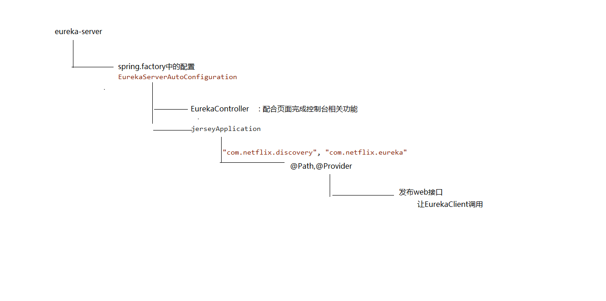

# Spring Cloud Netflix

## 1. Eureka的源码分析服务注册和服务发现以及心跳机制和保护机制

### 1.1 服务器端

依赖springboot的自动装配原理定位到spring-cloud-netflix-eureka-server包下的spring.factories文件

org.springframework.cloud.netflix.eureka.server.EurekaServerAutoConfiguration



Jersey是一个RESTFUL请求服务JAVA框架，与常规的JAVA编程使用的struts框架类似，它主要用于处理业务逻辑层

与`SpringMvc`的区别：

```
1. jersey同样提供DI，是由glassfish hk2实现，也就是说，如果想单独使用jersey一套，需要另外学习Bean容器；
2. MVC出发点即是WEB，但jersey出发点确实RESTFull，体现点在与接口的设计方面，如MVC返回复杂结构需要使用ModelAndView,而jersey仅仅需要返回一个流或者文件句柄；
3. jersey提供一种子资源的概念，这也是RESTFull中提倡所有url都是资源；
4. jersey直接提供application.wadl资源url说明；
5. MVC提供Session等状态管理，jersey没有，这个源自RESTFull设计无状态化；
6. Response方法支持更好返回结果，方便的返回Status，包括200，303，401，403；
7. 提供超级特别方便的方式访问RESTFull;

```

Jersey是一个是 webservice框架，常用注解解释

```
@Path
uri路径
定义资源的访问路径，client通过这个路径访问资源。比如：@Path("user")

@Produces
返回
指定返回MIME格式
资源按照那种数据格式返回，可取的值有：MediaType.APPLICATION_XXX。比如：@Produces(MediaType.APPLICATION_XML)

@Consumes
接收入参
接受指定的MIME格式
只有符合这个参数设置的请求再能访问到这个资源。比如@Consumes("application/x-www-form-urlencoded")

@PathParam
uri路径参数
写在方法的参数中，获得请求路径参数。比如：@PathParam("username")  String userName
```


由于集成了Jersey，我们可以找到在EurekaServer的依赖包中的 eureka-core-1.9.8.jar ,可以看到一些列的XXXResource


eureka信息查看 get: {ip:port}/eureka/status
>注册到eureka的服务信息查看 get: {ip:port}/eureka/apps

注册到eureka的具体的服务查看
>get: {ip:port}/eureka/apps/{appname}/{id}
>对应eureka源码的：InstanceResource.getInstanceInfo


服务续约
>put：{ip:port}/eureka/apps/{appname}/{id}?lastDirtyTimestamp={}&status=up
>对应eureka源码的：InstanceResource.renewLease


更改服务状态
>put：{ip:port}/eureka/apps/{appname}/{id}/status?lastDirtyTimestamp={}&value={UP/DOWN}
>对应eureka源码的：InstanceResource.statusUpdate


删除状态更新
>delete：{ip:port}/eureka/apps/{appname}/{id}/status?lastDirtyTimestamp={}&value={UP/DOWN}
>对应eureka源码的：InstanceResource.deleteStatusUpdate

删除服务
>delete: {ip:port}/eureka/apps/{appname}/{id}
>对应eureka源码的：InstanceResource.cancelLease


### 1.2 客户端


```java
@Configuration
@EnableConfigurationProperties
@ConditionalOnClass(EurekaClientConfig.class)
@Import(DiscoveryClientOptionalArgsConfiguration.class)
@ConditionalOnBean(EurekaDiscoveryClientConfiguration.Marker.class)
@ConditionalOnProperty(value = "eureka.client.enabled", matchIfMissing = true)
@ConditionalOnDiscoveryEnabled
@AutoConfigureBefore({ NoopDiscoveryClientAutoConfiguration.class,
		CommonsClientAutoConfiguration.class, ServiceRegistryAutoConfiguration.class })
@AutoConfigureAfter(name = {
		"org.springframework.cloud.autoconfigure.RefreshAutoConfiguration",
		"org.springframework.cloud.netflix.eureka.EurekaDiscoveryClientConfiguration",
		"org.springframework.cloud.client.serviceregistry.AutoServiceRegistrationAutoConfiguration" })
public class EurekaClientAutoConfiguration {
    ...
@Bean
public DiscoveryClient discoveryClient(EurekaClient client,
        EurekaClientConfig clientConfig) {
    return new EurekaDiscoveryClient(client, clientConfig);
}
```

```java
@Singleton
public class DiscoveryClient implements EurekaClient {
    ...
/**
* Register with the eureka service by making the appropriate REST call.
*/
boolean register() throws Throwable {
    logger.info(PREFIX + "{}: registering service...", appPathIdentifier);
    EurekaHttpResponse<Void> httpResponse;
    try {
        httpResponse = eurekaTransport.registrationClient.register(instanceInfo);
    } catch (Exception e) {
        logger.warn(PREFIX + "{} - registration failed {}", appPathIdentifier, e.getMessage(), e);
        throw e;
    }
    if (logger.isInfoEnabled()) {
        logger.info(PREFIX + "{} - registration status: {}", appPathIdentifier, httpResponse.getStatusCode());
    }
    return httpResponse.getStatusCode() == Status.NO_CONTENT.getStatusCode();
}

```

```java
public interface EurekaHttpClient {

    EurekaHttpResponse<Void> register(InstanceInfo info);

    EurekaHttpResponse<Void> cancel(String appName, String id);

    EurekaHttpResponse<InstanceInfo> sendHeartBeat(String appName, String id, InstanceInfo info, InstanceStatus overriddenStatus);

    EurekaHttpResponse<Void> statusUpdate(String appName, String id, InstanceStatus newStatus, InstanceInfo info);

    EurekaHttpResponse<Void> deleteStatusOverride(String appName, String id, InstanceInfo info);

    EurekaHttpResponse<Applications> getApplications(String... regions);

    EurekaHttpResponse<Applications> getDelta(String... regions);

    EurekaHttpResponse<Applications> getVip(String vipAddress, String... regions);

    EurekaHttpResponse<Applications> getSecureVip(String secureVipAddress, String... regions);

    EurekaHttpResponse<Application> getApplication(String appName);

    EurekaHttpResponse<InstanceInfo> getInstance(String appName, String id);

    EurekaHttpResponse<InstanceInfo> getInstance(String id);

    void shutdown();
}
```

### 1.3 Eureka心跳机制

```
1.服务器启动成功，等待客户（服务）端注册，在启动过程中如果我们配置了集群，集群之间会同步注册表，每一个Eureka serve都会存在这个集群完整的服务注册表信息
2.Eureka client 启动时根据配置信息，去注册到指定的注册中心
3.Eureka client会每30秒向Eureka server 发送一次心跳请求，证明该客户端服务正常
4.当Eureka server90s内没有接受客户端服务正常，注册中心会认为该节点失效，会注销该实列 （从注册表中删除注册信息）
5.单位时间内如果服务端统计到大量客户端没有发送心跳，则认为网络异常，进去自我保护机制，不在剔除没有发送心跳的客户端
6.当客户端恢复正常之后，服务端就会退出自我保护模式
7.客户端定时全量或增量从注册中心获取服务注册表，并且会缓存到本地
8.服务调用时，客户端会先从本地缓存找到调用服务，如果调取不到 先从注册中心刷新注册表，在同步到本地
9.客户端获取不到目标服务器信息发起服务调用
10.客户端程序关闭时向服务端发送取消请求，服务器将实例从注册表中删除
```

### 1.4 注册中心的比较


## 2. Feign的源码分析


@EnableFeignClients 应用到@Import 导入ImportBeanDefinitionRegistrar的实现类方式

```java
@Import(FeignClientsRegistrar.class)
public @interface EnableFeignClients {
    ...
```

```java
class FeignClientsRegistrar
		implements ImportBeanDefinitionRegistrar, ResourceLoaderAware, EnvironmentAware {
...

@Override
public void registerBeanDefinitions(AnnotationMetadata metadata,
        BeanDefinitionRegistry registry) {
    registerDefaultConfiguration(metadata, registry);
    registerFeignClients(metadata, registry);
}
```

扫描注解
```java
public void registerFeignClients(AnnotationMetadata metadata,
			BeanDefinitionRegistry registry) {
		ClassPathScanningCandidateComponentProvider scanner = getScanner();
		scanner.setResourceLoader(this.resourceLoader);

		Set<String> basePackages;

		Map<String, Object> attrs = metadata
				.getAnnotationAttributes(EnableFeignClients.class.getName());
		AnnotationTypeFilter annotationTypeFilter = new AnnotationTypeFilter(
				FeignClient.class);//扫描当前工程所有使用FeignClient标签
		final Class<?>[] clients = attrs == null ? null
				: (Class<?>[]) attrs.get("clients");
		if (clients == null || clients.length == 0) {
			scanner.addIncludeFilter(annotationTypeFilter);
			basePackages = getBasePackages(metadata);
		}
		else {
			final Set<String> clientClasses = new HashSet<>();
			basePackages = new HashSet<>();
			for (Class<?> clazz : clients) {
				basePackages.add(ClassUtils.getPackageName(clazz));
				clientClasses.add(clazz.getCanonicalName());
			}
			AbstractClassTestingTypeFilter filter = new AbstractClassTestingTypeFilter() {
				@Override
				protected boolean match(ClassMetadata metadata) {
					String cleaned = metadata.getClassName().replaceAll("\\$", ".");
					return clientClasses.contains(cleaned);
				}
			};
			scanner.addIncludeFilter(
					new AllTypeFilter(Arrays.asList(filter, annotationTypeFilter)));
		}

		for (String basePackage : basePackages) {
			Set<BeanDefinition> candidateComponents = scanner
					.findCandidateComponents(basePackage);
			for (BeanDefinition candidateComponent : candidateComponents) {
				if (candidateComponent instanceof AnnotatedBeanDefinition) {
					// verify annotated class is an interface
					AnnotatedBeanDefinition beanDefinition = (AnnotatedBeanDefinition) candidateComponent;
					AnnotationMetadata annotationMetadata = beanDefinition.getMetadata();
					Assert.isTrue(annotationMetadata.isInterface(),
							"@FeignClient can only be specified on an interface");

					Map<String, Object> attributes = annotationMetadata
							.getAnnotationAttributes(
									FeignClient.class.getCanonicalName());

					String name = getClientName(attributes);
					registerClientConfiguration(registry, name,
							attributes.get("configuration"));

					registerFeignClient(registry, annotationMetadata, attributes);//完成相关注册的功能
				}
			}
		}
	}
```

通过`BeanDefinitionBuilder`构建bean对象
```java
private void registerFeignClient(BeanDefinitionRegistry registry,
			AnnotationMetadata annotationMetadata, Map<String, Object> attributes) {
		String className = annotationMetadata.getClassName();
		BeanDefinitionBuilder definition = BeanDefinitionBuilder
				.genericBeanDefinition(FeignClientFactoryBean.class);//构建bean对象
		validate(attributes);
		definition.addPropertyValue("url", getUrl(attributes));
		definition.addPropertyValue("path", getPath(attributes));
		String name = getName(attributes);
		definition.addPropertyValue("name", name);
		String contextId = getContextId(attributes);
		definition.addPropertyValue("contextId", contextId);
		definition.addPropertyValue("type", className);
		definition.addPropertyValue("decode404", attributes.get("decode404"));
		definition.addPropertyValue("fallback", attributes.get("fallback"));
		definition.addPropertyValue("fallbackFactory", attributes.get("fallbackFactory"));
		definition.setAutowireMode(AbstractBeanDefinition.AUTOWIRE_BY_TYPE);

		String alias = contextId + "FeignClient";
		AbstractBeanDefinition beanDefinition = definition.getBeanDefinition();
		beanDefinition.setAttribute(FactoryBean.OBJECT_TYPE_ATTRIBUTE, className);

		// has a default, won't be null
		boolean primary = (Boolean) attributes.get("primary");

		beanDefinition.setPrimary(primary);

		String qualifier = getQualifier(attributes);
		if (StringUtils.hasText(qualifier)) {
			alias = qualifier;
		}

		BeanDefinitionHolder holder = new BeanDefinitionHolder(beanDefinition, className,
				new String[] { alias });
		BeanDefinitionReaderUtils.registerBeanDefinition(holder, registry);
	}
```

```java
class FeignClientFactoryBean
		implements FactoryBean<Object>, InitializingBean, ApplicationContextAware {
    ...
@Override
public Object getObject() throws Exception {
    return getTarget();
}
...
<T> T getTarget() {
    FeignContext context = this.applicationContext.getBean(FeignContext.class);
    Feign.Builder builder = feign(context);

    if (!StringUtils.hasText(this.url)) {
        if (!this.name.startsWith("http")) {
            this.url = "http://" + this.name;
        }
        else {
            this.url = this.name;
        }
        this.url += cleanPath();
        return (T) loadBalance(builder, context,
                new HardCodedTarget<>(this.type, this.name, this.url));
    }
    if (StringUtils.hasText(this.url) && !this.url.startsWith("http")) {
        this.url = "http://" + this.url;
    }
    String url = this.url + cleanPath();
    Client client = getOptional(context, Client.class);
    if (client != null) {
        if (client instanceof LoadBalancerFeignClient) {
            // not load balancing because we have a url,
            // but ribbon is on the classpath, so unwrap
            client = ((LoadBalancerFeignClient) client).getDelegate();
        }
        if (client instanceof FeignBlockingLoadBalancerClient) {
            // not load balancing because we have a url,
            // but Spring Cloud LoadBalancer is on the classpath, so unwrap
            client = ((FeignBlockingLoadBalancerClient) client).getDelegate();
        }
        builder.client(client);
    }
    Targeter targeter = get(context, Targeter.class);
    return (T) targeter.target(this, builder, context,
            new HardCodedTarget<>(this.type, this.name, url));//基于jdk的动态代理实现入口
}

```

```java
class DefaultTargeter implements Targeter {

	@Override
	public <T> T target(FeignClientFactoryBean factory, Feign.Builder feign,
			FeignContext context, Target.HardCodedTarget<T> target) {
		return feign.target(target);
	}

}
```

`ReflectiveFeign.java`

```java
@SuppressWarnings("unchecked")
  @Override
  public <T> T newInstance(Target<T> target) {
    Map<String, MethodHandler> nameToHandler = targetToHandlersByName.apply(target);
    Map<Method, MethodHandler> methodToHandler = new LinkedHashMap<Method, MethodHandler>();
    List<DefaultMethodHandler> defaultMethodHandlers = new LinkedList<DefaultMethodHandler>();

    for (Method method : target.type().getMethods()) {
      if (method.getDeclaringClass() == Object.class) {
        continue;
      } else if (Util.isDefault(method)) {
        DefaultMethodHandler handler = new DefaultMethodHandler(method);
        defaultMethodHandlers.add(handler);
        methodToHandler.put(method, handler);
      } else {
        methodToHandler.put(method, nameToHandler.get(Feign.configKey(target.type(), method)));
      }
    }
    InvocationHandler handler = factory.create(target, methodToHandler);
    T proxy = (T) Proxy.newProxyInstance(target.type().getClassLoader(),
        new Class<?>[] {target.type()}, handler);

    for (DefaultMethodHandler defaultMethodHandler : defaultMethodHandlers) {
      defaultMethodHandler.bindTo(proxy);
    }
    return proxy;
  }
```

```java
public class ReflectiveFeign extends Feign {
... 
 @Override
    public Object invoke(Object proxy, Method method, Object[] args) throws Throwable {
      if ("equals".equals(method.getName())) {
        try {
          Object otherHandler =
              args.length > 0 && args[0] != null ? Proxy.getInvocationHandler(args[0]) : null;
          return equals(otherHandler);
        } catch (IllegalArgumentException e) {
          return false;
        }
      } else if ("hashCode".equals(method.getName())) {
        return hashCode();
      } else if ("toString".equals(method.getName())) {
        return toString();
      }

      return dispatch.get(method).invoke(args);
    }
    ...
```   

```java
final class SynchronousMethodHandler implements MethodHandler {
    ...
 @Override
  public Object invoke(Object[] argv) throws Throwable {
    RequestTemplate template = buildTemplateFromArgs.create(argv);
    Options options = findOptions(argv);
    Retryer retryer = this.retryer.clone();
    while (true) {
      try {
        return executeAndDecode(template, options);
      } catch (RetryableException e) {
        try {
          retryer.continueOrPropagate(e);
        } catch (RetryableException th) {
          Throwable cause = th.getCause();
          if (propagationPolicy == UNWRAP && cause != null) {
            throw cause;
          } else {
            throw th;
          }
        }
        if (logLevel != Logger.Level.NONE) {
          logger.logRetry(metadata.configKey(), logLevel);
        }
        continue;
      }
    }
  }
```    

## 3. Hystrix 熔断、降级、限流

### 3.1 熔断

熔断这一概念来源于电子工程中的断路器（Circuit Breaker）。在互联网系统中，当下游服务因访问压力过大而响应变慢或失败，上游服务为了保护系统整体的可用性，可以暂时切断对下游服务的调用。这种牺牲局部，保全整体的措施就叫做熔断

```yml
management:
  endpoints:
    web:
      exposure:
        include: '*'
        
feign:
  hystrix:
    enabled: true
  httpclient:
    enabled: false
  okhttp:
    enabled: true
hystrix:
   command:
      default:
         circuitBreaker:
            requestVolumeThreshold: 20 #触发熔断的最小请求次数，默认20
            sleepWindowInMilliseconds: 10000 #熔断多少秒后去尝试请求
            errorThresholdPercentage: 50 #触发熔断的失败请求最小占比，默认50%
         execution:
            isolation:
               thread:
                  timeoutInMilliseconds: 5000 # 熔断器超时时间，默认：1000/毫秒
```

### 3.2 降级

所谓降级，就是当某个服务熔断之后，服务器将不再被调用，此时客户端可以自己准备一个本地的fallback回调，返回一个缺省值。 也可以理解为兜底
`因为熔断所以降级`

```java
//指定需要调用的微服务名称
@FeignClient(name="shop-service-product",fallback =
ProductFeginClientCallBack.class)
public interface ProductFeginClient {
//调用的请求路径
@RequestMapping(value = "/product/{id}",method = RequestMethod.GET)
public Product findById(@PathVariable("id") Long id);
}
```

```java
/**
* 实现自定义的ProductFeginClient接口
* 在接口实现类中编写熔断降级方法
*/
@Component
public class ProductFeginClientCallBack implements ProductFeginClient {
/**
* 降级方法
*/
public Product findById(Long id) {
Product product = new Product();
product.setId(-1l);
product.setProductName("熔断:触发降级方法");
return product;
}
```


### 3.3 限流

Hystrix能做什么

1. 在通过第三方客户端访问（通常是通过网络）依赖服务出现高延迟或者失败时，为系统提供保护和控制
2. 在分布式系统中防止级联失败
3. 快速失败（Fail fast）同时能快速恢复
4. 提供失败回退（Fallback）和优雅的服务降级机制
5. 提供近似实时的监控、报警和运维控制手段


隔离策略

线程池隔离模式

使用一个线程池来存储当前的请求，线程池对请求作处理，设置任务返回处理超时时间，堆积的请求堆积入线程池队列。这种方式需要为每个依赖的服务申请线程池，有一定的资源消耗，好处是可以应对突发流量（流量洪峰来临时，处理不完可将数据存储到线程池队里慢慢处理）。

信号量隔离模式

使用一个原子计数器（或信号量）来记录当前有多少个线程在运行，请求来先判断计数器的数值，若超过设置的最大线程个数则丢弃改类型的新请求，若不超过则执行计数操作请求来计数器+1，请求返回计数器-1。这种方式是严格的控制线程且立即返回模式，无法应对突发流量（流量洪峰来临时，处理的线程超过数量，其他的请求会直接返回，不继续去请求依赖的服务）。

线程池隔离模式 VS 信号量隔离模式


- hystrix.command.default.execution.isolation.strategy : 配置隔离策略
- ExecutionIsolationStrategy.SEMAPHORE 信号量隔离
- ExecutionIsolationStrategy.THREAD 线程池隔离
- hystrix.command.default.execution.isolation.maxConcurrentRequests : 最大信号量上限

Hystrix主要配置项


Hystrix 底层基于 RxJava，RxJava 是响应式编程开发库，因此Hystrix的整个实现策略简单说即：把一个HystrixCommand封装成一个Observable（待观察者），针对自身要实现的核心功能，对Observable进行各种装饰，并在订阅各步装饰的Observable，以便在指定事件到达时，添加自己的业务

```java
@Service
public class HelloService {

    @HystrixCommand(fallbackMethod = "helloError",
            commandProperties = {
                    @HystrixProperty(name = "execution.isolation.strategy", value = "THREAD"),
                    @HystrixProperty(name = "execution.isolation.thread.timeoutInMilliseconds", value = "1000"),
                    @HystrixProperty(name = "circuitBreaker.enabled", value = "true"),
                    @HystrixProperty(name = "circuitBreaker.requestVolumeThreshold", value = "2")},
            threadPoolProperties = {
                    @HystrixProperty(name = "coreSize", value = "5"),
                    @HystrixProperty(name = "maximumSize", value = "5"),
                    @HystrixProperty(name = "maxQueueSize", value = "10")
            })
    public String sayHello(String name) {
        try {
            Thread.sleep( 15000 );
            return "Hello " + name + " !";
        } catch (InterruptedException e) {
            e.printStackTrace();
        }
        return null;
    }

    public String helloError(String name) {
        return "服务器繁忙，请稍后访问~";
    }

}
```


## 4. Hystrix Doashboard、聚合监控Turbine

### 4.1 Hystrix配置

```xml
<dependency>
    <groupId>org.springframework.cloud</groupId>
    <artifactId>spring-cloud-starter-netflix-hystrix-dashboard</artifactId>
</dependency>
```

```yml
turbine:
# 要监控的微服务列表，多个用,分隔
appConfig: shop-service-order
clusterNameExpression: "'default'"
```

在启动类使用@EnableHystrixDashboard注解和@EnableTurbine激活仪表盘项目


### 4.2 Hystrix替代方案 [Sentinel](/share/microservice/springclouda?id=_1-sentinel)

Sentinel与Hystrix的区别


## 5. GateWay

路由 断言 过滤器 漏桶 令牌桶

## 6. 配置中心

## 7. 链路跟踪