# Jenkins持续集成

## 1. Jenkins安装和持续集成环境配置

### 1.1 Gitlab安装

1. 安装相关依赖

```bash
yum -y install policycoreutils openssh-server openssh-clients postfix # 安装相关依赖

systemctl enable sshd && sudo systemctl start sshd  # 启动ssh服务&设置为开机启动
systemctl enable postfix && systemctl start postfix # 设置postfix开机自启，并启动，postfix支持gitlab发信功能
firewall-cmd --add-service=ssh --permanent #开放ssh以及http服务，然后重新加载防火墙列表

firewall-cmd --add-service=http --permanent
firewall-cmd --reload
```

2. 下载gitlab

```bash
wget https://mirrors.tuna.tsinghua.edu.cn/gitlab-ce/yum/el6/gitlab-ce-12.4.2-ce.0.el6.x86_64.rpm
rpm -i gitlab-ce-12.4.2-ce.0.el6.x86_64.rpm
```

3. 修改gitlab配置

```bash
vi /etc/gitlab/gitlab.rb
external_url 'http://192.168.3.200:82'
nginx['listen_port'] = 82
```

4. 重载配置及启动gitlab添加到防火墙

```bash
gitlab-ctl reconfigure<br>gitlab-ctl restart
firewall-cmd --zone=public --add-port=82/tcp --permanent
firewall-cmd --reload
```

### 1.2 Jenkins安装

1. 安装JDK

目录为：/usr/lib/jvm

> yum install java-1.8.0-openjdk* -y


2. 下载jenkins安装

下载页面：https://mirrors.tuna.tsinghua.edu.cn/jenkins/redhat/jenkins-2.282-1.1.noarch.rpm

```bash
rpm -qa |grep jenkins
rpm -e --nodeps jenkins-2.282-1.1.noarch
rpm -ivh jenkins-2.282-1.1.noarch.rpm
```

3. 修改Jenkins配置

```bash
vi /etc/sysconfig/jenkins
JENKINS_USER="root"
JENKINS_PORT="8888"
firewall-cmd --zone=public --add-port=8888/tcp --permanent<br>firewall-cmd --reload
systemctl start jenkins
```

### 1.3 Jenkins插件管理

更换插件下载地址
```bash
cd /var/lib/jenkins/updates
sed -i 's/http:\/\/updates.jenkinsci.org\/download/https:\/\/mirrors.tuna.tsinghua.edu.cn\/jenkins/g' default.json
sed -i 's/http:\/\/www.google.com/https:\/\/www.baidu.com/g' default.json
```

Manage Plugins点击Advanced，把Update Site改为国内插件下载地址

https://mirrors.tuna.tsinghua.edu.cn/jenkins/updates/update-center.json

下载中文汉化插件 Localization: Chinese (Simplified)


### 1.4 Jenkins用户权限管理

#### 1.4.1 忘记密码

编辑config.xml文件，替换passwordHash行的内容123456

vim /var/lib/jenkins/users/admin_1679382529066310837/config.xml

`<passwordHash>#jbcrypt:$2a$10$MiIVR0rr/UhQBqT.bBq0QehTiQVqgNpUGyWW2nJObaVAM/2xSQdSq</passwordHash>`

systemctl restart jenkins 

#### 1.4.1 权限设置

安装Role-based Authorization Strategy插件，开启权限全局安全配置，授权策略切换为"Role-Based Strategy"，创建角色

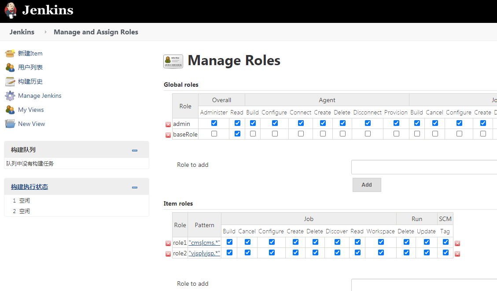

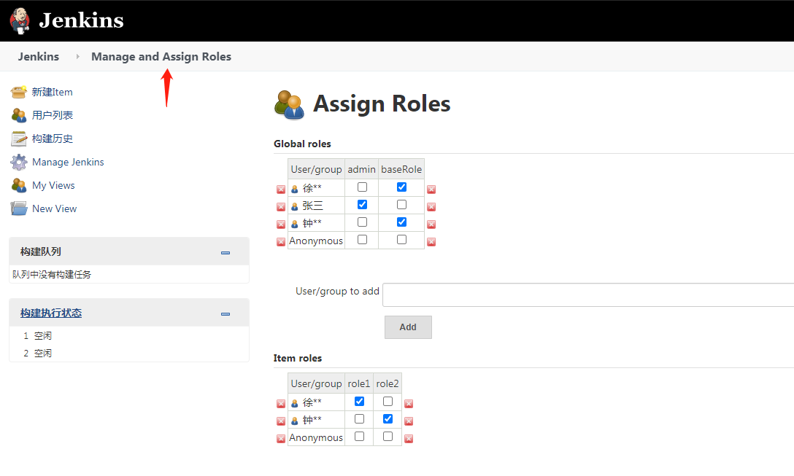


### 1.5 Jenkins凭证管理

#### 1.5.1 安装Credentials Binding插件

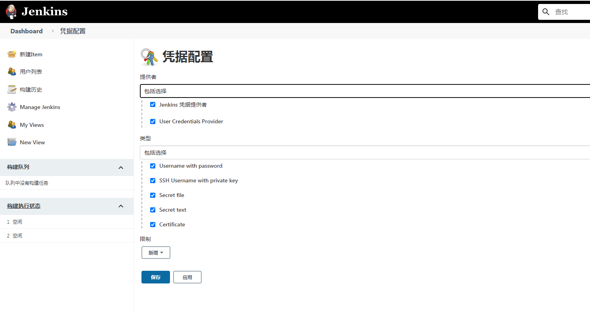

#### 1.5.2 安装Git插件和Git工具

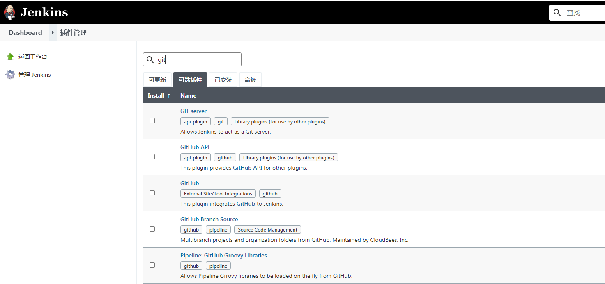

```bash
yum install git -y
```

#### 1.5.3 用户密码类型凭证

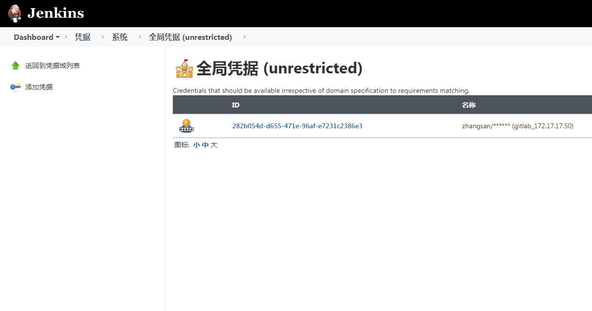


代码的构建目录
> /var/lib/jenkins/workspace

#### 1.5.4 SSH密钥类型凭证

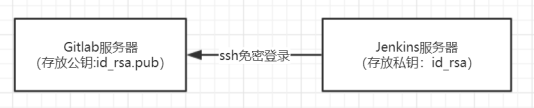

1. gitlab服务器使用root用户生成公钥和私钥在/root/.ssh/目录

> ssh-keygen -t rsa

id_rsa：私钥文件

id_rsa.pub：公钥文件

2. 把生成的公钥放在Gitlab中

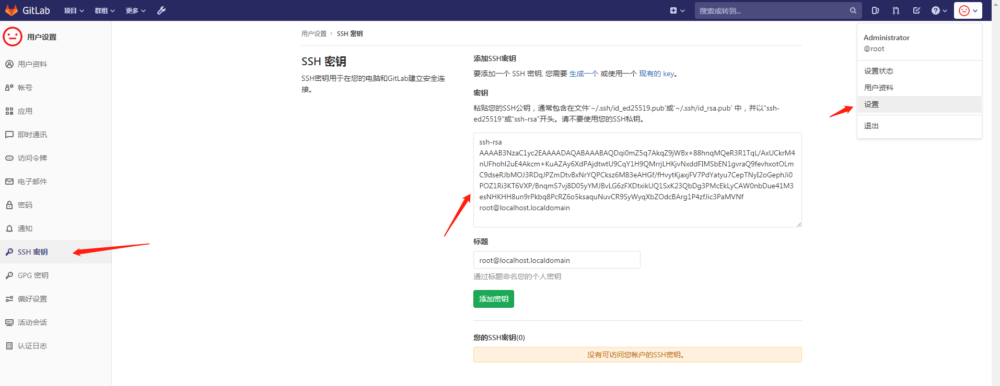

3. 在Jenkins中添加凭证，配置私钥

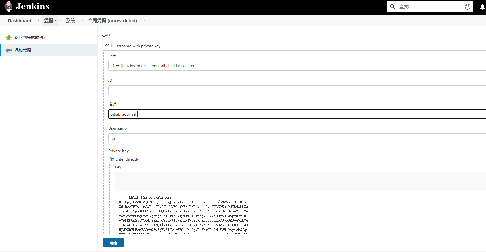

### 1.6 Maven安装和配置

#### 1.6.1 Maven安装

```bash
tar -xzf apache-maven-3.6.2-bin.tar.gz #解压
mkdir -p /opt/maven #创建目录
mv apache-maven-3.6.2/* /opt/maven #移动文件

vi /etc/profile
export JAVA_HOME=/usr/lib/jvm/java-1.8.0-openjdk
export MAVEN_HOME=/opt/maven
export PATH=$PATH:$JAVA_HOME/bin:$MAVEN_HOME/bin

source /etc/profile #配置生效
mvn -v #查找Maven版本
```

#### 1.6.2 全局工具配置关联

JDK配置
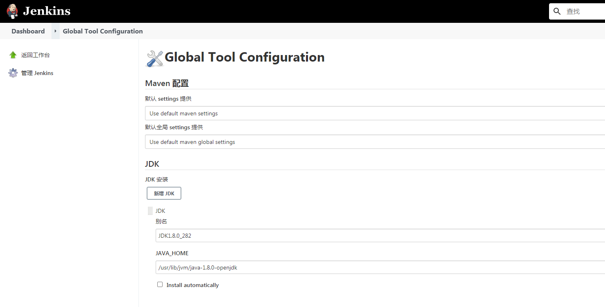

Maven配置
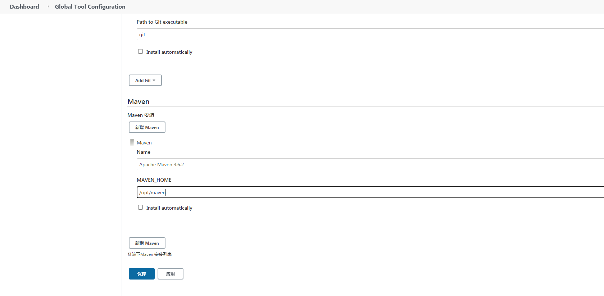

添加Jenkins全局变量
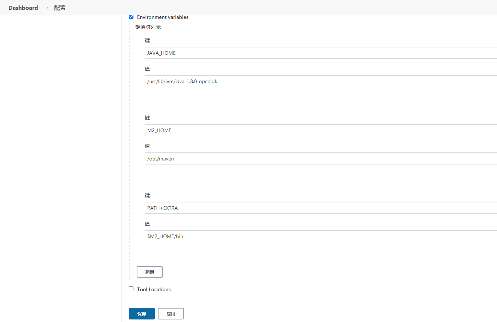

修改Maven的settings.xml

```bash
mkdir /root/repo #仓库目录
vi /opt/maven/conf/settings.xml
```

```xml
<localRepository>/root/repo/</localRepository>

<mirrors>
    <mirror>
            <id>nexus-aliyun</id>
            <mirrorOf>*,!jeecg,!jeecg-snapshots</mirrorOf>
            <name>Nexus aliyun</name>
            <url>http://maven.aliyun.com/nexus/content/groups/public</url>
    </mirror>
</mirrors>
```

测试Maven是否配置成功

> mvn clean package

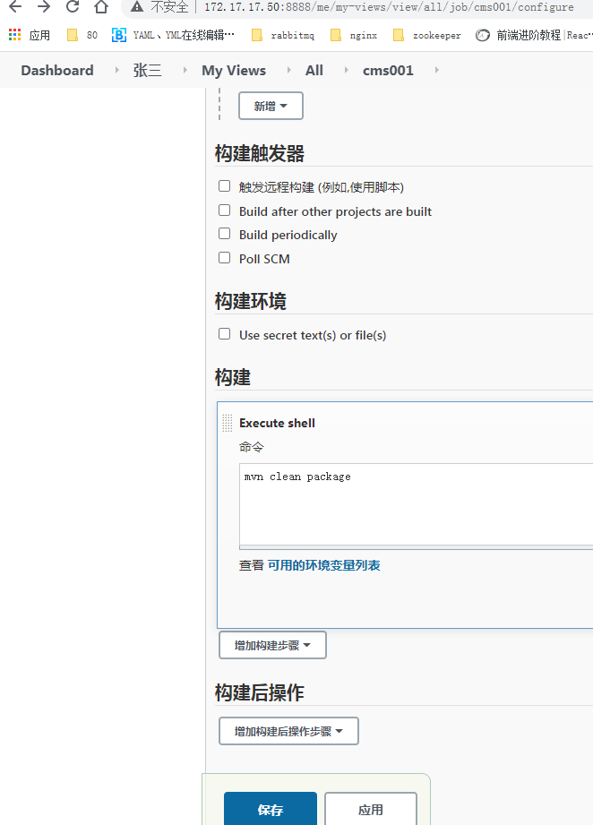

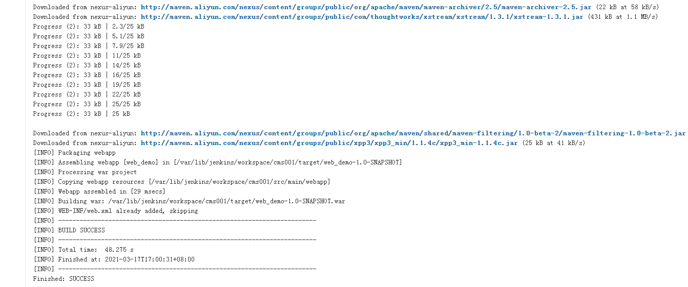


### 1.7 Tomcat安装和配置

#### 1.7.1 安装Tomcat8.5.47

```bash
yum install java-1.8.0-openjdk* -y #安装JDK
tar -xzf apache-tomcat-8.5.47.tar.gz #解压
mkdir -p /opt/tomcat 创建目录
mv /root/apache-tomcat-8.5.47/* /opt/tomcat #移动
/opt/tomcat/bin/startup.sh #启动
```

#### 1.7.2 配置Tomcat用户角色权限

> vi /opt/tomcat/conf/tomcat-users.xml

```xml
<tomcat-users>
    <role rolename="tomcat"/>
    <role rolename="role1"/>
    <role rolename="manager-script"/>
    <role rolename="manager-gui"/>
    <role rolename="manager-status"/>
    <role rolename="admin-gui"/>
    <role rolename="admin-script"/>
    <user username="tomcat" password="tomcat" roles="manager-gui,manager-script,tomcat,admin-gui,admin-script"/>
</tomcat-users>
```

> vi /opt/tomcat/webapps/manager/META-INF/context.xml

掉注释
```xml
<!--
<Valve className="org.apache.catalina.valves.RemoteAddrValve"
allow="127\.\d+\.\d+\.\d+|::1|0:0:0:0:0:0:0:1" />
-->
```

## 2. Jenkins构建Maven项目

### 2.1 自由风格软件项目（FreeStyle Project）

> 拉取代码->编译->打包->部署

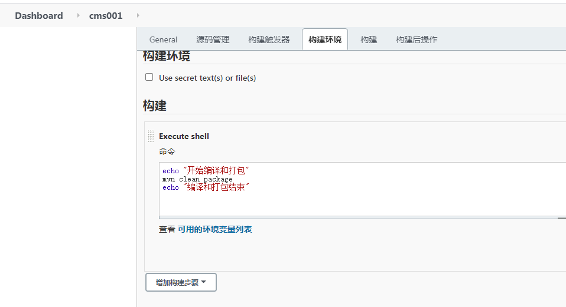

```bash
echo "开始编译和打包"
mvn clean package
echo "编译和打包结束"
```

安装 Deploy to container插件

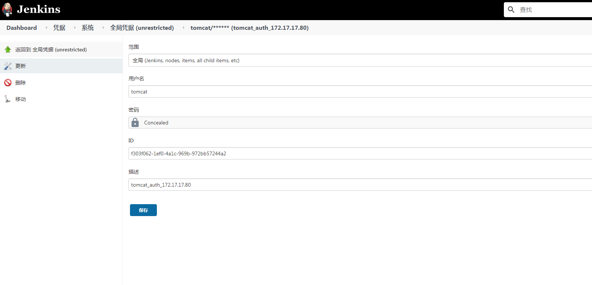

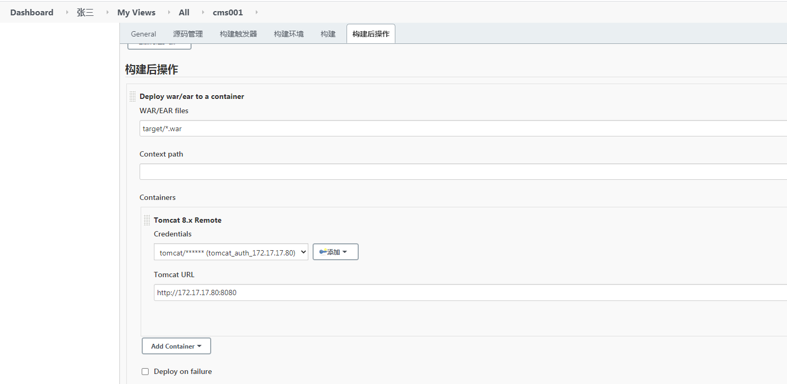

### 2.2 Maven项目（Maven Project）

安装Maven Integration插件

拉取代码和远程部署的过程和自由风格项目一样，只是"构建"部分不同

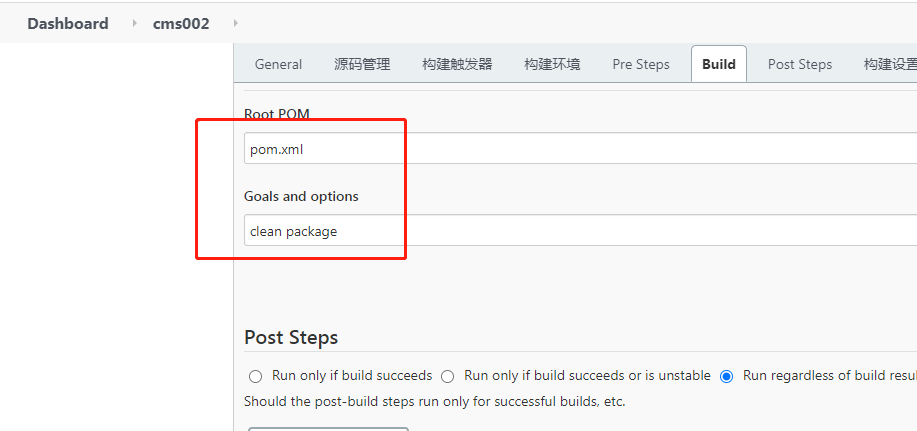


### 2.3 流水线项目（Pipeline Project）

- Pipeline 脚本是由 Groovy 语言实现的
- Pipeline 支持两种语法：Declarative(声明式)和 Scripted Pipeline(脚本式)语法
- Pipeline 也有两种创建方法：可以直接在 Jenkins 的 Web UI 界面中输入脚本；也可以通过创建一个 Jenkinsfile 脚本文件放入项目源码库中（一般我们都推荐在 Jenkins 中直接从源代码控制(SCM)中直接载入 Jenkinsfile Pipeline 这种方法）。

#### 2.3.1 Declarative声明式-Pipeline

安装 Pipeline 插件

> 流水线->选择HelloWorld模板

```shell
pipeline {
   agent any

   stages {
      stage('代码拉取') {
         steps {
            checkout([$class: 'GitSCM', branches: [[name: '*/master']], extensions: [], userRemoteConfigs: [[credentialsId: '282b054d-d655-471e-96af-e7231c2386e3', url: 'git@172.17.17.50:vjsp/web_demo.git']]])
         }
      }
      stage('编译构建') {
         steps {
            sh 'mvn clean package'
         }
      }
      stage('项目部署') {
         steps {
            deploy adapters: [tomcat8(credentialsId: 'f303f062-1ef0-4a1c-969b-972bb57244a2', path: '', url: 'http://172.17.17.80:8080')], contextPath: '/cms003_p01', war: 'target/*.war'
         }
      }
   }
}
```

stages：代表整个流水线的所有执行阶段。通常stages只有1个，里面包含多个stage

stage：代表流水线中的某个阶段，可能出现n个。一般分为拉取代码，编译构建，部署等阶段。

steps：代表一个阶段内需要执行的逻辑。steps里面是shell脚本，git拉取代码，ssh远程发布等任意内容。


#### 2.3.2 Scripted Pipeline脚本式-Pipeline

```shell
node {
    def mvnHome
    stage('拉取代码') { // for display purposes
        echo '拉取代码'
    }
    stage('编译构建') {
        echo '编译构建'
    }
    stage('项目部署') {
        echo '项目部署'
    }
}
```
Node：节点，一个 Node 就是一个 Jenkins 节点，Master 或者 Agent，是执行 Step 的具体运行环境，后续讲到Jenkins的Master-Slave架构的时候用到。

Stage：阶段，一个 Pipeline 可以划分为若干个 Stage，每个 Stage 代表一组操作，比如：Build、Test、Deploy，Stage 是一个逻辑分组的概念。

Step：步骤，Step 是最基本的操作单元，可以是打印一句话，也可以是构建一个 Docker 镜像，由各类 Jenkins 插件提供，比如命令：sh ‘make’，就相当于我们平时 shell 终端中执行 make 命令
一样。


#### 2.3.3 Pipeline Script from SCM

在项目根目录建立Jenkinsfile文件，把内容复制到该文件中并上传到Gitlab

```shell
pipeline {
   agent any

   stages {
      stage('代码拉取') {
         steps {
            checkout([$class: 'GitSCM', branches: [[name: '*/master']], extensions: [], userRemoteConfigs: [[credentialsId: '282b054d-d655-471e-96af-e7231c2386e3', url: 'git@172.17.17.50:vjsp/web_demo.git']]])
         }
      }
	  stage('code checking') {
         steps {
            script {
                 //引入SonarQubeScanner工具
                scannerHome = tool 'sonarqube-scanner'
            }
            //引入SonarQube的服务器环境
            withSonarQubeEnv('sonarqube6.7.4') {
                sh "${scannerHome}/bin/sonar-scanner"
            }
         }
      }  
      stage('编译构建') {
         steps {
            sh 'mvn clean package'
         }
      }
      stage('项目部署') {
         steps {
            deploy adapters: [tomcat8(credentialsId: 'f303f062-1ef0-4a1c-969b-972bb57244a2', path: '', url: 'http://172.17.17.80:8080')], contextPath: '/cms003S', war: 'target/*.war'
         }
      }
   }
   post {
         always {
            emailext(
               subject: '构建通知：${PROJECT_NAME} - Build # ${BUILD_NUMBER} - ${BUILD_STATUS}!',
               body: '${FILE,path="email.html"}',
               to: 'xcg992224@163.com'
            )
         }
   }
}
```

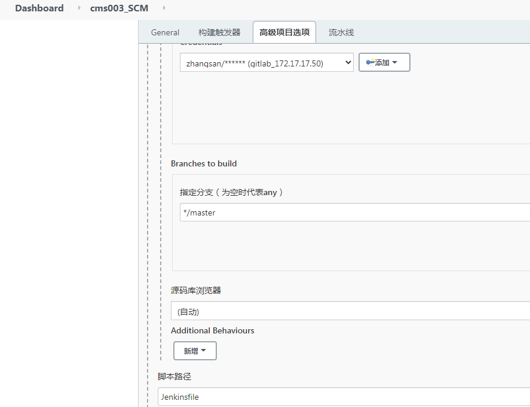


### 2.4 常用的构建触发器

#### 2.4.1 触发远程构建

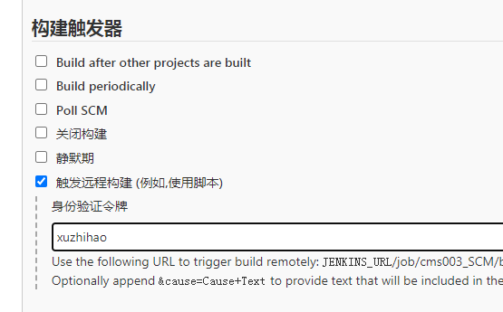

触发构建url：http://172.17.17.50:8888/job/cms003_SCM/build?token=xuzhihao


#### 2.4.2 其他工程构建后触发

#### 2.4.3 定时构建（Build periodically）

#### 2.4.4 轮询SCM（Poll SCM）

#### 2.4.5 Git hook自动触发构建(*)

利用Gitlab的webhook实现代码push到仓库，立即触发项目自动构建

安装插件：Gitlab Hook和GitLab


### 2.5 Jenkins的参数化构建

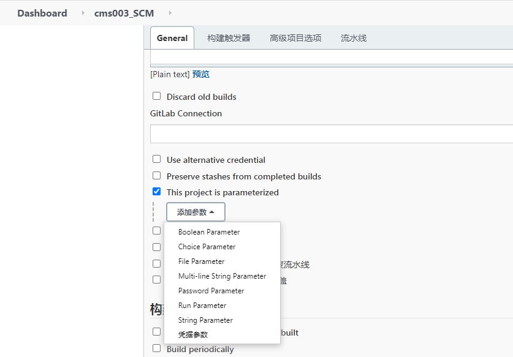

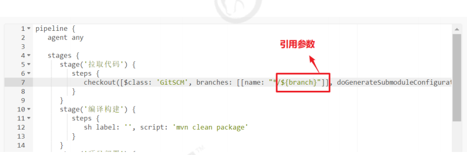

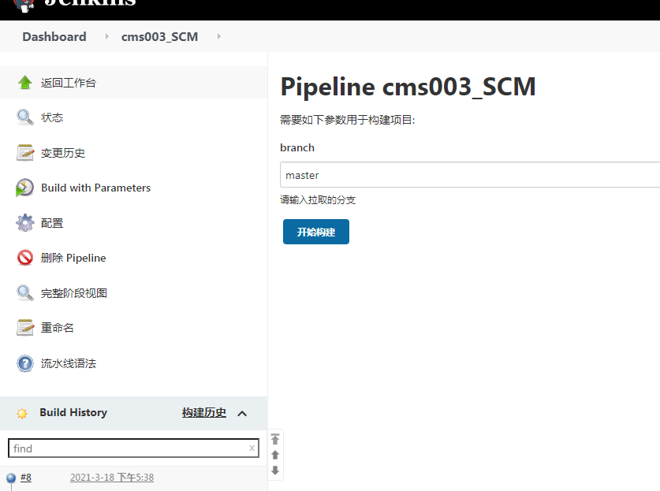


### 2.6 配置邮箱服务器发送构建结果

安装Email Extension Template插件

Jenkins设置邮箱相关参数

> Manage Jenkins->Configure System

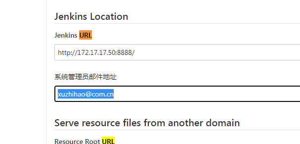

> 邮件相关全局参数参考列表系统设置->Extended E-mail Notification->Content Token Reference，点击旁边的?号

### 2.7 SonarQube代码审查

#### 2.7.1 安装SonarQube

解压sonar，并设置权限

```bash
unzip sonarqube-6.7.4.zip #解压
mkdir /opt/sonar #创建目录
mv sonarqube-6.7.4/* /opt/sonarqube-6.7.4 #移动文件
useradd sonar #创建sonar用户，必须sonar用于启动，否则报错
chown -R sonar. /opt/sonarqube-6.7.4 #更改sonar目录及文件权限
```

修改sonar配置文件

> vi /opt/sonarqube-6.7.4/conf/sonar.properties

```
sonar.jdbc.username=root 
sonar.jdbc.password=root
sonar.jdbc.url=jdbc:mysql://172.17.17.80:3306/sonar?useUnicode=true&characterEncoding=utf8&rewriteBatchedStatements=true&useConfigs=maxPerformance&useSSL=false
```

启动sonar

```bash
cd /opt/sonarqube-6.7.4
su sonar /opt/sonarqube-6.7.4/bin/linux-x86-64/sonar.sh start #启动
su sonar /opt/sonarqube-6.7.4/bin/linux-x86-64/sonar.sh status #查看状态
su sonar /opt/sonarqube-6.7.4/bin/linux-x86-64/sonar.sh stop #停止
tail -f logs/sonar.logs 查看日志
firewall-cmd --zone=public --add-port=9000/tcp --permanent
firewall-cmd --reload

```

默认账户：admin/admin

xuzhihao: 571ca3e519108b01b9c7cbc8f621c34e9edc7d64


#### 2.7.2 代码审查配置

安装SonarQube Scanner插件

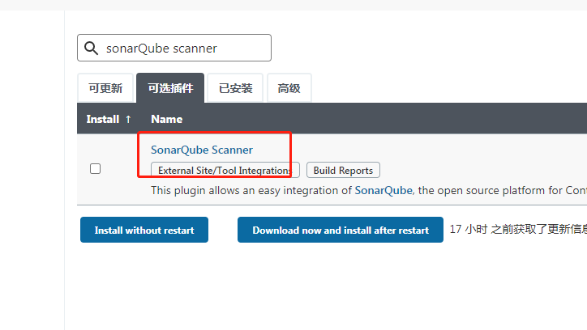

添加SonarQube凭证

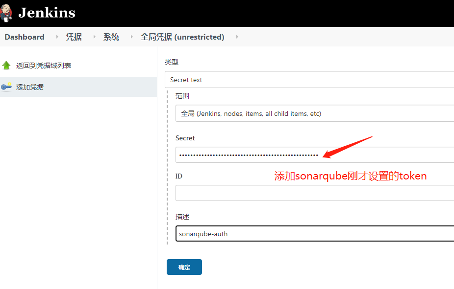

Jenkins进行SonarQube配置

> Manage Jenkins->Configure System->SonarQube servers

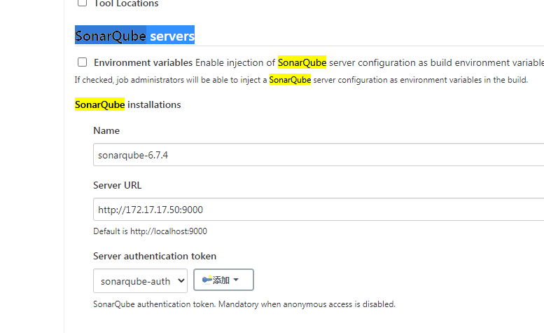

> Manage Jenkins->Global Tool Configuration

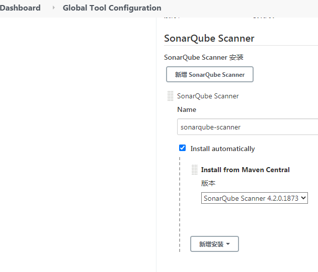

在项目添加SonaQube代码审查（非流水线项目）

```properties
sonar.projectKey=web_demo
sonar.projectName=web_demo
sonar.projectVersion=1.0-SNAPSHOT
sonar.sourceEncoding=UTF-8
sonar.sources=.
sonar.exclusions=**/test/**,**/target/**
sonar.java.source=1.8
sonar.java.target=1.8
sonar.login=admin
sonar.password=admin
sonar.java.binaries=target/classes
```

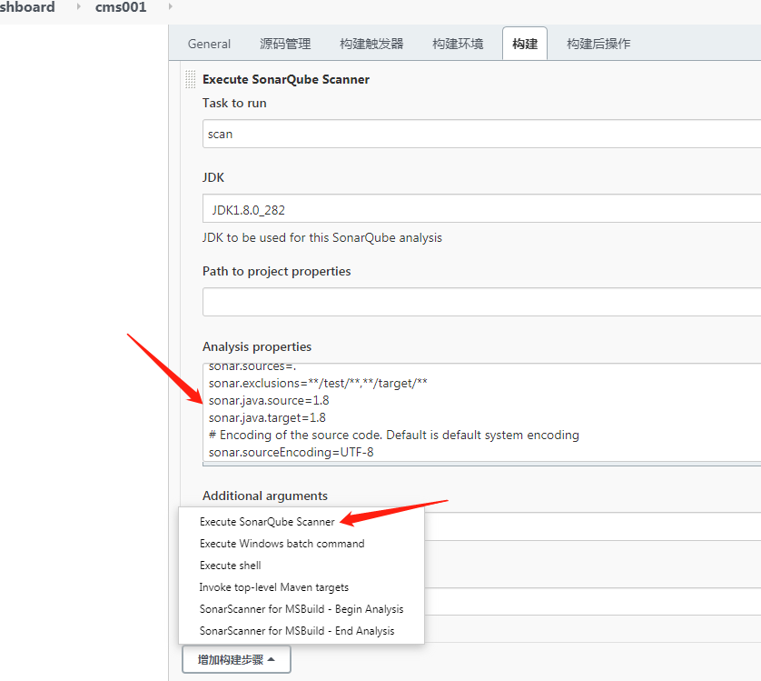

在项目添加SonaQube代码审查（流水线项目）`巨坑`

项目根目录中配置sonar-project.properties

```properties
sonar.projectKey=web_demo
sonar.projectName=web_demo
sonar.projectVersion=1.0-SNAPSHOT


sonar.sources=.
sonar.exclusions=**/test/**,**/target/**

sonar.java.source=1.8
sonar.java.target=1.8

sonar.sourceEncoding=UTF-8
sonar.java.binaries=target/classes

sonar.forceAuthentication=true
sonar.login=令牌令牌令牌令牌令牌令牌令牌令牌令牌令牌令牌令牌令牌令牌令牌令牌令牌令牌令牌令牌
sonar.password=
```

## 3. 微服务持续集成

### 3.1 docker安装

[Docker安装](linux/docker.md)

### 3.2 使用Dockerfile制作微服务镜像

[构建镜像](linux/docker.md?id=_9-dockerfile常见命令)

### 3.3 Harbor镜像仓库安装及使用

#### 3.3.1 Harbor安装

> wget https://github.com/goharbor/harbor/releases/download/v2.0.1/harbor-offline-installer-v2.0.1.tgz

```shell
tar xf harbor-offline-installer-v2.0.1.tgz
mkdir /opt/harbor
mv harbor/* /opt/harbor
cd /opt/harbor
# 复制配置文件
cp harbor.yml.tmpl harbor.yml
# 编辑
vi harbor.yml
```

```yml
#修改配置文件(如果不用https就注释掉https的几项，我是用的http就注释掉了https的，其他几项修改为自己的信息)
···
hostname: 192.168.3.200
···
# http related config
http:
  # port for http, default is 80. If https enabled, this port will redirect to https port
  port: 88
···
# https related config
#https:
  # https port for harbor, default is 443
  #port: 443
  # The path of cert and key files for nginx
  #certificate: /your/certificate/path
  #private_key: /your/private/key/path
····
harbor_admin_password: Harbor12345
···
data_volume: /data
···
```

安装

```shell
./install.sh 
docker-compose up -d #启动
docker-compose stop #停止
docker-compose restart #重新启动
```

默认账户密码：admin/Harbor12345

#### 3.3.2 在Harbor创建用户和项目

#### 3.3.3 把镜像上传到Harbor

```bash
docker tag eureka:v0.0.1 192.168.3.200:88/test/eureka:v0.0.1

docker push 192.168.3.200:88/test/eureka:v0.0.1

vi /etc/docker/daemon.json

{
"registry-mirrors": ["xxx.xxx.xxx.xxx"],
"insecure-registries": ["192.168.3.200:88"]
}

sudo systemctl daemon-reload
sudo systemctl restart docker 


docker login -u 用户名 -p 密码 192.168.3.200:88

```


#### 3.3.2 从Harbor下载镜像

```bash
vi /etc/docker/daemon.json

{
"registry-mirrors": ["xxx.xxx.xxx.xxx"],
"insecure-registries": ["192.168.3.200:88"]
}

docker login -u 用户名 -p 密码 192.168.3.200:88

docker pull 192.168.3.200:88/test/eureka:v0.0.1

```


### 3.4 拉取镜像发布应用

#### 3.4.1 安装 Publish Over SSH 插件

拷贝公钥到远程服务器

> ssh-copy-id 192.168.66.103

系统配置->添加远程服务器

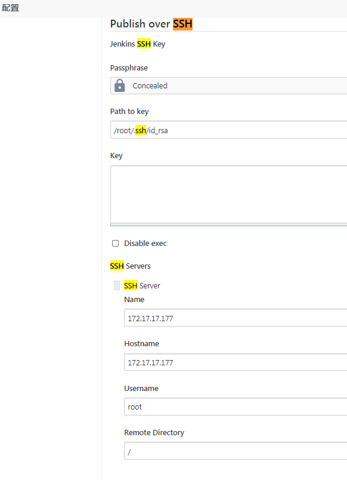


#### 3.4.2 Jenkinsfile构建脚本

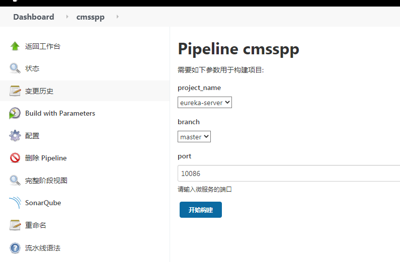

```
//git凭证ID
def git_auth = "282b054d-d655-471e-96af-e7231c2386e3"
//git的url地址
def git_url = "git@172.17.17.50:zhangsan/springcloud-platform.git"
//构建版本的名称
def tag = "latest"
//Harbor私服地址
def harbor_url = "172.17.17.80:88"
//Harbor的项目名称
def harbor_project_name = "test"
//Harbor的凭证
def harbor_auth = "17c792fd-30fc-4320-aebe-7646cfa09008"
//远程发布服务器名称
def sshPublisherName="172.17.17.177"

node {
   //获取当前选择的项目名称
   def selectedProjectNames = "${project_name}".split(",")
   
   //获取当前选择的服务器名称
   //def selectedServers = "${publish_server}".split(",")

   stage('拉取代码') {
      checkout([$class: 'GitSCM', branches: [[name: "*/${branch}"]], doGenerateSubmoduleConfigurations: false, extensions: [], submoduleCfg: [], userRemoteConfigs: [[credentialsId: "${git_auth}", url: "${git_url}"]]])
   }   
  
   stage('代码审查') {
		def scannerHome = tool 'sonarqube-scanner'
		withSonarQubeEnv('sonarqube6.7.4') {
			sh """
				cd ${project_name}
				${scannerHome}/bin/sonar-scanner
			"""
		}
	}
	
	stage('编译，构建镜像') {
		//定义镜像名称
		def imageName = "${project_name}:${tag}"
		
		//编译，安装公共工程
		//sh "mvn -f tensquare_common clean install"
		
		//编译，构建本地镜像
		sh "mvn -f ${project_name} clean package dockerfile:build"
		
		//给镜像打标签
		sh "docker tag ${imageName} ${harbor_url}/${harbor_project_name}/${imageName}"
		
		//登录Harbor，并上传镜像
		withCredentials([usernamePassword(credentialsId: "${harbor_auth}", passwordVariable: 'password', usernameVariable: 'username')]) {
			   //登录到Harbor
               sh "docker login -u ${username} -p ${password} ${harbor_url}"
               //镜像上传
               sh "docker push ${harbor_url}/${harbor_project_name}/${imageName}"
		}
		
		//删除本地镜像
		sh "docker rmi -f ${imageName}"
		sh "docker rmi -f ${harbor_url}/${harbor_project_name}/${imageName}"		
	}
	
	stage('远程发布') {
		sshPublisher(publishers: [sshPublisherDesc(configName: "${sshPublisherName}",transfers: [sshTransfer(cleanRemote: false, excludes: '', execCommand:"/opt/jenkins_shell/deploy.sh $harbor_url $harbor_project_name $project_name $tag $port", execTimeout: 120000, flatten: false, makeEmptyDirs: false,noDefaultExcludes: false, patternSeparator: '[, ]+', remoteDirectory: '',remoteDirectorySDF: false, removePrefix: '', sourceFiles: '')],usePromotionTimestamp: false, useWorkspaceInPromotion: false, verbose: false)])
	}
}
```

#### 3.4.3 编写deploy.sh部署脚本

上传deploy.sh文件到/opt/jenkins_shell目录下，且文件至少有执行权限！

> chmod +x deploy.sh

```sh
#! /bin/sh
#接收外部参数
harbor_url=$1
harbor_project_name=$2
project_name=$3
tag=$4
port=$5

imageName=$harbor_url/$harbor_project_name/$project_name:$tag

echo "$imageName"

#查询容器是否存在，存在则删除
containerId=`docker ps -a | grep -w ${project_name}:${tag}  | awk '{print $1}'`
if [ "$containerId" !=  "" ] ; then
    #停掉容器
    docker stop $containerId

    #删除容器
    docker rm $containerId
	
	echo "成功删除容器"
fi

#查询镜像是否存在，存在则删除
imageId=`docker images | grep -w $project_name  | awk '{print $3}'`

if [ "$imageId" !=  "" ] ; then
      
    #删除镜像
    docker rmi -f $imageId
	
	echo "成功删除镜像"
fi

# 登录Harbor
docker login -u username -p password $harbor_url

# 下载镜像
docker pull $imageName

# 启动容器
docker run -di -p $port:$port $imageName

echo "容器启动成功"

```


### 3.5 前端静态web网站

#### 3.5.1 安装Nginx服务器

[Nginx安装](deploy/nginx.md)

#### 3.5.2 安装NodeJS插件

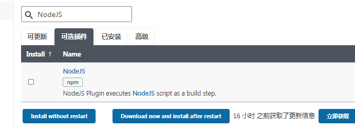

Manage Jenkins->Global Tool Configuration

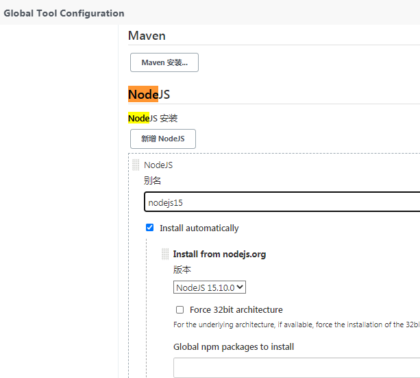


```
//gitlab的凭证
def git_auth = "282b054d-d655-471e-96af-e7231c2386e3"
//git的url地址
def git_url = "git@172.17.17.50:zhangsan/web.git"

node {
   stage('拉取代码') {
      checkout([$class: 'GitSCM', branches: [[name: '*/${branch}']],doGenerateSubmoduleConfigurations: false, extensions: [], submoduleCfg: [],
      userRemoteConfigs: [[credentialsId: "${git_auth}", url:"${git_url}"]]])
   }
   stage('打包，部署网站') {
      nodejs('nodejs12'){
         sh '''
            npm install
            npm run build
         '''
      }
      //=====以下为远程调用进行项目部署========
      sshPublisher(publishers: [sshPublisherDesc(configName: 'master_server',transfers: [sshTransfer(cleanRemote: false, excludes: '', execCommand: '',
      execTimeout: 120000, flatten: false, makeEmptyDirs: false, noDefaultExcludes:false, patternSeparator: '[, ]+', remoteDirectory: '/usr/share/nginx/html',
      remoteDirectorySDF: false, removePrefix: 'dist', sourceFiles: 'dist/**')],usePromotionTimestamp: false, useWorkspaceInPromotion: false, verbose: false)])
   }
}
```

## 4. 微服务持续集成优化

上面部署方案存在的问题：

1. 一次只能选择一个微服务部署
2. 只有一台生产者部署服务器
3. 每个微服务只有一个实例，容错率低

优化方案：

1. 在一个Jenkins工程中可以选择多个微服务同时发布
2. 在一个Jenkins工程中可以选择多台生产服务器同时部署
3. 每个微服务都是以集群高可用形式部署


Extended Choice Parameter插件安装

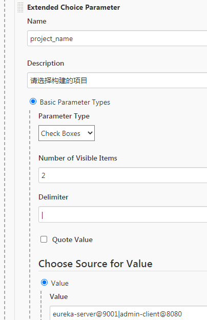

```
//git凭证ID
def git_auth = "282b054d-d655-471e-96af-e7231c2386e3"
//git的url地址
def git_url = "git@172.17.17.50:zhangsan/springcloud-platform-all.git"
//构建版本的名称
def tag = "latest"
//Harbor私服地址
def harbor_url = "172.17.17.80:88"
//Harbor的项目名称
def harbor_project = "test-all"
//Harbor的凭证
def harbor_auth = "17c792fd-30fc-4320-aebe-7646cfa09008"
//远程发布服务器名称
def sshPublisherName="172.17.17.177"

node {
   //获取当前选择的项目名称
   def selectedProjectNames = "${project_name}".split(",")
   
   //获取当前选择的服务器名称
   //def selectedServers = "${publish_server}".split(",")

   stage('拉取代码') {
      checkout([$class: 'GitSCM', branches: [[name: "*/${branch}"]], doGenerateSubmoduleConfigurations: false, extensions: [], submoduleCfg: [], userRemoteConfigs: [[credentialsId: "${git_auth}", url: "${git_url}"]]])
	}   
  
   stage('代码审查') {
		for(int i=0;i<selectedProjectNames.length;i++){
		
            //eureka_server@9001
            def projectInfo = selectedProjectNames[i];
            //当前遍历的项目名称
            def currentProjectName = "${projectInfo}".split("@")[0]
            //当前遍历的项目端口
            def currentProjectPort = "${projectInfo}".split("@")[1]

            def scannerHome = tool 'sonarqube-scanner'
            withSonarQubeEnv('sonarqube6.7.4') {
                 sh """
                         cd ${currentProjectName}
                         ${scannerHome}/bin/sonar-scanner
                 """
            }
        }
    }
	
	stage('编译，安装公共子工程') {
      //sh "mvn -f shop_common clean install"
    }
	
	stage('编译，打包微服务工程，上传镜像') {
       for(int i=0;i<selectedProjectNames.length;i++){
	   
			 //eureka_server@9001
			 def projectInfo = selectedProjectNames[i];
			 //当前遍历的项目名称
			 def currentProjectName = "${projectInfo}".split("@")[0]
			 //当前遍历的项目端口
			 def currentProjectPort = "${projectInfo}".split("@")[1]

			 sh "mvn -f ${currentProjectName} clean package dockerfile:build"

			 //定义镜像名称
			 def imageName = "${currentProjectName}:${tag}"
			 //对镜像打上标签
			 sh "docker tag ${imageName} ${harbor_url}/${harbor_project}/${imageName}"

			//把镜像推送到Harbor
			withCredentials([usernamePassword(credentialsId: "${harbor_auth}", passwordVariable: 'password', usernameVariable: 'username')]) {
				//登录到Harbor
				sh "docker login -u ${username} -p ${password} ${harbor_url}"
				//镜像上传
				sh "docker push ${harbor_url}/${harbor_project}/${imageName}"

			}
			
			//删除本地镜像
			sh "docker rmi -f ${imageName}"
			sh "docker rmi -f ${harbor_url}/${harbor_project}/${imageName}"	
			
			//遍历所有服务器，分别部署
			for(int j=0;j<selectedServers.length;j++){
				   //获取当前遍历的服务器名称
				def currentServerName = selectedServers[j]

				//加上的参数格式：--spring.profiles.active=eureka-server1/eureka-server2
				
				def activeProfile = "--spring.profiles.active="

				//根据不同的服务名称来读取不同的Eureka配置信息
				if(currentServerName=="master_server"){
				  activeProfile = activeProfile+"eureka-server1"
				}else if(currentServerName=="slave_server"){
				  activeProfile = activeProfile+"eureka-server2"
				}

				//部署应用
				//sshPublisher(publishers: [sshPublisherDesc(configName: "${currentServerName}", transfers: [sshTransfer(cleanRemote: false, excludes: '', execCommand: "/opt/jenkins_shell/deployCluster.sh $harbor_url //$harbor_project $currentProjectName $tag $currentProjectPort $activeProfile", execTimeout: 120000, flatten: false, makeEmptyDirs: false, noDefaultExcludes: false, patternSeparator: '[, ]+', //remoteDirectory: '', remoteDirectorySDF: false, removePrefix: '', sourceFiles: '')], usePromotionTimestamp: false, useWorkspaceInPromotion: false, verbose: false)])			
			}
        }
   }
}
```

deployCluster.sh部署脚本

```
#! /bin/sh
#接收外部参数
harbor_url=$1
harbor_project_name=$2
project_name=$3
tag=$4
port=$5
profile=$6

imageName=$harbor_url/$harbor_project_name/$project_name:$tag

echo "$imageName"

#查询容器是否存在，存在则删除
containerId=`docker ps -a | grep -w ${project_name}:${tag}  | awk '{print $1}'`

if [ "$containerId" !=  "" ] ; then
    #停掉容器
    docker stop $containerId

    #删除容器
    docker rm $containerId
	
	echo "成功删除容器"
fi

#查询镜像是否存在，存在则删除
imageId=`docker images | grep -w $project_name  | awk '{print $3}'`

if [ "$imageId" !=  "" ] ; then
      
    #删除镜像
    docker rmi -f $imageId
	
	echo "成功删除镜像"
fi


# 登录Harbor
docker login -u usernmae -p password $harbor_url

# 下载镜像
docker pull $imageName

# 启动容器
docker run -di -p $port:$port $imageName $profile

echo "容器启动成功"
```

## 5. 基于Kubernetes/K8S构建Jenkins持续集成

### 5.1 实现Master-Slave分布式构建

开启代理程序的TCP端口

> Manage Jenkins -> Configure Global Security

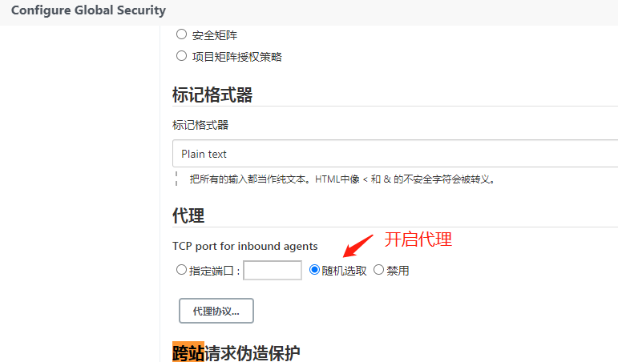

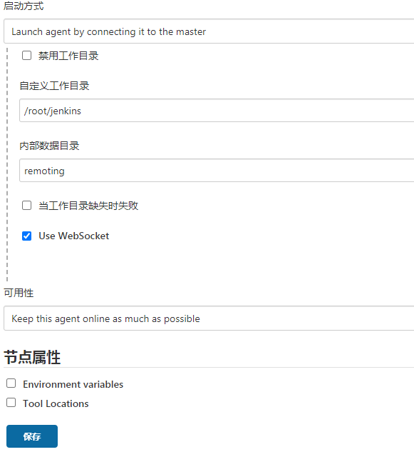

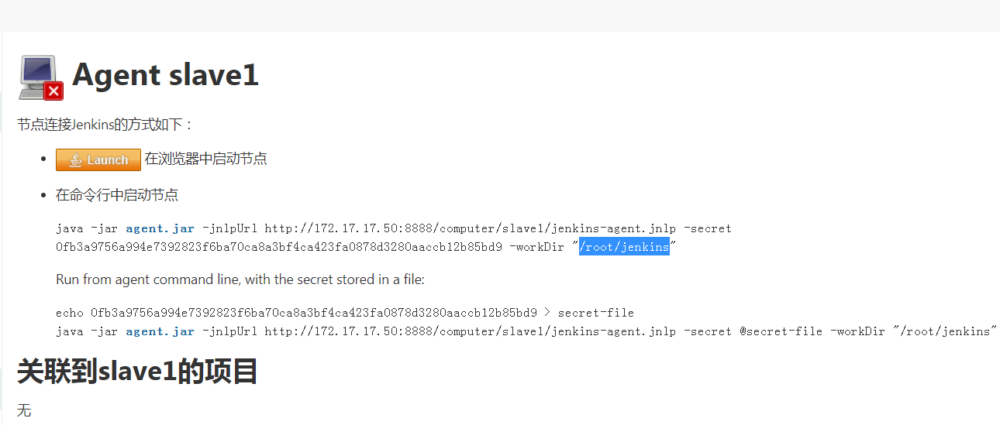

安装和配置节点选择第2种

自由风格和Maven风格的项目：

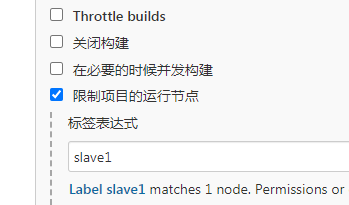

流水线风格的项目：

```
node('slave1') {
   stage('check out') {
   }
}
```

传统Jenkins的Master-Slave方案的缺陷

1. Master节点发生单点故障时，整个流程都不可用了
2. 每个 Slave节点的配置环境不一样，来完成不同语言的编译打包等操作，但是这些差异化的配置导致管理起来非常不方便，维护起来也是比较费劲
3. 资源分配不均衡，有的Slave节点要运行的job出现排队等待，而有的Slave节点处于空闲状态
4. 资源浪费，每台Slave节点可能是实体机或者VM，当Slave节点处于空闲状态时，也不会完全释放掉资源

### 5.2 Kubernates+Docker+Jenkins持续集成架

大致工作流程：手动/自动构建 -> Jenkins 调度 K8S API -> 动态生成 Jenkins Slave pod -> Slave pod拉取 Git 代码／编译／打包镜像 -> 推送到镜像仓库 Harbor -> Slave 工作完成，Pod 自动销毁 -> 部署到测试或生产 Kubernetes平台。（完全自动化，无需人工干预）


Kubernates+Docker+Jenkins持续集成方案好处

1. 服务高可用：当 Jenkins Master 出现故障时，Kubernetes会自动创建一个新的Jenkins Master容器，并且将Volume分配给新创建的容器，保证数据不丢失，从而达到集群服务高可用。
2. 动态伸缩，合理使用资源：每次运行Jo 时，会自动创建一个Jenkins Slave，Job完成后，Slave自动注销并删除容器，资源自动释放，而且Kubernetes会根据每个资源的使用情况，动态分配
Slave到空闲的节点上创建，降低出现因某节点资源利用率高，还排队等待在该节点的情况。
3. 扩展性好：当Kubernetes集群的资源严重不足而导致Job排队等待时，可以很容易的添加一个Kubernetes Node到集群中，从而实现扩展。

### 5.3 Kubernates安装

| 主机名称| IP地址 | 安装的软件 |
| ----- | ----- | ----- |
| k8s-master| 192.168.3.200 | kube-apiserver、kube-controller-manager、kubescheduler、docker、etcd、calico，NFS |
| k8s-node1 | 192.168.3.201 | kubelet、kubeproxy、Docker18.06.1-ce |
| k8s-node2 | 192.168.3.202 | kubelet、kubeproxy、Docker18.06.1-ce |

修改三台机器的hostname及hosts文件
```bash
cat >> /etc/hosts  <<EOF
192.168.3.200 k8s-master 
192.168.3.201 k8s-node1 
192.168.3.202 k8s-node2
EOF
```

关闭防火墙和关闭SELinux
```bash
systemctl stop firewalld
systemctl disable firewalld
setenforce 0
sed -i 's/SELINUX=.*/SELINUX=disabled/' /etc/selinux/config 
```

设置系统参数
```bash
vi /etc/sysctl.d/k8s.conf
net.bridge.bridge-nf-call-ip6tables = 1 
net.bridge.bridge-nf-call-iptables = 1
net.ipv4.ip_forward = 1 vm.swappiness = 0
sysctl -p /etc/sysctl.d/k8s.conf
```

kube-proxy开启ipvs的前置条件
```
cat > /etc/sysconfig/modules/ipvs.modules <<EOF
#!/bin/bash
modprobe -- ip_vs
modprobe -- ip_vs_rr
modprobe -- ip_vs_wrr
modprobe -- ip_vs_sh
modprobe -- nf_conntrack_ipv4
EOF
chmod 755 /etc/sysconfig/modules/ipvs.modules && bash /etc/sysconfig/modules/ipvs.modules && lsmod | grep -e ip_vs -e nf_conntrack_ipv4
```

所有节点关闭swap

```bash
swapoff -a 临时关闭
vi /etc/fstab 永久关闭
#注释掉以下字段
/dev/mapper/cl-swap swap swap defaults 0 0
```

主节点安装kubelet、kubeadm、kubectl
```bash
yum clean all

cat > /etc/yum.repos.d/kubernetes.repo <<EOF
[kubernetes]
name=Kubernetes
baseurl=https://mirrors.aliyun.com/kubernetes/yum/repos/kubernetes-el7-x86_64/
enabled=1
gpgcheck=0
repo_gpgcheck=0
gpgkey=https://mirrors.aliyun.com/kubernetes/yum/doc/yum-key.gpg
https://mirrors.aliyun.com/kubernetes/yum/doc/rpm-package-key.gpg
EOF

yum install -y kubelet kubeadm kubectl

#kubelet设置开机启动（注意：先不启动，现在启动的话会报错）
systemctl enable kubelet

kubelet --version

```

Master节点需要完成
```bash
kubeadm init --kubernetes-version=v1.20 --apiserver-advertise-address=172.17.17.50 --image-repository registry.aliyuncs.com/google_containers --service-cidr=10.1.0.0/16 --pod-network-cidr=10.244.0.0/16 
```

节点安装的命令

kubeadm join 172.17.17.50:6443 --token yyhwxt.5qkinumtww4dwsv5 \
    --discovery-token-ca-cert-hash sha256:2a9c49ccc37bf4f584e7bae440bbcf0a64eadaf6f662df01025a218122cd2e26

启动kubelet
```bash
systemctl restart kubelet
```

配置kubectl工具
```bash
mkdir -p $HOME/.kube
sudo cp -i /etc/kubernetes/admin.conf $HOME/.kube/config
sudo chown $(id -u):$(id -g) $HOME/.kube/config
```

安装Calico
```bash
mkdir k8s
cd k8s
kubectl apply -f https://docs.projectcalico.org/v3.18/manifests/calico.yaml
kubectl get pod --all-namespaces -o wide
```

Slave节点需要完成

在master节点上执行kubeadm token create --print-join-command重新生成加入命令
