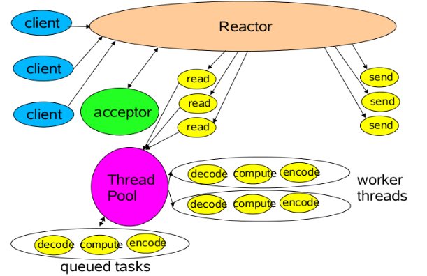
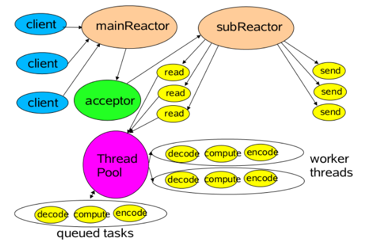

# NETTY原理和源码

## 1. 概念体系

- 设计 
 - 统一的 API，支持多种传输类型，阻塞的和非阻塞的
 - 简单而强大的线程模型
 - 真正的无连接数据报套接字支持
 - 链接逻辑组件以支持复用
- 易于使用 
 - 详实的Javadoc和大量的示例集
 - 不需要超过JDK 1.6+③的依赖。（一些可选的特性可能需要Java 1.7+和/或额外的依赖）
- 性能 
 - 拥有比 Java 的核心 API 更高的吞吐量以及更低的延迟
 - 得益于池化和复用，拥有更低的资源消耗
 - 最少的内存复制
- 健壮性 
 - 不会因为慢速、快速或者超载的连接而导致 OutOfMemoryError
 - 消除在高速网络中 NIO 应用程序常见的不公平读/写比率
- 安全性 
 - 完整的 SSL/TLS 以及 StartTLS 支持
 - 可用于受限环境下，如 Applet 和 OSGI
- 社区驱动 
 - 发布快速而且频繁
  
总结：通过实现 FTP、SMTP、HTTP 和 WebSocket 以及其他的基于二进制和基于文本的协议，Netty 扩展了它的应用范围及灵活性

**Netty 所提供的传输**

|名称|包|描述|
| -------------------- | ------------------- | ------------------------------------------------------------ |
| NIO | io.netty.channel.socket.nio | 使用java.nio.channels包作为基础——基于选择器的方式 |
| Epoll | io.netty.channel.epoll | 由JNI驱动的epoll()和非阻塞IO。这个传输支持只有在Linux上可用的多种特性，如SO_REUSEPORT，比NIO传输更快，而且是完全非阻塞的 |
| OIO | io.netty.channel.socket.oio | 使用java.net包作为基础——使用阻塞流 |
| Local | io.netty.channel.local | 可以在VM内部通过管道进行通信的本地传输 |
| Embedded | io.netty.channel.embedded | Embedded传输，允许使用ChannelHandler而又不需要一个真正的基于网络的传输。这在测试你的ChannelHandler实现时非常有用 |

**Netty 支持传输的网络协议**

| 传输 | TCP | UDP | SCTP | UDT |
| ---------- | ---------- | ---------- | ---------- | ---------- |
| NIO | √ | √ | √ | √ |
| Epoll(Linux) | √ | √ | - | - |
| OIO | √ | √ | √ | √ |

>SCTP (Stream Control Transmission Protocol)是一种传输协议，在TCP/IP协议栈中所处的位置和TCP、UDP类似，兼有TCP/UDP两者特征
>1. TCP是以字节为单位传输的，SCTP是以数据块为单位传输的
>2. TCP通常是单路径传输，SCTP可以多路径传输
>3. TCP是单流有序传输，SCTP可以多流独立有序/无序传输
>4. TCP连接的建立过程需要三步握手，SCTP连接的建立过程需要四步握手
>5. SCTP有heartbeat机制来管理路径的可用性

>UDT的特性包括在以下几个方面
>1. 基于UDP的应用层协议
>2. 面向连接的可靠协议
>3. 双工的协议
>4. 拥有新的拥塞控制算法，并具有可拓展的拥塞控制框架。

>此外UDT协议在高BDP网络相对于TCP协议的优势，可以用下面几点来表示： 
>1. UDT是基于UDP协议，并且是定时器做的发送，不像tcp需要等待ack后才能开始下一轮发送
>2. UDT的拥塞控制算法，能够实现在慢启动阶段快速增长抢占带宽，而在接近饱和时逐渐降低增长速度，使它趋于稳定。
>3. UDT对包丢失的处理算法，和对噪声链路的容忍性，使得在网络波动比较大的环境中，它比传统的TCP协议更加的稳定。

## 2. Netty中的三种Reactor（反应堆）

1.Reactor单线程模型,指的是所有的I/O操作都在同一个NIO线程上面完成，NIO线程的职责如下:
- 作为NIO服务端，接收客户端的TCP连接
- 作为NIO客户端，向服务端发起TCP连接
- 读取通信对端的请求或者应答消息
- 向通信对端发送消息请求或者应答消息

总结：对于一些小容量应用场景，可以使用单线程模型，但是对于高负载、大并发的应用却不合适，主要原因如下：

- 一个NIO线程同时处理成百上千的链路，性能上无法支撑。即便NIO线程的CPU负荷达到100%，也无法满足海量消息的编码、解码、读取和发送
- 当NIO线程负载过重之后，处理速度将变慢，这会导致大量客户端连接超时，超时之后往往进行重发，这更加重了NIO线程的负载，最终导致大量消息积压和处理超时，NIO线程会成为系统的性能瓶颈
- 可靠性问题。一旦NIO线程意外跑飞，或者进入死循环，会导致整个系统通讯模块不可用，不能接收和处理外部信息，造成节点故障。
为了解决这些问题，演进出了Reactor多线程模型，下面我们一起学习下Reactor多线程模型

2.Reactor多线程模型与单线程模型最大区别就是有一组NIO线程处理I/O操作，它的特点如下:
- 有一个专门的NIO线程--acceptor新城用于监听服务端，接收客户端的TCP连接请求；
- 网络I/O操作--读、写等由一个NIO线程池负责，线程池可以采用标准的JDK线程池实现，它包含一个任务队列和N个可用的线程，由这些NIO线程负责消息的读取、解码、编码和发送
- 1个NIO线程可以同时处理N条链路，但是1个链路只对应1个NIO线程，防止发生并发操作问题

总结：在绝大多数场景下，Reactor多线程模型都可以满足性能需求；但是，在极特殊应用场景中，一个NIO线程负责监听和处理所有的客户端连接可能会存在性能问题。例如百万客户端并发连接，或者服务端需要对客户端的握手信息进行安全认证，认证本身非常损耗性能。这类场景下，单独一个Acceptor线程可能会存在性能不足问题，为了解决性能问题，产生了第三种Reactor线程模型--主从Reactor多线程模型

3.主从Reactor多线程模型

特点是：服务端用于接收客户端连接的不再是1个单独的NIO线程，而是一个独立的NIO线程池。Acceptor接收到客户端TCP连接请求处理完成后（可能包含接入认证等），将新创建的SocketChannel注册到I/O线程池（sub reactor线程池）的某个I/O线程上，由它负责SocketChannel的读写和编解码工作

## 3. Netty大数据量的传输，压缩，解压缩

## 4. 复合缓冲和其他缓冲的原理和使用场景

## 5. Netty的http支持，实现tomcat容器，对socket实现

EventLoopGroup实现了Cloneable，在一个已经配置完成的引导类实例上调用clone()方法将返回另一个可以立即使用的引导类实例

这种方式只会创建引导类实例的EventLoopGroup的一个浅拷贝，因为通常这些克隆的Channel的生命周期都很短暂，一个典型的场景是——创建一个Channel以进行一次HTTP请求

## 6. Netty和RPC原理分析，Netty和websocket原理分析

## 7. RPC框架使用和原理分析

RPC是一种技术思想不是具体实现，就像调用本地方法一样调用远程方法，核心是通讯和序列化

1. RPC按通信协议，可以分为基于HTTP的、基于TCP等；
2. 按报文协议可以分为基于XML文本的、基于JSON文本的，二进制的。
3. 按照是否跨平台语言，可以分为平台专用的，平台中立的

WebService一般属于基于HTTP的、XML文本的、跨平台（平台中立）的，功能完善、体系成熟、支持事务、支持安全机制，广泛应用在金融电信（中国电信一个省级分公司就有几千个WS），传统企业的业务系统，ESB/SOA体系等。缺点：过于复杂，性能不是最优的，互联网用的较少

## 8. Netty的Scattering和Gathering的原理分析

## 9. NIO的零copy如何实现的、NIO的buffer和channel的应用和原理

**Channel的生命周期**
- ChannelUnregistered Channel 已经被创建，但还未注册到 EventLoop
- ChannelRegistered Channel 已经被注册到了 EventLoop
- ChannelActive Channel 处于活动状态（已经连接到它的远程节点）。它现在可以接收和发送数据了
- ChannelInactive Channel 没有连接到远程节点

**ChannelHandler的生命周期**
- handlerAdded 当把 ChannelHandler 添加到 ChannelPipeline 中时被调用
- handlerRemoved 当从 ChannelPipeline 中移除 ChannelHandler 时被调用
- exceptionCaught 当处理过程中在 ChannelPipeline 中有错误产生时被调用

**Netty 定义了下面两个重要的 ChannelHandler 子接口：**
- ChannelInboundHandler——处理入站数据以及各种状态变化；
  - channelRegistered 当 Channel 已经注册到它的 EventLoop 并且能够处理 I/O 时被调用
  - channelUnregistered 当 Channel 从它的 EventLoop 注销并且无法处理任何 I/O 时被调用 
  - channelActive 当 Channel 处于活动状态时被调用；Channel 已经连接/绑定并且已经就绪
  - channelInactive 当 Channel 离开活动状态并且不再连接它的远程节点时被调用
  - channelReadComplete 当Channel上的一个读操作完成时被调用
  - channelRead 当从 Channel 读取数据时被调用
  - channelWritabilityChanged 当 Channel 的可写状态发生改变时被调用。用户可以确保写操作不会完成得太快（以避免发生 OutOfMemoryError）或者可以在 Channel 变为再次可写时恢复写入。可以通过调用 Channel 的 isWritable()方法来检测Channel 的可写性。与可写性相关的阈值可以通过 Channel.config().setWriteHighWaterMark()和 Channel.config().setWriteLowWaterMark()方法来设置
  - userEventTriggered 当 ChannelnboundHandler.fireUserEventTriggered()方法被调用时被调用，因为一个 POJO 被传经了 ChannelPipeline
setWriteHighWaterMark()和 Channel.config().setWriteLowWaterMark()方法来设置
- ChannelOutboundHandler——处理出站数据并且允许拦截所有的操作。
  - connect(ChannelHandlerContext,、SocketAddress,SocketAddress,ChannelPromise)当请求将 Channel 连接到远程节点时被调用
  - disconnect(ChannelHandlerContext,ChannelPromise)当请求将 Channel 从远程节点断开时被调用
  - close(ChannelHandlerContext,ChannelPromise) 当请求关闭 Channel 时被调用
  - deregister(ChannelHandlerContext,ChannelPromise)当请求将 Channel 从它的 EventLoop 注销时被调用
  - read(ChannelHandlerContext) 当请求从 Channel 读取更多的数据时被调用
  - flush(ChannelHandlerContext) 当请求通过 Channel 将入队数据冲刷到远程节点时被调用
  - write(ChannelHandlerContext,Object,ChannelPromise)当请求通过 Channel 将数据写到远程节点时被调用

## 10. 堆外内存，文件通道，selector的源码深入

## 11. Netty实现高性能弹幕

## 12. 源码分析，粘包拆包以及自定义协议

## 13. SPDY

2012年google如一声惊雷提出了SPDY的方案，优化了HTTP1.X的请求延迟，解决了HTTP1.X的安全性，具体如下：

降低延迟，针对HTTP高延迟的问题，SPDY优雅的采取了多路复用（multiplexing）。多路复用通过多个请求stream共享一个tcp连接的方式，解决了HOL blocking的问题，降低了延迟同时提高了带宽的利用率。

请求优先级（request prioritization）。多路复用带来一个新的问题是，在连接共享的基础之上有可能会导致关键请求被阻塞。SPDY允许给每个request设置优先级，这样重要的请求就会优先得到响应。比如浏览器加载首页，首页的html内容应该优先展示，之后才是各种静态资源文件，脚本文件等加载，这样可以保证用户能第一时间看到网页内容。

header压缩。前面提到HTTP1.x的header很多时候都是重复多余的。选择合适的压缩算法可以减小包的大小和数量。

基于HTTPS的加密协议传输，大大提高了传输数据的可靠性。

服务端推送（server push），采用了SPDY的网页，例如我的网页有一个sytle.css的请求，在客户端收到sytle.css数据的同时，服务端会将sytle.js的文件推送给客户端，当客户端再次尝试获取sytle.js时就可以直接从缓存中获取到，不用再发请求了。SPDY构成图：
