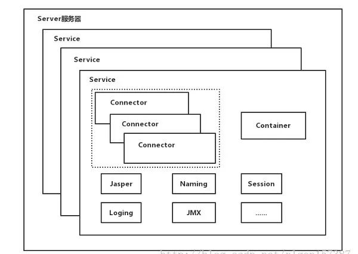
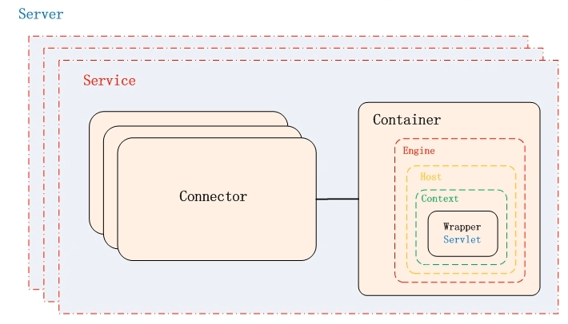
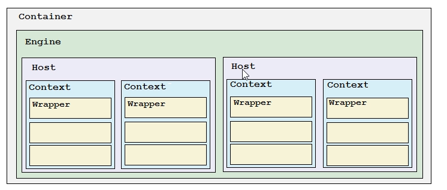
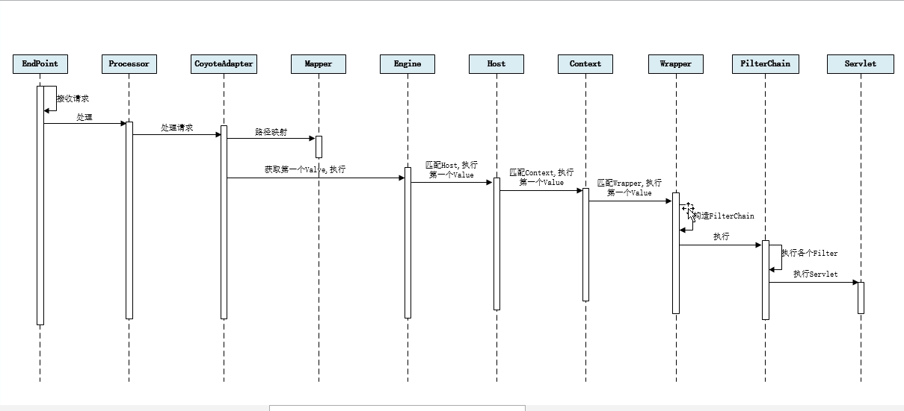
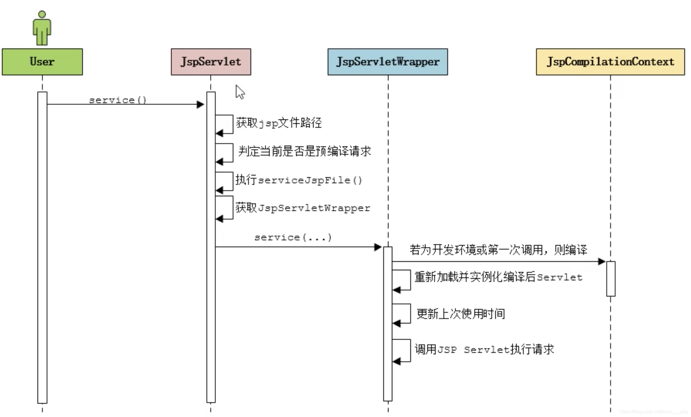
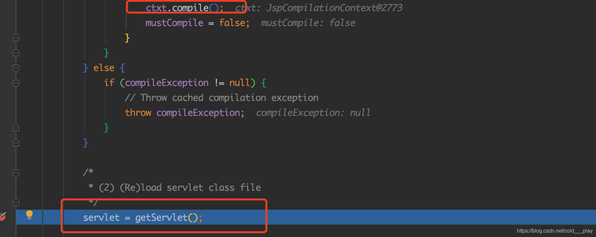
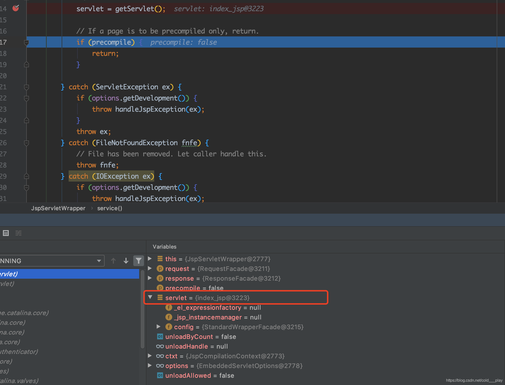
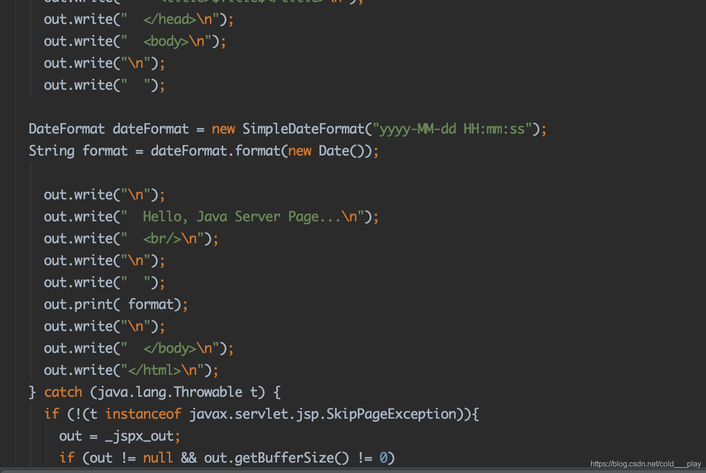
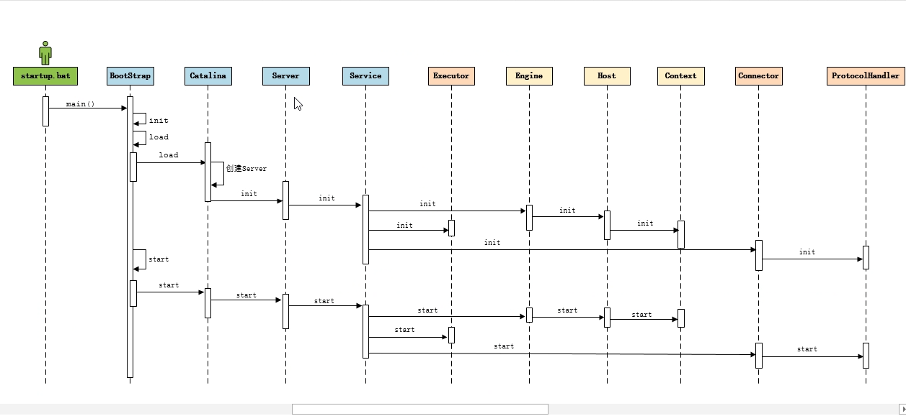

# Tomcat原理和源码

自8.5版本起Tomcat移除了对BIO的支持

IO模型
- NIO 非阻塞I/O
- NIO2 异步I/O JDK7的NIO2类库
- APR 采用Apache可移植运行库实现，C++编写的本地库，需要单独安装

应用层协议
- HTTP/1.1
- APJ 用于和WEB服务器集成(如Apache),以实现对静态资源的优化和集群部署，当前支持APJ/1.3
- HTTP/2 HTTP2.0大幅提升了web性能，下一代HTTP协议，自8.5以及9.0版本后支持

## 1. 整体架构设计

### 1.1 连接器Connector
- Socket连接
- 读取请求网络中的字节流
- 根据相应的协议(Http/AJP)解析字节流，生成统一的 TomcatRequestt对象
- 将TomcatRequest传给容器
- 容器返回 TomcatResponse对象
- 将TomcatResponse对象转换为字节流
- 将字节流返回给客户端

其实上面的细分都能总结为以下的三点

- 网络通信 EndPoint 监听请求
- 应用层协议的解析 Processor 解析封装对象
- Adapter 适配器模式 Tomcat的 Request/Response与 ServletRequest/ServletResponse对象的转化调用容器

ProtocolHandler是EndPoint和Processor的组合

### 1.2 catalina容器








## 2. Tomcat中“HTTP长连接”的实现原理与源码分析

## 3. Tomcat中关于解析HTTP请求行、请求头、情头体的源码分析

## 4. Tomcat中关于分块传输（chunk）请求体的源码分析

## 5. Tomcat中响应一个请求的原理与源码分析



NioEndpoint processKey接收请求，交给线程池处理 进入SocketProcessorBase的run方法
```java
if (handshake == 0) {
    SocketState state = SocketState.OPEN;
    // Process the request from this socket
    if (event == null) {
        state = getHandler().process(socketWrapper, SocketEvent.OPEN_READ);
    } else {
        state = getHandler().process(socketWrapper, event);
    }
    if (state == SocketState.CLOSED) {
        close(socket, key);
    }
}
```

经过AbstractProtocol解析规则进入Http11Processor的service方法

```java
if (getErrorState().isIoAllowed()) {
    try {
        rp.setStage(org.apache.coyote.Constants.STAGE_SERVICE);
        //通过连接器适配对象调用具体的方法
        getAdapter().service(request, response);
        // Handle when the response was committed before a serious
        // error occurred.  Throwing a ServletException should both
        // set the status to 500 and set the errorException.
        // If we fail here, then the response is likely already
        // committed, so we can't try and set headers.
        if(keepAlive && !getErrorState().isError() && !isAsync() &&
                statusDropsConnection(response.getStatus())) {
            setErrorState(ErrorState.CLOSE_CLEAN, null);
        }
    }
}
```

通过连接器适配对象调用具体方法CoyoteAdapter的service方法

```java
try {
    // Parse and set Catalina and configuration specific
    // request parameters
    postParseSuccess = postParseRequest(req, request, res, response);
    if (postParseSuccess) {
        //check valves if we support async
        request.setAsyncSupported(
                connector.getService().getContainer().getPipeline().isAsyncSupported());
        // Calling the container
        connector.getService().getContainer().getPipeline().getFirst().invoke(
                request, response);
    }
```

StandardEngineValve进入invoke

```java
public final void invoke(Request request, Response response)
        throws IOException, ServletException {

        // Select the Host to be used for this Request
        Host host = request.getHost();
        if (host == null) {
            // HTTP 0.9 or HTTP 1.0 request without a host when no default host
            // is defined.
            // Don't overwrite an existing error
            if (!response.isError()) {
                response.sendError(404);
            }
            return;
        }
        if (request.isAsyncSupported()) {
            request.setAsyncSupported(host.getPipeline().isAsyncSupported());
        }

        // Ask this Host to process this request
        host.getPipeline().getFirst().invoke(request, response);
    }
```

StandardHostValve进入invoke

```java
public final void invoke(Request request, Response response)
        throws IOException, ServletException {
    Context context = request.getContext();//拿到了web应用了
    if (context == null) {
        // Don't overwrite an existing error
        if (!response.isError()) {
            response.sendError(404);
        }
        return;
    }
```

```java
try {
    if (!response.isErrorReportRequired()) {
        context.getPipeline().getFirst().invoke(request, response);
    }
}
```

同样的方式有拿到了context的管道StandardContextValve的invoke

```java
public final void invoke(Request request, Response response)
        throws IOException, ServletException {
    // Disallow any direct access to resources under WEB-INF or META-INF
    MessageBytes requestPathMB = request.getRequestPathMB();
    if ((requestPathMB.startsWithIgnoreCase("/META-INF/", 0))
            || (requestPathMB.equalsIgnoreCase("/META-INF"))
            || (requestPathMB.startsWithIgnoreCase("/WEB-INF/", 0))
            || (requestPathMB.equalsIgnoreCase("/WEB-INF"))) {
        response.sendError(HttpServletResponse.SC_NOT_FOUND);
        return;
    }

    // Select the Wrapper to be used for this Request
    Wrapper wrapper = request.getWrapper();
    if (wrapper == null || wrapper.isUnavailable()) {
        response.sendError(HttpServletResponse.SC_NOT_FOUND);
        return;
    }

    // Acknowledge the request
    try {
        response.sendAcknowledgement(ContinueResponseTiming.IMMEDIATELY);
    } catch (IOException ioe) {
        container.getLogger().error(sm.getString(
                "standardContextValve.acknowledgeException"), ioe);
        request.setAttribute(RequestDispatcher.ERROR_EXCEPTION, ioe);
        response.sendError(HttpServletResponse.SC_INTERNAL_SERVER_ERROR);
        return;
    }

    if (request.isAsyncSupported()) {
        request.setAsyncSupported(wrapper.getPipeline().isAsyncSupported());
    }
    wrapper.getPipeline().getFirst().invoke(request, response);
}
```

惊人的相似马上就要找到终点了 StandardWrapperValve的invoke
```java
 public final void invoke(Request request, Response response)
        throws IOException, ServletException {

        // Initialize local variables we may need
        boolean unavailable = false;
        Throwable throwable = null;
        // This should be a Request attribute...
        long t1=System.currentTimeMillis();
        requestCount.incrementAndGet();
        StandardWrapper wrapper = (StandardWrapper) getContainer();
        Servlet servlet = null;
        Context context = (Context) wrapper.getParent();

        // Check for the application being marked unavailable
        if (!context.getState().isAvailable()) {
            response.sendError(HttpServletResponse.SC_SERVICE_UNAVAILABLE,
                           sm.getString("standardContext.isUnavailable"));
            unavailable = true;
        }

        // Check for the servlet being marked unavailable
        if (!unavailable && wrapper.isUnavailable()) {
            container.getLogger().info(sm.getString("standardWrapper.isUnavailable",
                    wrapper.getName()));
            long available = wrapper.getAvailable();
            if ((available > 0L) && (available < Long.MAX_VALUE)) {
                response.setDateHeader("Retry-After", available);
                response.sendError(HttpServletResponse.SC_SERVICE_UNAVAILABLE,
                        sm.getString("standardWrapper.isUnavailable",
                                wrapper.getName()));
            } else if (available == Long.MAX_VALUE) {
                response.sendError(HttpServletResponse.SC_NOT_FOUND,
                        sm.getString("standardWrapper.notFound",
                                wrapper.getName()));
            }
            unavailable = true;
        }

        // Allocate a servlet instance to process this request
        try {
            if (!unavailable) {
                servlet = wrapper.allocate();// 是他 是他 是他 就是他 我们的朋友小哪吒
            }
        }
        ...
        ...
        // Create the filter chain for this request
        ApplicationFilterChain filterChain =
                ApplicationFilterFactory.createFilterChain(request, wrapper, servlet);//构造出责任器链
        ...
        ...
        if (request.isAsyncDispatching()) {
            request.getAsyncContextInternal().doInternalDispatch();
        } else {
            filterChain.doFilter
                (request.getRequest(), response.getResponse());//执行责任期链
        }
```

进入ApplicationFilterChain的doFilter,所有servlet继承了HttpServlet，直接进入父的serive

```java
protected void service(HttpServletRequest req, HttpServletResponse resp)
        throws ServletException, IOException {
    String method = req.getMethod();
    if (method.equals(METHOD_GET)) {
        long lastModified = getLastModified(req);
        if (lastModified == -1) {
            // servlet doesn't support if-modified-since, no reason
            // to go through further expensive logic
            doGet(req, resp);//终点在这里
        } else {
            long ifModifiedSince;
            try {
                ifModifiedSince = req.getDateHeader(HEADER_IFMODSINCE);
            } catch (IllegalArgumentException iae) {
                // Invalid date header - proceed as if none was set
                ifModifiedSince = -1;
            }
            if (ifModifiedSince < (lastModified / 1000 * 1000)) {
                // If the servlet mod time is later, call doGet()
                // Round down to the nearest second for a proper compare
                // A ifModifiedSince of -1 will always be less
                maybeSetLastModified(resp, lastModified);
                doGet(req, resp);
            } else {
                resp.setStatus(HttpServletResponse.SC_NOT_MODIFIED);
            }
        }
    } else if (method.equals(METHOD_HEAD)) {
        long lastModified = getLastModified(req);
        maybeSetLastModified(resp, lastModified);
        doHead(req, resp);

    } else if (method.equals(METHOD_POST)) {
        doPost(req, resp);

    } else if (method.equals(METHOD_PUT)) {
        doPut(req, resp);

    } else if (method.equals(METHOD_DELETE)) {
        doDelete(req, resp);

    } else if (method.equals(METHOD_OPTIONS)) {
        doOptions(req,resp);

    } else if (method.equals(METHOD_TRACE)) {
        doTrace(req,resp);

    } else {
        //
        // Note that this means NO servlet supports whatever
        // method was requested, anywhere on this server.
        //

        String errMsg = lStrings.getString("http.method_not_implemented");
        Object[] errArgs = new Object[1];
        errArgs[0] = method;
        errMsg = MessageFormat.format(errMsg, errArgs);

        resp.sendError(HttpServletResponse.SC_NOT_IMPLEMENTED, errMsg);
    }
}
```

## 6. Tomcat中一个JSP请求的字节码生成分析

Tomcat在默认web.xml中配置了
```xml
<servlet>
      <servlet-name>jsp</servlet-name>
      <servlet-class>org.apache.jasper.servlet.JspServlet</servlet-class>
      <init-param>
          <param-name>fork</param-name>
          <param-value>false</param-value>
      </init-param>
      <init-param>
          <param-name>xpoweredBy</param-name>
          <param-value>false</param-value>
      </init-param>
      <load-on-startup>3</load-on-startup>
  </servlet>
  <!-- The mappings for the JSP servlet -->
  <servlet-mapping>
      <servlet-name>jsp</servlet-name>
      <url-pattern>*.jsp</url-pattern>
      <url-pattern>*.jspx</url-pattern>
  </servlet-mapping>
```

JspServlet处理流程图



源码跟踪

接受到对jsp的访问请求后，会最先到达JspServlet的service()方法中：

```java
public void service (HttpServletRequest request, HttpServletResponse response)
            throws ServletException, IOException {

        // jspFile may be configured as an init-param for this servlet instance
        String jspUri = jspFile;

        if (jspUri == null) {
            /*
             * Check to see if the requested JSP has been the target of a
             * RequestDispatcher.include()
             */
            jspUri = (String) request.getAttribute(
                    RequestDispatcher.INCLUDE_SERVLET_PATH);
            if (jspUri != null) {
                /*
                 * Requested JSP has been target of
                 * RequestDispatcher.include(). Its path is assembled from the
                 * relevant javax.servlet.include.* request attributes
                 */
                String pathInfo = (String) request.getAttribute(
                        RequestDispatcher.INCLUDE_PATH_INFO);
                if (pathInfo != null) {
                    jspUri += pathInfo;
                }
            } else {
                /*
                 * Requested JSP has not been the target of a
                 * RequestDispatcher.include(). Reconstruct its path from the
                 * request's getServletPath() and getPathInfo()
                 */
                jspUri = request.getServletPath();
                String pathInfo = request.getPathInfo();//获取请求的基本信息
                if (pathInfo != null) {
                    jspUri += pathInfo;
                }
            }
        }
        if (log.isDebugEnabled()) {
          log.debug("JspEngine --> " + jspUri);
          log.debug("\t     ServletPath: " + request.getServletPath());
          log.debug("\t        PathInfo: " + request.getPathInfo());
          log.debug("\t        RealPath: " + context.getRealPath(jspUri));
          log.debug("\t      RequestURI: " + request.getRequestURI());
          log.debug("\t     QueryString: " + request.getQueryString());
       }
        try {
            boolean precompile = preCompile(request);
            serviceJspFile(request, response, jspUri, precompile);
        } catch (RuntimeException e) {
            throw e;
        } catch (ServletException e) {
            throw e;
        } catch (IOException e) {
            throw e;
        } catch (Throwable e) {
            ExceptionUtils.handleThrowable(e);
            throw new ServletException(e);
        }
```

判断是否为预编译请求，然后执行serviceJspFile，在serviceJspFile方法中获取了一个JspServletWrapper

```java
private void serviceJspFile(HttpServletRequest request,
                                HttpServletResponse response, String jspUri,
                                boolean precompile)
        throws ServletException, IOException {

        JspServletWrapper wrapper = rctxt.getWrapper(jspUri);
        if (wrapper == null) {
            synchronized(this) {
                wrapper = rctxt.getWrapper(jspUri);
                if (wrapper == null) {
                    // Check if the requested JSP page exists, to avoid
                    // creating unnecessary directories and files.
                    if (null == context.getResource(jspUri)) {
                        handleMissingResource(request, response, jspUri);
                        return;
                    }
                    wrapper = new JspServletWrapper(config, options, jspUri,
                                                    rctxt);
                    rctxt.addWrapper(jspUri,wrapper);
                }
            }
        }

        try {
            wrapper.service(request, response, precompile);
        } catch (FileNotFoundException fnfe) {
            handleMissingResource(request, response, jspUri);
        }

    }
```

```java
      if (options.getDevelopment() || mustCompile) {
          synchronized (this) {
              if (options.getDevelopment() || mustCompile) {
                  // The following sets reload to true, if necessary
                  ctxt.compile();//执行编译
                  mustCompile = false;
              }
          }
      } else {
          if (compileException != null) {
              // Throw cached compilation exception
              throw compileException;
          }
      }
```

在JspCompilationContext的compile()方法中又调用了jspCompiler.compile()

```java
public void compile() throws JasperException, FileNotFoundException {
        createCompiler();
        if (jspCompiler.isOutDated()) {
            if (isRemoved()) {
                throw new FileNotFoundException(jspUri);
            }
            try {
                jspCompiler.removeGeneratedFiles();
                jspLoader = null;
                jspCompiler.compile();//调用编译
                jsw.setReload(true);
                jsw.setCompilationException(null);
            } catch (JasperException ex) {
                // Cache compilation exception
                jsw.setCompilationException(ex);
                if (options.getDevelopment() && options.getRecompileOnFail()) {
                    // Force a recompilation attempt on next access
                    jsw.setLastModificationTest(-1);
                }
                throw ex;
            } catch (FileNotFoundException fnfe) {
                // Re-throw to let caller handle this - will result in a 404
                throw fnfe;
            } catch (Exception ex) {
                JasperException je = new JasperException(
                        Localizer.getMessage("jsp.error.unable.compile"),
                        ex);
                // Cache compilation exception
                jsw.setCompilationException(je);
                throw je;
            }
        }
    }
```

最终到达Complier类中的compile(boolean compileClass, boolean jspcMode)方法：端点处做了2个事情，生成java文件、生成class文件

```java
public void compile(boolean compileClass, boolean jspcMode)
            throws FileNotFoundException, JasperException, Exception {
        if (errDispatcher == null) {
            this.errDispatcher = new ErrorDispatcher(jspcMode);
        }

        try {
            final Long jspLastModified = ctxt.getLastModified(ctxt.getJspFile());
            String[] smap = generateJava();//生成java文件
            File javaFile = new File(ctxt.getServletJavaFileName());
            if (!javaFile.setLastModified(jspLastModified.longValue())) {
                throw new JasperException(Localizer.getMessage("jsp.error.setLastModified", javaFile));
            }
            if (compileClass) {
                generateClass(smap);//生成class文件
                // Fix for bugzilla 41606
                // Set JspServletWrapper.servletClassLastModifiedTime after successful compile
                File targetFile = new File(ctxt.getClassFileName());
                if (targetFile.exists()) {
                    if (!targetFile.setLastModified(jspLastModified.longValue())) {
                        throw new JasperException(
                                Localizer.getMessage("jsp.error.setLastModified", targetFile));
                    }
                    if (jsw != null) {
                        jsw.setServletClassLastModifiedTime(
                                jspLastModified.longValue());
                    }
                }
            }
        }
```

java文件和class文件生成后，回到JspServletWrapper类中，调用getServlet()方法：加载jsp对应的servlet





然后执行service()方法：


查看index_jsp源码：在_jspService()方法中写出响应：



**编译结果**

如果在tomcat/conf/web.xml中配置了参数scratchdir，则jsp的编译后的结果就会存储在该目录下：

```xml
<init-param>
	<param-name>scratchdir</param-name>
	<param-value>D:/tmp/jsp/</param-value>
</init-param>
```

如果没有配置该项，则会将编译后的结果，存储在Tomcat安装目录下的work/Catalina(Engine名称)/localhost(Host名称)/Context命名 假设项目名称为 jsp_demo_01，默认的目录为：work/Catalina/localhost/jsp_demo_01

如果使用的是IDEA开发工具继承Tomcat访问web工程中的jsp，编译后的结果存放在：

>c:\Users\Administrator\.IntelliJIdea2020.3\system\tomcat\_project_tomcat\wor\Catalina\localost\jsp_demo_01_sar_exploded\org\apache\jsp

**预编译**

除了运行时编译，还可以直接在Web应用启动时，一次性将Web应用用的所有JSP页面一次性编译完成。在这种情况下，Web应用运行过程中，便可以不必在进行实时编译，而是直接调用JSP页面对应的Sevlet完成请求处理，从而提升系统性能。

Tomcat提供了一个Shell程序JspC，用于支持JSP预编译，而且在Tomcat的安装目录下提供了一个catalina-tasks.xml文件声明了Tomcat支持的Ant任务，因此，可以很容易使用Ant来执行JSP预编译。（如果想要使用这种方式，必须得确保在此之前已经下载并安装了Apache Ant）

**JSP编译原理**

```java
package org.apache.jsp;

import javax.servlet.*;
import javax.servlet.http.*;
import javax.servlet.jsp.*;
import java.text.SimpleDateFormat;
import java.util.Date;

public final class index_jsp extends org.apache.jasper.runtime.HttpJspBase
    implements org.apache.jasper.runtime.JspSourceDependent,
                 org.apache.jasper.runtime.JspSourceImports {

  private static final javax.servlet.jsp.JspFactory _jspxFactory =
          javax.servlet.jsp.JspFactory.getDefaultFactory();

  private static java.util.Map<java.lang.String,java.lang.Long> _jspx_dependants;

  private static final java.util.Set<java.lang.String> _jspx_imports_packages;

  private static final java.util.Set<java.lang.String> _jspx_imports_classes;

  static {
    _jspx_imports_packages = new java.util.HashSet<>();
    _jspx_imports_packages.add("javax.servlet");
    _jspx_imports_packages.add("javax.servlet.http");
    _jspx_imports_packages.add("javax.servlet.jsp");
    _jspx_imports_classes = new java.util.HashSet<>();
    _jspx_imports_classes.add("java.util.Date");
    _jspx_imports_classes.add("java.text.SimpleDateFormat");
  }

  private volatile javax.el.ExpressionFactory _el_expressionfactory;
  private volatile org.apache.tomcat.InstanceManager _jsp_instancemanager;

  public java.util.Map<java.lang.String,java.lang.Long> getDependants() {
    return _jspx_dependants;
  }

  public java.util.Set<java.lang.String> getPackageImports() {
    return _jspx_imports_packages;
  }

  public java.util.Set<java.lang.String> getClassImports() {
    return _jspx_imports_classes;
  }

  public javax.el.ExpressionFactory _jsp_getExpressionFactory() {
    if (_el_expressionfactory == null) {
      synchronized (this) {
        if (_el_expressionfactory == null) {
          _el_expressionfactory = _jspxFactory.getJspApplicationContext(getServletConfig().getServletContext()).getExpressionFactory();
        }
      }
    }
    return _el_expressionfactory;
  }

  public org.apache.tomcat.InstanceManager _jsp_getInstanceManager() {
    if (_jsp_instancemanager == null) {
      synchronized (this) {
        if (_jsp_instancemanager == null) {
          _jsp_instancemanager = org.apache.jasper.runtime.InstanceManagerFactory.getInstanceManager(getServletConfig());
        }
      }
    }
    return _jsp_instancemanager;
  }

  public void _jspInit() {
  }

  public void _jspDestroy() {
  }

  public void _jspService(final javax.servlet.http.HttpServletRequest request, final javax.servlet.http.HttpServletResponse response)
      throws java.io.IOException, javax.servlet.ServletException {

    final java.lang.String _jspx_method = request.getMethod();
    if (!"GET".equals(_jspx_method) && !"POST".equals(_jspx_method) && !"HEAD".equals(_jspx_method) && !javax.servlet.DispatcherType.ERROR.equals(request.getDispatcherType())) {
      response.sendError(HttpServletResponse.SC_METHOD_NOT_ALLOWED, "JSP 只允许 GET、POST 或 HEAD。Jasper 还允许 OPTIONS");
      return;
    }

    final javax.servlet.jsp.PageContext pageContext;
    javax.servlet.http.HttpSession session = null;
    final javax.servlet.ServletContext application;
    final javax.servlet.ServletConfig config;
    javax.servlet.jsp.JspWriter out = null;
    final java.lang.Object page = this;
    javax.servlet.jsp.JspWriter _jspx_out = null;
    javax.servlet.jsp.PageContext _jspx_page_context = null;


    try {
      response.setContentType("text/html; charset=UTF-8");
      pageContext = _jspxFactory.getPageContext(this, request, response,
      			null, true, 8192, true);
      _jspx_page_context = pageContext;
      application = pageContext.getServletContext();
      config = pageContext.getServletConfig();
      session = pageContext.getSession();
      out = pageContext.getOut();
      _jspx_out = out;

      out.write("\r\n");
      out.write("\r\n");
      out.write("\r\n");
      out.write("<!DOCTYPE html PUBLIC \"-//W3C//DTD HTML 4.01 Transitional//EN\" \"http://www.w3.org/TR/html4/loose.dtd\">\r\n");
      out.write("<html>\r\n");
      out.write("<head>\r\n");
      out.write("<meta http-equiv=\"Content-Type\" content=\"text/html; charset=utf-8\">\r\n");
      out.write("</head>\r\n");
      out.write("<body>\r\n");
      out.write("\t<a href=\"login.do\">登录</a>\r\n");
      out.write("\t<br>\r\n");
      out.write("\t<a href=\"download.do\">下载</a>\r\n");
      out.write("\t<br>\r\n");
      out.write("\t");

		Date d = new Date();
		SimpleDateFormat df = new SimpleDateFormat("yyyy-MM-dd HH:mm:ss");
		String now = df.format(d);
	
      out.write("\r\n");
      out.write("\t当前时间：");
      out.print(now);
      out.write("\r\n");
      out.write("</body>\r\n");
      out.write("</html>");
    } catch (java.lang.Throwable t) {
      if (!(t instanceof javax.servlet.jsp.SkipPageException)){
        out = _jspx_out;
        if (out != null && out.getBufferSize() != 0)
          try {
            if (response.isCommitted()) {
              out.flush();
            } else {
              out.clearBuffer();
            }
          } catch (java.io.IOException e) {}
        if (_jspx_page_context != null) _jspx_page_context.handlePageException(t);
        else throw new ServletException(t);
      }
    } finally {
      _jspxFactory.releasePageContext(_jspx_page_context);
    }
  }
}
```

1. 其类名为index_jsp，继承自org.apache.jasper.runtime.HttpJspBase，该类是HttpServlet的子类，所以jsp本质就是一个Servlet
2. 通过属性_jspx_dependants保存了当前JSP页面依赖的资源，包含引入的外部JSP页面，导入的标签、标签所在的jar包等，便于后续处理过程中使用（如重新编译检测，因此它以Map的形式保存了每个资源的啥功上次修改时间）
3. 通过属性_jspx_imports_packages存放导入的java包，默认导入javax_servlet、javax.servlet.http、javax.servlet.jsp
4. 通过属性 _jspx_imports_classes存放导入的类，通过import指令导入的DateFormat、SimpleDateFormat、Date都会包含在集合中。_jspx_imports_packages和_spx_imports_classes主要用于配置EL引擎上下文
5. 请求处理由方法_jspService完成，而在父类HttpJspBash中的service方法通过模板方法模式调用了子类_jspService方法
6. _jspService方法中定义了几个重要的局部变量：pageContext、Session、application、config、out、page。由于整个页面的输出由 _jspService方法完成，因此这些变量会对整个JSP页面生效
7. 指定文档类型的指令(page)最终装换为response.setContentType方法调用
8. 对于每一行的静态内容(HTML)，调用out.write输出
9. 对于<% ... %>中的java代码，将直接转换为Servlet类中的代码。如果在Java代码中嵌入了静态文件，同样调用out.write输出

## 7. Tomcat中利用BIO处理请求的源码分析

## 8. Tomcat中利用NIO处理请求的源码分析

## 9. Tomcat中异步Servlet实现的源码分析

## 10. Tomcat是如何做到“打破双亲委派的”？Tomcat中自定义类加载器的应用与源码解析
- commonLoader：Tomcat最基本的类加载器，加载路径中的class可以被Tomcat容器本身以及各个Webapp访问
- catalinaLoader：Tomcat容器私有的类加载器，加载路径中的class对于Webapp不可见
- sharedLoader：各个Webapp共享的类加载器，加载路径中的class对于所有Webapp可见，但是对于Tomcat容器不可见
- WebappClassLoader：各个Webapp私有的类加载器，加载路径中的class只对当前Webapp可见

tomcat 为了实现隔离性，没有遵守这个父类委托机制约定，每个webappClassLoader加载自己的目录下的class文件，不会传递给父类加载器

## 11. Tomcat中的四大容器处理请求的源码分析
- Engine：org.apache.catalina.core.StandardEngine
- Host： org.apache.catalina.core.StandardHost
- Context：org.apache.catalina.core.StandardContext
- Wrapper：org.apache.catalina.core.StandardWrapper

## 12. Tomcat启动过程与解析配置文件源码解析

Server,Service,Container,Executor都实现了Lifecycle接口



## 13. Tomcat性能调优

```xml
<Connector port="8080"  
	protocol="HTTP/1.1"  
	maxThreads="1000"    <!--请求最大线程数，默认200 -->
    maxConnections="1000"    <!--最大连接数-->
    acceptCount="1000"    <!--允许的最大连接数，应大于等于 maxProcessors ，默认值为 100 -->
    maxHttpHeaderSize="102400"    <!--http首部长度最大值,默认4096个字节(4K) -->
	minSpareThreads="100"    <!--Tomcat初始化时创建的 socket 线程数 -->
	maxSpareThreads="1000"    <!--Tomcat连接器的最大空闲 socket 线程数 -->
	minProcessors="100"    <!--最小空闲连接线程数，用于提高系统处理性能，默认值为 10 -->
	maxProcessors="1000"    <!--最大连接线程数，即：并发处理的最大请求数，默认值为 75 -->
	enableLookups="false"    <!--是否反查域名，取值为： true 或 false 。为了提高处理能力，应设置为 false -->
	URIEncoding="utf-8"    <!--URL统一编码 -->
	redirectPort="8443"    
	disableUploadTimeout="true"    
	compression="on"    <!-- 打开压缩功能 -->
	compressionMinSize="2048"    <!-- 启用压缩的输出内容大小，默认为2KB -->
	noCompressionUserAgents="gozilla, traviata"    <!-- 对于以下的浏览器，不启用压缩 -->
	compressableMimeType="text/html,text/xml,text/javascript,text/css,text/plain"    <!--哪些资源类型需要压缩 -->
/>
```
测试工具ApacheBench、Jmeter