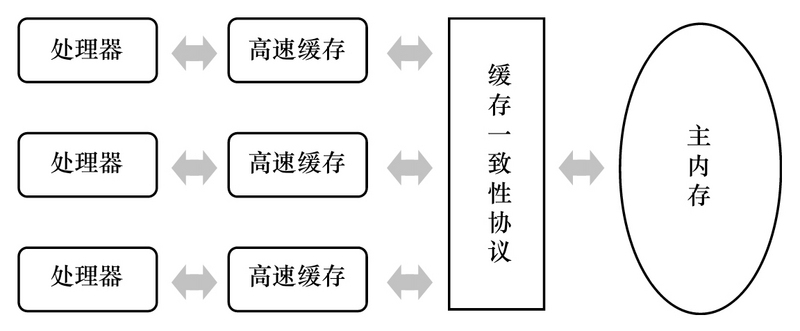
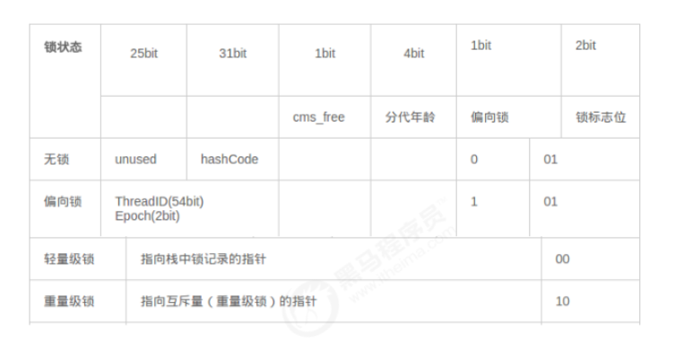
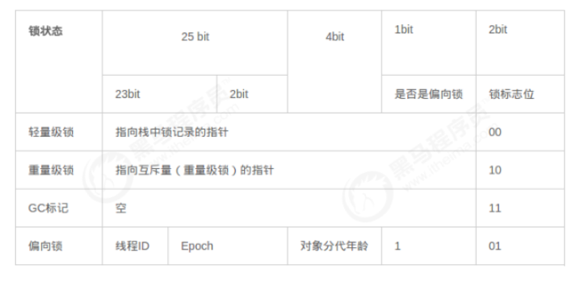
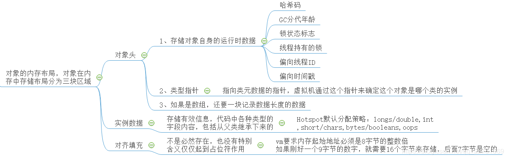
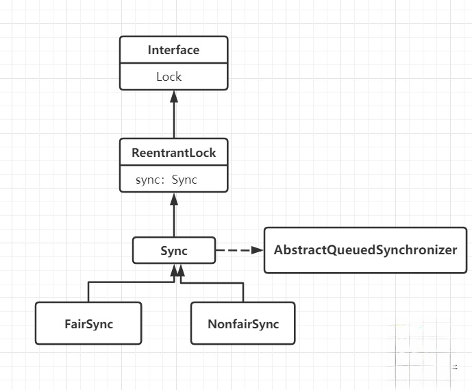
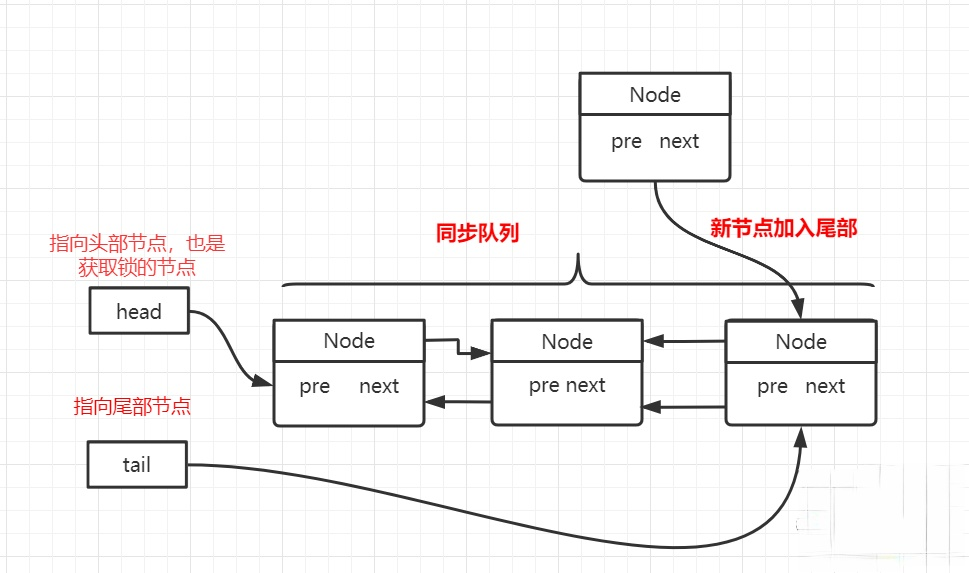
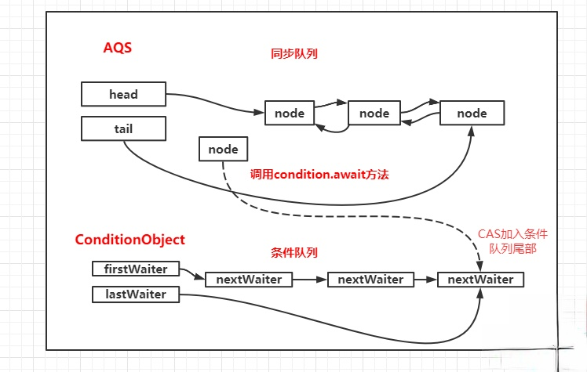

# JVM底层原理

## JMM内存模型（java Memory Model）
### 现代计算机模型基础理论知识
计算机之父冯诺依曼1945年提出计算机由五大组成部分，输入设置，输出设备存储器(内存和外存)，控制器，运算器

CPU缓存分成三个级别：L1,L2,L3 级别越小越靠近CPU，速度越块，容量越小

### happens-before原则

#### 为什么会出现线程可见性问题

要想解释为什么会出现线程可见性问题，需要从计算机处理器结构谈起。我们都知道计算机运算任务需要CPU和内存相互配合共同完成，其中CPU负责逻辑计算，内存负责数据存储。CPU要与内存进行交互，如读取运算数据、存储运算结果等。由于内存和CPU的计算速度有几个数量级的差距，为了提高CPU的利用率，现代处理器结构都加入了一层读写速度尽可能接近CPU运算速度的高速缓存来作为内存与CPU之间的缓冲：将运算需要使用的数据复制到缓存中，让CPU运算可以快速进行，计算结束后再将计算结果从缓存同步到主内存中，这样处理器就无须等待缓慢的内存读写了。
高速缓存的引入解决了CPU和内存之间速度的矛盾，但是在多CPU系统中也带来了新的问题：缓存一致性。在多CPU系统中，每个CPU都有自己的高速缓存，所有的CPU又共享同一个主内存。如果多个CPU的运算任务都涉及到主内存中同一个变量时，那同步回主内存时以哪个CPU的缓存数据为准呢？这就需要各个CPU在数据读写时都遵循同一个协议进行操作。



参考上图，假设有两个线程A、B分别在两个不同的CPU上运行，它们共享同一个变量X。如果线程A对X进行修改后，并没有将X更新后的结果同步到主内存，则变量X的修改对B线程是不可见的。所以CPU与内存之间的高速缓存就是导致线程可见性问题的一个原因。

CPU和主内存之间的高速缓存还会导致另一个问题——重排序。假设A、B两个线程共享两个变量X、Y，A和B分别在不同的CPU上运行。在A中先更改变量X的值，然后再更改变量Y的值。这时有可能发生Y的值被同步回主内存，而X的值没有同步回主内存的情况，此时对于B线程来说是无法感知到X变量被修改的，或者可以认为对于B线程来说，Y变量的修改被重排序到了X变量修改的前面。上面的程序NoVisibility类中有可能输出0就是这种情况，虽然在主线程中是先修改number变量，再修改ready变量，但对于读线程来说，ready变量的修改有可能被重排序到number变量修改之前。

此外，为了提高程序的执行效率，编译器在生成指令序列时和CPU执行指令序列时，都有可能对指令进行重排序。Java语言规范要求JVM只在单个线程内部维护一种类似串行的语义，即只要程序的最终结果与严格串行环境中执行的结果相同即可。所以在单线程环境中，我们无法察觉到重排序，因为程序重排序后的执行结果与严格按顺序执行的结果相同。就像在类NoVisibility的主线程中，先修改ready变量还是先修改number变量对于主线程自己的执行结果是没有影响的，但是如果number变量和ready变量的修改发生重排序，对读线程是有影响的。所以在编写并发程序时，我们一定要注意重排序对多线程执行结果的影响。

看到这里大家一定会发现，我们所讨论的CPU高速缓存、指令重排序等内容都是计算机体系结构方面的东西，并不是Java语言所特有的。事实上，很多主流程序语言(如C/C++)都存在多线程可见性的问题，这些语言是借助物理硬件和操作系统的内存模型来处理多线程可见性问题的，因此不同平台上内存模型的差异，会影响到程序的执行结果。Java虚拟机规范定义了自己的内存模型JMM(Java Memory Model)来屏蔽掉不同硬件和操作系统的内存模型差异，以实现让Java程序在各种平台下都能达到一致的内存访问结果。所以对于Java程序员，无需了解底层硬件和操作系统内存模型的知识，只要关注Java自己的内存模型，就能够解决Java语言中的内存可见性问题了。

#### 原则

上面讨论了Java中多线程共享变量的可见性问题及产生这种问题的原因。下面我们看一下如何解决这个问题，即当一个多线程共享变量被某个线程修改后，如何让这个修改被需要读取这个变量的线程感知到

为了方便程序员开发，将底层的烦琐细节屏蔽掉，JMM定义了Happens-Before原则。只要我们理解了Happens-Before原则，无需了解JVM底层的内存操作，就可以解决在并发编程中遇到的变量可见性问题。

JVM定义的Happens-Before原则是一组偏序关系：对于两个操作A和B，这两个操作可以在不同的线程中执行。如果A Happens-Before B，那么可以保证，当A操作执行完后，A操作的执行结果对B操作是可见的。

##### 程序顺序规则
在一个线程内部，按照程序代码的书写顺序，书写在前面的代码操作Happens-Before书写在后面的代码操作。这时因为Java语言规范要求JVM在单个线程内部要维护类似严格串行的语义，如果多个操作之间有先后依赖关系，则不允许对这些操作进行重排序。

##### 锁定规则

对锁M解锁之前的所有操作Happens-Before对锁M加锁之后的所有操作。
```java
class HappensBeforeLock {
    private int value = 0;
    
    public synchronized void setValue(int value) {
        this.value = value;
    }
    
    public synchronized int getValue() {
        return value;
    }
}
```
同一时刻只能有一个线程执行锁中的操作，所以锁中的操作被重排序外界是不关心的，只要最终结果能被外界感知到就好。除了重排序，剩下影响变量可见性的就是CPU缓存了。在锁被释放时，A线程会把释放锁之前所有的操作结果同步到主内存中，而在获取锁时，B线程会使自己CPU的缓存失效，重新从主内存中读取变量的值。这样，A线程中的操作结果就会被B线程感知到了。

##### volatile变量规则

对一个volatile变量的写操作及这个写操作之前的所有操作Happens-Before对这个变量的读操作及这个读操作之后的所有操作。
```java
Map configOptions;
char[] configText; //线程间共享变量，用于保存配置信息
// 此变量必须定义为volatile
volatile boolean initialized = false;

// 假设以下代码在线程A中执行
// 模拟读取配置信息，当读取完成后将initialized设置为true以通知其他线程配置可用configOptions = new HashMap();
configText = readConfigFile(fileName);
processConfigOptions(configText, configOptions);
initialized = true;

// 假设以下代码在线程B中执行
// 等待initialized为true，代表线程A已经把配置信息初始化完成
while (!initialized) {    
    sleep();
}
//使用线程A中初始化好的配置信息
doSomethingWithConfig();
```

在volatile变量写操作发生后，A线程会把volatile变量本身和书写在它之前的那些操作的执行结果一起同步到主内存中。最后，当B线程读取volatile变量时，B线程会使自己的CPU缓存失效，重新从主内存读取所需变量的值，这样无论是volatile本身，还是书写在volatile变量写操作之前的那些操作结果，都能让B线程感知到，也就是上面程序中的initialized和configOptions变量的最新值都可以让线程B感知到

原子变量与volatile变量在读操作和写操作上有着相同的语义

##### 线程启动规则

调用start方法时，会将start方法之前所有操作的结果同步到主内存中，新线程创建好后，需要从主内存获取数据。这样在start方法调用之前的所有操作结果对于新创建的线程都是可见的

##### 线程结束规则

当一个线程结束时，会把自己所有操作的结果都同步到主内存。而任何其它线程当发现这个线程已经执行结束了，就会从主内存中重新刷新最新的变量值。所以结束的线程A对共享变量的修改，对于其它检测了A线程是否结束的线程是可见的

##### 中断规则

一个线程在另一个线程上调用interrupt,Happens-Before被中断线程检测到interrupt被调用。
假设两个线程A和B，A先做了一些操作operationA，然后调用B线程的interrupt方法。当B线程感知到自己的中断标识被设置时(通过抛出InterruptedException，或调用interrupted和isInterrupted),operationA中的操作结果对B都是可见的


##### 终结器规则

一个对象的构造函数执行结束Happens-Before它的finalize()方法的开始。
“结束”和“开始”表明在时间上，一个对象的构造函数必须在它的finalize()方法调用时执行完。
根据这条原则，可以确保在对象的finalize方法执行时，该对象的所有field字段值都是可见的。


##### 传递性规则

如果操作A Happens-Before B，B Happens-Before C，那么可以得出操作A Happens-Before C


### Volatile的使用场景和底层实现原理

volatile是轻量级的synchronized，但是volatile不会引起线程的上下文切换和调度

volatile在多核处理器进行开发时保证了共享变量的可见性，即当一个线程修改这个变量时，其他线程能立马得到最新修改的值

#### volatile的硬件实现原理

- 高速缓存一般集成在CPU内部，保存着CPU刚用过或循环使用的一部分数据，是内存数据的部分拷贝，计算机内部的数据通信为：CPU <–> 寄存器 <–> 高速缓存 <–> 内存
- 对volatile变量的写操作，会在正常汇编指令前加一个lock前缀的指令
  - lock前缀指令将引起当前处理器缓存的数据写回到系统内存。对于内存中可以缓存并已经缓存的数据，系统不会在总线上声言LOCK#信号而是锁定这块内存区域的缓存并写回到内存中（锁缓存）；如果内存中的数据没有被缓存，那么将在总线上声言LOCK#信号，锁住总线，并将数据写回到内存中
  - 处理器的缓存写回到内存中将会导致其他处理器的缓存无效。多核CPU之间的缓存一致性协议（锁缓存的保证）：每个处理器通过嗅探总线上有其他处理器写内存地址，如果处理器发现正好是自己缓存行所对应的内存地址，就会将当前处理器的缓存行设置成无效状态，当处理器再次访问这个数据时，就会重新将内存中的数据加载到处理器缓存中。当然如果是锁总线，那么就不需要缓存一致性协议来保障，因为锁总线将会独占所有共享内存
- CPU缓存一致性（MESI 协议及 RFO 请求）
  - M（修改，Modified）：本地处理器已经修改缓存行，即是脏行，它的内容与内存中的内容不一样，并且此 cache 只有本地一个拷贝(专有)；
  - E（专有，Exclusive）：缓存行内容和内存中的一样，而且其它处理器都没有这行数据；
  - S（共享，Shared）：缓存行内容和内存中的一样, 有可能其它处理器也存在此缓存行的拷贝；
  - I（无效，Invalid）：缓存行失效, 不能使用。
- 状态转换
  - 初始：一开始时，缓存行没有加载任何数据，所以它处于 I 状态。
  - 本地写（Local Write）：如果本地处理器写数据至处于 I 状态的缓存行，则缓存行的状态变成 M。
  - 本地读（Local Read）：如果本地处理器读取处于 I 状态的缓存行，很明显此缓存没有数据给它。此时分两种情况：
    - (1)其它处理器的缓存里也没有此行数据，则从内存加载数据到此缓存行后，再将它设成 E 状态，表示只有我一家有这条数据，其它处理器都没有；
    - (2)其它处理器的缓存有此行数据，则将此缓存行的状态设为 S 状态。
    - 注：如果处于M状态的缓存行，再由本地处理器写入/读出，状态是不会改变的
  - 远程读（Remote Read）：假设我们有两个处理器 c1 和 c2，如果 c2 需要读另外一个处理器 c1 的缓存行内容，c1 需要把它缓存行的内容通过内存控制器 (Memory Controller) 发送给 c2，c2 接到后将相应的缓存行状态设为 S。
  - 远程写（Remote Write）：其实确切地说不是远程写，而是 c2 得到 c1 的数据后，不是为了读，而是为了写。
    - 也算是本地写，只是 c1 也拥有这份数据的拷贝，这该怎么办呢？c2 将发出一个 RFO (Request For Owner) 请求，它需要拥有这行数据的权限，其它处理器的相应缓存行设为 I，除了它自已，谁不能动这行数据。这保证了数据的安全，同时处理 RFO 请求以及设置I的过程将给写操作带来很大的性能消耗。

#### volatile的特性
1、可见性：对一个volatile变量的读，总是能看到其他线程对这个变量最新的修改。

2、原子性：volatile变量的单个读/写操作是原子性的且具有可见性，复合操作（依赖当前值的读写复合操作等，比如i++；以及该变量包含在具有其他变量的不变式中）不具有原子性。

#### volatile的内存语义
java虚拟机内存模型中存在主内存和工作内存之分，实际上并不存在，只是抽象出来的用来表述问题的概念。

主内存中存储的是各个线程共享的数据，每一个线程都有一份与其他线程隔离独立的数据空间叫做工作内存，工作内存一部分存储的是线程私有数据，一部分是主内存中共享数据的拷贝。

对于普通共享变量：线程持有主内存中共享变量的数据拷贝，当发生读操作时，线程首先在自己的拷贝中查找，如果没有则从主内存中拷贝；发生写操作时，将会修改线程拷贝的数据，而不是主内存中的共享数据，所以无法保证共享变量的可见性。

volatile的写内存语义：当写一个volatile变量时，JMM会把该线程对应的本地内存中的共享变量值刷新到主内存 .和锁synchronized的释放内存语义一致。

volatile的读内存语义：当读一个volatile变量时，JMM会把该线程对应的本地内存设置为无效。线程接下来将从主内存中读取共享变量。和锁synchronized的获取内存语义一致。

java编译器通过在volatile的读写前后插入内存屏障指令（指令重排序不可越过内存屏障）来禁止特定类型的编译器和处理器重排序来实现上述内存语义。

- 编译器禁止volatile读与volatile读后面的任意内存操作重排序。
- 编译器禁止volatile写与volatile前面的任意内存操作重排序。

volatile的写-读和锁的释放-获取具有相同的内存语义:

- volatile的写和锁的释放有相同的内存语义
- volatile的读与锁的获取有相同的内存语义。

#### JSR-133（从JDK5开始）对volatile内存语义的增强

在JSR-133之前，虽然不允许volatile变量之间的重排序，但是旧的Java内存模型允许对volatile变量与普通变量重排序，因此旧的内存模型中，volatile的写-读没有锁的释放-获取所具有的内存语义。
为了提供一种比锁更轻量的线程间通信机制，JSR-133增强了volatile的内存语义：严格限制编译器和处理器对volatile变量与普通变量的重排序，确保volatile的写-读和锁的释放-获取具有相同的内存语义。

####  应用场景

1、轻量级的“读-写锁”策略

即通过锁来实现独占写锁，使用volatile实现共享的读锁（多个线程可以同时读value值）
```java
private volatile int value;
public int get Value(){return value;}
public synchronized void doubleValue(value=value*value;);
```

2、状态标志，用来对线程接下来的逻辑进行控制
```java
private volatile boolean status = false;
public void shutdown(){status = true;}
public void doWork(){
		while(!status){
		doTask();	
	}	
}
```

3、单例模式（双检查锁机制）
利用volatile修改的可见性以及禁止特定指令的重排序和synchronized的独占性保证同时只有一个线程进入同步方法块，既保证了其高效性，也保证了其线程安全性

```java
private volatile static Singleton instace;
public static Singleton getInstance(){   // 没有使用同步方法，而是同步方法块
	//第一次nu11检查 ，利用volatile的统程间可见性，不需要加锁，性能提高
	if(instance == null)(
		synchronized(Singleton.class) { //锁住类对象,阻塞其他线程
		//第二次nu11检查，以保证不会创建重复的实例
		if(instance == null)(
			instance = new Singleton(); //禁止重排序
		}
	}
	return instance;
```

### ThreadLocal的使用场景和底层源码分析
  - 线程并发
  - 传递数据
  - 数据隔离

ThreadLocal与synchronized的区别
  - ThreadLocal 空间换时间为每个线程提供独立副本，相互隔离，具有更高的并发性
  - synchronized 时间换空间 提供一份变量 让不同的线程排队访问

```java
static class Bank {
		private ThreadLocal<Integer> threadlocal = new ThreadLocal<Integer>() {
			protected Integer initialValue() {
				return 0;
			}
		};

		public Integer get() {
			return threadlocal.get();
		}

		public void set(Integer money) {
			threadlocal.set(threadlocal.get() + money);
		}
	}

	static class Transfer implements Runnable {
		private Bank bank;

		public Transfer(Bank bank) {
			this.bank = bank;
		}

		@Override
		public void run() {
			for (int i = 0; i < 10; i++) {
				bank.set(10);
				System.out.println(Thread.currentThread().getName() + "账户余额：" + bank.get());
			}

		}
	}

	public static void main(String[] args) {
		Bank bank = new Bank();
		Transfer transfer = new Transfer(bank);
		new Thread(transfer, "客户1").start();
		new Thread(transfer, "客户2").start();
	}
```
```java
    private static ThreadLocal<Connection> tl = new ThreadLocal<>();
    /**
	 * 获取连接
	 * 
	 * @return
	 * @throws SQLException
	 */
	public synchronized Connection getConnection() throws SQLException {
		Connection conn = tl.get();
		// 如果容器中没有连接，就从连接池获取一个连接存到ThreadLocal中
		if (conn == null) {
			conn = DriverManager.getConnection(url, username, password);
			tl.set(conn);
		}
		return conn;
	}
```

## 并发同步处理

- 解释一：并行是指两个或者多个事件在同一时刻发生；而并发是指两个或多个事件在同一时间间隔发生（微观上的一段时间）。
- 解释二：并行是在不同实体上的多个事件，并发是在同一实体上的多个事件。

### synchronized三大特性：原子性、可见性、一致性
- 原子性
```java
//定义一个共享变量 number
//对number进行1000次 ++ 操作
//使用 5 个线程来进行
public class Test02Atomicity {
    //1、定义一个共享变量 number
    private static int number = 0;
    private static Object obj = new Object();
​
    public static void main(String[] args) throws InterruptedException {
        Runnable increment = () -> {
            for (int i = 0; i < 10000; i++) {
                synchronized (obj) {
                    number++;
                }
            }
        };
        List<Thread> list = new ArrayList<>();
​
        for (int i = 0; i < 5; i++) {
            Thread t = new Thread(increment);
            t.start();
            list.add(t);
        }
        for (Thread thread : list) {
            thread.join();
        }
        System.out.println("number=" + number);
    }
}
```

synchronized 保证原子性的原理

对 number++；增加同步代码快，保证同一时间只有一个线程操作 number++；。就不会出现安全问题

- 可见性
```java
//创建一个共享变量mber
//创建一条线程不断的读取共享变量++ 操作
//创建一条线程修改共享变量
public class Test01Visibility {
    // 多个线程都会访问的数据，我们称为线程的共享数据
    private static boolean flag = true;
    private static Object obj = new Object();
​
    public static void main(String[] args) throws InterruptedException {
        new Thread(() -> {
            while (flag) {
                synchronized (obj) {
                }
            }
        }).start();
​
        TimeUnit.SECONDS.sleep(1);
​
        new Thread(() -> {
            flag = false;
            System.out.println("时间到，线程2设置为false");
        }).start();
    }
}
```

synchronized 保证可见性的原理

执行 synchronized时，会对应执行 lock 原子操作会刷新工作内存中共享变量的值

- 一致性

为了提高程序的执行效率，编译器和CPU对象程序中的代码进行重排序,有依赖关系，不能重排序

```java
int a = 1;
int b = 2;
int c = a + b;
```

synchronized 保证有序性的原理

synchronized后，依然会发生重排序，只不过有同步代码块可以保证只有一个线程执行同步代码块的代码

多线程下重排会影响结果，可使用`jcstress`测试

- 可重入特性：一个线程可以重复进入synchronized，重复获取同一把锁
- 不可中断特性：synchronized是不可中断的，处于阻塞状态的线程会一直等待锁
  - Lock的lock方法是不可中断的
  - Lock的tryLock方法是可中断的

### synchronized内置锁实现原理（反汇编和JVM源码）
JDK源码下载地址http://hg.openjdk.java.net/

#### monitorenter原理

每一个对象都会和一个监视器monitor（C++对象）关联。监视器被占用时会被锁住，其他线程无法来获取该monitor。 当JVM执行某个线程的某个方法内部的monitorenter时，它会尝试去获取当前对象对应的monitor的所有权。其过程如下：
- 若monior的进入数为0，线程可以进入monitor，并将monitor的进入数置为1。当前线程成为monitor的owner（所有者）
- 若线程已拥有monitor的所有权，允许它重入monitor，则进入monitor的进入数加1
- 若其他线程已经占有monitor的所有权，那么当前尝试获取monitor的所有权的线程会被阻塞，直到monitor的进入数变为0，才能重新尝试获取monitor的所有权

总结：synchronized的锁对象会关联一个monitor,这个monitor不是我们主动创建的,而是JVM的线程执行到这个同步代码块,发现锁对象没有monitor就会创建monitor,monitor内部有两个重要的成员变量owner:拥有这把锁的线程,recursions会记录线程拥有锁的次数,当一个线程拥有monitor后，其他线程只能等待

#### monitorexit原理
- 能执行monitorexit指令的线程一定是拥有当前对象的monitor的所有权的线程
- 执行monitorexit时会将monitor的进入数减1。当monitor的进入数减为0时，当前线程退出monitor，不再拥有monitor的所有权，此时其他被这个monitor阻塞的线程可以尝试去获取这个monitor的所有权

#### synchronized与lock的区别：
- synchronized是一个关键字，而lock是一个接口。
- synchronized会自动释放锁，而lock必须手动释放锁。
- synchronized是不可中断的，而lock是可中断也可不中断。
- 通过lock可以知道线程是否拿到锁，而synchronized不能。
- synchronized可以锁住方法和代码块，而lock只能锁住代码块。
- synchronized是非公平锁（就是调用任意一个等待线程，不是先来先调），ReentrantLock可以控制是否公平。
- lock可以使用读锁来提高多线程效率。（ReentrantReadWriteLock）

#### monitor监视器锁

在HotSpot虚拟机中，monitor是由ObjectMonitor实现的。其源码是用c++来实现的，位于HotSpot虚拟机源码ObjectMonitor.hpp文件中(src/share/vm/runtime/objectMonitor.hpp)。ObjectMonitor主要数据结构如下：

```java
public class Test {
    public static void main(String[] args){
        synchronized(Test.class){
            System.out.println("hello");
        }
    }
}
//
    4: monitorenter
    5: getstatic    #9    // Field java/lang/System.out:Ljava/io/PrintStream; 
    8: ldc           #15   // String hello
    10: invokevirtual #17  // Method java/io/PrintStream.println:(Ljava/lang/String;)V
    13: aload_1
    14: monitorexit
```

```C
ObjectMonitor() {
    _header = NULL;
    _count = 0;
    _waiters = 0，
    _recursions = 0; // 线程的重入次数
    _object = NULL; // 存储该monitor的对象
    _owner = NULL; // 标识拥有该monitor的线程
    _WaitSet = NULL; // 处于wait状态的线程，会被加入到_WaitSet
    _WaitSetLock = 0 ;
    _Responsible = NULL;
    _succ = NULL;
    _cxq = NULL; // 多线程竞争锁时的单向列表
    FreeNext = NULL;
    _EntryList = NULL; // 处于等待锁block状态的线程，会被加入到该列表
    _SpinFreq = 0;
    _SpinClock = 0;
    OwnerIsThread = 0;
}
```

- _owner：初始时为NULL。当有线程占有该monitor时，owner标记为该线程的唯一标识。当线程释放monitor时，owner又恢复为NULL。owner是一个临界资源，JVM是通过CAS操作来保证其线程安全的。 ​ 
- _cxq：竞争队列，所有请求锁的线程首先会被放在这个队列中（单向链接）。_cxq是一个临界资源，JVM通过CAS原子指令来修改cxq队列。修改前cxq的旧值填入了node的next字段，_cxq指向新值（新线程）。因此_cxq是一个后进先出的stack（栈）。 ​ 
- _EntryList：_cxq队列中有资格成为候选资源的线程会被移动到该队列中。 ​ 
- _WaitSet：因为调用wait方法而被阻塞的线程会被放在该队列中。

>每一个Java对象都可以与一个监视器monitor关联，我们可以把它理解成为一把锁，当一个线程想要执行一段被synchronized圈起来的同步方法或者代码块时，该线程得先获取到synchronized修饰的对象对应的monitor。 我们的Java代码里不会显示地去创造这么一个monitor对象，我们也无需创建，事实上可以这么理解：monitor并不是随着对象创建而创建的。我们是通过synchronized修饰符告诉JVM需要为我们的某个对象创建关联的monitor对象。每个线程都存在两个ObjectMonitor对象列表，分别为free和used列表。同时JVM中也维护着global locklist。当线程需要ObjectMonitor对象时，首先从线程自身的free表中申请，若存在则使用，若不存在则从global list中申请

#### monitor竞争
```C
void ATTR ObjectMonitor::enter(TRAPS)  {
    ...
    //获取锁：cmpxchg_ptr原子操作，尝试将_owner替换为自己，并返回旧值
    cur = Atomic::cmpxchg_ptr (Self, &_owner, NULL) ;
    ...
    // 重复获取锁，线程重入，次数加1，返回
    if (cur == Self) {
        _recursions ++ ;
        return ;
    }
    //首次获取锁情况处理
    if (Self->is_lock_owned ((address)cur)) {
        assert (_recursions == 0, "internal state error");
        _recursions = 1 ;
        _owner = Self ;
        OwnerIsThread = 1 ;
        return ;
    }
    ...
    //尝试自旋获取锁
    if (Knob_SpinEarly && TrySpin (Self) > 0) {
    ...
```
- 通过CAS尝试把monitor的owner字段设置为当前线程`Atomic::cmpxchg_ptr`。
- 如果设置之前的owner指向当前线程，说明当前线程再次进入到monitor，即是重入锁，执行 recursions++，记录重入的次数。
- 如果当前线程是第一次进入monitor，设置recursions为1，_owner为当前线程，该线程成功获得并返回。
- 如果获取锁失败，则等待锁的释放。

#### monitor等待

- 当前线程被封装成ObjectWaiter对象node，状态设置为ObjectWaiter::TS_CXQ。
- 在for循环中，通过CAS把node节点push到_cxq列表中，同一时刻可能有多个线程把自己的node节点push到_cxq列表中。
- node节点push到_cxq列表之后，通过自旋尝试获取锁，如果还是没有获取锁，则通过park将当前线程挂起，等待被唤醒。
- 当前线程被唤醒时，会从挂起的点继续执行，通过ObjectMonitor::TryLock尝试获取锁。

#### minotor释放
- 退出同步代码块时，_recursions--，当_recursions的值变为0时，说明线程释放了锁。

####  monitor是重量级锁

ObjectMonitor的函数调用会涉及到Atomic::cmpxchg_ptr，Atomic::inc_ptr等内核函数，执行同步代码块，没有竞争到锁的对象会被park()挂起，竞争到锁的线程会被unpark()唤醒。这个时候会存在操作系统用户态与内核态的转换，反复的切换会消耗大量的系统资源，因此synchronized是java语言中的一个重量级（Heavyweight）的操作。

用户态切换至内核态需要传递许多变量，同时内核还需要保护好用户态在切换时的一些寄存器
值、变量等，以备内核态切换回用户态。这种切换就带来了大量的系统资源消耗，这就是在
synchronized未优化之前，效率低的原因。

`synchronized的本质是用户态到内核态的转换过程`

### synchronized膨胀升级过程

对象在内存中存储的布局可以分为三块区域：对象头（Header），实例数据（Instance Data），对齐填充（Padding）

- 对象头
长度一般为32位或者64位，分为两部分信息：一部分用于存储对象自身的运行时数据，如哈希码，GC分代年龄，锁状态标志，线程持有的锁，偏向线程的ID，偏向时间戳等，称之为Mark Word。另一部分是类型指针，是对象指向他的类元数据的指针，用于确定是哪个类的实例（非必须）；如果是数组还需要有一块记录数组长度的数据

在64位虚拟机下，Mark Word是64bit大小的，其存储结构如下：


在32位虚拟机下，Mark Word是32bit大小的，其存储结构如下：



- 实例数据

在程序代码中定义的各种类型的字段内容，无论是继承的还是自己的。

- 对齐填充

非必须，内存管理系统要求对象起始地址必须是8字节的整数倍，通常用于填充实例数据。


对象头 = Mark Word + 类型指针（未开启指针压缩的情况下）

在32位系统中，Mark Word = 4 bytes，类型指针 = 4bytes，对象头 = 8 bytes = 64 bits

在64位系统中，Mark Word = 8 bytes，类型指针 = 8bytes，对象头 = 16 bytes = 128bits

使用jol-core查看对象布局

开启(-XX:+UseCompressedOops) 可以压缩指针。 

关闭(-XX:-UseCompressedOops) 可以关闭压缩指针。

```xml
<dependency>
    <groupId>org.openjdk.jol</groupId>
    <artifactId>jol-core</artifactId>
    <version>0.9</version>
</dependency>
```
```java
public class JolCoreTest {
	public static void main(String[] args) {
		// TODO Auto-generated method stub
		LockObj obj = new LockObj();
		System.out.println(ClassLayout.parseInstance(obj).toPrintable());
	}
}
class LockObj {
	private int i;
	private boolean b;

}
```
```txt
com.xuzhihao.test.LockObj object internals:
 OFFSET  SIZE      TYPE DESCRIPTION                               VALUE
      0     4           (object header)                           01 00 00 00 (00000001 00000000 00000000 00000000) (1)
      4     4           (object header)                           00 00 00 00 (00000000 00000000 00000000 00000000) (0)
      8     4           (object header)                           80 08 15 1c (10000000 00001000 00010101 00011100) (471140480)
     12     4           (object header)                           00 00 00 00 (00000000 00000000 00000000 00000000) (0)
     16     4       int LockObj.i                                 0
     20     1   boolean LockObj.b                                 false
     21     3           (loss due to the next object alignment)
Instance size: 24 bytes
Space losses: 0 bytes internal + 3 bytes external = 3 bytes total

```

无锁 --> 偏向锁（Biased Locking）--> 轻量级锁（Lightweight Locking）--> 重量级锁

- 偏向锁
  - 未加锁的时候，锁标志为01，包含哈希值、年龄分代和偏向锁标志位(0)
  - 施加偏向锁时，哈希值和一部分无用内存会转化为锁主人的线程信息，以及加锁时的时间戳epoch，此时锁标志位没变，偏向锁标志改为1
  - 加锁时先判断当前线程id是否与MarkWord的线程id是否一致，一致则执行同步代码；不一致则检查偏向标志是否偏向，未偏向则使用CAS加锁；未偏向CAS加锁失败和存在偏向锁会导致偏向锁膨胀为轻量级锁，或者重新偏向
  - 偏向锁只有遇到其他线程竞争偏向锁时，持有偏向锁的线程才会释放锁，线程不会主动去释放偏向锁
  - 偏向锁撤销
    - 1. 偏向锁的撤销动作必须等待全局安全点
    - 2. 暂停拥有偏向锁的线程，判断锁对象是否处于被锁定状态
    - 3. 撤销偏向锁，恢复到无锁（标志位为 01）或轻量级锁（标志位为 00）的状态
  - 偏向锁关闭
    - 1. 偏向锁在Java 6之后是默认启用的，但在应用程序启动几秒钟之后才激活，可以使用 -XX:BiasedLockingStartupDelay=0 参数关闭延迟
    - 2. 可以通过 XX:-UseBiasedLocking=false 参数关闭偏向锁
- 轻量级锁
  - 当发生多个线程竞争时，偏向锁会变为轻量级锁，锁标志位为00
  - 获得锁的线程会先将偏向锁撤销(在安全点)，并在栈桢中创建锁记录LockRecord，对象的MarkWord被复制到刚创建的LockRecord，然后CAS尝试将记录LockRecord的owner指向锁对象，再将锁对象的MarkWord指向锁，加锁成功
  - 如果CAS加锁失败，线程会自旋一定次数加锁，再失败则升级为重量级锁
- 重量级锁
  - 重量级锁就是上面介绍到synchronized使用监视器Monitor实现的锁机制
  - 竞争线程激烈，锁则继续膨胀，变为重量级锁，也是互斥锁，锁标志位为10，MarkWord其余内容被替换为一个指向对象锁Monitor的指针
- 自旋锁
  - 减少不必要的CPU上下文切换；在轻量级锁升级为重量级锁时，就使用了自旋加锁的方式 
  - 自旋次数的默认值是10次，用户可以使用参数-XX : PreBlockSpin来更改
- 适应自旋锁
  - JDK 1.6引入 自适应意味着自旋的时间不再固定了，而是由前一次在同一个锁上的自旋时间及锁的拥有者的状态来决定
  - 如果在同一个锁对象上，自旋等待刚刚成功获得过锁，并且持
有锁的线程正在运行中，那么虚拟机就会认为这次自旋也很有可能再次成功，进而它将允许自旋等待持
续相对更长的时间，比如100次循环
  - 如果对于某个锁，自旋很少成功获得过，那在以后要获取这个锁时将可能省略掉自旋过程，以避免浪费处理器资源
- 锁粗化
  - 多次加锁操作在JVM内部也是种消耗，如果多个加锁可以合并为一个锁，就可减少不必要的开销  
  - JVM会探测到一连串细小的操作都使用同一个对象加锁，将同步代码块的范围放大，放到这串操作的外面，这样只需要加一次锁即可
```java
 for (int i = 0; i < 100; i++) {
            sb.append("aa");
        }
```

- 锁消除
  - 机即时编译器（JIT）在运行时删除不必要的加锁操作，如果变量是独属一个线程的栈变量，加不加锁都是安全的，编译器会尝试消除锁
  - 锁消除的主要判定依据来源于逃逸分析的数据支持
  - 开启锁消除需要在JVM参数上设置-server -XX:+DoEscapeAnalysis -XX:+EliminateLocks
```java
public static void main(String[] args) {
        contactString("aa", "bb", "cc");
    }

    public static String contactString(String s1, String s2, String s3) {
        return new StringBuffer().append(s1).append(s2).append(s3).toString();
    }
```

- 其他锁优化方法
  - 分段锁，分段锁也并非一种实际的锁，而是一种思想；ConcurrentHashMap是学习分段锁的最好实践。主要是将大对象拆成小对象，然后对大对象的加锁操作变成对小对象加锁，增加了并行度
  - 减少synchronized的范围
  - 降低synchronized锁的粒度

### 乐观锁、悲观锁、重入锁、公平锁、非公平锁粒度

#### 乐观锁

总是假设最好的情况，每次去拿数据的时候都认为别人不会修改，所以不会上锁，但是在更新的时候会判断一下在此期间别人有没有去更新这个数据，可以使用版本号机制和CAS算法实现。

乐观锁适用于多读的应用类型，这样可以提高吞吐量，像数据库提供的类似于write_condition机制，其实都是提供的乐观锁。

在Java中java.util.concurrent.atomic包下面的原子变量类就是使用了乐观锁的一种实现方式CAS实现的。

CAS在获取共享变量时，为了保证该变量的可见性，需要使用volatile修饰，结合CAS和volatile操作，可以实现无锁并发，适用于竞争不激烈、多核CPU的场景下。

因为没有使用synchronized，所以线程不会陷入阻塞，这是提升效率的重要因素之一。

但如果竞争激烈，就会导致重试频繁发生，进而降低效率。

#### 悲观锁
总是假设最坏的情况，每次去拿数据的时候都认为别人会修改，所以每次在拿数据的时候都会上锁，这样别人想拿这个数据就会阻塞直到它拿到锁（共享资源每次只给一个线程使用，其它线程阻塞，用完后再把资源转让给其它线程）。传统的关系型数据库里边就用到了很多这种锁机制，比如行锁，表锁等，读锁，写锁等，都是在做操作之前先上锁。Java中synchronized和ReentrantLock等独占锁就是悲观锁思想的实现。

#### 重入锁
所谓重入锁，指的是以线程为单位，当一个线程获取对象锁之后，这个线程可以再次获取本对象上的锁，而其他的线程是不可以的。

synchronized 和ReentrantLock 都是可重入锁。可重入锁的意义在于防止死锁。

实现原理是通过为每个锁关联一个请求计数器和一个占有它的线程。当计数为0时，认为锁是未被占有的；线程请求一个未被占有的锁时，JVM将记录锁的占有者，并且将请求计数器置为1 。

如果同一个线程再次请求这个锁，计数将递增，每次占用线程退出同步块，计数器值将递减。直到计数器为0,锁被释放。

#### 公平锁

公平锁就是很公平，在并发环境中，每个线程在获取锁时会先查看此锁维护的等待队列，如果为空，或者当前线程是等待队列的第一个，就占有锁，否则就会加入到等待队列中，以后会按照FIFO的规则从队列中取到自己。

公平锁的优点是等待锁的线程不会饿死。缺点是整体吞吐效率相对非公平锁要低，等待队列中除第一个线程以外的所有线程都会阻塞，CPU唤醒阻塞线程的开销比非公平锁大

#### 非公平锁

上来就直接尝试占有锁，如果尝试失败，就再采用类似公平锁那种方式。

非公平锁的优点是可以减少唤起线程的开销，整体的吞吐效率高，因为线程有几率不阻塞直接获得锁，CPU不必唤醒所有线程。缺点是处于等待队列中的线程可能会饿死，或者等很久才会获得锁

java jdk并发包中的ReentrantLock可以指定构造函数的boolean类型来创建公平锁和非公平锁（默认）,比如：公平锁可以使用new ReentrantLock(true)实现

### CAS使用场景和实现原理

```java
	private static sun.misc.Unsafe unsafe;
	private static long offset;
	private String[] table = { "1", "2", "3", "4" };
	static {
		try {
			Field field = Unsafe.class.getDeclaredField("theUnsafe");
			field.setAccessible(true);
			unsafe = (Unsafe) field.get(null);
			offset = unsafe.objectFieldOffset(UnsafeTest.class.getDeclaredField("i"));
		} catch (Exception e) { // Internal reference
			e.printStackTrace();
		}
	}

	public static void main(String[] args) {
		final UnsafeTest po = new UnsafeTest();
		// 数组中存储的对象的对象头大小
		int ns = unsafe.arrayIndexScale(String[].class);
		// 数组中第一个元素的起始位置
		int base = unsafe.arrayBaseOffset(String[].class);
		System.out.println(unsafe.getObject(po.table, base + 3 * ns));
	}
    public static void main2(String[] args) {
		final UnsafeTest po = new UnsafeTest();
		new Thread(new Runnable() {
			@Override
			public void run() {
				while (true) {
					boolean b = unsafe.compareAndSwapInt(po, offset, po.i, po.i + 1);
					if (b)
						System.out.println(unsafe.getIntVolatile(po, offset));
					try {
						Thread.sleep(500);
					} catch (InterruptedException e) {
						// TODO Auto-generated catch block
						e.printStackTrace();
					}
				}
			}
		}).start();
```

Unsafe.cpp中的compareAndSwapInt

```C++
//unsafe.cpp
UNSAFE_ENTRY(jboolean, Unsafe_CompareAndSwapInt(JNIEnv *env, jobject unsafe, jobject obj, jlong offset, jint e, jint x))
  UnsafeWrapper("Unsafe_CompareAndSwapInt");
  oop p = JNIHandles::resolve(obj);
  jint* addr = (jint *) index_oop_from_field_offset_long(p, offset);
  return (jint)(Atomic::cmpxchg(x, addr, e)) == e;
UNSAFE_END
```

在Linux的x86，Atomic::cmpxchg方法的实现如下

```C
/**
    1 __asm__表示汇编的开始；
    2 volatile表示禁止编译器优化；//禁止指令重排
    3 LOCK_IF_MP是个内联函数，
      根据当前系统是否为多核处理器，
      决定是否为cmpxchg指令添加lock前缀 //内存屏障
*/
inline jint Atomic::cmpxchg (jint exchange_value, volatile jint* dest, jint compare_value) {
  int mp = os::is_MP();
  __asm__ volatile (LOCK_IF_MP(%4) "cmpxchgl %1,(%3)"
                    : "=a" (exchange_value)
                    : "r" (exchange_value), "a" (compare_value), "r" (dest), "r" (mp)
                    : "cc", "memory");
  return exchange_value;
}
```

总结：jdk提供的CAS机制，在汇编层级，会禁止变量两侧的指令优化，然后使用cmpxchg指令比较并更新变量值(原子性)，如果是多核则使用lock锁定(缓存锁、MESI)

所以如果你是多核或者多个cpu，CPU在执行cmpxchg指令之前会执行lock锁定总线，实际是锁定`北桥信号`（锁定北桥信号比锁定总线轻量一些）。我不释放这把锁谁也过不去，以此来保证cmpxchg的原子性

#### CAS同步操作的问题

- ABA问题
  - 线程X准备将变量的值从A改为B，然而这期间线程Y将变量的值从A改为C，然后再改为A；最后线程X检测变量值是A，并置换为B。但实际上，A已经不再是原来的A了
  - 解决方法，是把变量定为唯一类型。值可以加上版本号，或者时间戳。如加上版本号，线程Y的修改变为A1->B2->A3，此时线程X再更新则可以判断出A1不等于A3
- 只能保证一个共享变量的原子操作
  - 只保证一个共享变量的原子操作，对多个共享变量同步时，循环CAS是无法保证操作的原子

#### 基于volatile + CAS 实现同步锁的原理
- CAS只能同步一个变量的修改，我们又应该如何用它来锁住代码块呢？
- 先说说实现锁的要素
  - 1 同步代码块同一时刻只能有一个线程能执行
  - 2 加锁操作要happens-before同步代码块里的操作，而代码块里的操作要happens-before解锁操作
  - 3 同步代码块结束后相对其他线程其修改的变量是可见的 (内存可见性)
- 要素1：可以利用CAS的原子性来实现，任意时刻只有一个线程能成功操作变量
  - 先设想CAS操作的共享变量是一个关联代码块的同步状态变量，同步开始之前先CAS更新状态变量为加锁状态，同步结束之后，再CAS状态变量为无锁状态
  - 如果期间有第二个线程来加锁，则会发现状态变量为加锁状态，则放弃执行同步代码块
- 要素2：使用volatile修饰状态变量，禁止指令重排
  - volatile保证同步代码里的操作happens-before解锁操作，而加锁操作happens-before代码块里的操作
- 要素3：还是用volatile，volatile变量写指令前后会插入内存屏障
  - volatile修饰的状态变量被CAS为无锁状态前，同步代码块的脏数据就会被更新，被各个线程可见

```java
//伪代码
volatile state = 0 ;   // 0-无锁 1-加锁；volatile禁止指令重排，加入内存屏障
...
if(cas(state, 0 , 1)){ // 1 加锁成功，只有一个线程能成功加锁
    ...                // 2 同步代码块
    cas(state, 1, 0);  // 3 解锁时2的操作具有可见性
}
```


### ReentrantLock源码分析
> ReentrantLock实现了Lock接口，并使用内部类Sync(Sync继承AbstractQueuedSynchronizer)来实现同步操作

  

> ReentrantLock内部类Sync非公平锁实现
```java
final boolean nonfairTryAcquire(int acquires) {
            final Thread current = Thread.currentThread();
            int c = getState();
            if (c == 0) {
                //非公平时直接上锁
                if (compareAndSetState(0, acquires)) {
                    setExclusiveOwnerThread(current);
                    return true;
                }
            }
            else if (current == getExclusiveOwnerThread()) {
                //重入
                int nextc = c + acquires;
                if (nextc < 0) // overflow
                    throw new Error("Maximum lock count exceeded");
                setState(nextc);
                return true;
            }
            return false;
        }

        protected final boolean tryRelease(int releases) {
            int c = getState() - releases;
            if (Thread.currentThread() != getExclusiveOwnerThread())
                throw new IllegalMonitorStateException();
            boolean free = false;
            if (c == 0) {
                free = true;
                setExclusiveOwnerThread(null);
            }
            setState(c);
            return free;
        }
```

>  Sync的子类NonfairSync和FairSync都重写了tryAcquire方法,其中NonfairSync的tryAcquire调用父类的nonfairTryAcquire方法, FairSync则自己重写tryAcquire的逻辑。其中调用hasQueuedPredecessors()判断是否有排队Node，存在则返回false（false会导致当前线程排队等待锁）

```java
protected final boolean tryAcquire(int acquires) {
        final Thread current = Thread.currentThread();
        int c = getState();
        if (c == 0) {
            //公平锁进入无论任何时候都判断是否需要排队
            if (!hasQueuedPredecessors() &&
                compareAndSetState(0, acquires)) {
                setExclusiveOwnerThread(current);
                return true;
            }
        }
        else if (current == getExclusiveOwnerThread()) {
            //重入
            int nextc = c + acquires;
            if (nextc < 0)
                throw new Error("Maximum lock count exceeded");
            setState(nextc);
            return true;
        }
        return false;
    }           
```


```java
public final boolean hasQueuedPredecessors() {
        Node t = tail; // Read fields in reverse initialization order
        Node h = head;
        Node s;
        //三种情况
        //1.未初始化 null==null false
        //2.初始化只有一个元素 false
        //3.初始化大于一个元素 true
        return h != t &&
        //因为是重入锁 判断当前线程是不是首节点的next的线程 如果是重入则不需要排队
            ((s = h.next) == null || s.thread != Thread.currentThread());
    }
```

> 判断锁标志位
```java
public final void acquire(int arg) {
    if (!tryAcquire(arg) &&
        acquireQueued(addWaiter(Node.EXCLUSIVE), arg))//抢锁失败进入排队
        selfInterrupt();
}

final boolean acquireQueued(final Node node, int arg) {
    boolean failed = true;
    try {
        boolean interrupted = false;
        for (;;) {
            final Node p = node.predecessor();
            //判断当前节点上一个节点是head节点的时候说明自己是第一个排队的 进行自旋
            if (p == head && tryAcquire(arg)) {
                setHead(node);
                p.next = null; // help GC
                failed = false;
                return interrupted;
            }
            //自旋失败进行park
            if (shouldParkAfterFailedAcquire(p, node) &&
                parkAndCheckInterrupt())
                interrupted = true;
        }
    } finally {
        if (failed)
            cancelAcquire(node);
    }
}
private static boolean shouldParkAfterFailedAcquire(Node pred, Node node) {
    int ws = pred.waitStatus;
    if (ws == Node.SIGNA
        return true;
    if (ws > 0) 
        do {
            node.prev = pred = pred.prev;
        } while (pred.waitStatus > 0);
        pred.next = node;
    } else {
        compareAndSetWaitStatus(pred, ws, Node.SIGNAL);
    }
    return false;
}
private Node addWaiter(Node mode) {
    Node node = new Node(Thread.currentThread(), mode);
    // Try the fast path of enq; backup to full enq on failure
    Node pred = tail;
    if (pred != null) {
        node.prev = pred;
        if (compareAndSetTail(pred, node)) {
            pred.next = node;
            return node;
        }
    }
    enq(node);
    return node;
}
private Node enq(final Node node) {
    for (;;) {
        Node t = tail;
        if (t == null) { // Must initialize
            if (compareAndSetHead(new Node()))
                tail = head;
        } else {
            node.prev = t;
            if (compareAndSetTail(t, node)) {
                t.next = node;
                return t;
            }
        }
    }
}
```

### ReentrantReadWriteLock源码分析
### Condition源码分析
### LockSupport源码分析
LockSupport是基于Unsafe类，由JDK提供的线程操作工具类，主要作用就是挂起线程，唤醒线程。Unsafe.park，unpark操作时，会调用当前线程的变量parker代理执行。Parker代码

```java
public static void park(Object blocker); // 暂停当前线程
public static void parkNanos(Object blocker, long nanos); // 暂停当前线程，不过有超时时间的限制
public static void parkUntil(Object blocker, long deadline); // 暂停当前线程，直到某个时间
public static void park(); // 无期限暂停当前线程
public static void parkNanos(long nanos); // 暂停当前线程，不过有超时时间的限制
public static void parkUntil(long deadline); // 暂停当前线程，直到某个时间
public static void unpark(Thread thread); // 恢复当前线程
public static Object getBlocker(Thread t);
```


### AbstractQueuedSynchronizer(AQS)源码分析

特性：
  - 阻塞等待队列
  - 共享/独占
  - 公平/非公平
  - 可重
  - 允许中断

AQS其实就是基于volatile+cas实现的锁模板；如果需要线程阻塞等待，唤醒机制，则使用LockSupport挂起、唤醒线程

```java
//AbstractQueuedSynchronizer.java
public class AbstractQueuedSynchronizer{
    //线程节点
    static final class Node {
        ...
        volatile Node prev;
        volatile Node next;
        volatile Thread thread;
        ...
    }    
    ....
    //head 等待队列头尾节点
    private transient volatile Node head;
    private transient volatile Node tail;
    // The synchronization state. 同步状态
    private volatile int state;  
    ...
    //提供CAS操作，状态具体的修改由子类实现
    protected final boolean compareAndSetState(int expect, int update) {
        return STATE.compareAndSet(this, expect, update);
    }
}
```

- AQS内部维护一个同步队列，元素就是包装了线程的Node
- 同步队列中首节点是获取到锁的节点，它在释放锁的时会唤醒后继节点，后继节点获取到锁的时候，会把自己设为首节点
  
```java
public final void acquire(int arg) {
        if (!tryAcquire(arg) &&
            acquireQueued(addWaiter(Node.EXCLUSIVE), arg))
            selfInterrupt();
}
```
- 线程会先尝试获取锁，失败则封装成Node，CAS加入同步队列的尾部。在加入同步队列的尾部时，会判断前驱节点是否是head结点，并尝试加锁(可能前驱节点刚好释放锁)，否则线程进入阻塞等待
  

在AQS还存一个ConditionObject的内部类，它的使用机制和Object.wait、notify类似

```java
//AbstractQueuedSynchronizer.java
public class ConditionObject implements Condition, java.io.Serializable {
    //条件队列;Node 复用了AQS中定义的Node
    private transient Node firstWaiter;
    private transient Node lastWaiter;
    ...
```
- 每个Condition对象内部包含一个Node元素的FIFO条件队列
- 当一个线程调用Condition.await()方法，那么该线程将会释放锁、构造Node加入条件队列并进入等待状态
```java
//类似Object.wait
public final void await() throws InterruptedException{
    ...
    Node node = addConditionWaiter(); //构造Node,加入条件队列
    int savedState = fullyRelease(node);
    int interruptMode = 0;
    while (!isOnSyncQueue(node)) {
        //挂起线程
        LockSupport.park(this);
        if ((interruptMode = checkInterruptWhileWaiting(node)) != 0)
            break;
    }
    //notify唤醒线程后，加入同步队列继续竞争锁
    if (acquireQueued(node, savedState) && interruptMode != THROW_IE)
        interruptMode = REINTERRUPT;
```
  

- 调用Condition.signal时，获取条件队列的首节点，将其移动到同步队列并且利用LockSupport唤醒节点中的线程。随后继续执行wait挂起前的状态，调用acquireQueued(node, savedState)竞争同步状态
```java
  //类似Object.notify
    private void doSignal(Node first) {
        do {
            if ( (firstWaiter = first.nextWaiter) == null)
                lastWaiter = null;
            first.nextWaiter = null;
        } while (!transferForSignal(first) &&
                 (first = firstWaiter) != null);
    }
```
  

- volatile+cas机制保证了代码的同步性和可见性，而AQS封装了线程阻塞等待挂起，解锁唤醒其他线程的逻辑。AQS子类只需根据状态变量，判断是否可获取锁，是否释放锁成功即可
- 继承AQS可选性重写以下几个接口
```java
protected boolean tryAcquire(int arg);//尝试独占性加锁
protected boolean tryRelease(int arg);//对应tryAcquire释放锁
protected int tryAcquireShared(int arg);//尝试共享性加锁
protected boolean tryReleaseShared(int arg);//对应tryAcquireShared释放锁
protected boolean isHeldExclusively();//该线程是否正在独占资源，只有用到condition才需要取实现它
```

## 并发常用工具类

线程通讯几种方式
- 1、`synchronized`加wait/notify 休眠唤醒方式
- 2、`ReentrantLock`加Condition方式
- 3、`CountDownLatch` 闭锁方式
- 4、`CyclicBarrier` 栅栏的方式
- 5、`Semaphore` 信号量的方式
  - join的使用
  - yield的使用

```java
public class addEvenDemo {
	private int i = 0;// 打印的数
	private Object obj = new Object();
	public void odd() {
		// 小于10打印
		while (i < 10) {
			synchronized (obj) {
				if (i % 2 == 1) {
					System.out.println("奇数" + i);
					i++;
					obj.notify();
				} else {
					try {
						obj.wait();
					} catch (InterruptedException e) {
						// TODO Auto-generated catch block
						e.printStackTrace();
					} // 等待偶数打印完毕
				}
			}
		}
	}
	public void even() {
		// 小于10打印
		while (i < 10) {
			synchronized (obj) {
				if (i % 2 == 0) {
					System.out.println("偶数" + i);
					i++;
					obj.notify();
				} else {
					try {
						obj.wait();
					} catch (InterruptedException e) {
						// TODO Auto-generated catch block
						e.printStackTrace();
					} // 等待奇数打印完毕
				}
			}
		}
	}
	public static void main(String[] args) {
		addEvenDemo addEvenDemo = new addEvenDemo();
		new Thread(() -> {
			addEvenDemo.odd();
		}).start();
		new Thread(() -> {
			addEvenDemo.even();
		}).start();
	}
}
```

```java
private int i = 0;// 打印的数
	private Lock lock = new ReentrantLock();
	private Condition condition = lock.newCondition();
	public void odd() {
		// 小于10打印
		while (i < 10) {
			lock.lock();
			try {
				if (i % 2 == 1) {
					System.out.println("奇数" + i);
					i++;
					condition.signal();
				} else {
					condition.await();
				}
			} catch (Exception e) {
			} finally {
				lock.unlock();
			}
		}
	}
	public void even() {
		// 小于10打印
		while (i < 10) {
			lock.lock();
			try {
				if (i % 2 == 0) {
					System.out.println("偶数" + i);
					i++;
					condition.signal();
				} else {
					condition.await();
				}
			} catch (Exception e) {
			} finally {
				lock.unlock();
			}
		}
	}
```

### CountDownLatch源码解析和使用场景
- countDownLatch这个类使一个线程等待其他线程各自执行完毕后再执行。
- 是通过一个计数器来实现的，计数器的初始值是线程的数量。每当一个线程执行完毕后，计数器的值就-1，当计数器的值为0时，表示所有线程都执行完毕，然后在闭锁上等待的线程就可以恢复工作了。

```java
//14个分中心都各自算完以后 再计算总分比提升比例等考核项
private CountDownLatch countDownLatch = new CountDownLatch(2);

	// 分中心计算
	public void fzx(String fzxId) {
		System.out.println(fzxId + "正在计算...");
		try {
			Thread.sleep(1000L);
		} catch (InterruptedException e) {
			// TODO Auto-generated catch block
			e.printStackTrace();
		}
		countDownLatch.countDown();
	}

	// 总比计算
	public void cal() {
		// 等待所有分中心计算完毕
		String name = Thread.currentThread().getName();
		System.out.println(name + "正在等待...");
		try {
			countDownLatch.await();
		} catch (InterruptedException e) {
			// TODO Auto-generated catch block
			e.printStackTrace();
		}
		System.out.println("分中心计算完毕，开始计算");
	}

	public static void main(String[] args) {
		CountDownLatchDemo countDownLatchDemo = new CountDownLatchDemo();
		new Thread(() -> {
			countDownLatchDemo.fzx("100");
		}).start();
		new Thread(() -> {
			countDownLatchDemo.fzx("200");
		}).start();
		new Thread(() -> {
			countDownLatchDemo.cal();
		}).start();

	}
```

### CyclicBarrier源码解析和使用场景
```java

	private CyclicBarrier cyclicBarrier = new CyclicBarrier(3);

	// 考核项组数据生成 必须同时准备好才能一起同步
	public void check(String propertyGroup) {
		System.out.println(propertyGroup + "正在准备...");
		try {
			cyclicBarrier.await();
		} catch (InterruptedException | BrokenBarrierException e) {
			// TODO Auto-generated catch block
			e.printStackTrace();
		}
		System.out.println(propertyGroup + "正在同步...");
	}

	public static void main(String[] args) {
		CyclicBarrierDemo cyclicBarrierDemo = new CyclicBarrierDemo();
		new Thread(() -> {
			cyclicBarrierDemo.check("及时处置项");
		}).start();
		new Thread(() -> {
			cyclicBarrierDemo.check("超时项");
		}).start();
		new Thread(() -> {
			cyclicBarrierDemo.check("延期项");
		}).start();
	}
```

### Semphore源码解析和使用场景
- 控制对某组资源的访问权限、秒杀车位、流量控制,一组线程40个，每10个一组执行
```java
static class Work implements Runnable {
		private int workerNum;// 工号
		private Semaphore Semaphore;// 机器数量

		public Work(int workerNum, java.util.concurrent.Semaphore semaphore) {
			this.workerNum = workerNum;
			Semaphore = semaphore;
		}

		@Override
		public void run() {
			try {
				// 获取机器资源
				Semaphore.acquire();
				System.out.println(Thread.currentThread().getName()+"获取到机器，开始工作");
				Thread.sleep(1000L);
				Semaphore.release();
				System.out.println(Thread.currentThread().getName()+"工作完毕，释放机器");
			} catch (InterruptedException e) {
				// TODO Auto-generated catch block
				e.printStackTrace();
			}

		}
	}

	public static void main(String[] args) {
		int workers = 8;
		Semaphore Semaphore = new Semaphore(3);
		for (int i = 0; i < workers - 1; i++) {
			new Thread(new Work(i,Semaphore)).start();
		}
	}
```

### AtomicBoolean、AtomicInteger、AtomicLong(基本类型)

```java
public class AtomicBooleanTest {
	private static AtomicBoolean initialized = new AtomicBoolean(false);

	public void init() {
		if (initialized.compareAndSet(false, true)) {
			System.out.println("这里放置初始化代码");
		}
	}

	public static void main(String[] args) {
		AtomicBooleanTest t = new AtomicBooleanTest();
		new Thread(() -> {
			t.init();
		}).start();
		new Thread(() -> {
			t.init();
		}).start();
	}
}
```
```java
public class AtomicIntegerTest {
	public static void main(String[] args) {
		 AtomicInteger atomicInteger = new AtomicInteger(123);
	        System.out.println(atomicInteger.get());
	        int expectedValue = 123;
	        int newValue      = 234;
	        Boolean b =atomicInteger.compareAndSet(expectedValue, newValue);
	        System.out.println(b);
	        System.out.println(atomicInteger);
	}
}
```
>LongAdder的基本思路就是分散热点，将value值的新增操作分散到一个数组中，不同线程会命中到数组的不同槽中，各个线程只对自己槽中的那个value值进行CAS操作，这样热点就被分散了，冲突的概率就小很多

```java
/**
 * Atomic和LongAdder耗时测试
 *
 */
public class AtomicLongAdderTest {
	public static void main(String[] args) throws Exception {
		testAtomicLongAdder(1, 10000000);
		testAtomicLongAdder(10, 10000000);
		testAtomicLongAdder(100, 10000000);
	}

	static void testAtomicLongAdder(int threadCount, int times) throws Exception {
		System.out.println("threadCount: " + threadCount + ", times: " + times);
		long start = System.currentTimeMillis();
		testLongAdder(threadCount, times);
		System.out.println("LongAdder 耗时：" + (System.currentTimeMillis() - start) + "ms");
		System.out.println("threadCount: " + threadCount + ", times: " + times);
		long atomicStart = System.currentTimeMillis();
		testAtomicLong(threadCount, times);
		System.out.println("AtomicLong 耗时：" + (System.currentTimeMillis() - atomicStart) + "ms");
		System.out.println("----------------------------------------");
	}

	static void testAtomicLong(int threadCount, int times) throws Exception {
		AtomicLong atomicLong = new AtomicLong();
		List<Thread> list = new ArrayList<Thread>();
		for (int i = 0; i < threadCount; i++) {
			list.add(new Thread(() -> {
				for (int j = 0; j < times; j++) {
					atomicLong.incrementAndGet();
				}
			}));
		}
		for (Thread thread : list) {
			thread.start();
		}
		for (Thread thread : list) {
			thread.join();
		}
		System.out.println("AtomicLong value is : " + atomicLong.get());
	}

	static void testLongAdder(int threadCount, int times) throws Exception {
		LongAdder longAdder = new LongAdder();
		List<Thread> list = new ArrayList<Thread>();
		for (int i = 0; i < threadCount; i++) {
			list.add(new Thread(() -> {
				for (int j = 0; j < times; j++) {
					longAdder.increment();
				}
			}));
		}
		for (Thread thread : list) {
			thread.start();
		}
		for (Thread thread : list) {
			thread.join();
		}
		System.out.println("LongAdder value is : " + longAdder.longValue());
	}
}
```

### AtomicIntegerArray、AtomicLongArray、AtomicReferenceArray（数组类型）


### AtomicReference、AtomicStampedRerence、AtomicMarkableReference（引用类型）


### AtomicIntegerFieldUpdater、AtomicLongFieldUpdater、AtomicReferenceFieldUpdater（属性原子修改器）


## 线程池源码

队列分为：阻塞式队列(有界)、非阻塞式队列(无界),遵循着先进先出。阻塞队列与非阻塞队列区别：
-  1.非阻塞式队列超出队列总数会丢失。
-  2.阻塞式队列超出总数会进入等待（等待时间=设置超时时间）。
-  3.获取队列方面：非阻塞式队列，如果为空返回null。阻塞式队列，如果为空也会进入等待。

为什么要使用线程池：
-  1、系统执行多任务时，会为每个任务创建对应的线程，当任务执行结束之后会销毁对应的线程，在这种情况下对象被频繁的创建和销毁。
-  2、当对线程象被频繁时会占用大量的系统资源，在并发的过程中会造成资源竞争出现问题。大量的创建线程还会造成混乱，没有一个统一的管理机制，容易造成应用卡顿。
-  3、大量线程对象被频繁销毁，将会频繁出发GC机制，从而降低性能。

引入线程池的好处：
   - 1、重用线程池中的线程，避免因频繁创建和销毁线程造成的性能消耗。
   - 2、更加有效的控制线程的最大并发数，防止线程过多抢占资源造成的系统阻塞。
   - 3、对线程进行有效的管理。
   - 4、减少用户态到内核态的转换


### 创建线程的四种方式
- 继承Thread类
```java
class tThread extends Thread {
    public tThread(String st) {
        super(st);
    }
    public void run(){
        for (int i = 0; i < 10; ++i){
            System.out.println(i + " " + this.getName());
            try{
                this.sleep((int)Math.random()*10);
            }
            catch(Exception e){
                System.out.println(e.toString());
            }
             
        }
    }
}
public class gbx12{
    public static void main(String args[]) {
        tThread r1 = new tThread("ME");
        tThread r2 = new tThread("You");
        r1.start();
        r2.start();
    }
}
```

- 实现Runable接口
```java
class myRunnable implements Runnable{
    @Override
    public void run() {
        for(int i =0;i<100;i++){
            if(i%2==0){
                System.out.println(i);
            }
        }
    }
}
public class threadTest2 {
    public static void main(String[] args) {
        myRunnable m = new myRunnable();
        Thread t = new Thread(m);
        t.start();
    }
}
```

- 实现Callabe接口
```java
public class Test {
	public static void main(String[] args) throws Exception {
		//创建任务
		MyCallable mc=new MyCallable();
		/**FutureTask同时实现了Runnable，Future接口。
		 * 它既可以作为Runnable被线程执行，又可以作为Future得到Callable的返回值
		 */
		//交付任务管理
		FutureTask task=new FutureTask<>(mc);//可以看成FutureTask实现了runnable接口
		Thread t=new Thread(task);
		t.start();
		System.out.println("获取结果:"+task.get());
		System.out.println("任务是否完成:"+task.isDone());
	}
}
//实现Callable接口，重写call方法
class MyCallable implements Callable {
	@Override
	public Object call() throws Exception {
		String [] str= {"apple","pear","banana","orange","grape"};
		int i=(int)(Math.random()*5);
		return str[i];
	}
}
``` 

- 线程池

ThreadPoolExecutor中定义了一个volatile变量
```java
volatile int runState;
static final int RUNNING    = 0;
static final int SHUTDOWN   = 1;
static final int STOP       = 2;
static final int TERMINATED = 3;
```

在ThreadPoolExecutor类中，最核心的任务提交方法是execute()方法，虽然通过submit也可以提交任务，但是实际上submit方法里面最终调用的还是execute()方法，所以我们只需要研究execute()方法的实现原理即可：
```java
public void execute(Runnable command) {
    if (command == null)
        throw new NullPointerException();
    if (poolSize >= corePoolSize || !addIfUnderCorePoolSize(command)) {
        if (runState == RUNNING && workQueue.offer(command)) {
            if (runState != RUNNING || poolSize == 0)
                ensureQueuedTaskHandled(command);
        }
        else if (!addIfUnderMaximumPoolSize(command))
            reject(command); // is shutdown or saturated
    }
}
```

接着是这句，这句要好好理解一下：

>if (poolSize >= corePoolSize || !addIfUnderCorePoolSize(command))

由于是或条件运算符，所以先计算前半部分的值，如果线程池中当前线程数不小于核心池大小，那么就会直接进入下面的if语句块了。

如果线程池中当前线程数小于核心池大小，则接着执行后半部分，也就是执行

>addIfUnderCorePoolSize(command)

如果执行完addIfUnderCorePoolSize这个方法返回false，则继续执行下面的if语句块，否则整个方法就直接执行完毕了。

如果执行完addIfUnderCorePoolSize这个方法返回false，然后接着判断：

>if (runState == RUNNING && workQueue.offer(command))

如果当前线程池处于RUNNING状态，则将任务放入任务缓存队列；如果当前线程池不处于RUNNING状态或者任务放入缓存队列失败，则执行：

>addIfUnderMaximumPoolSize(command)

如果执行addIfUnderMaximumPoolSize方法失败，则执行reject()方法进行任务拒绝处理。

我们接着看2个关键方法的实现：addIfUnderCorePoolSize和addIfUnderMaximumPoolSize：

```java
private boolean addIfUnderCorePoolSize(Runnable firstTask) {
    Thread t = null;
    final ReentrantLock mainLock = this.mainLock;
    mainLock.lock();
    try {
        if (poolSize < corePoolSize && runState == RUNNING)
            t = addThread(firstTask);        //创建线程去执行firstTask任务   
        } finally {
        mainLock.unlock();
    }
    if (t == null)
        return false;
    t.start();
    return true;
}
```

我们再看addIfUnderMaximumPoolSize方法的实现，这个方法的实现思想和addIfUnderCorePoolSize方法的实现思想非常相似，唯一的区别在于addIfUnderMaximumPoolSize方法是在线程池中的线程数达到了核心池大小并且往任务队列中添加任务失败的情况下执行的

```java
private boolean addIfUnderMaximumPoolSize(Runnable firstTask) {
    Thread t = null;
    final ReentrantLock mainLock = this.mainLock;
    mainLock.lock();
    try {
        if (poolSize < maximumPoolSize && runState == RUNNING)
            t = addThread(firstTask);
    } finally {
        mainLock.unlock();
    }
    if (t == null)
        return false;
    t.start();
    return true;
}
```

```java
private boolean addIfUnderCorePoolSize(Runnable firstTask) {
    Thread t = null;
    final ReentrantLock mainLock = this.mainLock;
    mainLock.lock();
    try {
        if (poolSize < corePoolSize && runState == RUNNING)
            t = addThread(firstTask);        //创建线程去执行firstTask任务   
        } finally {
        mainLock.unlock();
    }
    if (t == null)
        return false;
    t.start();
    return true;
}
```

总结:

- 如果当前线程池中的线程数目小于corePoolSize，则每来一个任务，就会创建一个线程去执行这个任务；
- 如果当前线程池中的线程数目>=corePoolSize，则每来一个任务，会尝试将其添加到任务缓存队列当中，若添加成功，则该任务会等待空闲线程将其取出去执行；若添加失败（一般来说是任务缓存队列已满），则会尝试创建新的线程去执行这个任务；
- 如果当前线程池中的线程数目达到maximumPoolSize，则会采取任务拒绝策略进行处理；
- 如果线程池中的线程数量大于 corePoolSize时，如果某线程空闲时间超过keepAliveTime，线程将被终止，直至线程池中的线程数目不大于corePoolSize；如果允许为核心池中的线程设置存活时间，那么核心池中的线程空闲时间超过keepAliveTime，线程也会被终止。


### newCachedThreadPool
可缓存线程池，如果线程池长度超过处理需要，可灵活回收空闲线程，若无可回收，则新建线程。
```java
    //可缓存、定时、定长、单例 
    //SynchronousQueue
    ExecutorService executorService = Executors.newCachedThreadPool();
    for (int i = 0; i <10 ; i++) {
        final int i1 = i;
        executorService.execute(new Runnable() {
            @Override
            public void run() {
                System.out.println(Thread.currentThread().getName()+",i:"+ i1);
            }
        });
    }
```

### newFixedThreadPool 定长线程池
定长线程池，可控制线程最大并发数，超出的线程会在队列中等待。
```java
    //可定长线程,核心线程5个,最多创建5个线程 (只会创建5个线程,其他线程共享这5个线程)
    //LinkedBlockingQueue
    ExecutorService executorService = Executors.newFixedThreadPool(5);
    for (int i = 0; i <10 ; i++) {
        final int i1 = i;
        executorService.execute(new Runnable() {
            @Override
            public void run() {
                System.out.println(Thread.currentThread().getName()+",i:"+ i1);
            }
        });
    }
```

### newScheduledThreadPool 可定时线程池
可定时线程池，支持定时及周期性任务执行。
```java
    //可定时线程 =>核心线程数3 (延迟三秒执行)
    //DelayedWorkQueue
    long l = System.currentTimeMillis();
    ScheduledExecutorService scheduledExecutorService = Executors.newScheduledThreadPool(3);
    for (int i = 0; i <10 ; i++) {
        final int i1 = i;
        scheduledExecutorService.schedule(new Runnable() {
            @Override
            public void run() {
                System.out.println(Thread.currentThread().getName()+",i:"+ i1);
                System.out.println("耗时："+ (System.currentTimeMillis() -l)/1000 +"秒" );
            }
        },3, TimeUnit.SECONDS);
    }
```

### newSingleThreadExecutor 单例线程池
单例线程池，它只会用唯一的工作线程来执行任务，保证所有任务按照指定顺序(FIFO, LIFO, 优先级)执行。
```java
    //单例线程 =>核心线程数1 最大线程数1
    //LinkedBlockingQueue
    ExecutorService executorService = Executors.newSingleThreadExecutor();
    for (int i = 0; i <10 ; i++) {
        final int i1 = i;
        executorService.execute(new Runnable() {
            @Override
            public void run() {
                System.out.println(Thread.currentThread().getName()+",i:"+ i1);
            }
        });
    }
```

### 自定义线程池
```java
 public ThreadPoolExecutor(int corePoolSize,//核心线程数
                              int maximumPoolSize,//最大线程数
                              long keepAliveTime,//空闲线程的存活时间
                              TimeUnit unit,//时间单位
                              BlockingQueue<Runnable> workQueue,//任务队列
                              ThreadFactory threadFactory,//线程工厂
                              RejectedExecutionHandler handler)//拒绝策略 默认AbortPolicy
```

### 如何合理配置线程池的大小

如果是CPU密集型任务，就需要尽量压榨CPU，参考值可以设为 NCPU+1

如果是IO密集型任务，参考值可以设置为2*NCPU

### Fork Join源码解析和使用场景
