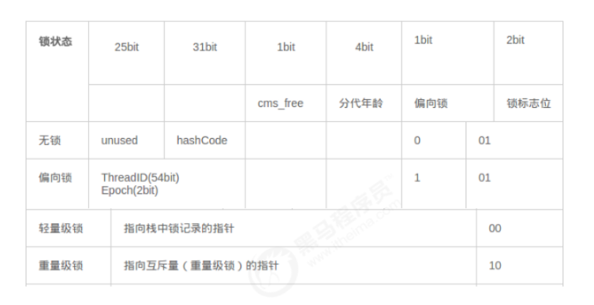
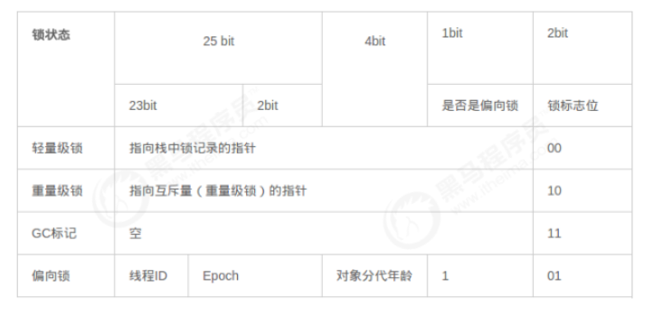
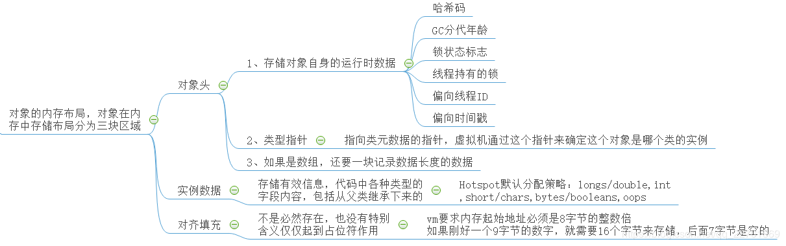
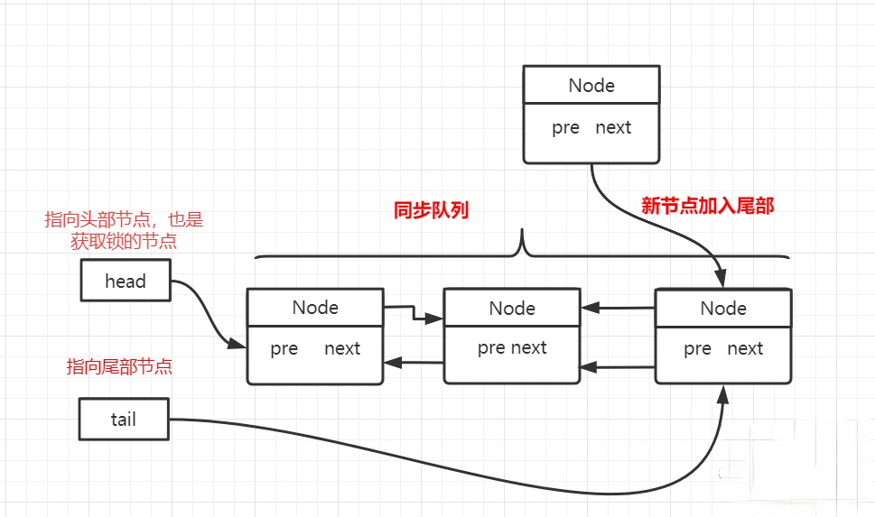
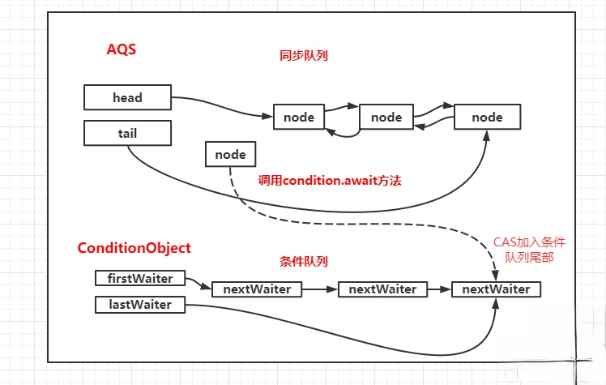
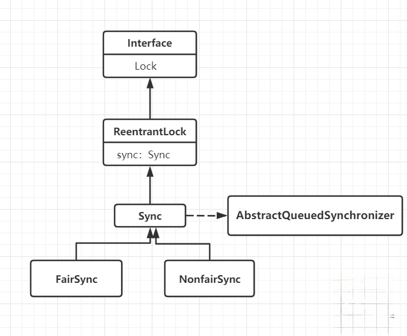

# JVM底层原理（深入JDK）

## JMM内存模型（java Memory Model）
### 现代计算机模型基础理论知识
计算机之父冯诺依曼1945年提出计算机由五大组成部分，输入设置，输出设备存储器(内存和外存)，控制器，运算器

CPU缓存分成三个级别：L1,L2,L3 级别越小越靠近CPU，速度越块，容量越小

### synchronized三大特性：原子性、可见性、一致性
- 原子性
```java
//定义一个共享变量 number
//对number进行1000次 ++ 操作
//使用 5 个线程来进行
public class Test02Atomicity {
    //1、定义一个共享变量 number
    private static int number = 0;
    private static Object obj = new Object();
​
    public static void main(String[] args) throws InterruptedException {
        Runnable increment = () -> {
            for (int i = 0; i < 10000; i++) {
                synchronized (obj) {
                    number++;
                }
            }
        };
        List<Thread> list = new ArrayList<>();
​
        for (int i = 0; i < 5; i++) {
            Thread t = new Thread(increment);
            t.start();
            list.add(t);
        }
        for (Thread thread : list) {
            thread.join();
        }
        System.out.println("number=" + number);
    }
}
```

synchronized 保证原子性的原理

对 number++；增加同步代码快，保证同一时间只有一个线程操作 number++；。就不会出现安全问题

- 可见性
```java
//创建一个共享变量mber
//创建一条线程不断的读取共享变量++ 操作
//创建一条线程修改共享变量
public class Test01Visibility {
    // 多个线程都会访问的数据，我们称为线程的共享数据
    private static boolean flag = true;
    private static Object obj = new Object();
​
    public static void main(String[] args) throws InterruptedException {
        new Thread(() -> {
            while (flag) {
                synchronized (obj) {
                }
            }
        }).start();
​
        TimeUnit.SECONDS.sleep(1);
​
        new Thread(() -> {
            flag = false;
            System.out.println("时间到，线程2设置为false");
        }).start();
    }
}
```

synchronized 保证可见性的原理

执行 synchronized时，会对应执行 lock 原子操作会刷新工作内存中共享变量的值

- 一致性

为了提高程序的执行效率，编译器和CPU对象程序中的代码进行重排序,有依赖关系，不能重排序

```java
int a = 1;
int b = 2;
int c = a + b;
```

synchronized 保证有序性的原理

synchronized后，依然会发生重排序，只不过有同步代码块可以保证只有一个线程执行同步代码块的代码

多线程下重排会影响结果，可使用`jcstress`测试

### synchronized特性

- 可重入特性：一个线程可以重复进入synchronized，重复获取同一把锁
- 不可中断特性：synchronized是不可中断的，处于阻塞状态的线程会一直等待锁
  - Lock的lock方法是不可中断的
  - Lock的tryLock方法是可中断的

### happens-before原则


### Volatile的使用场景和底层实现原理


### ThreadLocal的使用场景和底层源码分析


## 并发同步处理

### synchronized内置锁实现原理（反汇编和JVM源码）
JDK源码下载地址http://hg.openjdk.java.net/
#### monitorenter原理

每一个对象都会和一个监视器monitor（C++对象）关联。监视器被占用时会被锁住，其他线程无法来获取该monitor。 当JVM执行某个线程的某个方法内部的monitorenter时，它会尝试去获取当前对象对应的monitor的所有权。其过程如下：
- 若monior的进入数为0，线程可以进入monitor，并将monitor的进入数置为1。当前线程成为monitor的owner（所有者）
- 若线程已拥有monitor的所有权，允许它重入monitor，则进入monitor的进入数加1
- 若其他线程已经占有monitor的所有权，那么当前尝试获取monitor的所有权的线程会被阻塞，直到monitor的进入数变为0，才能重新尝试获取monitor的所有权

总结：synchronized的锁对象会关联一个monitor,这个monitor不是我们主动创建的,而是JVM的线程执行到这个同步代码块,发现锁对象没有monitor就会创建monitor,monitor内部有两个重要的成员变量owner:拥有这把锁的线程,recursions会记录线程拥有锁的次数,当一个线程拥有monitor后，其他线程只能等待

#### monitorexit原理
- 能执行monitorexit指令的线程一定是拥有当前对象的monitor的所有权的线程
- 执行monitorexit时会将monitor的进入数减1。当monitor的进入数减为0时，当前线程退出monitor，不再拥有monitor的所有权，此时其他被这个monitor阻塞的线程可以尝试去获取这个monitor的所有权

#### synchronized与lock的区别：
- synchronized是一个关键字，而lock是一个接口。
- synchronized会自动释放锁，而lock必须手动释放锁。
- synchronized是不可中断的，而lock是可中断也可不中断。
- 通过lock可以知道线程是否拿到锁，而synchronized不能。
- synchronized可以锁住方法和代码块，而lock只能锁住代码块。
- synchronized是非公平锁（就是调用任意一个等待线程，不是先来先调），ReentrantLock可以控制是否公平。
- lock可以使用读锁来提高多线程效率。（ReentrantReadWriteLock）

#### monitor监视器锁

在HotSpot虚拟机中，monitor是由ObjectMonitor实现的。其源码是用c++来实现的，位于HotSpot虚拟机源码ObjectMonitor.hpp文件中(src/share/vm/runtime/objectMonitor.hpp)。ObjectMonitor主要数据结构如下：

```C
ObjectMonitor() {
    _header = NULL;
    _count = 0;
    _waiters = 0，
    _recursions = 0; // 线程的重入次数
    _object = NULL; // 存储该monitor的对象
    _owner = NULL; // 标识拥有该monitor的线程
    _WaitSet = NULL; // 处于wait状态的线程，会被加入到_WaitSet
    _WaitSetLock = 0 ;
    _Responsible = NULL;
    _succ = NULL;
    _cxq = NULL; // 多线程竞争锁时的单向列表
    FreeNext = NULL;
    _EntryList = NULL; // 处于等待锁block状态的线程，会被加入到该列表
    _SpinFreq = 0;
    _SpinClock = 0;
    OwnerIsThread = 0;
}
void ATTR ObjectMonitor::enter(TRAPS)  {
    ...
    //获取锁：cmpxchg_ptr原子操作，尝试将_owner替换为自己，并返回旧值
    cur = Atomic::cmpxchg_ptr (Self, &_owner, NULL) ;
    ...
    // 重复获取锁，次数加1，返回
    if (cur == Self) {
        _recursions ++ ;
        return ;
    }
    //首次获取锁情况处理
    if (Self->is_lock_owned ((address)cur)) {
        assert (_recursions == 0, "internal state error");
        _recursions = 1 ;
        _owner = Self ;
        OwnerIsThread = 1 ;
        return ;
    }
    ...
    //尝试自旋获取锁
    if (Knob_SpinEarly && TrySpin (Self) > 0) {
    ...
```

- _owner：初始时为NULL。当有线程占有该monitor时，owner标记为该线程的唯一标识。当线程释放monitor时，owner又恢复为NULL。owner是一个临界资源，JVM是通过CAS操作来保证其线程安全的。 ​ 
- _cxq：竞争队列，所有请求锁的线程首先会被放在这个队列中（单向链接）。_cxq是一个临界资源，JVM通过CAS原子指令来修改cxq队列。修改前cxq的旧值填入了node的next字段，_cxq指向新值（新线程）。因此_cxq是一个后进先出的stack（栈）。 ​ 
- _EntryList：_cxq队列中有资格成为候选资源的线程会被移动到该队列中。 ​ 
- _WaitSet：因为调用wait方法而被阻塞的线程会被放在该队列中。

>每一个Java对象都可以与一个监视器monitor关联，我们可以把它理解成为一把锁，当一个线程想要执行一段被synchronized圈起来的同步方法或者代码块时，该线程得先获取到synchronized修饰的对象对应的monitor。 我们的Java代码里不会显示地去创造这么一个monitor对象，我们也无需创建，事实上可以这么理解：monitor并不是随着对象创建而创建的。我们是通过synchronized修饰符告诉JVM需要为我们的某个对象创建关联的monitor对象。每个线程都存在两个ObjectMonitor对象列表，分别为free和used列表。同时JVM中也维护着global locklist。当线程需要ObjectMonitor对象时，首先从线程自身的free表中申请，若存在则使用，若不存在则从global list中申请

#### monitor竞争

- 通过CAS尝试把monitor的owner字段设置为当前线程。
- 如果设置之前的owner指向当前线程，说明当前线程再次进入到monitor，即是重入锁，执行 recursions++，记录重入的次数。
- 如果当前线程是第一次进入monitor，设置recursions为1，_owner为当前线程，该线程成功获得并返回。
- 如果获取锁失败，则等待锁的释放。

#### monitor等待

- 当前线程被封装成ObjectWaiter对象node，状态设置为ObjectWaiter::TS_CXQ。
- 在for循环中，通过CAS把node节点push到_cxq列表中，同一时刻可能有多个线程把自己的node节点push到_cxq列表中。
- node节点push到_cxq列表之后，通过自旋尝试获取锁，如果还是没有获取锁，则通过park将当前线程挂起，等待被唤醒。
- 当前线程被唤醒时，会从挂起的点继续执行，通过ObjectMonitor::TryLock尝试获取锁。

#### minotor释放
- 退出同步代码块时，_recursions--，当_recursions的值变为0时，说明线程释放了锁。

####  monitor是重量级锁

ObjectMonitor的函数调用会涉及到Atomic::cmpxchg_ptr，Atomic::inc_ptr等内核函数，执行同步代码块，没有竞争到锁的对象会被park()挂起，竞争到锁的线程会被unpark()唤醒。这个时候会存在操作系统用户态与内核态的转换，反复的切换会消耗大量的系统资源，因此synchronized是java语言中的一个重量级（Heavyweight）的操作。

### synchronized膨胀升级过程

无锁 --> 偏向锁（Biased Locking）--> 轻量级锁（Lightweight Locking）--> 重量级锁

对象在内存中存储的布局可以分为三块区域：对象头（Header），实例数据（Instance Data），对齐填充（Padding）

- 对象头
长度一般为32位或者64位，分为两部分信息：一部分用于存储对象自身的运行时数据，如哈希码，GC分代年龄，锁状态标志，线程持有的锁，偏向线程的ID，偏向时间戳等，称之为Mark Word。另一部分是类型指针，是对象指向他的类元数据的指针，用于确定是哪个类的实例（非必须）；如果是数组还需要有一块记录数组长度的数据

在64位虚拟机下，Mark Word是64bit大小的，其存储结构如下：


在32位虚拟机下，Mark Word是32bit大小的，其存储结构如下：



- 实例数据

在程序代码中定义的各种类型的字段内容，无论是继承的还是自己的。

- 对齐填充

非必须，内存管理系统要求对象起始地址必须是8字节的整数倍，通常用于填充实例数据。


- 偏向锁
  - 未加锁的时候，锁标志为01，包含哈希值、年龄分代和偏向锁标志位(0)
  - 施加偏向锁时，哈希值和一部分无用内存会转化为锁主人的线程信息，以及加锁时的时间戳epoch，此时锁标志位没变，偏向锁标志改为1
  - 加锁时先判断当前线程id是否与MarkWord的线程id是否一致，一致则执行同步代码；不一致则检查偏向标志是否偏向，未偏向则使用CAS加锁；未偏向CAS加锁失败和存在偏向锁会导致偏向锁膨胀为轻量级锁，或者重新偏向
  - 偏向锁只有遇到其他线程竞争偏向锁时，持有偏向锁的线程才会释放锁，线程不会主动去释放偏向锁
  - 偏向锁撤销
    - 1. 偏向锁的撤销动作必须等待全局安全点
    - 2. 暂停拥有偏向锁的线程，判断锁对象是否处于被锁定状态
    - 3. 撤销偏向锁，恢复到无锁（标志位为 01）或轻量级锁（标志位为 00）的状态
  - 偏向锁关闭
    - 1. 偏向锁在Java 6之后是默认启用的，但在应用程序启动几秒钟之后才激活，可以使用 -XX:BiasedLockingStartupDelay=0 参数关闭延迟
    - 2. 可以通过 XX:-UseBiasedLocking=false 参数关闭偏向锁
- 轻量级锁
  - 当发生多个线程竞争时，偏向锁会变为轻量级锁，锁标志位为00
  - 获得锁的线程会先将偏向锁撤销(在安全点)，并在栈桢中创建锁记录LockRecord，对象的MarkWord被复制到刚创建的LockRecord，然后CAS尝试将记录LockRecord的owner指向锁对象，再将锁对象的MarkWord指向锁，加锁成功
  - 如果CAS加锁失败，线程会自旋一定次数加锁，再失败则升级为重量级锁
- 重量级锁
  - 重量级锁就是上面介绍到synchronized使用监视器Monitor实现的锁机制
  - 竞争线程激烈，锁则继续膨胀，变为重量级锁，也是互斥锁，锁标志位为10，MarkWord其余内容被替换为一个指向对象锁Monitor的指针
- 自旋锁
  - 减少不必要的CPU上下文切换；在轻量级锁升级为重量级锁时，就使用了自旋加锁的方式 
- 锁粗化
  - 多次加锁操作在JVM内部也是种消耗，如果多个加锁可以合并为一个锁，就可减少不必要的开销  
- 锁消除
  - 删除不必要的加锁操作，如果变量是独属一个线程的栈变量，加不加锁都是安全的，编译器会尝试消除锁
  - 开启锁消除需要在JVM参数上设置-server -XX:+DoEscapeAnalysis -XX:+EliminateLocks
- 其他锁优化方法
  - 分段锁，分段锁也并非一种实际的锁，而是一种思想；ConcurrentHashMap是学习分段锁的最好实践。主要是将大对象拆成小对象，然后对大对象的加锁操作变成对小对象加锁，增加了并行度
  - 减少synchronized的范围
  - 降低synchronized锁的粒度


### AbstractQueuedSynchronizer(AQS)源码分析

AQS其实就是基于volatile+cas实现的锁模板；如果需要线程阻塞等待，唤醒机制，则使用LockSupport挂起、唤醒线程

```java
//AbstractQueuedSynchronizer.java
public class AbstractQueuedSynchronizer{
    //线程节点
    static final class Node {
        ...
        volatile Node prev;
        volatile Node next;
        volatile Thread thread;
        ...
    }    
    ....
    //head 等待队列头尾节点
    private transient volatile Node head;
    private transient volatile Node tail;
    // The synchronization state. 同步状态
    private volatile int state;  
    ...
    //提供CAS操作，状态具体的修改由子类实现
    protected final boolean compareAndSetState(int expect, int update) {
        return STATE.compareAndSet(this, expect, update);
    }
}
```

- AQS内部维护一个同步队列，元素就是包装了线程的Node
- 同步队列中首节点是获取到锁的节点，它在释放锁的时会唤醒后继节点，后继节点获取到锁的时候，会把自己设为首节点
  
```java
public final void acquire(int arg) {
        if (!tryAcquire(arg) &&
            acquireQueued(addWaiter(Node.EXCLUSIVE), arg))
            selfInterrupt();
}
```
- 线程会先尝试获取锁，失败则封装成Node，CAS加入同步队列的尾部。在加入同步队列的尾部时，会判断前驱节点是否是head结点，并尝试加锁(可能前驱节点刚好释放锁)，否则线程进入阻塞等待
  
在AQS还存一个ConditionObject的内部类，它的使用机制和Object.wait、notify类似

```java
//AbstractQueuedSynchronizer.java
public class ConditionObject implements Condition, java.io.Serializable {
    //条件队列;Node 复用了AQS中定义的Node
    private transient Node firstWaiter;
    private transient Node lastWaiter;
    ...
```
- 每个Condition对象内部包含一个Node元素的FIFO条件队列
- 当一个线程调用Condition.await()方法，那么该线程将会释放锁、构造Node加入条件队列并进入等待状态
```java
//类似Object.wait
public final void await() throws InterruptedException{
    ...
    Node node = addConditionWaiter(); //构造Node,加入条件队列
    int savedState = fullyRelease(node);
    int interruptMode = 0;
    while (!isOnSyncQueue(node)) {
        //挂起线程
        LockSupport.park(this);
        if ((interruptMode = checkInterruptWhileWaiting(node)) != 0)
            break;
    }
    //notify唤醒线程后，加入同步队列继续竞争锁
    if (acquireQueued(node, savedState) && interruptMode != THROW_IE)
        interruptMode = REINTERRUPT;
```
  

- 调用Condition.signal时，获取条件队列的首节点，将其移动到同步队列并且利用LockSupport唤醒节点中的线程。随后继续执行wait挂起前的状态，调用acquireQueued(node, savedState)竞争同步状态
```java
  //类似Object.notify
    private void doSignal(Node first) {
        do {
            if ( (firstWaiter = first.nextWaiter) == null)
                lastWaiter = null;
            first.nextWaiter = null;
        } while (!transferForSignal(first) &&
                 (first = firstWaiter) != null);
    }
```
  

- volatile+cas机制保证了代码的同步性和可见性，而AQS封装了线程阻塞等待挂起，解锁唤醒其他线程的逻辑。AQS子类只需根据状态变量，判断是否可获取锁，是否释放锁成功即可
- 继承AQS可选性重写以下几个接口
```java
protected boolean tryAcquire(int arg);//尝试独占性加锁
protected boolean tryRelease(int arg);//对应tryAcquire释放锁
protected int tryAcquireShared(int arg);//尝试共享性加锁
protected boolean tryReleaseShared(int arg);//对应tryAcquireShared释放锁
protected boolean isHeldExclusively();//该线程是否正在独占资源，只有用到condition才需要取实现它
```

### CAS使用场景和实现原理

```java
	private static sun.misc.Unsafe unsafe;
	private static long offset;
	private String[] table = { "1", "2", "3", "4" };
	static {
		try {
			Field field = Unsafe.class.getDeclaredField("theUnsafe");
			field.setAccessible(true);
			unsafe = (Unsafe) field.get(null);
			offset = unsafe.objectFieldOffset(UnsafeTest.class.getDeclaredField("i"));
		} catch (Exception e) { // Internal reference
			e.printStackTrace();
		}
	}

	public static void main(String[] args) {
		final UnsafeTest po = new UnsafeTest();
		// 数组中存储的对象的对象头大小
		int ns = unsafe.arrayIndexScale(String[].class);
		// 数组中第一个元素的起始位置
		int base = unsafe.arrayBaseOffset(String[].class);
		System.out.println(unsafe.getObject(po.table, base + 3 * ns));
	}
    public static void main2(String[] args) {
		final UnsafeTest po = new UnsafeTest();
		new Thread(new Runnable() {
			@Override
			public void run() {
				while (true) {
					boolean b = unsafe.compareAndSwapInt(po, offset, po.i, po.i + 1);
					if (b)
						System.out.println(unsafe.getIntVolatile(po, offset));
					try {
						Thread.sleep(500);
					} catch (InterruptedException e) {
						// TODO Auto-generated catch block
						e.printStackTrace();
					}
				}
			}
		}).start();
```

在Linux的x86，Atomic::cmpxchg方法的实现如下
```C
/**
    1 __asm__表示汇编的开始；
    2 volatile表示禁止编译器优化；//禁止指令重排
    3 LOCK_IF_MP是个内联函数，
      根据当前系统是否为多核处理器，
      决定是否为cmpxchg指令添加lock前缀 //内存屏障
*/
inline jint Atomic::cmpxchg (jint exchange_value, volatile jint* dest, jint compare_value) {
  int mp = os::is_MP();
  __asm__ volatile (LOCK_IF_MP(%4) "cmpxchgl %1,(%3)"
                    : "=a" (exchange_value)
                    : "r" (exchange_value), "a" (compare_value), "r" (dest), "r" (mp)
                    : "cc", "memory");
  return exchange_value;
}
```

总结：jdk提供的CAS机制，在汇编层级，会禁止变量两侧的指令优化，然后使用cmpxchg指令比较并更新变量值(原子性)，如果是多核则使用lock锁定(缓存锁、MESI)

#### CAS同步操作的问题

- ABA问题
  - 线程X准备将变量的值从A改为B，然而这期间线程Y将变量的值从A改为C，然后再改为A；最后线程X检测变量值是A，并置换为B。但实际上，A已经不再是原来的A了
  - 解决方法，是把变量定为唯一类型。值可以加上版本号，或者时间戳。如加上版本号，线程Y的修改变为A1->B2->A3，此时线程X再更新则可以判断出A1不等于A3
- 只能保证一个共享变量的原子操作
  - 只保证一个共享变量的原子操作，对多个共享变量同步时，循环CAS是无法保证操作的原子

#### 基于volatile + CAS 实现同步锁的原理
- CAS只能同步一个变量的修改，我们又应该如何用它来锁住代码块呢？
- 先说说实现锁的要素
  - 1 同步代码块同一时刻只能有一个线程能执行
  - 2 加锁操作要happens-before同步代码块里的操作，而代码块里的操作要happens-before解锁操作
  - 3 同步代码块结束后相对其他线程其修改的变量是可见的 (内存可见性)
- 要素1：可以利用CAS的原子性来实现，任意时刻只有一个线程能成功操作变量
  - 先设想CAS操作的共享变量是一个关联代码块的同步状态变量，同步开始之前先CAS更新状态变量为加锁状态，同步结束之后，再CAS状态变量为无锁状态
  - 如果期间有第二个线程来加锁，则会发现状态变量为加锁状态，则放弃执行同步代码块
- 要素2：使用volatile修饰状态变量，禁止指令重排
  - volatile保证同步代码里的操作happens-before解锁操作，而加锁操作happens-before代码块里的操作
- 要素3：还是用volatile，volatile变量写指令前后会插入内存屏障
  - volatile修饰的状态变量被CAS为无锁状态前，同步代码块的脏数据就会被更新，被各个线程可见

```java
//伪代码
volatile state = 0 ;   // 0-无锁 1-加锁；volatile禁止指令重排，加入内存屏障
...
if(cas(state, 0 , 1)){ // 1 加锁成功，只有一个线程能成功加锁
    ...                // 2 同步代码块
    cas(state, 1, 0);  // 3 解锁时2的操作具有可见性
}
```

### 乐观锁、悲观锁、重入锁、公平锁、非公平锁粒度

#### 乐观锁

总是假设最好的情况，每次去拿数据的时候都认为别人不会修改，所以不会上锁，但是在更新的时候会判断一下在此期间别人有没有去更新这个数据，可以使用版本号机制和CAS算法实现。

乐观锁适用于多读的应用类型，这样可以提高吞吐量，像数据库提供的类似于write_condition机制，其实都是提供的乐观锁。

在Java中java.util.concurrent.atomic包下面的原子变量类就是使用了乐观锁的一种实现方式CAS实现的。

CAS在获取共享变量时，为了保证该变量的可见性，需要使用volatile修饰，结合CAS和volatile操作，可以实现无锁并发，适用于竞争不激烈、多核CPU的场景下。

因为没有使用synchronized，所以线程不会陷入阻塞，这是提升效率的重要因素之一。

但如果竞争激烈，就会导致重试频繁发生，进而降低效率。

#### 悲观锁
总是假设最坏的情况，每次去拿数据的时候都认为别人会修改，所以每次在拿数据的时候都会上锁，这样别人想拿这个数据就会阻塞直到它拿到锁（共享资源每次只给一个线程使用，其它线程阻塞，用完后再把资源转让给其它线程）。传统的关系型数据库里边就用到了很多这种锁机制，比如行锁，表锁等，读锁，写锁等，都是在做操作之前先上锁。Java中synchronized和ReentrantLock等独占锁就是悲观锁思想的实现。

#### 重入锁
所谓重入锁，指的是以线程为单位，当一个线程获取对象锁之后，这个线程可以再次获取本对象上的锁，而其他的线程是不可以的。

synchronized 和ReentrantLock 都是可重入锁。可重入锁的意义在于防止死锁。

实现原理是通过为每个锁关联一个请求计数器和一个占有它的线程。当计数为0时，认为锁是未被占有的；线程请求一个未被占有的锁时，JVM将记录锁的占有者，并且将请求计数器置为1 。

如果同一个线程再次请求这个锁，计数将递增，每次占用线程退出同步块，计数器值将递减。直到计数器为0,锁被释放。

#### 公平锁

公平锁就是很公平，在并发环境中，每个线程在获取锁时会先查看此锁维护的等待队列，如果为空，或者当前线程是等待队列的第一个，就占有锁，否则就会加入到等待队列中，以后会按照FIFO的规则从队列中取到自己。

公平锁的优点是等待锁的线程不会饿死。缺点是整体吞吐效率相对非公平锁要低，等待队列中除第一个线程以外的所有线程都会阻塞，CPU唤醒阻塞线程的开销比非公平锁大

#### 非公平锁

上来就直接尝试占有锁，如果尝试失败，就再采用类似公平锁那种方式。

非公平锁的优点是可以减少唤起线程的开销，整体的吞吐效率高，因为线程有几率不阻塞直接获得锁，CPU不必唤醒所有线程。缺点是处于等待队列中的线程可能会饿死，或者等很久才会获得锁

java jdk并发包中的ReentrantLock可以指定构造函数的boolean类型来创建公平锁和非公平锁（默认）,比如：公平锁可以使用new ReentrantLock(true)实现

### ReentrantLock源码分析
  

- ReentrantLock实现了Lock接口，并使用内部类Sync(Sync继承AbstractQueuedSynchronizer)来实现同步操作
- ReentrantLock内部类Sync
```java
abstract static class Sync extends AbstractQueuedSynchronizer{
    .... 
    final boolean nonfairTryAcquire(int acquires) {
            final Thread current = Thread.currentThread();
            int c = getState();
            if (c == 0) {
                //直接CAS状态加锁，非公平操作
                if (compareAndSetState(0, acquires)) { 
                    setExclusiveOwnerThread(current);
                    return true;
                }
            }
    ...
    //重写了tryRelease
    protected final boolean tryRelease(int releases) {
        c = state - releases; //改变同步状态
        ...
        //修改volatile 修饰的状态变量
        setState(c); 
        return free;
    }
}
```
- Sync的子类NonfairSync和FairSync都重写了tryAcquire方法
- 其中NonfairSync的tryAcquire调用父类的nonfairTryAcquire方法, FairSync则自己重写tryAcquire的逻辑。其中调用hasQueuedPredecessors()判断是否有排队Node，存在则返回false（false会导致当前线程排队等待锁）
```java
   static final class NonfairSync extends Sync {
        protected final boolean tryAcquire(int acquires) {
            return nonfairTryAcquire(acquires);
        }
    }
    ....
    static final class FairSync extends Sync {
        protected final boolean tryAcquire(int acquires) {
            final Thread current = Thread.currentThread();
            int c = getState();
            if (c == 0) {
                if (!hasQueuedPredecessors() &&   
                    compareAndSetState(0, acquires)) {
                    setExclusiveOwnerThread(current);
                    return true;
                }
            }
    ....    
```

### ReentrantReadWriteLock源码分析
### Condition源码分析
### LockSupport源码分析
LockSupport是基于Unsafe类，由JDK提供的线程操作工具类，主要作用就是挂起线程，唤醒线程。Unsafe.park，unpark操作时，会调用当前线程的变量parker代理执行。Parker代码

```java
public static void park(Object blocker); // 暂停当前线程
public static void parkNanos(Object blocker, long nanos); // 暂停当前线程，不过有超时时间的限制
public static void parkUntil(Object blocker, long deadline); // 暂停当前线程，直到某个时间
public static void park(); // 无期限暂停当前线程
public static void parkNanos(long nanos); // 暂停当前线程，不过有超时时间的限制
public static void parkUntil(long deadline); // 暂停当前线程，直到某个时间
public static void unpark(Thread thread); // 恢复当前线程
public static Object getBlocker(Thread t);
```

## 并发常用工具类

## 线程池源码

队列分为：阻塞式队列(有界)、非阻塞式队列(无界),遵循着先进先出。阻塞队列与非阻塞队列区别：
-  1.非阻塞式队列超出队列总数会丢失。
-  2.阻塞式队列超出总数会进入等待（等待时间=设置超时时间）。
-  3.获取队列方面：非阻塞式队列，如果为空返回null。阻塞式队列，如果为空也会进入等待。

为什么要使用线程池：
-  1、系统执行多任务时，会为每个任务创建对应的线程，当任务执行结束之后会销毁对应的线程，在这种情况下对象被频繁的创建和销毁。
-  2、当对线程象被频繁时会占用大量的系统资源，在并发的过程中会造成资源竞争出现问题。大量的创建线程还会造成混乱，没有一个统一的管理机制，容易造成应用卡顿。
-  3、大量线程对象被频繁销毁，将会频繁出发GC机制，从而降低性能。

引入线程池的好处：
-  1、重用线程池中的线程，避免因频繁创建和销毁线程造成的性能消耗。
-  2、更加有效的控制线程的最大并发数，防止线程过多抢占资源造成的系统阻塞。
-  3、对线程进行有效的管理。

### newCachedThreadPool
可缓存线程池，如果线程池长度超过处理需要，可灵活回收空闲线程，若无可回收，则新建线程。
```java
    //可缓存、定时、定长、单例 
    //SynchronousQueue
    ExecutorService executorService = Executors.newCachedThreadPool();
    for (int i = 0; i <10 ; i++) {
        final int i1 = i;
        executorService.execute(new Runnable() {
            @Override
            public void run() {
                System.out.println(Thread.currentThread().getName()+",i:"+ i1);
            }
        });
    }
```

### newFixedThreadPool 定长线程池
定长线程池，可控制线程最大并发数，超出的线程会在队列中等待。
```java
    //可定长线程,核心线程5个,最多创建5个线程 (只会创建5个线程,其他线程共享这5个线程)
    //LinkedBlockingQueue
    ExecutorService executorService = Executors.newFixedThreadPool(5);
    for (int i = 0; i <10 ; i++) {
        final int i1 = i;
        executorService.execute(new Runnable() {
            @Override
            public void run() {
                System.out.println(Thread.currentThread().getName()+",i:"+ i1);
            }
        });
    }
```

### newScheduledThreadPool 可定时线程池
可定时线程池，支持定时及周期性任务执行。
```java
    //可定时线程 =>核心线程数3 (延迟三秒执行)
    //DelayedWorkQueue
    long l = System.currentTimeMillis();
    ScheduledExecutorService scheduledExecutorService = Executors.newScheduledThreadPool(3);
    for (int i = 0; i <10 ; i++) {
        final int i1 = i;
        scheduledExecutorService.schedule(new Runnable() {
            @Override
            public void run() {
                System.out.println(Thread.currentThread().getName()+",i:"+ i1);
                System.out.println("耗时："+ (System.currentTimeMillis() -l)/1000 +"秒" );
            }
        },3, TimeUnit.SECONDS);
    }
```

### newSingleThreadExecutor 单例线程池
单例线程池，它只会用唯一的工作线程来执行任务，保证所有任务按照指定顺序(FIFO, LIFO, 优先级)执行。
```java
    //单例线程 =>核心线程数1 最大线程数1
    //LinkedBlockingQueue
    ExecutorService executorService = Executors.newSingleThreadExecutor();
    for (int i = 0; i <10 ; i++) {
        final int i1 = i;
        executorService.execute(new Runnable() {
            @Override
            public void run() {
                System.out.println(Thread.currentThread().getName()+",i:"+ i1);
            }
        });
    }
```

### 自定义线程池
```java
 public ThreadPoolExecutor(int corePoolSize,//核心线程数
                              int maximumPoolSize,//最大线程数
                              long keepAliveTime,//空闲线程的存活时间
                              TimeUnit unit,//时间单位
                              BlockingQueue<Runnable> workQueue,//任务队列
                              ThreadFactory threadFactory,//线程工厂
                              RejectedExecutionHandler handler)//拒绝策略 默认AbortPolicy
```
### Fork Join源码解析和使用场景
