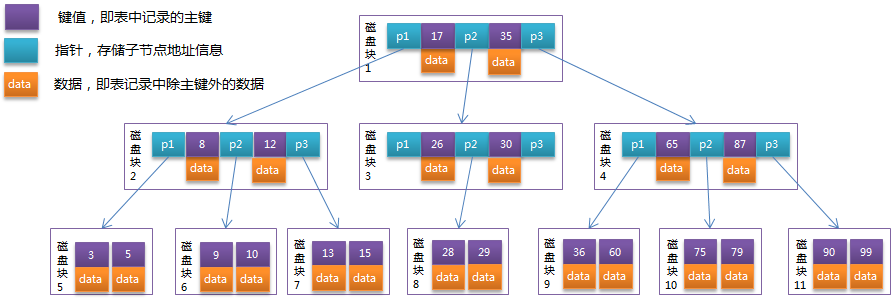

# 数据库原理调优

## 1. Redis

## 2. MongoDB

## 3. Mysql

>索引本质是排好序的数据结构

### hash数据结构

定义：散列表（Hash table，也叫哈希表），是根据关键码值(Key value)而直接进行访问的数据结构。也就是说，它通过把关键码值映射到表中一个位置来访问记录，以加快查找的速度。这个映射函数叫做散列函数，存放记录的数组叫做散列表。 对目标值进行hash运算得到hash值和数据磁盘指针地址保存到hash表，这样就达到快速定位数据位置。

缺点：精确查找十分快速，但范围查找就碰壁了。

### BTree

定义：一个节点可以存储多个数据，这样可以避免黑红树的缺点，树的层数很变小。

缺点：  节点里面数组数据：每个数据的结构=索引数据+数据记录（即叶子节点存储键值和数据记录）

### B+Tree

定义：B+Tree是在B-Tree基础上的一种优化。`节点里面数组数据：每个数据只存储键信息`，这样不存数据可以腾出空间放更多的键信息，让树层数越小
   - 非叶子节点只存储键信息。
   - `所有叶子节点之间都有一个链指针`
   - 数据记录都存放在叶子节点中

### mysql为什么用整型自增作为索引比较好。而UUID作为索引效率比较低
   - 索引存储在磁盘，而且树的每个节点分配的空间有大小。整型占空间比较小，这样可以存放多个键值。反之然后UUID占空间比较大
   - 整型比较方便，UUID比较需要先转成ASCII在进行比较，`顺序往后插入提升速度`

最左前缀

myisam数据索引分离 innodb在一起
 
局部性原理 4kb 一页

行溢出65535，数据长度限制

**版本链:**

对于使用InnoDB存储引擎的表来说，它的聚簇索引记录中都包含两个必要的隐藏列（ row_id并不是必要的，我们创建的表中有主键或者非NULL唯一键时都不会包含row_id列）：

>trx_id：每次对某条记录进行改动时，都会把对应的事务id赋值给trx_id隐藏列。
>roll_pointer：每次对某条记录进行改动时，这个隐藏列会存一个指针，可以通过这个指针找到该记录修改前的信息 

**readView 结构:**
1. m_ids: 一个列表, 存储当前系统活跃的事务id (重点)
2. min_trx_id: 存m_ids的最小值
3. max_trx_id: 系统分配给下一个事务的id
4. creator_trx_id: 生成readView事务的事务id

注意max_trx_id并不是m_ids中的最大值，事务id是递增分配的。比方说现在有id为1， 2， 3这三个事务，之后id为3的事务提交了。那么一个新的读事务在生成ReadView时， m_ids就包括1和2， min_trx_id的值就是1，max_trx_id的值就是4。

有了这个ReadView，这样在访问某条记录时，只需要按照下边的步骤判断记录的某个版本是否可见：

1. 如果被访问版本的trx_id属性值与ReadView中的creator_trx_id值相同，意味着当前事务在访问它自己修改过的记录，所以该版本可以被当前事务访问。
2. 如果被访问版本的trx_id属性值小于ReadView中的min_trx_id值，表明生成该版本的事务在当前事务生成ReadView前已经提交，所以该版本可以被当前事务访问。
3. 如果被访问版本的trx_id属性值大于ReadView中的max_trx_id值，表明生成该版本的事务在当前事务生成ReadView后才开启，所以该版本不可以被当前事务访问。
4. 如果被访问版本的trx_id属性值在ReadView的min_trx_id和max_trx_id之间，那就需要判断一下trx_id属性值是不是在m_ids列表中，如果在，说明创建ReadView时生成该版本的事务还是活跃的，该版本不可以被访问；如果不在，说明创建ReadView时生成该版本的事务已经被提交，该版本可以被访问

MVCC（ Multi-Version Concurrency Control ，多版本并发控制）指的就是在使用READ COMMITTD、REPEATABLE READ这两种隔离级别的事务在执行普通的SEELCT操作时访问记录的版本链的过程。可以使不同事务的读-写、写-读操作并发执行，从而提升系统性能。 READ COMMITTD、 REPEATABLE READ这两个隔离级别的一个很大不同就是：生成ReadView的时机不同， READ COMMITTD在每一次进行普通SELECT操作前都会生成一个ReadView，而REPEATABLE READ只在第一次进行普通SELECT操作前生成一个ReadView，之后的查询操作都重复使用这个ReadView就好了

**锁**
1. 从性能上分为乐观锁(用版本对比来实现)和悲观锁
2. 从对数据库操作的类型分，分为读锁和写锁(都属于悲观锁)
   - 读锁（共享锁）：针对同一份数据，多个读操作可以同时进行而不会互相影响
   - 写锁（排它锁）：当前写操作没有完成前，它会阻断其他写锁和读锁
3. 从对数据操作的粒度分，分为表锁和行锁

## 4. Oracle

| 隔离级别| 脏读可能性 | 不可重复度可能性 | 幻读可能性 | 加锁读 |
| ----- | ----- | ----- | ----- | ----- | 
| READ UNCOMMITTED| 是 | 是 | 是 | 否 | 
| READ COMMITTED| 否 | 是 | 是 | 否 | 
| REPEATABLE READ| 否 | 否 | 是 | 否 | 
| SERIALIZABLE| 否 | 否 | 否 | 是 | 

mysql和oracle的区别：

1、类型和成本的区别

oracle数据库是一个对象关系数据库管理系统（ORDBMS），一个重量型数据库。它通常被称为Oracle RDBMS或简称为Oracle，是一个收费的数据库。

MySQL是一个开源的关系数据库管理系统（RDBMS），一个是轻量型数据库。它是世界上使用最多的RDBMS，作为服务器运行，提供对多个数据库的多用户访问。它是一个开源、免费的数据库。

2、存储上的区别

与Oracle相比，MySQL没有表空间，角色管理，快照，同义词和包以及自动存储管理。

3、安全性上的区别

MySQL使用三个参数来验证用户，即用户名，密码和位置；Oracle使用了许多安全功能，如用户名，密码，配置文件，本地身份验证，外部身份验证，高级安全增强功能等。

4、对事务的支持

MySQL在innodb存储引擎的行级锁的情况下才可支持事务，而Oracle则完全支持事务

5、性能诊断上的区别

MySQL的诊断调优方法较少，主要有慢查询日志。

Oracle有各种成熟的性能诊断调优工具，能实现很多自动分析、诊断功能。比如awr、addm、sqltrace、tkproof等

6、管理工具上的区别

MySQL管理工具较少，在linux下的管理工具的安装有时要安装额外的包（phpmyadmin， etc)，有一定复杂性。

Oracle有多种成熟的命令行、图形界面、web管理工具，还有很多第三方的管理工具，管理极其方便高效。

7、并发性上的区别

MySQL以表级锁为主，对资源锁定的粒度很大，如果一个session对一个表加锁时间过长，会让其他session无法更新此表中的数据。虽然InnoDB引擎的表可以用行级锁，但这个行级锁的机制依赖于表的索引，如果表没有索引，或者sql语句没有使用索引，那么仍然使用表级锁。

Oracle使用行级锁，对资源锁定的粒度要小很多，只是锁定sql需要的资源，并且加锁是在数据库中的数据行上，不依赖与索引。所以Oracle对并发性的支持要好很多。

8、 保存数据的持久性

MySQL是在数据库更新或者重启，则会丢失数据，Oracle把提交的sql操作线写入了在线联机日志文件中，保持到了磁盘上，可以随时恢复

9、事务隔离级别上的区别

MySQL是read commited的隔离级别，而Oracle是repeatable read的隔离级别，同时二者都支持serializable串行化事务隔离级别，可以实现最高级别的读一致性。每个session提交后其他session才能看到提交的更改。

Oracle通过在undo表空间中构造多版本数据块来实现读一致性，每个session查询时，如果对应的数据块发生变化，Oracle会在undo表空间中为这个session构造它查询时的旧的数据块

MySQL没有类似Oracle的构造多版本数据块的机制，只支持read commited的隔离级别。一个session读取数据时，其他session不能更改数据，但可以在表最后插入数据。session更新数据时，要加上排它锁，其他session无法访问数据。

10、操作上的一些区别

①主键

Mysql一般使用自动增长类型，在创建表时只要指定表的主键为auto_increment，插入记录时，不需要再指定该记录的主键值，Mysql将自动增长；

Oracle没有自动增长类型，主键一般使用的序列，插入记录时将序列号的下一个值付给该字段即可；只是ORM框架是只要是native主键生成策略即可。

②单引号的处理

MYSQL里可以用双引号包起字符串，ORACLE里只可以用单引号包起字符串。在插入和修改字符串前必须做单引号的替换：把所有出现的一个单引号替换成两个单引号。

③翻页的SQL语句的处理

MYSQL处理翻页的SQL语句比较简单，用LIMIT 开始位置，记录个数；ORACLE处理翻页的SQL语句就比较繁琐了。

④ 空字符的处理

MYSQL的非空字段也可以有空的内容，ORACLE里定义了非空字段就不容许有空的内容。

⑤字符串的模糊比较

MYSQL里用 字段名 like '%字符串%'；ORACLE里也可以用 字段名 like '%字符串%' 但这种方法不能使用索引， 速度不快。

netca

dbca

1. lsnrctl start--启动监听
2. sqlplus /as dba
   1. start up
3. isqlplusctl start 
4. emctl start dbconsole

netstat -tulnp|grep 5560 -查看端口号是否被占用

## 5. Mycat

## 6. ShardingSphere

## 7. DBLE

## 8. 分布式数据库OceanBase