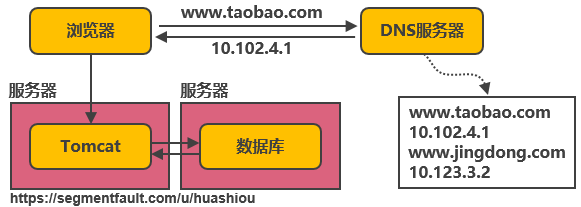
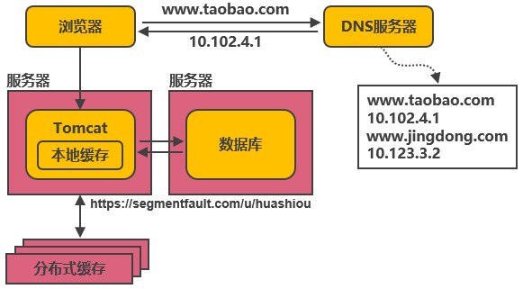
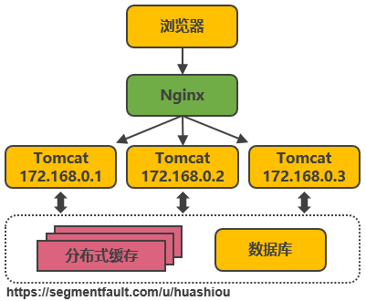
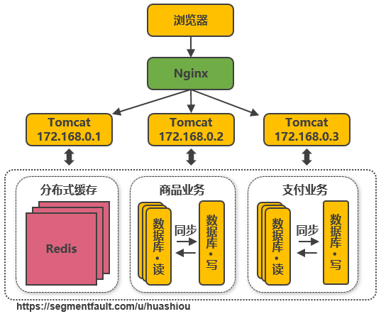
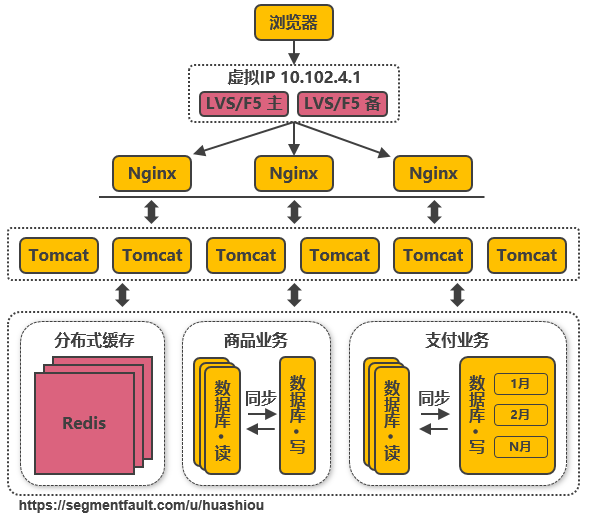
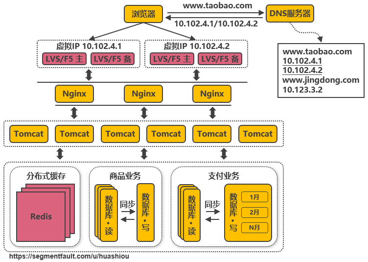
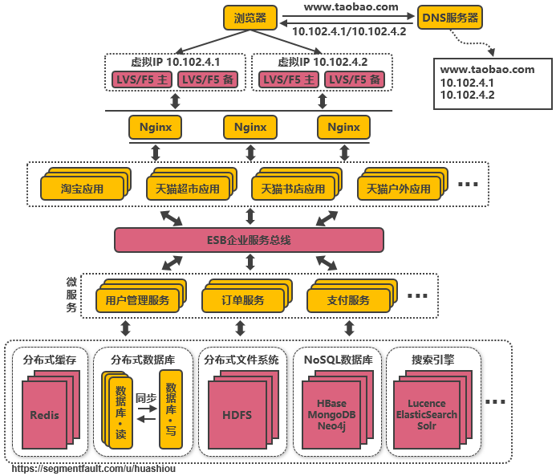
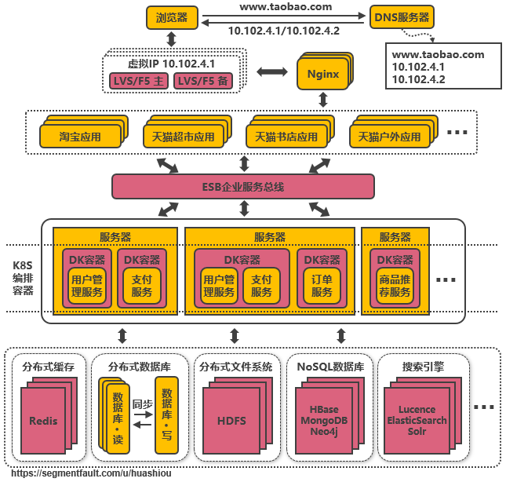
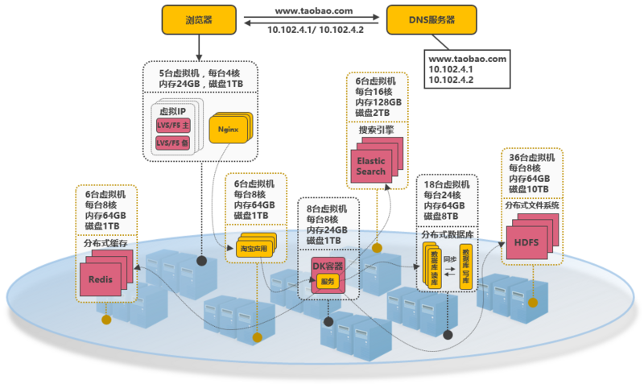

# 服务端高并发分布式架构演进之路

## 架构演进

###  第一次演进：Tomcat与数据库分开部署

### 第二次演进：引入本地缓存和分布式缓存

### 第三次演进：引入反向代理实现负载均衡

### 第四次演进：数据库读写分离

### 第五次演进：数据库按业务分库

### 第六次演进：把大表拆分为小表

### 第七次演进：使用LVS或F5来使多个Nginx负载均衡

### 第八次演进：通过DNS轮询实现机房间的负载均衡

### 第九次演进：引入NoSQL数据库和搜索引擎等技术

### 第十次演进：大应用拆分为小应用

### 第十一次演进：复用的功能抽离成微服务

### 第十二次演进：引入企业服务总线ESB屏蔽服务接口的访问差异

### 第十三次演进：引入容器化技术实现运行环境隔离与动态服务管理

### 第十四次演进：以云平台承载系统

