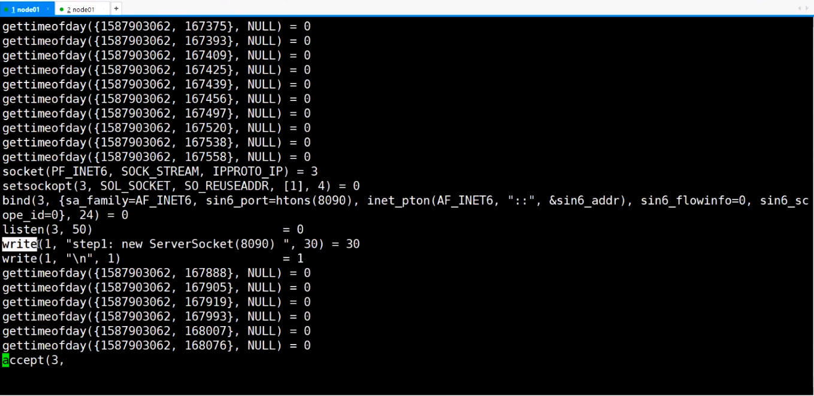
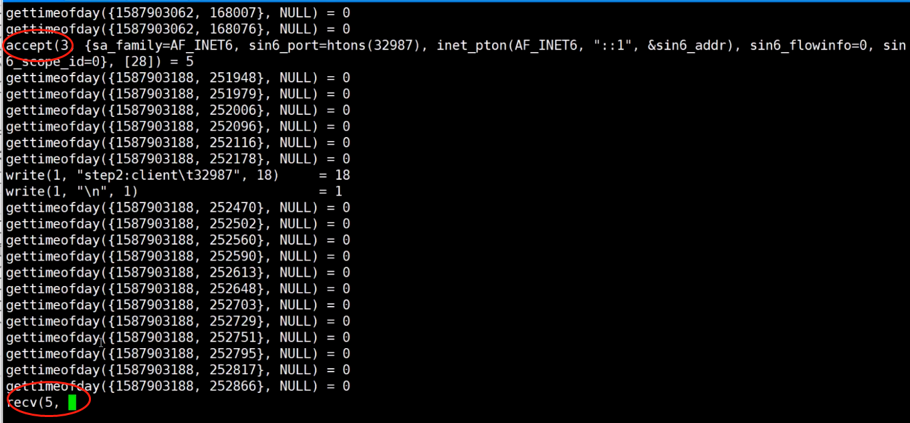
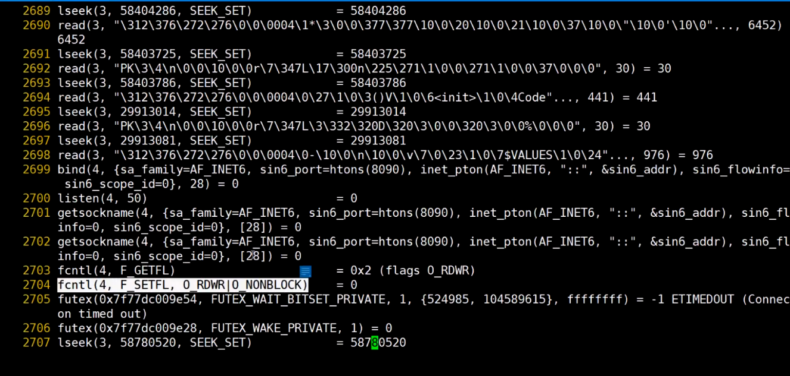

# 网络通信

## 1. 网络协议详解

## 2. socket底层原理

## 3. IO模型

### BIO底层原理
```java
public class OldSocket {
	public static void main(String[] args) throws IOException {
		ServerSocket server = new ServerSocket(8090);
		System.out.println("step1: new ServerSocket 8090");
		Socket client = server.accept();
		System.out.println("step1: client\t" + client.getPort());
		InputStream in = client.getInputStream();
		BufferedReader reader = new BufferedReader(new InputStreamReader(in));
		System.out.println(reader.readLine());
		for (;;) {
		}
	}
}
```

```bash
strace -ff -o out /usr/java/j2sdk1.4.2_18/bin/java OldSocket
```
1.4jdk accept和recv都会产生阻塞 





```bash
strace -ff -o out /usr/java/jdk1.8.0_181/bin/java OldSocket,
```

1.8jdk 使用非阻塞模型poll


### NIO底层原理

```java
public class ChannelSocket {
	public static void main(String[] args) throws IOException {
		ServerSocketChannel ss= ServerSocketChannel.open();
		ss.bind(new InetSocketAddress(8090));
		ss.configureBlocking(false);
		while(true) {
			SocketChannel client=ss.accept();
			if(client==null) {
				System.out.println("null......");
			}else {
				System.out.println("client...port"+client.socket().getPort());
			}
		}
	}
}
```




### AIO底层原理

## 4. NETTY原理和源码

## 5. Tomcat原理和源码

## 6. Nginx高并发原理

## 7. CDN技术