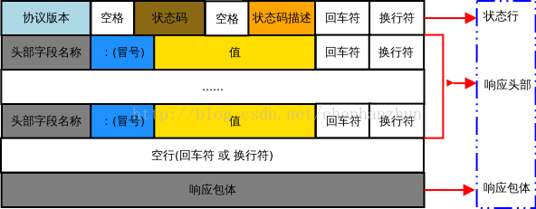
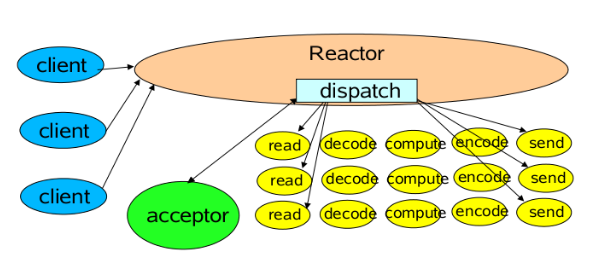
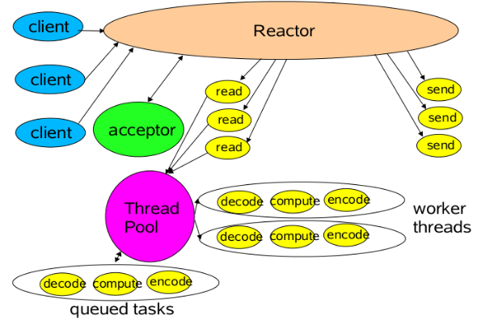

# 网络通信

## 1. 网络协议详解

### http请求和响应格式

HTTP 超文本传输协议 请求报文由请求行、请求头部、空行 和 请求包体 4 个部分组成


```html
POST /examples/default.jsp HTTP/1.1 
Accept: text/plain; text/html 
Accept-Language: en-gb 
Connection: Keep-Alive 
Host: localhost 
User-Agent: Mozilla/4.0 (compatible; MSIE 4.01; Windows 98)
Content-Length: 33 Content-Type: application/x-www-form-urlencoded Accept-Encoding: gzip, deflate 

lastName=Franks&firstName=Michael  
```

请求行：请求行由方法字段、URL 字段 和HTTP 协议版本字段 3 个部分组成，他们之间使用空格隔开。常用的 HTTP 请求方法有 GET、POST、HEAD、PUT、DELETE、OPTIONS、TRACE、CONNECT
 - GET：当客户端要从服务器中读取某个资源时，使用GET 方法。GET 方法要求服务器将URL 定位的资源放在响应报文的部分，回送给客户端，即向服务器请求某个资源。使用GET 方法时，请求参数和对应的值附加在 URL 后面，利用一个问号(“?”)代表URL 的结尾与请求参数的开始，传递参数长度受限制。例如，/index.jsp?id=100&op=bind。
 - POST：当客户端给服务器提供信息较多时可以使用POST 方法，POST 方法向服务器提交数据，比如完成表单数据的提交，将数据提交给服务器处理。GET 一般用于获取/查询资源信息，POST 会附带用户数据，一般用于更新资源信息。POST 方法将请求参数封装在HTTP 请求数据中，以名称/值的形式出现，可以传输大量数据;

请求头部：请求头部由关键字/值对组成，每行一对，关键字和值用英文冒号“:”分隔。请求头部通知服务器有关于客户端请求的信息，典型的请求头有：
 - User-Agent：产生请求的浏览器类型;
 - Accept：客户端可识别的响应内容类型列表;星号 “ * ” 用于按范围将类型分组，用 “ */* ” 指示可接受全部类型，用“ type/* ”指示可接受 type 类型的所有子类型;
 - Accept-Language：客户端可接受的自然语言;
 - Accept-Encoding：客户端可接受的编码压缩格式;
 - Accept-Charset：可接受的应答的字符集;
 - Host：请求的主机名，允许多个域名同处一个IP 地址，即虚拟主机;
 - connection：连接方式(close 或 keepalive);
 -  Cookie：存储于客户端扩展字段，向同一域名的服务端发送属于该域的cookie;

空行：最后一个请求头之后是一个空行，发送回车符和换行符，通知服务器以下不再有请求头;

请求包体：请求包体不在 GET 方法中使用，而是在POST 方法中使用。POST 方法适用于需要客户填写表单的场合。与请求包体相关的最常使用的是包体类型 Content-Type 和包体长度 Content-Length;

HTTP 响应报文由状态行、响应头部、空行 和 响应包体 4 个部分组成，如下图所示：


```html
HTTP/1.1 200 OK 
Server: Microsoft-IIS/4.0 
Date: Mon, 5 Jan 2004 13:13:33 GMT 
Content-Type: text/html 
Last-Modified: Mon, 5 Jan 2004 13:13:12 GMT 
Content-Length: 112 

<html> 
    <head> 
        <title>HTTP Response Example</title> 
    </head> 
    <body> 
        Welcome to Brainy Software 
    </body> 
</html> 
```

状态行：状态行由 HTTP 协议版本字段、状态码和状态码的描述文本 3 个部分组成，他们之间使用空格隔开;

状态码由三位数字组成，第一位数字表示响应的类型，常用的状态码有五大类如下所示：
 - 1xx：表示服务器已接收了客户端请求，客户端可继续发送请求;
 - 2xx：表示服务器已成功接收到请求并进行处理;
 - 3xx：表示服务器要求客户端重定向;
 - 4xx：表示客户端的请求有非法内容;
 - 5xx：表示服务器未能正常处理客户端的请求而出现意外错误;

状态码描述文本有如下取值：
 - 200 OK：表示客户端请求成功;
 - 400 Bad Request：表示客户端请求有语法错误，不能被服务器所理解;
 - 401 Unauthonzed：表示请求未经授权，该状态代码必须与 WWW-Authenticate 报头域一起使用;
 - 403 Forbidden：表示服务器收到请求，但是拒绝提供服务，通常会在响应正文中给出不提供服务的原因;
 - 404 Not Found：请求的资源不存在，例如，输入了错误的URL;
 - 500 Internal Server Error：表示服务器发生不可预期的错误，导致无法完成客户端的请求;
 - 503 Service Unavailable：表示服务器当前不能够处理客户端的请求，在一段时间之后，服务器可能会恢复正常;

响应头部：响应头可能包括：
 - Location：Location响应报头域用于重定向接受者到一个新的位置。例如：客户端所请求的页面已不存在原先的位置，为了让客户端重定向到这个页面新的位置，服务器端可以发回Location响应报头后使用重定向语句，让客户端去访问新的域名所对应的服务器上的资源;
 - Server：Server 响应报头域包含了服务器用来处理请求的软件信息及其版本。它和 User-Agent 请求报头域是相对应的，前者发送服务器端软件的信息，后者发送客户端软件(浏览器)和操作系统的信息。
 - Vary：指示不可缓存的请求头列表;
 - Connection：连接方式;
 - 对于请求来说：close(告诉 WEB 服务器或者代理服务器，在完成本次请求的响应后，断开连接，不等待本次连接的后续请求了)。keepalive(告诉WEB服务器或者代理服务器，在完成本次请求的响应后，保持连接，等待本次连接的后续请求);
 - 对于响应来说：close(连接已经关闭); keepalive(连接保持着，在等待本次连接的后续请求); Keep-Alive：如果浏览器请求保持连接，则该头部表明希望WEB 服务器保持连接多长时间(秒);例如：Keep-Alive：300;
 - WWW-Authenticate：WWW-Authenticate响应报头域必须被包含在401 (未授权的)响应消息中，这个报头域和前面讲到的Authorization 请求报头域是相关的，当客户端收到 401 响应消息，就要决定是否请求服务器对其进行验证。如果要求服务器对其进行验证，就可以发送一个包含了Authorization 报头域的请求;

空行：最后一个响应头部之后是一个空行，发送回车符和换行符，通知服务器以下不再有响应头部。

响应包体：服务器返回给客户端的文本信息;

HTTP 工作原理

HTTP 协议采用请求/响应模型。客户端向服务器发送一个请求报文，服务器以一个状态作为响应。
 - 客户端连接到web服务器：HTTP 客户端与web服务器建立一个 TCP 连接;
 - 客户端向服务器发起 HTTP 请求：通过已建立的TCP 连接，客户端向服务器发送一个请求报文;
 - 服务器接收 HTTP 请求并返回 HTTP 响应：服务器解析请求，定位请求资源，服务器将资源副本写到 TCP 连接，由客户端读取;
 - 释放 TCP 连接：若connection 模式为close，则服务器主动关闭TCP 连接，客户端被动关闭连接，释放TCP 连接;若connection 模式为keepalive，则该连接会保持一段时间，在该时间内可以继续接收请求;
 - 客户端浏览器解析HTML内容：客户端将服务器响应的 html 文本解析并显示;

HTTP 无状态性

HTTP 协议是无状态的(stateless)。也就是说，同一个客户端第二次访问同一个服务器上的页面时，服务器无法知道这个客户端曾经访问过，服务器也无法分辨不同的客户端。HTTP 的无状态特性简化了服务器的设计，使服务器更容易支持大量并发的HTTP 请求。

HTTP 持久连接

HTTP1.0 使用的是非持久连接，主要缺点是客户端必须为每一个待请求的对象建立并维护一个新的连接，即每请求一个文档就要有两倍RTT 的开销。因为同一个页面可能存在多个对象，所以非持久连接可能使一个页面的下载变得十分缓慢，而且这种短连接增加了传输的负担。HTTP1.1 使用持久连接keepalive，所谓持久连接，就是服务器在发送响应后仍然在一段时间内保持这条连接，允许在同一个连接中存在多次数据请求和响应，即在持久连接情况下，服务器在发送完响应后并不关闭TCP 连接，而客户端可以通过这个连接继续请求其他对象。

### http转发与重定向

1、首先转发是服务器的操作，而重定向是客户端的操作。

2、重定向时，客户端浏览器的地址栏有变化，而转发没有

3、转发可以携带数据，重定向不行

4、重定向发生在客户端!转发发生在服务端,客户端是不知道

5、重定向时，客户端发送了两个请求，而转发只发送了一个请求（本质区别）

### http的Cookie机制

### http缓存控制和代理服务

浏览器缓存分为强缓存和协商缓存，浏览器加载一个页面的简单流程如下：

- 浏览器先根据这个资源的http头信息来判断是否命中强缓存。如果命中则直接加在缓存中的资源，并不会将请求发送到服务器。
- 如果未命中强缓存，则浏览器会将资源加载请求发送到服务器。服务器来判断浏览器本地缓存是否失效。若可以使用，则服务器并不会返回资源信息，浏览器继续从缓存加载资源。
- 如果未命中协商缓存，则服务器会将完整的资源返回给浏览器，浏览器加载新资源，并更新缓存。

web缓存器，也叫作代理服务器

web缓存代理服务器的工作方式：

- 用户A浏览器建立一条到该web缓存服务器中的TCP连接，并向web缓存服务器中的该对象发送一个HTTP请求。
- 该web缓存服务器先检查该对象在本地有没有副本。如果有，那么该web缓存服务器就用HTTP响应报文想客户机浏览器返回该对象。
- 如果该web缓存服务器没有该对象的副本，他就与该对象的初始服务器建立一条TCP连接，并发送一个该对象的HTTP请求。在收到该请求后初始web服务器向该web缓存服务器发送具有该对象的HTTP响应报文。
- 当该web缓存服务器收到该对象时，他在本地存储空间存储了一个副本，并用HTTP响应报文向用户A浏览器发送该副本。
- 如果其他用户的浏览器也恰好要访问该对象，那么久能迅速从web缓存服务器中得到它，并且不会增加网络流量。

HTTP代理分为正向代理、反向代理和透明代理；
 - 正向代理：服务器代理客户端去访问其他的服务器，这个服务器时存在于客户端和源始服务器之间，客户端隐藏与代理服务器的后面充当幕后主使。源始服务器所看到的是它在代理服务器服务器进行交互，而不知道客户端的存在。一般用在web缓存技术中。场景如下：
   - 访问原来无法访问的资源，如google
   - 可以做缓存，加速访问资源
   - 对客户端访问授权，上网进行认证
   - 代理可以记录用户访问记录（上网行为管理），对外隐藏用户信息
 - 反向代理：与正向代理相反，此时是源始服务器藏在代理服务器后面，客户端看到的是自己在与代理服务器交互，而不知道源始服务器的存在。可以隐藏保护源始服务器资源。在负载均衡中使用反向代理技术来减小服务器压力。在CDN（分布式集群管理）的核心技术中也用到了反向代理。
   - 保证内网的安全，阻止web攻击，大型网站，通常将反向代理作为公网访问地址，Web服务器是内网
   - 负载均衡，通过反向代理服务器来优化网站的负载
 - 透明代理：客户端根本不需要知道有代理服务器的存在它改变你的request fields（报文），并会传送真实IP，多用于路由器的NAT转发中。注意，加密的透明代理则是属于匿名代理，意思是不用设置使用代理了。当用户服务器提交请求的时候，透明代理设备根据自身策略拦截并修改用户的报文，并作为实际的请求方，向服务器送请求，当接收信息回传，透明代理再根据自身的设置把允许的报文发回至用户

>总结：正向代理即是客户端代理, 代理客户端, 服务端不知道实际发起请求的客户端.
>反向代理即是服务端代理, 代理服务端, 客户端不知道实际提供服务的服务端

### HTTPS是什么？SSL/TLS又是什么？ 

### 对称加密与非对称加密 、数字签名与证书 

### OSI七层网络协议

OSI（Open System Interconnect），即开放式系统互联。 一般都叫OSI参考模型，是ISO（国际标准化组织）组织在1985年研究的网络互连模型。ISO为了更好的使网络应用更为普及，推出了OSI参考模型。其含义就是推荐所有公司使用这个规范来控制网络。这样所有公司都有相同的规范，就能互联了。
OSI定义了网络互连的七层框架（物理层、数据链路层、网络层、传输层、会话层、表示层、应用层），即ISO开放互连系统参考模型


OSI七层和TCP/IP四层的关系

OSI引入了服务、接口、协议、分层的概念，TCP/IP借鉴了OSI的这些概念建立TCP/IP模型。

OSI先有模型，后有协议，先有标准，后进行实践；而TCP/IP则相反，先有协议和应用再提出了模型，且是参照的OSI模型。

OSI是一种理论下的模型，而TCP/IP已被广泛使用，成为网络互联事实上的标准。
 - TCP：transmission control protocol 传输控制协议
 - UDP：user data protocol 用户数据报协议


OSI七层和TCP/IP的区别

 - TCP/IP他是一个协议簇；而OSI（开放系统互联）则是一个模型，且TCP/IP的开发时间在OSI之前。
 - TCP/IP是由一些交互性的模块做成的分层次的协议，其中每个模块提供特定的功能；OSi则指定了哪个功能是属于哪一层的。
 - TCP/IP是五层结构，而OSI是七层结构。OSI的最高三层在TCP中用应用层表示。


### TCP协议详解

传输控制协议（TCP，Transmission Control Protocol）是一种面向连接的、可靠的、基于字节流的传输层通信协议


### TCP协议的流量控制详解

零窗口探测报文

### TCP协议的可靠性是如何保障的

数据链路层流量控制技术，目标：提高信道利用率

停止-等待协议SW
 - 每发完一个数据帧就停止发送，等待对方确认
 - 收到确认后再发送下一个数据帧
 - 每发送完一个数据帧就启动一个相应的重传计时器，当计时器超时却未收到确认时就重传该数据帧

这种可靠性传输协议被称为`自动重传请求ARQ（Aytomatic Repeat reQuest）`

ARQ表明重传的请求式发送方自动进行的，接收方不需要请求方重传某个出错的数据帧

后退N帧协议GBN
 - 基于互动窗口的流量控制技术
 - 发送方可在未收到接收方确认帧的情况下，将序号落在发送窗口内的多个数据帧全部发送出去，接收方必须具备累计确认和捎带确认
 - 发生方只有收到确认帧时，发送窗口才能向前滑动
 - 当发送窗口内某个已经发送的数据帧出现超时重发时，其后续在发送窗口内已经发送的数据帧必须全部重传，这是后退N帧协议名称的由来

选择重传协议SR
 - 接收方有差错处理策略，一旦收到误码数据帧或者怀疑数据帧立即发送相应的否定确认帧`NAK`,不必等到计时器超
 - 发送发只重传出错的数据帧或者超时的数据帧

### TCP协议可靠传输的实现

以字节为单位的时间窗口
 - 虽然发送方的发送窗口式根据接收方的接收窗口设置的，但在同一时刻发送方的窗口并不总是和接收方的接收窗口一样大
 - 对于不按序到达的数据如何处理，TCP并无明确要求，先到先入缓存到齐后一并提交应用进程
 - TCP接收方必须有积累确认和捎带确认机制，但不硬过分推迟发送确认，会导致不必要的重传
 - 全双工同通信，通信中的每一方都再发送和接受报文段，每一方都有自己的发送窗口和接收窗口

### TCP协议与Socket的联系
- HTTP是应用层协议，定义的是传输数据的内容以及格式的规范
- TCP是底层通讯协议，定义的是数据传输和连接方式的规范
- Socket可以支持不同的传输层协议（TCP或UDP），当使用TCP协议进行连接时，该Socket连接就是一个TCP连接，Socket是发动机，提供了网络通信的能力

我们在传输数据时，可以只使用（传输层）TCP/IP协议，但是那样的话，如果没有应用层，便无法识别数据内容，如果想要使传输的数据有意义，则必须使用到应用层协议，应用层协议有很多，比如HTTP、FTP、TELNET等，也可以自己定义应用层协议。WEB使用HTTP协议作应用层协议，以封装HTTP文本信息，然后使用TCP/IP做传输层协议将它发到网络上

TCP/IP只是一个协议栈，就像操作系统的运行机制一样，必须要具体实现，同时还要提供对外的操作接口。这个就像操作系统会提供标准的编程接口，比如win32编程接口一样，TCP/IP也要提供可供程序员做网络开发所用的接口，这就是Socket编程接口


## 2. Socket底层原理

## 3. IO模型

### BIO底层原理
```java
public class OldSocket {
	public static void main(String[] args) throws IOException {
		ServerSocket server = new ServerSocket(8090);
		System.out.println("step1: new ServerSocket 8090");
		Socket client = server.accept();
		System.out.println("step1: client\t" + client.getPort());
		InputStream in = client.getInputStream();
		BufferedReader reader = new BufferedReader(new InputStreamReader(in));
		System.out.println(reader.readLine());
		for (;;) {
		}
	}
}
```

```bash
strace -ff -o out /usr/java/j2sdk1.4.2_18/bin/java OldSocket
```
1.4jdk accept和recv都会产生阻塞 


```bash
strace -ff -o out /usr/java/jdk1.8.0_181/bin/java OldSocket,
```

1.8jdk 使用非阻塞模型poll


### NIO底层原理

```java
public class ChannelSocket {
	public static void main(String[] args) throws IOException {
		ServerSocketChannel ss= ServerSocketChannel.open();
		ss.bind(new InetSocketAddress(8090));
		ss.configureBlocking(false);
		while(true) {
			SocketChannel client=ss.accept();
			if(client==null) {
				System.out.println("null......");
			}else {
				System.out.println("client...port"+client.socket().getPort());
			}
		}
	}
}
```


### AIO底层原理

## 4. NETTY原理和源码

### 概念体系

- 设计 
 - 统一的 API，支持多种传输类型，阻塞的和非阻塞的
 - 简单而强大的线程模型
 - 真正的无连接数据报套接字支持
 - 链接逻辑组件以支持复用
- 易于使用 
 - 详实的Javadoc和大量的示例集
 - 不需要超过JDK 1.6+③的依赖。（一些可选的特性可能需要Java 1.7+和/或额外的依赖）
- 性能 
 - 拥有比 Java 的核心 API 更高的吞吐量以及更低的延迟
 - 得益于池化和复用，拥有更低的资源消耗
 - 最少的内存复制
- 健壮性 
 - 不会因为慢速、快速或者超载的连接而导致 OutOfMemoryError
 - 消除在高速网络中 NIO 应用程序常见的不公平读/写比率
- 安全性 
 - 完整的 SSL/TLS 以及 StartTLS 支持
 - 可用于受限环境下，如 Applet 和 OSGI
- 社区驱动 
 - 发布快速而且频繁
  
总结：通过实现 FTP、SMTP、HTTP 和 WebSocket 以及其他的基于二进制和基于文本的协议，Netty 扩展了它的应用范围及灵活性

**Netty 所提供的传输**

|名称|包|描述|
| -------------------- | ------------------- | ------------------------------------------------------------ |
| NIO | io.netty.channel.socket.nio | 使用java.nio.channels包作为基础——基于选择器的方式 |
| Epoll | io.netty.channel.epoll | 由JNI驱动的epoll()和非阻塞IO。这个传输支持只有在Linux上可用的多种特性，如SO_REUSEPORT，比NIO传输更快，而且是完全非阻塞的 |
| OIO | io.netty.channel.socket.oio | 使用java.net包作为基础——使用阻塞流 |
| Local | io.netty.channel.local | 可以在VM内部通过管道进行通信的本地传输 |
| Embedded | io.netty.channel.embedded | Embedded传输，允许使用ChannelHandler而又不需要一个真正的基于网络的传输。这在测试你的ChannelHandler实现时非常有用 |

**Netty 支持传输的网络协议**

| 传输 | TCP | UDP | SCTP | UDT |
| ---------- | ---------- | ---------- | ---------- | ---------- |
| NIO | √ | √ | √ | √ |
| Epoll(Linux) | √ | √ | - | - |
| OIO | √ | √ | √ | √ |

>SCTP (Stream Control Transmission Protocol)是一种传输协议，在TCP/IP协议栈中所处的位置和TCP、UDP类似，兼有TCP/UDP两者特征
>1. TCP是以字节为单位传输的，SCTP是以数据块为单位传输的
>2. TCP通常是单路径传输，SCTP可以多路径传输
>3. TCP是单流有序传输，SCTP可以多流独立有序/无序传输
>4. TCP连接的建立过程需要三步握手，SCTP连接的建立过程需要四步握手
>5. SCTP有heartbeat机制来管理路径的可用性

>UDT的特性包括在以下几个方面
>1. 基于UDP的应用层协议
>2. 面向连接的可靠协议
>3. 双工的协议
>4. 拥有新的拥塞控制算法，并具有可拓展的拥塞控制框架。

>此外UDT协议在高BDP网络相对于TCP协议的优势，可以用下面几点来表示： 
>1. UDT是基于UDP协议，并且是定时器做的发送，不像tcp需要等待ack后才能开始下一轮发送
>2. UDT的拥塞控制算法，能够实现在慢启动阶段快速增长抢占带宽，而在接近饱和时逐渐降低增长速度，使它趋于稳定。
>3. UDT对包丢失的处理算法，和对噪声链路的容忍性，使得在网络波动比较大的环境中，它比传统的TCP协议更加的稳定。

### Netty中的三种Reactor（反应堆）

1.Reactor单线程模型,指的是所有的I/O操作都在同一个NIO线程上面完成，NIO线程的职责如下:
- 作为NIO服务端，接收客户端的TCP连接
- 作为NIO客户端，向服务端发起TCP连接
- 读取通信对端的请求或者应答消息
- 向通信对端发送消息请求或者应答消息



总结：对于一些小容量应用场景，可以使用单线程模型，但是对于高负载、大并发的应用却不合适，主要原因如下：

- 一个NIO线程同时处理成百上千的链路，性能上无法支撑。即便NIO线程的CPU负荷达到100%，也无法满足海量消息的编码、解码、读取和发送
- 当NIO线程负载过重之后，处理速度将变慢，这会导致大量客户端连接超时，超时之后往往进行重发，这更加重了NIO线程的负载，最终导致大量消息积压和处理超时，NIO线程会成为系统的性能瓶颈
- 可靠性问题。一旦NIO线程意外跑飞，或者进入死循环，会导致整个系统通讯模块不可用，不能接收和处理外部信息，造成节点故障。
为了解决这些问题，演进出了Reactor多线程模型，下面我们一起学习下Reactor多线程模型

2.Reactor多线程模型与单线程模型最大区别就是有一组NIO线程处理I/O操作，它的特点如下:
- 有一个专门的NIO线程--acceptor新城用于监听服务端，接收客户端的TCP连接请求；
- 网络I/O操作--读、写等由一个NIO线程池负责，线程池可以采用标准的JDK线程池实现，它包含一个任务队列和N个可用的线程，由这些NIO线程负责消息的读取、解码、编码和发送
- 1个NIO线程可以同时处理N条链路，但是1个链路只对应1个NIO线程，防止发生并发操作问题



总结：在绝大多数场景下，Reactor多线程模型都可以满足性能需求；但是，在极特殊应用场景中，一个NIO线程负责监听和处理所有的客户端连接可能会存在性能问题。例如百万客户端并发连接，或者服务端需要对客户端的握手信息进行安全认证，认证本身非常损耗性能。这类场景下，单独一个Acceptor线程可能会存在性能不足问题，为了解决性能问题，产生了第三种Reactor线程模型--主从Reactor多线程模型

3.主从Reactor多线程模型

特点是：服务端用于接收客户端连接的不再是1个单独的NIO线程，而是一个独立的NIO线程池。Acceptor接收到客户端TCP连接请求处理完成后（可能包含接入认证等），将新创建的SocketChannel注册到I/O线程池（sub reactor线程池）的某个I/O线程上，由它负责SocketChannel的读写和编解码工作


### Netty大数据量的传输，压缩，解压缩

### 复合缓冲和其他缓冲的原理和使用场景

### Netty的http支持，实现tomcat容器，对socket实现

EventLoopGroup实现了Cloneable，在一个已经配置完成的引导类实例上调用clone()方法将返回另一个可以立即使用的引导类实例

这种方式只会创建引导类实例的EventLoopGroup的一个浅拷贝，因为通常这些克隆的Channel的生命周期都很短暂，一个典型的场景是——创建一个Channel以进行一次HTTP请求

### Netty和RPC原理分析，Netty和websocket原理分析

### RPC框架使用和原理分析

### Netty的Scattering和Gathering的原理分析

### NIO的零copy如何实现的、NIO的buffer和channel的应用和原理

**Channel的生命周期**
- ChannelUnregistered Channel 已经被创建，但还未注册到 EventLoop
- ChannelRegistered Channel 已经被注册到了 EventLoop
- ChannelActive Channel 处于活动状态（已经连接到它的远程节点）。它现在可以接收和发送数据了
- ChannelInactive Channel 没有连接到远程节点

**ChannelHandler的生命周期**
- handlerAdded 当把 ChannelHandler 添加到 ChannelPipeline 中时被调用
- handlerRemoved 当从 ChannelPipeline 中移除 ChannelHandler 时被调用
- exceptionCaught 当处理过程中在 ChannelPipeline 中有错误产生时被调用

**Netty 定义了下面两个重要的 ChannelHandler 子接口：**
- ChannelInboundHandler——处理入站数据以及各种状态变化；
  - channelRegistered 当 Channel 已经注册到它的 EventLoop 并且能够处理 I/O 时被调用
  - channelUnregistered 当 Channel 从它的 EventLoop 注销并且无法处理任何 I/O 时被调用 
  - channelActive 当 Channel 处于活动状态时被调用；Channel 已经连接/绑定并且已经就绪
  - channelInactive 当 Channel 离开活动状态并且不再连接它的远程节点时被调用
  - channelReadComplete 当Channel上的一个读操作完成时被调用
  - channelRead 当从 Channel 读取数据时被调用
  - channelWritabilityChanged 当 Channel 的可写状态发生改变时被调用。用户可以确保写操作不会完成得太快（以避免发生 OutOfMemoryError）或者可以在 Channel 变为再次可写时恢复写入。可以通过调用 Channel 的 isWritable()方法来检测Channel 的可写性。与可写性相关的阈值可以通过 Channel.config().setWriteHighWaterMark()和 Channel.config().setWriteLowWaterMark()方法来设置
  - userEventTriggered 当 ChannelnboundHandler.fireUserEventTriggered()方法被调用时被调用，因为一个 POJO 被传经了 ChannelPipeline
setWriteHighWaterMark()和 Channel.config().setWriteLowWaterMark()方法来设置
- ChannelOutboundHandler——处理出站数据并且允许拦截所有的操作。
  - connect(ChannelHandlerContext,、SocketAddress,SocketAddress,ChannelPromise)当请求将 Channel 连接到远程节点时被调用
  - disconnect(ChannelHandlerContext,ChannelPromise)当请求将 Channel 从远程节点断开时被调用
  - close(ChannelHandlerContext,ChannelPromise) 当请求关闭 Channel 时被调用
  - deregister(ChannelHandlerContext,ChannelPromise)当请求将 Channel 从它的 EventLoop 注销时被调用
  - read(ChannelHandlerContext) 当请求从 Channel 读取更多的数据时被调用
  - flush(ChannelHandlerContext) 当请求通过 Channel 将入队数据冲刷到远程节点时被调用
  - write(ChannelHandlerContext,Object,ChannelPromise)当请求通过 Channel 将数据写到远程节点时被调用


### 堆外内存，文件通道，selector的源码深入

### Netty实现高性能弹幕

### 源码分析，粘包拆包以及自定义协议

### SPDY

2012年google如一声惊雷提出了SPDY的方案，优化了HTTP1.X的请求延迟，解决了HTTP1.X的安全性，具体如下：

降低延迟，针对HTTP高延迟的问题，SPDY优雅的采取了多路复用（multiplexing）。多路复用通过多个请求stream共享一个tcp连接的方式，解决了HOL blocking的问题，降低了延迟同时提高了带宽的利用率。

请求优先级（request prioritization）。多路复用带来一个新的问题是，在连接共享的基础之上有可能会导致关键请求被阻塞。SPDY允许给每个request设置优先级，这样重要的请求就会优先得到响应。比如浏览器加载首页，首页的html内容应该优先展示，之后才是各种静态资源文件，脚本文件等加载，这样可以保证用户能第一时间看到网页内容。

header压缩。前面提到HTTP1.x的header很多时候都是重复多余的。选择合适的压缩算法可以减小包的大小和数量。

基于HTTPS的加密协议传输，大大提高了传输数据的可靠性。

服务端推送（server push），采用了SPDY的网页，例如我的网页有一个sytle.css的请求，在客户端收到sytle.css数据的同时，服务端会将sytle.js的文件推送给客户端，当客户端再次尝试获取sytle.js时就可以直接从缓存中获取到，不用再发请求了。SPDY构成图：

## 5. Tomcat原理和源码

自8.5版本起Tomcat移除了对BIO的支持

IO模型
- NIO 非阻塞I/O
- NIO2 异步I/O JDK7的NIO2类库
- APR 采用Apache可移植运行库实现，C++编写的本地库，需要单独安装

应用层协议
- HTTP/1.1
- APJ 用于和WEB服务器集成(如Apache),以实现对静态资源的优化和集群部署，当前支持APJ/1.3
- HTTP/2 HTTP2.0大幅提升了web性能，下一代HTTP协议，自8.5以及9.0版本后支持

### 整体架构设计

#### 连接器Connector
- Socket连接
- 读取请求网络中的字节流
- 根据相应的协议(Http/AJP)解析字节流，生成统一的 TomcatRequestt对象
- 将TomcatRequest传给容器
- 容器返回 TomcatResponse对象
- 将TomcatResponse对象转换为字节流
- 将字节流返回给客户端

其实上面的细分都能总结为以下的三点

- 网络通信 EndPoint 监听请求
- 应用层协议的解析 Processor 解析封装对象
- Adapter 适配器模式 Tomcat的 Request/Response与 ServletRequest/ServletResponse对象的转化调用容器

ProtocolHandler是EndPoint和Processor的组合

#### catalina容器


### Tomcat中“HTTP长连接”的实现原理与源码分析

### Tomcat中关于解析HTTP请求行、请求头、情头体的源码分析

### Tomcat中关于分块传输（chunk）请求体的源码分析

### Tomcat中响应一个请求的原理与源码分析


NioEndpoint processKey接收请求，交给线程池处理 进入SocketProcessorBase的run方法
```java
if (handshake == 0) {
    SocketState state = SocketState.OPEN;
    // Process the request from this socket
    if (event == null) {
        state = getHandler().process(socketWrapper, SocketEvent.OPEN_READ);
    } else {
        state = getHandler().process(socketWrapper, event);
    }
    if (state == SocketState.CLOSED) {
        close(socket, key);
    }
}
```

经过AbstractProtocol解析规则进入Http11Processor的service方法

```java
if (getErrorState().isIoAllowed()) {
    try {
        rp.setStage(org.apache.coyote.Constants.STAGE_SERVICE);
        //通过连接器适配对象调用具体的方法
        getAdapter().service(request, response);
        // Handle when the response was committed before a serious
        // error occurred.  Throwing a ServletException should both
        // set the status to 500 and set the errorException.
        // If we fail here, then the response is likely already
        // committed, so we can't try and set headers.
        if(keepAlive && !getErrorState().isError() && !isAsync() &&
                statusDropsConnection(response.getStatus())) {
            setErrorState(ErrorState.CLOSE_CLEAN, null);
        }
    }
}
```

通过连接器适配对象调用具体方法CoyoteAdapter的service方法

```java
try {
    // Parse and set Catalina and configuration specific
    // request parameters
    postParseSuccess = postParseRequest(req, request, res, response);
    if (postParseSuccess) {
        //check valves if we support async
        request.setAsyncSupported(
                connector.getService().getContainer().getPipeline().isAsyncSupported());
        // Calling the container
        connector.getService().getContainer().getPipeline().getFirst().invoke(
                request, response);
    }
```

StandardEngineValve进入invoke

```java
public final void invoke(Request request, Response response)
        throws IOException, ServletException {

        // Select the Host to be used for this Request
        Host host = request.getHost();
        if (host == null) {
            // HTTP 0.9 or HTTP 1.0 request without a host when no default host
            // is defined.
            // Don't overwrite an existing error
            if (!response.isError()) {
                response.sendError(404);
            }
            return;
        }
        if (request.isAsyncSupported()) {
            request.setAsyncSupported(host.getPipeline().isAsyncSupported());
        }

        // Ask this Host to process this request
        host.getPipeline().getFirst().invoke(request, response);
    }
```

StandardHostValve进入invoke

```java
public final void invoke(Request request, Response response)
        throws IOException, ServletException {
    Context context = request.getContext();//拿到了web应用了
    if (context == null) {
        // Don't overwrite an existing error
        if (!response.isError()) {
            response.sendError(404);
        }
        return;
    }
```

```java
try {
    if (!response.isErrorReportRequired()) {
        context.getPipeline().getFirst().invoke(request, response);
    }
}
```

同样的方式有拿到了context的管道StandardContextValve的invoke

```java
public final void invoke(Request request, Response response)
        throws IOException, ServletException {
    // Disallow any direct access to resources under WEB-INF or META-INF
    MessageBytes requestPathMB = request.getRequestPathMB();
    if ((requestPathMB.startsWithIgnoreCase("/META-INF/", 0))
            || (requestPathMB.equalsIgnoreCase("/META-INF"))
            || (requestPathMB.startsWithIgnoreCase("/WEB-INF/", 0))
            || (requestPathMB.equalsIgnoreCase("/WEB-INF"))) {
        response.sendError(HttpServletResponse.SC_NOT_FOUND);
        return;
    }

    // Select the Wrapper to be used for this Request
    Wrapper wrapper = request.getWrapper();
    if (wrapper == null || wrapper.isUnavailable()) {
        response.sendError(HttpServletResponse.SC_NOT_FOUND);
        return;
    }

    // Acknowledge the request
    try {
        response.sendAcknowledgement(ContinueResponseTiming.IMMEDIATELY);
    } catch (IOException ioe) {
        container.getLogger().error(sm.getString(
                "standardContextValve.acknowledgeException"), ioe);
        request.setAttribute(RequestDispatcher.ERROR_EXCEPTION, ioe);
        response.sendError(HttpServletResponse.SC_INTERNAL_SERVER_ERROR);
        return;
    }

    if (request.isAsyncSupported()) {
        request.setAsyncSupported(wrapper.getPipeline().isAsyncSupported());
    }
    wrapper.getPipeline().getFirst().invoke(request, response);
}
```

惊人的相似马上就要找到终点了 StandardWrapperValve的invoke
```java
 public final void invoke(Request request, Response response)
        throws IOException, ServletException {

        // Initialize local variables we may need
        boolean unavailable = false;
        Throwable throwable = null;
        // This should be a Request attribute...
        long t1=System.currentTimeMillis();
        requestCount.incrementAndGet();
        StandardWrapper wrapper = (StandardWrapper) getContainer();
        Servlet servlet = null;
        Context context = (Context) wrapper.getParent();

        // Check for the application being marked unavailable
        if (!context.getState().isAvailable()) {
            response.sendError(HttpServletResponse.SC_SERVICE_UNAVAILABLE,
                           sm.getString("standardContext.isUnavailable"));
            unavailable = true;
        }

        // Check for the servlet being marked unavailable
        if (!unavailable && wrapper.isUnavailable()) {
            container.getLogger().info(sm.getString("standardWrapper.isUnavailable",
                    wrapper.getName()));
            long available = wrapper.getAvailable();
            if ((available > 0L) && (available < Long.MAX_VALUE)) {
                response.setDateHeader("Retry-After", available);
                response.sendError(HttpServletResponse.SC_SERVICE_UNAVAILABLE,
                        sm.getString("standardWrapper.isUnavailable",
                                wrapper.getName()));
            } else if (available == Long.MAX_VALUE) {
                response.sendError(HttpServletResponse.SC_NOT_FOUND,
                        sm.getString("standardWrapper.notFound",
                                wrapper.getName()));
            }
            unavailable = true;
        }

        // Allocate a servlet instance to process this request
        try {
            if (!unavailable) {
                servlet = wrapper.allocate();// 是他 是他 是他 就是他 我们的朋友小哪吒
            }
        }
        ...
        ...
        // Create the filter chain for this request
        ApplicationFilterChain filterChain =
                ApplicationFilterFactory.createFilterChain(request, wrapper, servlet);//构造出责任器链
        ...
        ...
        if (request.isAsyncDispatching()) {
            request.getAsyncContextInternal().doInternalDispatch();
        } else {
            filterChain.doFilter
                (request.getRequest(), response.getResponse());//执行责任期链
        }
```

进入ApplicationFilterChain的doFilter,所有servlet继承了HttpServlet，直接进入父的serive

```java
protected void service(HttpServletRequest req, HttpServletResponse resp)
        throws ServletException, IOException {
    String method = req.getMethod();
    if (method.equals(METHOD_GET)) {
        long lastModified = getLastModified(req);
        if (lastModified == -1) {
            // servlet doesn't support if-modified-since, no reason
            // to go through further expensive logic
            doGet(req, resp);//终点在这里
        } else {
            long ifModifiedSince;
            try {
                ifModifiedSince = req.getDateHeader(HEADER_IFMODSINCE);
            } catch (IllegalArgumentException iae) {
                // Invalid date header - proceed as if none was set
                ifModifiedSince = -1;
            }
            if (ifModifiedSince < (lastModified / 1000 * 1000)) {
                // If the servlet mod time is later, call doGet()
                // Round down to the nearest second for a proper compare
                // A ifModifiedSince of -1 will always be less
                maybeSetLastModified(resp, lastModified);
                doGet(req, resp);
            } else {
                resp.setStatus(HttpServletResponse.SC_NOT_MODIFIED);
            }
        }
    } else if (method.equals(METHOD_HEAD)) {
        long lastModified = getLastModified(req);
        maybeSetLastModified(resp, lastModified);
        doHead(req, resp);

    } else if (method.equals(METHOD_POST)) {
        doPost(req, resp);

    } else if (method.equals(METHOD_PUT)) {
        doPut(req, resp);

    } else if (method.equals(METHOD_DELETE)) {
        doDelete(req, resp);

    } else if (method.equals(METHOD_OPTIONS)) {
        doOptions(req,resp);

    } else if (method.equals(METHOD_TRACE)) {
        doTrace(req,resp);

    } else {
        //
        // Note that this means NO servlet supports whatever
        // method was requested, anywhere on this server.
        //

        String errMsg = lStrings.getString("http.method_not_implemented");
        Object[] errArgs = new Object[1];
        errArgs[0] = method;
        errMsg = MessageFormat.format(errMsg, errArgs);

        resp.sendError(HttpServletResponse.SC_NOT_IMPLEMENTED, errMsg);
    }
}
```

### Tomcat中一个JSP请求的字节码生成分析

Tomcat在默认web.xml中配置了
```xml
<servlet>
      <servlet-name>jsp</servlet-name>
      <servlet-class>org.apache.jasper.servlet.JspServlet</servlet-class>
      <init-param>
          <param-name>fork</param-name>
          <param-value>false</param-value>
      </init-param>
      <init-param>
          <param-name>xpoweredBy</param-name>
          <param-value>false</param-value>
      </init-param>
      <load-on-startup>3</load-on-startup>
  </servlet>
  <!-- The mappings for the JSP servlet -->
  <servlet-mapping>
      <servlet-name>jsp</servlet-name>
      <url-pattern>*.jsp</url-pattern>
      <url-pattern>*.jspx</url-pattern>
  </servlet-mapping>
```

JspServlet处理流程图


源码跟踪

接受到对jsp的访问请求后，会最先到达JspServlet的service()方法中：

```java
public void service (HttpServletRequest request, HttpServletResponse response)
            throws ServletException, IOException {

        // jspFile may be configured as an init-param for this servlet instance
        String jspUri = jspFile;

        if (jspUri == null) {
            /*
             * Check to see if the requested JSP has been the target of a
             * RequestDispatcher.include()
             */
            jspUri = (String) request.getAttribute(
                    RequestDispatcher.INCLUDE_SERVLET_PATH);
            if (jspUri != null) {
                /*
                 * Requested JSP has been target of
                 * RequestDispatcher.include(). Its path is assembled from the
                 * relevant javax.servlet.include.* request attributes
                 */
                String pathInfo = (String) request.getAttribute(
                        RequestDispatcher.INCLUDE_PATH_INFO);
                if (pathInfo != null) {
                    jspUri += pathInfo;
                }
            } else {
                /*
                 * Requested JSP has not been the target of a
                 * RequestDispatcher.include(). Reconstruct its path from the
                 * request's getServletPath() and getPathInfo()
                 */
                jspUri = request.getServletPath();
                String pathInfo = request.getPathInfo();//获取请求的基本信息
                if (pathInfo != null) {
                    jspUri += pathInfo;
                }
            }
        }
        if (log.isDebugEnabled()) {
          log.debug("JspEngine --> " + jspUri);
          log.debug("\t     ServletPath: " + request.getServletPath());
          log.debug("\t        PathInfo: " + request.getPathInfo());
          log.debug("\t        RealPath: " + context.getRealPath(jspUri));
          log.debug("\t      RequestURI: " + request.getRequestURI());
          log.debug("\t     QueryString: " + request.getQueryString());
       }
        try {
            boolean precompile = preCompile(request);
            serviceJspFile(request, response, jspUri, precompile);
        } catch (RuntimeException e) {
            throw e;
        } catch (ServletException e) {
            throw e;
        } catch (IOException e) {
            throw e;
        } catch (Throwable e) {
            ExceptionUtils.handleThrowable(e);
            throw new ServletException(e);
        }
```

判断是否为预编译请求，然后执行serviceJspFile，在serviceJspFile方法中获取了一个JspServletWrapper

```java
private void serviceJspFile(HttpServletRequest request,
                                HttpServletResponse response, String jspUri,
                                boolean precompile)
        throws ServletException, IOException {

        JspServletWrapper wrapper = rctxt.getWrapper(jspUri);
        if (wrapper == null) {
            synchronized(this) {
                wrapper = rctxt.getWrapper(jspUri);
                if (wrapper == null) {
                    // Check if the requested JSP page exists, to avoid
                    // creating unnecessary directories and files.
                    if (null == context.getResource(jspUri)) {
                        handleMissingResource(request, response, jspUri);
                        return;
                    }
                    wrapper = new JspServletWrapper(config, options, jspUri,
                                                    rctxt);
                    rctxt.addWrapper(jspUri,wrapper);
                }
            }
        }

        try {
            wrapper.service(request, response, precompile);
        } catch (FileNotFoundException fnfe) {
            handleMissingResource(request, response, jspUri);
        }

    }
```

```java
      if (options.getDevelopment() || mustCompile) {
          synchronized (this) {
              if (options.getDevelopment() || mustCompile) {
                  // The following sets reload to true, if necessary
                  ctxt.compile();//执行编译
                  mustCompile = false;
              }
          }
      } else {
          if (compileException != null) {
              // Throw cached compilation exception
              throw compileException;
          }
      }
```

在JspCompilationContext的compile()方法中又调用了jspCompiler.compile()

```java
public void compile() throws JasperException, FileNotFoundException {
        createCompiler();
        if (jspCompiler.isOutDated()) {
            if (isRemoved()) {
                throw new FileNotFoundException(jspUri);
            }
            try {
                jspCompiler.removeGeneratedFiles();
                jspLoader = null;
                jspCompiler.compile();//调用编译
                jsw.setReload(true);
                jsw.setCompilationException(null);
            } catch (JasperException ex) {
                // Cache compilation exception
                jsw.setCompilationException(ex);
                if (options.getDevelopment() && options.getRecompileOnFail()) {
                    // Force a recompilation attempt on next access
                    jsw.setLastModificationTest(-1);
                }
                throw ex;
            } catch (FileNotFoundException fnfe) {
                // Re-throw to let caller handle this - will result in a 404
                throw fnfe;
            } catch (Exception ex) {
                JasperException je = new JasperException(
                        Localizer.getMessage("jsp.error.unable.compile"),
                        ex);
                // Cache compilation exception
                jsw.setCompilationException(je);
                throw je;
            }
        }
    }
```

最终到达Complier类中的compile(boolean compileClass, boolean jspcMode)方法：端点处做了2个事情，生成java文件、生成class文件

```java
public void compile(boolean compileClass, boolean jspcMode)
            throws FileNotFoundException, JasperException, Exception {
        if (errDispatcher == null) {
            this.errDispatcher = new ErrorDispatcher(jspcMode);
        }

        try {
            final Long jspLastModified = ctxt.getLastModified(ctxt.getJspFile());
            String[] smap = generateJava();//生成java文件
            File javaFile = new File(ctxt.getServletJavaFileName());
            if (!javaFile.setLastModified(jspLastModified.longValue())) {
                throw new JasperException(Localizer.getMessage("jsp.error.setLastModified", javaFile));
            }
            if (compileClass) {
                generateClass(smap);//生成class文件
                // Fix for bugzilla 41606
                // Set JspServletWrapper.servletClassLastModifiedTime after successful compile
                File targetFile = new File(ctxt.getClassFileName());
                if (targetFile.exists()) {
                    if (!targetFile.setLastModified(jspLastModified.longValue())) {
                        throw new JasperException(
                                Localizer.getMessage("jsp.error.setLastModified", targetFile));
                    }
                    if (jsw != null) {
                        jsw.setServletClassLastModifiedTime(
                                jspLastModified.longValue());
                    }
                }
            }
        }
```

java文件和class文件生成后，回到JspServletWrapper类中，调用getServlet()方法：加载jsp对应的servlet


然后执行service()方法：


查看index_jsp源码：在_jspService()方法中写出响应：


**编译结果**

如果在tomcat/conf/web.xml中配置了参数scratchdir，则jsp的编译后的结果就会存储在该目录下：

```xml
<init-param>
	<param-name>scratchdir</param-name>
	<param-value>D:/tmp/jsp/</param-value>
</init-param>
```

如果没有配置该项，则会将编译后的结果，存储在Tomcat安装目录下的work/Catalina(Engine名称)/localhost(Host名称)/Context命名 假设项目名称为 jsp_demo_01，默认的目录为：work/Catalina/localhost/jsp_demo_01

如果使用的是IDEA开发工具继承Tomcat访问web工程中的jsp，编译后的结果存放在：

>c:\Users\Administrator\.IntelliJIdea2020.3\system\tomcat\_project_tomcat\wor\Catalina\localost\jsp_demo_01_sar_exploded\org\apache\jsp

**预编译**

除了运行时编译，还可以直接在Web应用启动时，一次性将Web应用用的所有JSP页面一次性编译完成。在这种情况下，Web应用运行过程中，便可以不必在进行实时编译，而是直接调用JSP页面对应的Sevlet完成请求处理，从而提升系统性能。

Tomcat提供了一个Shell程序JspC，用于支持JSP预编译，而且在Tomcat的安装目录下提供了一个catalina-tasks.xml文件声明了Tomcat支持的Ant任务，因此，可以很容易使用Ant来执行JSP预编译。（如果想要使用这种方式，必须得确保在此之前已经下载并安装了Apache Ant）

**JSP编译原理**

```java
package org.apache.jsp;

import javax.servlet.*;
import javax.servlet.http.*;
import javax.servlet.jsp.*;
import java.text.SimpleDateFormat;
import java.util.Date;

public final class index_jsp extends org.apache.jasper.runtime.HttpJspBase
    implements org.apache.jasper.runtime.JspSourceDependent,
                 org.apache.jasper.runtime.JspSourceImports {

  private static final javax.servlet.jsp.JspFactory _jspxFactory =
          javax.servlet.jsp.JspFactory.getDefaultFactory();

  private static java.util.Map<java.lang.String,java.lang.Long> _jspx_dependants;

  private static final java.util.Set<java.lang.String> _jspx_imports_packages;

  private static final java.util.Set<java.lang.String> _jspx_imports_classes;

  static {
    _jspx_imports_packages = new java.util.HashSet<>();
    _jspx_imports_packages.add("javax.servlet");
    _jspx_imports_packages.add("javax.servlet.http");
    _jspx_imports_packages.add("javax.servlet.jsp");
    _jspx_imports_classes = new java.util.HashSet<>();
    _jspx_imports_classes.add("java.util.Date");
    _jspx_imports_classes.add("java.text.SimpleDateFormat");
  }

  private volatile javax.el.ExpressionFactory _el_expressionfactory;
  private volatile org.apache.tomcat.InstanceManager _jsp_instancemanager;

  public java.util.Map<java.lang.String,java.lang.Long> getDependants() {
    return _jspx_dependants;
  }

  public java.util.Set<java.lang.String> getPackageImports() {
    return _jspx_imports_packages;
  }

  public java.util.Set<java.lang.String> getClassImports() {
    return _jspx_imports_classes;
  }

  public javax.el.ExpressionFactory _jsp_getExpressionFactory() {
    if (_el_expressionfactory == null) {
      synchronized (this) {
        if (_el_expressionfactory == null) {
          _el_expressionfactory = _jspxFactory.getJspApplicationContext(getServletConfig().getServletContext()).getExpressionFactory();
        }
      }
    }
    return _el_expressionfactory;
  }

  public org.apache.tomcat.InstanceManager _jsp_getInstanceManager() {
    if (_jsp_instancemanager == null) {
      synchronized (this) {
        if (_jsp_instancemanager == null) {
          _jsp_instancemanager = org.apache.jasper.runtime.InstanceManagerFactory.getInstanceManager(getServletConfig());
        }
      }
    }
    return _jsp_instancemanager;
  }

  public void _jspInit() {
  }

  public void _jspDestroy() {
  }

  public void _jspService(final javax.servlet.http.HttpServletRequest request, final javax.servlet.http.HttpServletResponse response)
      throws java.io.IOException, javax.servlet.ServletException {

    final java.lang.String _jspx_method = request.getMethod();
    if (!"GET".equals(_jspx_method) && !"POST".equals(_jspx_method) && !"HEAD".equals(_jspx_method) && !javax.servlet.DispatcherType.ERROR.equals(request.getDispatcherType())) {
      response.sendError(HttpServletResponse.SC_METHOD_NOT_ALLOWED, "JSP 只允许 GET、POST 或 HEAD。Jasper 还允许 OPTIONS");
      return;
    }

    final javax.servlet.jsp.PageContext pageContext;
    javax.servlet.http.HttpSession session = null;
    final javax.servlet.ServletContext application;
    final javax.servlet.ServletConfig config;
    javax.servlet.jsp.JspWriter out = null;
    final java.lang.Object page = this;
    javax.servlet.jsp.JspWriter _jspx_out = null;
    javax.servlet.jsp.PageContext _jspx_page_context = null;


    try {
      response.setContentType("text/html; charset=UTF-8");
      pageContext = _jspxFactory.getPageContext(this, request, response,
      			null, true, 8192, true);
      _jspx_page_context = pageContext;
      application = pageContext.getServletContext();
      config = pageContext.getServletConfig();
      session = pageContext.getSession();
      out = pageContext.getOut();
      _jspx_out = out;

      out.write("\r\n");
      out.write("\r\n");
      out.write("\r\n");
      out.write("<!DOCTYPE html PUBLIC \"-//W3C//DTD HTML 4.01 Transitional//EN\" \"http://www.w3.org/TR/html4/loose.dtd\">\r\n");
      out.write("<html>\r\n");
      out.write("<head>\r\n");
      out.write("<meta http-equiv=\"Content-Type\" content=\"text/html; charset=utf-8\">\r\n");
      out.write("</head>\r\n");
      out.write("<body>\r\n");
      out.write("\t<a href=\"login.do\">登录</a>\r\n");
      out.write("\t<br>\r\n");
      out.write("\t<a href=\"download.do\">下载</a>\r\n");
      out.write("\t<br>\r\n");
      out.write("\t");

		Date d = new Date();
		SimpleDateFormat df = new SimpleDateFormat("yyyy-MM-dd HH:mm:ss");
		String now = df.format(d);
	
      out.write("\r\n");
      out.write("\t当前时间：");
      out.print(now);
      out.write("\r\n");
      out.write("</body>\r\n");
      out.write("</html>");
    } catch (java.lang.Throwable t) {
      if (!(t instanceof javax.servlet.jsp.SkipPageException)){
        out = _jspx_out;
        if (out != null && out.getBufferSize() != 0)
          try {
            if (response.isCommitted()) {
              out.flush();
            } else {
              out.clearBuffer();
            }
          } catch (java.io.IOException e) {}
        if (_jspx_page_context != null) _jspx_page_context.handlePageException(t);
        else throw new ServletException(t);
      }
    } finally {
      _jspxFactory.releasePageContext(_jspx_page_context);
    }
  }
}
```

1. 其类名为index_jsp，继承自org.apache.jasper.runtime.HttpJspBase，该类是HttpServlet的子类，所以jsp本质就是一个Servlet
2. 通过属性_jspx_dependants保存了当前JSP页面依赖的资源，包含引入的外部JSP页面，导入的标签、标签所在的jar包等，便于后续处理过程中使用（如重新编译检测，因此它以Map的形式保存了每个资源的啥功上次修改时间）
3. 通过属性_jspx_imports_packages存放导入的java包，默认导入javax_servlet、javax.servlet.http、javax.servlet.jsp
4. 通过属性 _jspx_imports_classes存放导入的类，通过import指令导入的DateFormat、SimpleDateFormat、Date都会包含在集合中。_jspx_imports_packages和_spx_imports_classes主要用于配置EL引擎上下文
5. 请求处理由方法_jspService完成，而在父类HttpJspBash中的service方法通过模板方法模式调用了子类_jspService方法
6. _jspService方法中定义了几个重要的局部变量：pageContext、Session、application、config、out、page。由于整个页面的输出由 _jspService方法完成，因此这些变量会对整个JSP页面生效
7. 指定文档类型的指令(page)最终装换为response.setContentType方法调用
8. 对于每一行的静态内容(HTML)，调用out.write输出
9. 对于<% ... %>中的java代码，将直接转换为Servlet类中的代码。如果在Java代码中嵌入了静态文件，同样调用out.write输出

**编译流程**


### Tomcat中利用BIO处理请求的源码分析

### Tomcat中利用NIO处理请求的源码分析

### Tomcat中异步Servlet实现的源码分析

### Tomcat是如何做到“打破双亲委派的”？Tomcat中自定义类加载器的应用与源码解析
- commonLoader：Tomcat最基本的类加载器，加载路径中的class可以被Tomcat容器本身以及各个Webapp访问
- catalinaLoader：Tomcat容器私有的类加载器，加载路径中的class对于Webapp不可见
- sharedLoader：各个Webapp共享的类加载器，加载路径中的class对于所有Webapp可见，但是对于Tomcat容器不可见
- WebappClassLoader：各个Webapp私有的类加载器，加载路径中的class只对当前Webapp可见

tomcat 为了实现隔离性，没有遵守这个父类委托机制约定，每个webappClassLoader加载自己的目录下的class文件，不会传递给父类加载器

### Tomcat中的四大容器处理请求的源码分析
- Engine：org.apache.catalina.core.StandardEngine
- Host： org.apache.catalina.core.StandardHost
- Context：org.apache.catalina.core.StandardContext
- Wrapper：org.apache.catalina.core.StandardWrapper

### Tomcat启动过程与解析配置文件源码解析

Server,Service,Container,Executor都实现了Lifecycle接口


### Tomcat性能调优

```txt
<Connector port="8080"  
	protocol="HTTP/1.1"  
	maxThreads="1000"    <!--请求最大线程数，默认200 -->
    maxConnections="1000"    <!--最大连接数>
    acceptCount="1000"    <!--允许的最大连接数，应大于等于 maxProcessors ，默认值为 100 -->
    maxHttpHeaderSize="102400"    <!--http首部长度最大值,默认4096个字节(4K) -->
	minSpareThreads="100"    <!--Tomcat初始化时创建的 socket 线程数 -->
	maxSpareThreads="1000"    <!--Tomcat连接器的最大空闲 socket 线程数 -->
	minProcessors="100"    <!--最小空闲连接线程数，用于提高系统处理性能，默认值为 10 -->
	maxProcessors="1000"    <!--最大连接线程数，即：并发处理的最大请求数，默认值为 75 -->
	enableLookups="false"    <!--是否反查域名，取值为： true 或 false 。为了提高处理能力，应设置为 false -->
	URIEncoding="utf-8"    <!--URL统一编码 -->
	redirectPort="8443"    
	disableUploadTimeout="true"    
	compression="on"    <!-- 打开压缩功能 -->
	compressionMinSize="2048"    <!-- 启用压缩的输出内容大小，默认为2KB -->
	noCompressionUserAgents="gozilla, traviata"    <!-- 对于以下的浏览器，不启用压缩 -->
	compressableMimeType="text/html,text/xml,text/javascript,text/css,text/plain"    <!--哪些资源类型需要压缩 -->
/>
```

## 6. Nginx高并发原理

## 7. CDN技术