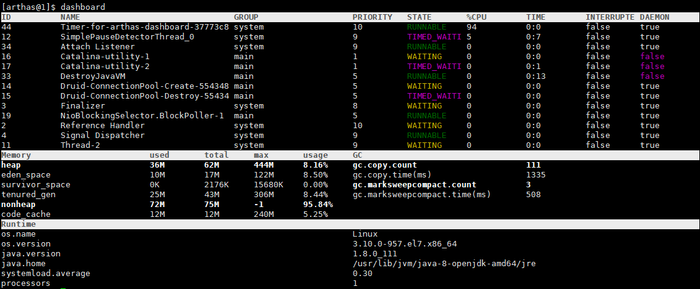
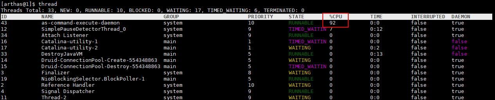
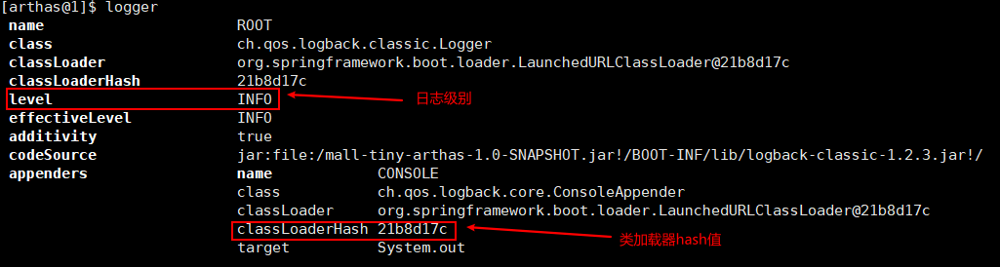
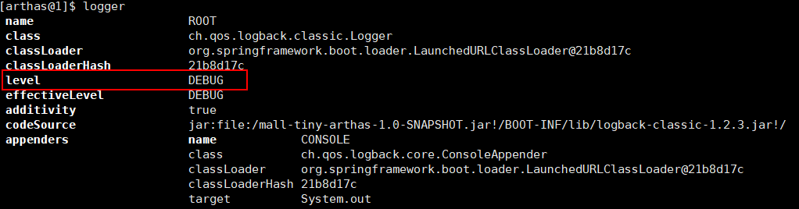
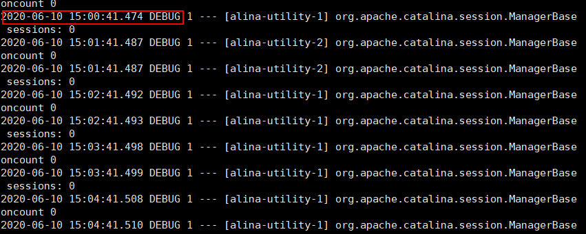

# Arthas 简介

Arthas是Alibaba开源的Java诊断工具，深受开发者喜爱。它采用命令行交互模式，同时提供丰富的 Tab 自动补全功能，进一步方便进行问题的定位和诊断

下载地址：https://alibaba.github.io/arthas/arthas-boot.jar

## 1. 常用命令

### 1.1 dashboard

使用`dashboard`命令可以显示当前系统的实时数据面板，包括线程信息、JVM内存信息及JVM运行时参数。



### 1.2 thread

查看当前线程信息，查看线程的堆栈，可以找出当前最占CPU的线程。



常用命令：

```bash
# 打印当前最忙的3个线程的堆栈信息
thread -n 3
# 查看ID为1都线程的堆栈信息
thread 1
# 找出当前阻塞其他线程的线程
thread -b
# 查看指定状态的线程
thread -state WAITING
```

### 1.3 logger

使用`logger`命令可以查看日志信息，并改变日志级别，这个命令非常有用。

比如我们在生产环境上一般是不会打印`DEBUG`级别的日志的，当我们在线上排查问题时可以临时开启`DEBUG`级别的日志，帮助我们排查问题，下面介绍下如何操作。

- 我们的应用默认使用的是`INFO`级别的日志，使用`logger`命令可以查看；



- 使用如下命令改变日志级别为`DEBUG`，需要使用`-c`参数指定类加载器的HASH值；

```bash
logger -c 21b8d17c --name ROOT --level debug
```

- 再使用`logger`命令查看，发现`ROOT`级别日志已经更改；



- 使用`docker logs -f shop-admin`命令查看容器日志，发现已经打印了DEBUG级别的日志；



- 查看完日志以后记得要把日志级别再调回`INFO`级别。

```bash
logger -c 21b8d17c --name ROOT --level info
```

### 1.4 热更新

```bash
jad --source-only com.xuzhihao.LoginAction > /tmp/LoginAction.java
sc -d *LoginAction | grep classLoaderHash
mc -c 50696e43 /tmp/LoginAction.java -d  /tmp
redefine /tmp/com/xuzhihao/LoginAction.class
```