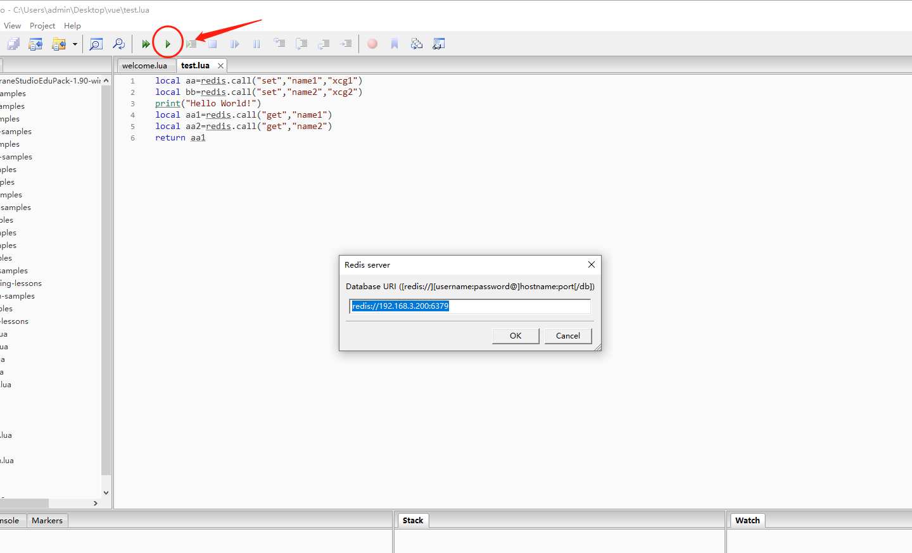
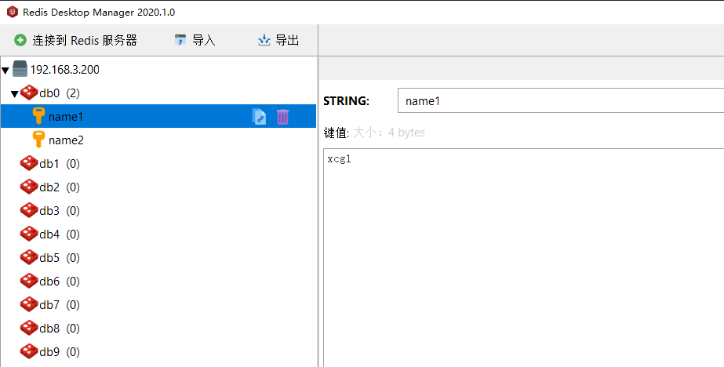

# MongoDB客户端工具Robo 3T

## 1.介绍
Robo 3T 由MongoDB客户端Studio 3T的开发人员维护和提供。以前，Robo 3T被称为Robomongo。它也是适用于Windows，MacOS和Linux的跨平台MongoDB GUI管理工具。它具有相同的引擎和环境，是MongoDB shell（3.2）的一部分

## 2.资源下载
下载地址：https://robomongo.org/download

## 2.脚本调试

```lua
local aa=redis.call("set","name1","xcg1")
local bb=redis.call("set","name2","xcg2")
print("Hello World!")
local aa1=redis.call("get","name1")
local aa2=redis.call("get","name2")
return aa1
```

首次执行需要填写redis地址




## 4.调试快捷键

- F10 下一行
- Shift+F10 跳过调试
- Ctrl +F10 跳过当前function
- Shift + F5 终止运行
- F6 运行
- F5 debug运行

## 5.查看结果

